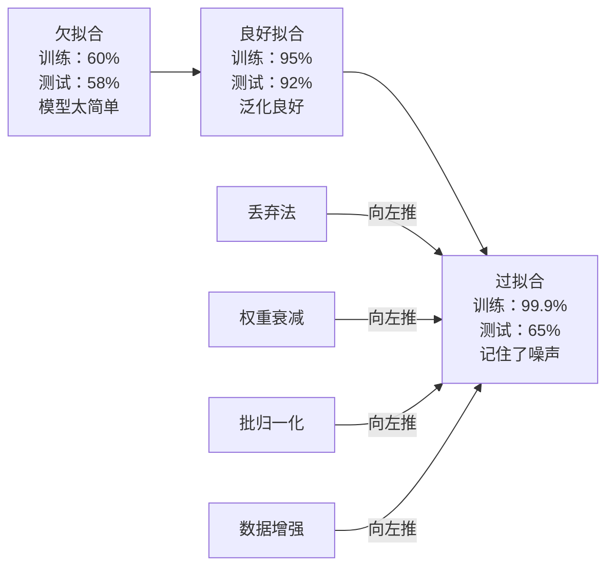
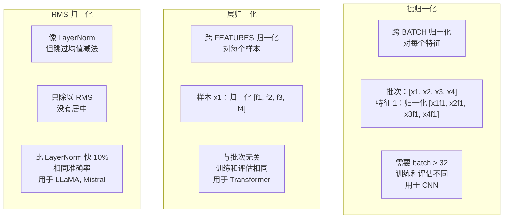
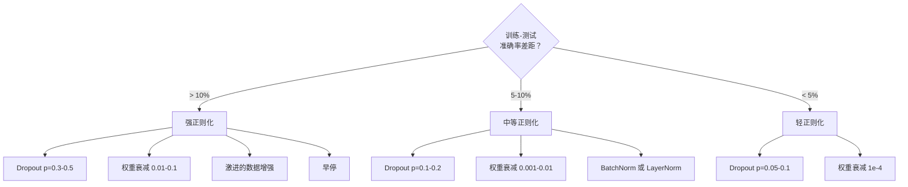

# 正则化

> 你的模型在训练数据上达到 99%，在测试数据上只有 60%。它记住了而不是学会了。正则化是你对复杂性征收的税，以强制泛化。

**类型：** 构建
**语言：** Python
**前置知识：** 课程 03.06（优化器）
**时间：** ~75 分钟

## 学习目标

- 从零实现带反向缩放丢弃法的 Dropout、L2 权重衰减、批归一化、层归一化和 RMSNorm
- 测量训练-测试准确率差距，并通过正则化实验诊断过拟合
- 解释为什么 Transformer 使用 LayerNorm 而不是 BatchNorm，以及为什么现代 LLM 偏好 RMSNorm
- 根据过拟合的严重程度应用正确的正则化技术组合

## 问题

一个具有足够参数的神经网络可以记住任何数据集。这不是假设——Zhang 等人（2017）通过在 Imagenet 上使用随机标签训练标准网络证明了这一点。网络在完全随机的标签分配上达到了接近零的训练损失。它们记住了一百万个随机输入-输出对，没有任何模式可学。训练损失完美。测试准确率为零。

这就是过拟合问题，随着模型变大，它变得更糟。GPT-3 有 1750 亿个参数。训练集有大约 5000 亿个 token。拥有这么多参数，模型有足够的能力逐字记住训练数据的显著部分。没有正则化，它只会复读训练样本，而不是学习可泛化的模式。

训练性能和测试性能之间的差距就是过拟合差距。本课程中的每一种技术都从不同的角度攻击这个差距。丢弃法强制网络不依赖任何单个神经元。权重衰减防止任何单个权重变得过大。批归一化平滑损失景观，使优化器找到更平坦、更可泛化的最小值。层归一化做同样的事情，但在批归一化失败的地方有效（小批量、可变长度序列）。RMSNorm 通过去掉均值计算使其快 10%。每种技术都很简单。一起使用时，它们是记住和泛化之间的区别。

## 概念

### 过拟合光谱

每个模型都处于从欠拟合（太简单无法捕捉模式）到过拟合（太复杂以至于捕捉噪声）的光谱上的某个位置。最佳点位于中间，正则化将模型从过拟合端推向它。



### 丢弃法

最简单的正则化技术，并有最优美的解释。训练期间，以概率 p 随机将每个神经元的输出设为零。

```
output = activation(z) * mask    其中 mask[i] ~ Bernoulli(1 - p)
```

当 p = 0.5 时，一半的神经元在每次前向传播中被置零。网络必须学习冗余表示，因为它无法预测哪些神经元可用。这防止了共适应——神经元学会依赖特定的其他神经元存在。

集成解释：一个有 N 个神经元和丢弃法的网络创建了 2^N 个可能的子网络（神经元开或关的每种组合）。使用丢弃法训练近似同时训练所有 2^N 个子网络，每个在不同的 mini-batch 上。在测试时，你使用所有神经元（无丢弃法）并将输出缩放 (1 - p) 倍，以匹配训练期间的期望值。这相当于对 2^N 个子网络的预测进行平均——从单个模型中获得一个巨大的集成。

在实践中，缩放是在训练期间而不是测试期间应用的（反向丢弃法）：

```
训练期间：  output = activation(z) * mask / (1 - p)
测试期间：  output = activation(z)   （无需修改）
```

这样更简洁，因为测试代码完全不需要知道丢弃法。

默认比率：Transformer 中 p = 0.1，MLP 中 p = 0.5，CNN 中 p = 0.2-0.3。更高的丢弃法 = 更强的正则化 = 更大的欠拟合风险。

### 权重衰减（L2 正则化）

将所有权重的平方大小添加到损失中：

```
total_loss = task_loss + (lambda / 2) * sum(w_i^2)
```

正则化项的梯度是 lambda * w。这意味着在每一步，每个权重都被按其大小比例缩小向零。大的权重受到更多惩罚。模型被推向没有单个权重主导的解。

为什么这有助于泛化：过拟合的模型往往有大的权重，会放大训练数据中的噪声。权重衰减保持权重小，这限制了模型的有效容量，并强制其依赖鲁棒、可泛化的特征，而不是记住的怪癖。

lambda 超参数控制强度。典型值：

- Transformer 上的 AdamW 为 0.01
- CNN 上的 SGD 为 1e-4
- 严重过拟合的模型为 0.1

如课程 06 所讨论的：权重衰减和 L2 正则化在 SGD 中是等价的，但在 Adam 中不是。使用 Adam 训练时始终使用 AdamW（解耦权重衰减）。

### 批归一化

在将每层的输出传递到下一层之前，跨 mini-batch 对其进行归一化。

对于某层的一个 mini-batch 的激活值：

```
mu = (1/B) * sum(x_i)           （批均值）
sigma^2 = (1/B) * sum((x_i - mu)^2)   （批方差）
x_hat = (x_i - mu) / sqrt(sigma^2 + eps)   （归一化）
y = gamma * x_hat + beta        （缩放和偏移）
```

Gamma 和 beta 是可学习参数，允许网络在最优时撤消归一化。没有它们，你会强制每层的输出为零均值单位方差，这可能不是网络想要的。

**训练与推理的区别：** 训练期间，mu 和 sigma 来自当前 mini-batch。推理期间，你使用训练期间累积的运行平均值（指数移动平均，动量 = 0.1，意味着 90% 旧 + 10% 新）。

为什么 BatchNorm 有效仍然存在争议。原始论文声称它减少了"内部协变量偏移"（随着早期层更新，层输入分布的变化）。Santurkar 等人（2018）表明这个解释是错误的。实际原因：BatchNorm 使损失景观更平滑。梯度更具预测性，Lipschitz 常数更小，优化器可以安全地迈出更大的步子。这就是为什么 BatchNorm 让你使用更高的学习率并更快收敛。

BatchNorm 有一个根本限制：它依赖于批统计。当批量大小为 1 时，均值和方差毫无意义。小批量（< 32）时，统计信息嘈杂并损害性能。这对物体检测（内存限制批量大小）和语言建模（序列长度变化）等任务很重要。

### 层归一化

跨特征而不是跨批次进行归一化。对单个样本：

```
mu = (1/D) * sum(x_j)           （特征均值）
sigma^2 = (1/D) * sum((x_j - mu)^2)   （特征方差）
x_hat = (x_j - mu) / sqrt(sigma^2 + eps)
y = gamma * x_hat + beta
```

D 是特征维度。每个样本独立归一化——不依赖于批量大小。这就是为什么 Transformer 使用 LayerNorm 而不是 BatchNorm。序列长度可变，批量大小通常很小（或生成时为 1），并且训练和推理之间的计算是相同的。

Transformer 中的 LayerNorm 应用在每个自注意力块和前馈块之后（Post-LN）或之前（Pre-LN，训练更稳定）。

### RMSNorm

没有均值减法的 LayerNorm。由 Zhang & Sennrich（2019）提出。

```
rms = sqrt((1/D) * sum(x_j^2))
y = gamma * x / rms
```

就是这样。没有均值计算，没有 beta 参数。观察：LayerNorm 中的重新居中（均值减法）对模型性能贡献甚微，但消耗计算。移除它以相同的准确率获得约 10% 的开销减少。

LLaMA、LLaMA 2、LLaMA 3、Mistral 和大多数现代 LLM 使用 RMSNorm 而不是 LayerNorm。在数十亿参数和数万亿 token 的规模下，那 10% 的节省是显著的。

### 归一化对比



### 数据增强作为正则化

不是模型修改，而是数据修改。在保持标签不变的情况下转换训练输入：

- 图像：随机裁剪、翻转、旋转、颜色抖动、cutout
- 文本：同义词替换、回译、随机删除
- 音频：时间拉伸、音高偏移、噪声添加

效果与正则化相同：它增加了训练集的有效大小，使模型更难记住特定样本。一个只见过每张图像一次原始形式的模型可以记住它。一个见过每张图像 50 个增强版本的模型被迫学习不变结构。

### 早停

最简单的正则化器：当验证损失开始增加时停止训练。此时模型尚未过拟合。实践中，你每个 epoch 跟踪验证损失，保存最佳模型，并在一个"耐心"窗口（通常 5-20 个 epoch）内继续训练。如果验证损失在耐心窗口内没有改善，你就停止并加载最佳保存的模型。

### 何时应用什么



```figure
l2-regularization
```

## 构建

### 步骤 1：丢弃法（训练和评估模式）

```python
import random
import math


class Dropout:
    def __init__(self, p=0.5):
        self.p = p
        self.training = True
        self.mask = None

    def forward(self, x):
        if not self.training:
            return list(x)
        self.mask = []
        output = []
        for val in x:
            if random.random() < self.p:
                self.mask.append(0)
                output.append(0.0)
            else:
                self.mask.append(1)
                output.append(val / (1 - self.p))
        return output

    def backward(self, grad_output):
        grads = []
        for g, m in zip(grad_output, self.mask):
            if m == 0:
                grads.append(0.0)
            else:
                grads.append(g / (1 - self.p))
        return grads
```

### 步骤 2：L2 权重衰减

```python
def l2_regularization(weights, lambda_reg):
    penalty = 0.0
    for w in weights:
        penalty += w * w
    return lambda_reg * 0.5 * penalty

def l2_gradient(weights, lambda_reg):
    return [lambda_reg * w for w in weights]
```

### 步骤 3：批归一化

```python
class BatchNorm:
    def __init__(self, num_features, momentum=0.1, eps=1e-5):
        self.gamma = [1.0] * num_features
        self.beta = [0.0] * num_features
        self.eps = eps
        self.momentum = momentum
        self.running_mean = [0.0] * num_features
        self.running_var = [1.0] * num_features
        self.training = True
        self.num_features = num_features

    def forward(self, batch):
        batch_size = len(batch)
        if self.training:
            mean = [0.0] * self.num_features
            for sample in batch:
                for j in range(self.num_features):
                    mean[j] += sample[j]
            mean = [m / batch_size for m in mean]

            var = [0.0] * self.num_features
            for sample in batch:
                for j in range(self.num_features):
                    var[j] += (sample[j] - mean[j]) ** 2
            var = [v / batch_size for v in var]

            for j in range(self.num_features):
                self.running_mean[j] = (1 - self.momentum) * self.running_mean[j] + self.momentum * mean[j]
                self.running_var[j] = (1 - self.momentum) * self.running_var[j] + self.momentum * var[j]
        else:
            mean = list(self.running_mean)
            var = list(self.running_var)

        self.x_hat = []
        output = []
        for sample in batch:
            normalized = []
            out_sample = []
            for j in range(self.num_features):
                x_h = (sample[j] - mean[j]) / math.sqrt(var[j] + self.eps)
                normalized.append(x_h)
                out_sample.append(self.gamma[j] * x_h + self.beta[j])
            self.x_hat.append(normalized)
            output.append(out_sample)
        return output
```

### 步骤 4：层归一化

```python
class LayerNorm:
    def __init__(self, num_features, eps=1e-5):
        self.gamma = [1.0] * num_features
        self.beta = [0.0] * num_features
        self.eps = eps
        self.num_features = num_features

    def forward(self, x):
        mean = sum(x) / len(x)
        var = sum((xi - mean) ** 2 for xi in x) / len(x)

        self.x_hat = []
        output = []
        for j in range(self.num_features):
            x_h = (x[j] - mean) / math.sqrt(var + self.eps)
            self.x_hat.append(x_h)
            output.append(self.gamma[j] * x_h + self.beta[j])
        return output
```

### 步骤 5：RMSNorm

```python
class RMSNorm:
    def __init__(self, num_features, eps=1e-6):
        self.gamma = [1.0] * num_features
        self.eps = eps
        self.num_features = num_features

    def forward(self, x):
        rms = math.sqrt(sum(xi * xi for xi in x) / len(x) + self.eps)
        output = []
        for j in range(self.num_features):
            output.append(self.gamma[j] * x[j] / rms)
        return output
```

### 步骤 6：有正则化和无正则化的训练

```python
def sigmoid(x):
    x = max(-500, min(500, x))
    return 1.0 / (1.0 + math.exp(-x))


def make_circle_data(n=200, seed=42):
    random.seed(seed)
    data = []
    for _ in range(n):
        x = random.uniform(-2, 2)
        y = random.uniform(-2, 2)
        label = 1.0 if x * x + y * y < 1.5 else 0.0
        data.append(([x, y], label))
    return data


class RegularizedNetwork:
    def __init__(self, hidden_size=16, lr=0.05, dropout_p=0.0, weight_decay=0.0):
        random.seed(0)
        self.hidden_size = hidden_size
        self.lr = lr
        self.dropout_p = dropout_p
        self.weight_decay = weight_decay
        self.dropout = Dropout(p=dropout_p) if dropout_p > 0 else None

        self.w1 = [[random.gauss(0, 0.5) for _ in range(2)] for _ in range(hidden_size)]
        self.b1 = [0.0] * hidden_size
        self.w2 = [random.gauss(0, 0.5) for _ in range(hidden_size)]
        self.b2 = 0.0

    def forward(self, x, training=True):
        self.x = x
        self.z1 = []
        self.h = []
        for i in range(self.hidden_size):
            z = self.w1[i][0] * x[0] + self.w1[i][1] * x[1] + self.b1[i]
            self.z1.append(z)
            self.h.append(max(0.0, z))

        if self.dropout and training:
            self.dropout.training = True
            self.h = self.dropout.forward(self.h)
        elif self.dropout:
            self.dropout.training = False
            self.h = self.dropout.forward(self.h)

        self.z2 = sum(self.w2[i] * self.h[i] for i in range(self.hidden_size)) + self.b2
        self.out = sigmoid(self.z2)
        return self.out

    def backward(self, target):
        eps = 1e-15
        p = max(eps, min(1 - eps, self.out))
        d_loss = -(target / p) + (1 - target) / (1 - p)
        d_sigmoid = self.out * (1 - self.out)
        d_out = d_loss * d_sigmoid

        for i in range(self.hidden_size):
            d_relu = 1.0 if self.z1[i] > 0 else 0.0
            d_h = d_out * self.w2[i] * d_relu
            self.w2[i] -= self.lr * (d_out * self.h[i] + self.weight_decay * self.w2[i])
            for j in range(2):
                self.w1[i][j] -= self.lr * (d_h * self.x[j] + self.weight_decay * self.w1[i][j])
            self.b1[i] -= self.lr * d_h
        self.b2 -= self.lr * d_out

    def evaluate(self, data):
        correct = 0
        total_loss = 0.0
        for x, y in data:
            pred = self.forward(x, training=False)
            eps = 1e-15
            p = max(eps, min(1 - eps, pred))
            total_loss += -(y * math.log(p) + (1 - y) * math.log(1 - p))
            if (pred >= 0.5) == (y >= 0.5):
                correct += 1
        return total_loss / len(data), correct / len(data) * 100

    def train_model(self, train_data, test_data, epochs=300):
        history = []
        for epoch in range(epochs):
            total_loss = 0.0
            correct = 0
            for x, y in train_data:
                pred = self.forward(x, training=True)
                self.backward(y)
                eps = 1e-15
                p = max(eps, min(1 - eps, pred))
                total_loss += -(y * math.log(p) + (1 - y) * math.log(1 - p))
                if (pred >= 0.5) == (y >= 0.5):
                    correct += 1
            train_loss = total_loss / len(train_data)
            train_acc = correct / len(train_data) * 100
            test_loss, test_acc = self.evaluate(test_data)
            history.append((train_loss, train_acc, test_loss, test_acc))
            if epoch % 75 == 0 or epoch == epochs - 1:
                gap = train_acc - test_acc
                print(f"    Epoch {epoch:3d}: train_acc={train_acc:.1f}%, test_acc={test_acc:.1f}%, gap={gap:.1f}%")
        return history
```

## 使用

PyTorch 以模块形式提供所有归一化和正则化：

```python
import torch
import torch.nn as nn

model = nn.Sequential(
    nn.Linear(784, 256),
    nn.BatchNorm1d(256),
    nn.ReLU(),
    nn.Dropout(0.3),
    nn.Linear(256, 128),
    nn.BatchNorm1d(128),
    nn.ReLU(),
    nn.Dropout(0.3),
    nn.Linear(128, 10),
)

model.train()
out_train = model(torch.randn(32, 784))

model.eval()
out_test = model(torch.randn(1, 784))
```

`model.train()` / `model.eval()` 切换至关重要。它开关丢弃法，并告诉 BatchNorm 使用批统计还是运行统计。在推理前忘记 `model.eval()` 是深度学习中常见的 bug 之一。你的测试准确率会随机波动，因为丢弃法仍然活跃，BatchNorm 正在使用 mini-batch 统计。

对于 Transformer，模式不同：

```python
class TransformerBlock(nn.Module):
    def __init__(self, d_model=512, nhead=8, dropout=0.1):
        super().__init__()
        self.attention = nn.MultiheadAttention(d_model, nhead, dropout=dropout)
        self.norm1 = nn.LayerNorm(d_model)
        self.ff = nn.Sequential(
            nn.Linear(d_model, d_model * 4),
            nn.GELU(),
            nn.Linear(d_model * 4, d_model),
            nn.Dropout(dropout),
        )
        self.norm2 = nn.LayerNorm(d_model)
        self.dropout = nn.Dropout(dropout)

    def forward(self, x):
        attended, _ = self.attention(x, x, x)
        x = self.norm1(x + self.dropout(attended))
        x = self.norm2(x + self.ff(x))
        return x
```

LayerNorm，而不是 BatchNorm。Dropout p=0.1，而不是 p=0.5。这些是 Transformer 的默认值。

## 交付

本课程产出：
- `outputs/prompt-regularization-advisor.md` —— 一个诊断过拟合并推荐正确正则化策略的提示词

## 练习

1. 为 2D 数据实现空间丢弃法：不丢弃单个神经元，而是丢弃整个特征通道。通过将连续特征组视为通道并丢弃整个组来模拟这一点。在 hidden_size=32 的圆形数据集上比较与标准丢弃法的训练-测试差距。

2. 将课程 05 中的标签平滑与本课程中的丢弃法结合。用四种配置训练：两者都不用、仅丢弃法、仅标签平滑、两者都用。测量每种配置的最终训练-测试准确率差距。哪种组合给出的差距最小？

3. 在圆形数据集网络的隐藏层和激活函数之间添加 BatchNorm 层。在学习率为 0.01、0.05 和 0.1 时，用和不用 BatchNorm 进行训练。BatchNorm 应该允许在普通网络发散的高学习率下稳定训练。

4. 实现早停：每个 epoch 跟踪测试损失，保存最佳权重，如果测试损失在 20 个 epoch 内没有改善就停止。运行正则化网络 1000 个 epoch。报告哪个 epoch 有最佳测试准确率，以及你节省了多少个 epoch 的计算量。

5. 在 4 层网络（不只是 2 层）上比较 LayerNorm vs RMSNorm。使用相同权重初始化两者。训练 200 个 epoch，比较最终准确率、训练速度（每个 epoch 的时间）和第一层的梯度大小。验证 RMSNorm 更快且准确率相同。

## 关键术语

| 术语 | 人们怎么说 | 实际含义 |
|------|-----------|---------|
| 过拟合 | "模型记住了数据" | 当模型的训练性能显著超过测试性能时，表明它学习了噪声而不是信号 |
| 正则化 | "防止过拟合" | 任何约束模型复杂性以改善泛化的技术：丢弃法、权重衰减、归一化、增强 |
| 丢弃法 | "随机删除神经元" | 训练期间以概率 p 随机置零神经元，强制冗余表示；相当于训练一个集成 |
| 权重衰减 | "L2 惩罚" | 每一步通过减去 lambda * w 将所有权重向零收缩；通过权重大小惩罚复杂性 |
| 批归一化 | "按批次归一化" | 训练期间使用批统计对层输出进行跨批次归一化，推理期间使用运行平均值 |
| 层归一化 | "按样本归一化" | 在每个样本内跨特征归一化；与批次无关，用于批量大小变化的 Transformer |
| RMSNorm | "不带均值的 LayerNorm" | 均方根归一化；去掉 LayerNorm 中的均值减法，获得 10% 的速度提升，准确率相同 |
| 早停 | "在过拟合前停止" | 当验证损失停止改善时停止训练；最简单的正则化器，经常与其他方法一起使用 |
| 数据增强 | "从少量数据中获取更多数据" | 转换训练输入（翻转、裁剪、噪声）以增加有效数据集大小并强制学习不变性 |
| 泛化差距 | "训练-测试差异" | 训练和测试性能之间的差异；正则化旨在最小化这个差距 |

## 延伸阅读

- Srivastava et al., "Dropout: A Simple Way to Prevent Neural Networks from Overfitting" (2014) —— 原始的丢弃法论文，包含集成解释和大量实验
- Ioffe & Szegedy, "Batch Normalization: Accelerating Deep Network Training by Reducing Internal Covariate Shift" (2015) —— 引入了 BatchNorm 及其训练过程，是引用最多的深度学习论文之一
- Zhang & Sennrich, "Root Mean Square Layer Normalization" (2019) —— 展示了 RMSNorm 以更少的计算匹配 LayerNorm 的准确率；被 LLaMA 和 Mistral 采用
- Zhang et al., "Understanding Deep Learning Requires Rethinking Generalization" (2017) —— 具有里程碑意义的论文，展示了神经网络可以记住随机标签，挑战了传统的泛化观点
