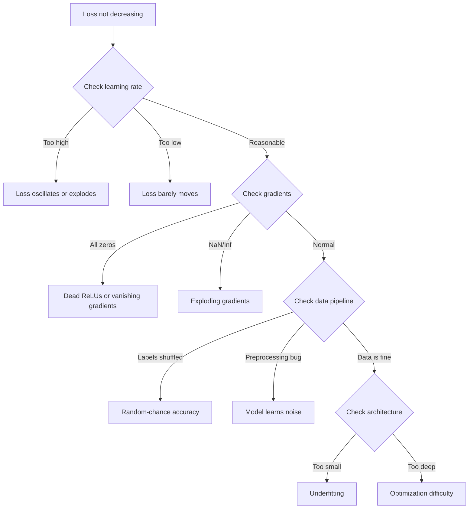
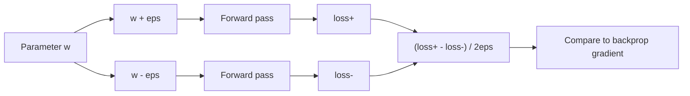
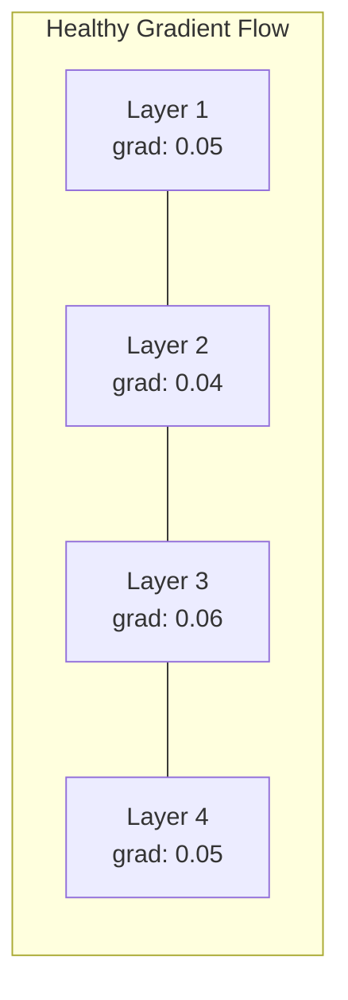
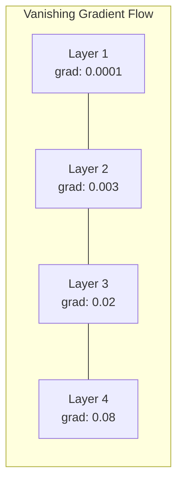
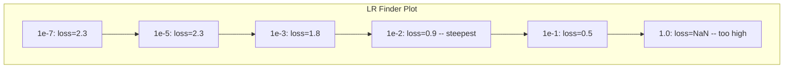

# 调试神经网络

> 你的网络编译了。它运行了。它产生了一个数字。这个数字是错的，但什么都没有崩溃。欢迎来到最困难的一种调试 —— 那种没有错误消息的调试。

**类型：** 构建
**语言：** Python、PyTorch
**前置要求：** 第三阶段第 01-10 课（特别是反向传播、损失函数、优化器）
**时间：** ~90 分钟

## 学习目标

- 使用系统性的调试策略诊断常见的神经网络故障（NaN 损失、平坦损失曲线、过拟合、震荡）
- 应用"过拟合一个批次"技术来验证你的模型架构和训练循环是否正确
- 检查梯度大小、激活分布和权重范数以识别梯度消失/爆炸问题
- 构建一个涵盖数据流水线、模型架构、损失函数、优化器和学习率问题的调试检查清单

## 问题

传统软件在损坏时会崩溃。空指针会抛出异常。类型不匹配会在编译时失败。差一错误会产生明显错误的输出。

神经网络不会给你这种奢侈。

一个损坏的神经网络会运行到完成，打印一个损失值，并输出预测。损失可能会下降。预测可能看起来合理。但模型在悄悄出错 —— 学习捷径、记忆噪声、或收敛到无用的局部最小值。Google 的研究人员估计，60-70% 的机器学习调试时间花在了"静默"错误上，这些错误不产生任何错误但会降低模型质量。

一个工作模型和一个损坏模型之间的区别通常只是一行错误位置的代码：缺少的 `zero_grad()`、转置的维度、差 10 倍的学习率。规范的"神经网络训练配方"（2019 年）以这样开头："最常见的神经网络错误是不会导致崩溃的错误。"

本课程教你找到这些错误。

## 概念

### 调试心态

放弃打印加祈祷式的调试。神经网络调试需要系统性的方法，因为反馈循环很慢（每次训练运行数分钟到数小时），而且症状是模糊的（糟糕的损失可能意味着 20 件不同的事情）。

黄金法则：**从简单开始，一次增加一个复杂度，并独立验证每个部分。**



### 症状 1：损失不下降

这是最常见的投诉。训练循环在运行，轮次在走，但损失保持平坦或在剧烈震荡。

**学习率错误。** 太高：损失震荡或跳到 NaN。太低：损失下降得如此之慢以至于看起来平坦。对于 Adam，从 1e-3 开始。对于 SGD，从 1e-1 或 1e-2 开始。总是尝试跨越 10 倍的三个学习率（例如，1e-2、1e-3、1e-4），然后再下结论是其他问题。

**ReLU 死亡。** 如果 ReLU 神经元收到较大的负输入，它输出 0 并且其梯度为 0。它再也不会激活。如果有足够的神经元死亡，网络无法学习。检查：打印每个 ReLU 层后激活值恰好为 0 的比例。如果超过 50% 死亡，切换到 LeakyReLU 或降低学习率。

**梯度消失。** 在具有 sigmoid 或 tanh 激活的深度网络中，梯度在反向传播时呈指数级缩小。当它们到达第一层时，几乎为 0。前面的层停止学习。修复：使用 ReLU/GELU、添加残差连接或使用批归一化。

**梯度爆炸。** 相反的问题 —— 梯度呈指数级增长。常见于 RNN 和非常深的网络。损失跳到 NaN。修复：梯度裁剪（`torch.nn.utils.clip_grad_norm_`）、降低学习率或添加归一化。

### 症状 2：损失下降但模型很差

损失在下降。训练准确率达到 99%。但测试准确率是 55%。或者模型对真实数据产生无意义的输出。

**过拟合。** 模型记忆训练数据而不是学习模式。训练和验证损失之间的差距随时间增长。修复：更多数据、dropout、权重衰减、早停、数据增强。

**数据泄露。** 测试数据泄露到了训练中。准确率高得可疑。常见原因：分割前洗牌、使用完整数据集的统计量进行预处理、跨分割的重复样本。修复：先分割、后预处理、检查重复。

**标签错误。** 大多数真实数据集中 5-10% 的标签是错误的（Northcutt 等人，2021 —— "测试集中普遍存在的标签错误"）。模型学习噪声。修复：使用置信学习来发现和修复错误标签的样本，或使用损失截断来忽略高损失样本。

### 症状 3：损失中出现 NaN 或 Inf

损失值变成 `nan` 或 `inf`。训练死亡了。

**学习率太高。** 梯度更新过度冲过头，导致权重爆炸。修复：降低 10 倍。

**log(0) 或 log(负数)。** 交叉熵损失计算 `log(p)`。如果你的模型输出恰好为 0 或负的概率，log 会爆炸。修复：将预测值限制在 `[eps, 1-eps]`，其中 `eps=1e-7`。

**除以零。** 批归一化除以标准差。一个具有恒定值的批次的标准差为 0。修复：在分母中添加 epsilon（PyTorch 默认这样做，但自定义实现可能不会）。

**数值溢出。** 大的激活值输入到 `exp()` 会产生 Inf。Softmax 尤其容易。修复：在指数化之前减去最大值（log-sum-exp 技巧）。

### 技术 1：梯度检查

将你的解析梯度（来自反向传播）与数值梯度（来自有限差分）进行比较。如果它们不一致，你的反向传播有错误。

参数 `w` 的数值梯度：

```
grad_numerical = (loss(w + eps) - loss(w - eps)) / (2 * eps)
```

一致性度量（相对差异）：

```
rel_diff = |grad_analytical - grad_numerical| / max(|grad_analytical|, |grad_numerical|, 1e-8)
```

如果 `rel_diff < 1e-5`：正确。如果 `rel_diff > 1e-3`：几乎肯定是错误。



### 技术 2：激活统计量

在训练期间监控每层后激活值的均值和标准差。健康的网络保持激活值均值接近 0、标准差接近 1（归一化后）或至少保持有界。

| 健康指标 | 均值 | 标准差 | 诊断 |
|---------|------|--------|------|
| 健康 | ~0 | ~1 | 网络正常学习 |
| 饱和 | >>0 或 <<0 | ~0 | 激活值卡在极值 |
| 死亡 | 0 | 0 | 神经元死亡（全零） |
| 爆炸 | >>10 | >>10 | 激活值无界增长 |

### 技术 3：梯度流可视化

绘制每层的平均梯度大小。在健康的网络中，各层的梯度大小应该大致相似。如果早期层的梯度比后期层小 1000 倍，你就遇到了梯度消失。





### 技术 4：过拟合一个批次测试

深度学习中最重要的一种调试技术。

取一个小批次（8-32 个样本）。在上面训练 100 多次迭代。损失应该几乎降到零，训练准确率应该达到 100%。如果没有，你的模型或训练循环有根本性的错误 —— 不要继续进行完整训练。

这个测试能捕捉到：
- 损坏的损失函数
- 损坏的反向传播
- 架构太小无法表示数据
- 优化器未连接到模型参数
- 数据和标签不对齐

这只需要 30 秒的运行时间，可以节省数小时的完整训练运行调试。

### 技术 5：学习率查找器

Leslie Smith（2017 年）提出在一个轮次内将学习率从非常小（1e-7）扫到非常大（10），同时记录损失。绘制损失 vs 学习率的曲线。最优学习率大约比损失开始最快下降的速率小 10 倍。



本例中的最佳学习率：约 1e-3（在最陡点之前的一个数量级）。

### 常见的 PyTorch 错误

这些是在 PyTorch 社区中浪费最多集体时间的错误：

| 错误 | 症状 | 修复 |
|------|------|------|
| 忘记 `optimizer.zero_grad()` | 梯度跨批次累积，损失震荡 | 在 `loss.backward()` 之前添加 `optimizer.zero_grad()` |
| 测试时忘记 `model.eval()` | Dropout 和批归一化行为不同，测试准确率在不同运行间变化 | 添加 `model.eval()` 和 `torch.no_grad()` |
| 错误的张量形状 | 静默广播产生错误结果，没有错误 | 调试时在每次操作后打印形状 |
| CPU/GPU 不匹配 | `RuntimeError: expected CUDA tensor` | 在模型和数据上都使用 `.to(device)` |
| 未分离张量 | 计算图无限增长，OOM | 使用 `.detach()` 或 `with torch.no_grad()` |
| 原地操作破坏 autograd | `RuntimeError: modified by in-place operation` | 将 `x += 1` 替换为 `x = x + 1` |
| 数据未归一化 | 损失卡在随机水平 | 将输入归一化到 mean=0、std=1 |
| 标签数据类型错误 | 交叉熵需要 Long，得到 Float | 转换标签：`labels.long()` |

### 主调试表

| 症状 | 可能原因 | 首先要尝试的 |
|------|---------|------------|
| 损失卡在 -log(1/num_classes) | 模型预测均匀分布 | 检查数据流水线，验证标签匹配输入 |
| 几步后损失 NaN | 学习率太高 | 将学习率降低 10 倍 |
| 立即出现 NaN 损失 | log(0) 或除以零 | 在 log/除法操作中添加 epsilon |
| 损失剧烈震荡 | 学习率太高或批次太小 | 降低学习率，增加批次大小 |
| 损失下降后停滞 | 微调阶段学习率太高 | 添加学习率调度（余弦或步进衰减） |
| 训练准确率高、测试准确率低 | 过拟合 | 添加 dropout、权重衰减、更多数据 |
| 训练准确率 = 测试准确率 = 随机水平 | 模型没有学习 | 运行过拟合一个批次测试 |
| 训练准确率 = 测试准确率但两者都低 | 欠拟合 | 更大的模型、更多层、更多特征 |
| 梯度全为零 | ReLU 死亡或计算图分离 | 切换到 LeakyReLU，检查 `.requires_grad` |
| 训练期间内存不足 | 批次太大或图未释放 | 减少批次大小，评估时使用 `torch.no_grad()` |

```figure
learning-curves
```

## 构建

一个监控激活值、梯度和损失曲线的诊断工具包。你将故意破坏一个网络，并使用该工具包诊断每个问题。

### 第 1 步：NetworkDebugger 类

挂接到 PyTorch 模型中，以记录每层的激活和梯度统计量。

```python
import torch
import torch.nn as nn
import math


class NetworkDebugger:
    def __init__(self, model):
        self.model = model
        self.activation_stats = {}
        self.gradient_stats = {}
        self.loss_history = []
        self.lr_losses = []
        self.hooks = []
        self._register_hooks()

    def _register_hooks(self):
        for name, module in self.model.named_modules():
            if isinstance(module, (nn.Linear, nn.Conv2d, nn.ReLU, nn.LeakyReLU)):
                hook = module.register_forward_hook(self._make_activation_hook(name))
                self.hooks.append(hook)
                hook = module.register_full_backward_hook(self._make_gradient_hook(name))
                self.hooks.append(hook)

    def _make_activation_hook(self, name):
        def hook(module, input, output):
            with torch.no_grad():
                out = output.detach().float()
                self.activation_stats[name] = {
                    "mean": out.mean().item(),
                    "std": out.std().item(),
                    "fraction_zero": (out == 0).float().mean().item(),
                    "min": out.min().item(),
                    "max": out.max().item(),
                }
        return hook

    def _make_gradient_hook(self, name):
        def hook(module, grad_input, grad_output):
            if grad_output[0] is not None:
                with torch.no_grad():
                    grad = grad_output[0].detach().float()
                    self.gradient_stats[name] = {
                        "mean": grad.mean().item(),
                        "std": grad.std().item(),
                        "abs_mean": grad.abs().mean().item(),
                        "max": grad.abs().max().item(),
                    }
        return hook

    def record_loss(self, loss_value):
        self.loss_history.append(loss_value)

    def check_loss_health(self):
        if len(self.loss_history) < 2:
            return "NOT_ENOUGH_DATA"
        recent = self.loss_history[-10:]
        if any(math.isnan(v) or math.isinf(v) for v in recent):
            return "NAN_OR_INF"
        if len(self.loss_history) >= 20:
            first_half = sum(self.loss_history[:10]) / 10
            second_half = sum(self.loss_history[-10:]) / 10
            if second_half >= first_half * 0.99:
                return "NOT_DECREASING"
        if len(recent) >= 5:
            diffs = [recent[i+1] - recent[i] for i in range(len(recent)-1)]
            if max(diffs) - min(diffs) > 2 * abs(sum(diffs) / len(diffs)):
                return "OSCILLATING"
        return "HEALTHY"

    def check_activations(self):
        issues = []
        for name, stats in self.activation_stats.items():
            if stats["fraction_zero"] > 0.5:
                issues.append(f"DEAD_NEURONS: {name} has {stats['fraction_zero']:.0%} zero activations")
            if abs(stats["mean"]) > 10:
                issues.append(f"EXPLODING_ACTIVATIONS: {name} mean={stats['mean']:.2f}")
            if stats["std"] < 1e-6:
                issues.append(f"COLLAPSED_ACTIVATIONS: {name} std={stats['std']:.2e}")
        return issues if issues else ["HEALTHY"]

    def check_gradients(self):
        issues = []
        grad_magnitudes = []
        for name, stats in self.gradient_stats.items():
            grad_magnitudes.append((name, stats["abs_mean"]))
            if stats["abs_mean"] < 1e-7:
                issues.append(f"VANISHING_GRADIENT: {name} abs_mean={stats['abs_mean']:.2e}")
            if stats["abs_mean"] > 100:
                issues.append(f"EXPLODING_GRADIENT: {name} abs_mean={stats['abs_mean']:.2e}")
        if len(grad_magnitudes) >= 2:
            first_mag = grad_magnitudes[0][1]
            last_mag = grad_magnitudes[-1][1]
            if last_mag > 0 and first_mag / last_mag > 100:
                issues.append(f"GRADIENT_RATIO: first/last = {first_mag/last_mag:.0f}x (vanishing)")
        return issues if issues else ["HEALTHY"]

    def print_report(self):
        print("\n=== NETWORK DEBUGGER REPORT ===")
        print(f"\nLoss health: {self.check_loss_health()}")
        if self.loss_history:
            print(f"  Last 5 losses: {[f'{v:.4f}' for v in self.loss_history[-5:]]}")
        print("\nActivation diagnostics:")
        for item in self.check_activations():
            print(f"  {item}")
        print("\nGradient diagnostics:")
        for item in self.check_gradients():
            print(f"  {item}")
        print("\nPer-layer activation stats:")
        for name, stats in self.activation_stats.items():
            print(f"  {name}: mean={stats['mean']:.4f} std={stats['std']:.4f} zero={stats['fraction_zero']:.1%}")
        print("\nPer-layer gradient stats:")
        for name, stats in self.gradient_stats.items():
            print(f"  {name}: abs_mean={stats['abs_mean']:.2e} max={stats['max']:.2e}")

    def remove_hooks(self):
        for hook in self.hooks:
            hook.remove()
        self.hooks.clear()
```

### 第 2 步：过拟合一个批次测试

```python
def overfit_one_batch(model, x_batch, y_batch, criterion, lr=0.01, steps=200):
    optimizer = torch.optim.Adam(model.parameters(), lr=lr)
    model.train()
    print("\n=== OVERFIT ONE BATCH TEST ===")
    print(f"Batch size: {x_batch.shape[0]}, Steps: {steps}")

    for step in range(steps):
        optimizer.zero_grad()
        output = model(x_batch)
        loss = criterion(output, y_batch)
        loss.backward()
        optimizer.step()

        if step % 50 == 0 or step == steps - 1:
            with torch.no_grad():
                preds = (output > 0).float() if output.shape[-1] == 1 else output.argmax(dim=1)
                targets = y_batch if y_batch.dim() == 1 else y_batch.squeeze()
                acc = (preds.squeeze() == targets).float().mean().item()
            print(f"  Step {step:3d} | Loss: {loss.item():.6f} | Accuracy: {acc:.1%}")

    final_loss = loss.item()
    if final_loss > 0.1:
        print(f"\n  FAIL: Loss did not converge ({final_loss:.4f}). Model or training loop is broken.")
        return False
    print(f"\n  PASS: Loss converged to {final_loss:.6f}")
    return True
```

### 第 3 步：学习率查找器

```python
def find_learning_rate(model, x_data, y_data, criterion, start_lr=1e-7, end_lr=10, steps=100):
    import copy
    original_state = copy.deepcopy(model.state_dict())
    optimizer = torch.optim.SGD(model.parameters(), lr=start_lr)
    lr_mult = (end_lr / start_lr) ** (1 / steps)

    model.train()
    results = []
    best_loss = float("inf")
    current_lr = start_lr

    print("\n=== LEARNING RATE FINDER ===")

    for step in range(steps):
        optimizer.zero_grad()
        output = model(x_data)
        loss = criterion(output, y_data)

        if math.isnan(loss.item()) or loss.item() > best_loss * 10:
            break

        best_loss = min(best_loss, loss.item())
        results.append((current_lr, loss.item()))

        loss.backward()
        optimizer.step()

        current_lr *= lr_mult
        for param_group in optimizer.param_groups:
            param_group["lr"] = current_lr

    model.load_state_dict(original_state)

    if len(results) < 10:
        print("  Could not complete LR sweep -- loss diverged too quickly")
        return results

    min_loss_idx = min(range(len(results)), key=lambda i: results[i][1])
    suggested_lr = results[max(0, min_loss_idx - 10)][0]

    print(f"  Swept {len(results)} steps from {start_lr:.0e} to {results[-1][0]:.0e}")
    print(f"  Minimum loss {results[min_loss_idx][1]:.4f} at lr={results[min_loss_idx][0]:.2e}")
    print(f"  Suggested learning rate: {suggested_lr:.2e}")

    return results
```

### 第 4 步：梯度检查器

```python
def _flat_to_multi_index(flat_idx, shape):
    multi_idx = []
    remaining = flat_idx
    for dim in reversed(shape):
        multi_idx.insert(0, remaining % dim)
        remaining //= dim
    return tuple(multi_idx)


def gradient_check(model, x, y, criterion, eps=1e-4):
    model.train()
    x_double = x.double()
    y_double = y.double()
    model_double = model.double()

    print("\n=== GRADIENT CHECK ===")
    overall_max_diff = 0
    checked = 0

    for name, param in model_double.named_parameters():
        if not param.requires_grad:
            continue

        layer_max_diff = 0

        model_double.zero_grad()
        output = model_double(x_double)
        loss = criterion(output, y_double)
        loss.backward()
        analytical_grad = param.grad.clone()

        num_checks = min(5, param.numel())
        for i in range(num_checks):
            idx = _flat_to_multi_index(i, param.shape)
            original = param.data[idx].item()

            param.data[idx] = original + eps
            with torch.no_grad():
                loss_plus = criterion(model_double(x_double), y_double).item()

            param.data[idx] = original - eps
            with torch.no_grad():
                loss_minus = criterion(model_double(x_double), y_double).item()

            param.data[idx] = original

            numerical = (loss_plus - loss_minus) / (2 * eps)
            analytical = analytical_grad[idx].item()

            denom = max(abs(numerical), abs(analytical), 1e-8)
            rel_diff = abs(numerical - analytical) / denom

            layer_max_diff = max(layer_max_diff, rel_diff)
            checked += 1

        overall_max_diff = max(overall_max_diff, layer_max_diff)
        status = "OK" if layer_max_diff < 1e-5 else "MISMATCH"
        print(f"  {name}: max_rel_diff={layer_max_diff:.2e} [{status}]")

    model.float()

    print(f"\n  Checked {checked} parameters")
    if overall_max_diff < 1e-5:
        print("  PASS: Gradients match (rel_diff < 1e-5)")
    elif overall_max_diff < 1e-3:
        print("  WARN: Small differences (1e-5 < rel_diff < 1e-3)")
    else:
        print("  FAIL: Gradient mismatch detected (rel_diff > 1e-3)")
    return overall_max_diff
```

### 第 5 步：故意破坏的网络

现在将工具包应用于损坏的网络并诊断每个问题。

```python
def demo_broken_networks():
    torch.manual_seed(42)
    x = torch.randn(64, 10)
    y = (x[:, 0] > 0).long()

    print("\n" + "=" * 60)
    print("BUG 1: Learning rate too high (lr=10)")
    print("=" * 60)
    model1 = nn.Sequential(nn.Linear(10, 32), nn.ReLU(), nn.Linear(32, 2))
    debugger1 = NetworkDebugger(model1)
    optimizer1 = torch.optim.SGD(model1.parameters(), lr=10.0)
    criterion = nn.CrossEntropyLoss()
    for step in range(20):
        optimizer1.zero_grad()
        out = model1(x)
        loss = criterion(out, y)
        debugger1.record_loss(loss.item())
        loss.backward()
        optimizer1.step()
    debugger1.print_report()
    debugger1.remove_hooks()

    print("\n" + "=" * 60)
    print("BUG 2: Dead ReLUs from bad initialization")
    print("=" * 60)
    model2 = nn.Sequential(nn.Linear(10, 32), nn.ReLU(), nn.Linear(32, 32), nn.ReLU(), nn.Linear(32, 2))
    with torch.no_grad():
        for m in model2.modules():
            if isinstance(m, nn.Linear):
                m.weight.fill_(-1.0)
                m.bias.fill_(-5.0)
    debugger2 = NetworkDebugger(model2)
    optimizer2 = torch.optim.Adam(model2.parameters(), lr=1e-3)
    for step in range(50):
        optimizer2.zero_grad()
        out = model2(x)
        loss = criterion(out, y)
        debugger2.record_loss(loss.item())
        loss.backward()
        optimizer2.step()
    debugger2.print_report()
    debugger2.remove_hooks()

    print("\n" + "=" * 60)
    print("BUG 3: Missing zero_grad (gradients accumulate)")
    print("=" * 60)
    model3 = nn.Sequential(nn.Linear(10, 32), nn.ReLU(), nn.Linear(32, 2))
    debugger3 = NetworkDebugger(model3)
    optimizer3 = torch.optim.SGD(model3.parameters(), lr=0.01)
    for step in range(50):
        out = model3(x)
        loss = criterion(out, y)
        debugger3.record_loss(loss.item())
        loss.backward()
        optimizer3.step()
    debugger3.print_report()
    debugger3.remove_hooks()

    print("\n" + "=" * 60)
    print("HEALTHY NETWORK: Correct setup for comparison")
    print("=" * 60)
    model_good = nn.Sequential(nn.Linear(10, 32), nn.ReLU(), nn.Linear(32, 2))
    debugger_good = NetworkDebugger(model_good)
    optimizer_good = torch.optim.Adam(model_good.parameters(), lr=1e-3)
    for step in range(50):
        optimizer_good.zero_grad()
        out = model_good(x)
        loss = criterion(out, y)
        debugger_good.record_loss(loss.item())
        loss.backward()
        optimizer_good.step()
    debugger_good.print_report()
    debugger_good.remove_hooks()

    print("\n" + "=" * 60)
    print("OVERFIT-ONE-BATCH TEST (healthy model)")
    print("=" * 60)
    model_test = nn.Sequential(nn.Linear(10, 32), nn.ReLU(), nn.Linear(32, 2))
    overfit_one_batch(model_test, x[:8], y[:8], criterion)

    print("\n" + "=" * 60)
    print("LEARNING RATE FINDER")
    print("=" * 60)
    model_lr = nn.Sequential(nn.Linear(10, 32), nn.ReLU(), nn.Linear(32, 2))
    find_learning_rate(model_lr, x, y, criterion)

    print("\n" + "=" * 60)
    print("GRADIENT CHECK")
    print("=" * 60)
    model_grad = nn.Sequential(nn.Linear(10, 8), nn.ReLU(), nn.Linear(8, 2))
    gradient_check(model_grad, x[:4], y[:4], criterion)
```

## 使用

### PyTorch 内置工具

```python
import torch
import torch.nn as nn

model = nn.Sequential(
    nn.Linear(768, 256),
    nn.ReLU(),
    nn.Linear(256, 10),
)

with torch.autograd.detect_anomaly():
    output = model(input_tensor)
    loss = criterion(output, target)
    loss.backward()

for name, param in model.named_parameters():
    if param.grad is not None:
        print(f"{name}: grad_mean={param.grad.abs().mean():.2e}")
```

### Weights & Biases 集成

```python
import wandb

wandb.init(project="debug-training")

for epoch in range(100):
    loss = train_one_epoch()
    wandb.log({
        "loss": loss,
        "lr": optimizer.param_groups[0]["lr"],
        "grad_norm": torch.nn.utils.clip_grad_norm_(model.parameters(), float("inf")),
    })

    for name, param in model.named_parameters():
        if param.grad is not None:
            wandb.log({f"grad/{name}": wandb.Histogram(param.grad.cpu().numpy())})
```

### TensorBoard

```python
from torch.utils.tensorboard import SummaryWriter

writer = SummaryWriter("runs/debug_experiment")

for epoch in range(100):
    loss = train_one_epoch()
    writer.add_scalar("Loss/train", loss, epoch)

    for name, param in model.named_parameters():
        writer.add_histogram(f"weights/{name}", param, epoch)
        if param.grad is not None:
            writer.add_histogram(f"gradients/{name}", param.grad, epoch)
```

### 调试检查清单（在完整训练之前）

1. 运行过拟合一个批次测试。如果失败，停止。
2. 打印模型摘要 —— 验证参数量合理。
3. 用随机数据运行一次前向传播 —— 检查输出形状。
4. 训练 5 个轮次 —— 验证损失在下降。
5. 检查激活统计量 —— 没有死亡层、没有爆炸。
6. 检查梯度流 —— 没有消失、没有爆炸。
7. 验证数据流水线 —— 打印 5 个随机样本及其标签。

## 交付

本课程产出的文件：
- `outputs/prompt-nn-debugger.md` —— 一个用于诊断神经网络训练失败的提示
- `outputs/skill-debug-checklist.md` —— 一个用于调试训练问题的决策树检查清单

关键部署模式：
- 在生产训练脚本中添加监控钩子
- 每 N 步将激活和梯度统计量记录到 W&B 或 TensorBoard
- 实现对 NaN 损失、死亡神经元（>80% 为零）或梯度爆炸的自动警报
- 改变架构或数据流水线时始终运行过拟合一个批次测试

## 练习

1. **添加梯度爆炸检测器。** 修改 `NetworkDebugger` 以检测梯度何时超过阈值，并自动建议梯度裁剪值。在一个没有归一化的 20 层网络上测试它。

2. **构建死亡神经元复活器。** 编写一个函数，识别死亡 ReLU 神经元（始终输出 0）并用 Kaiming 初始化重新初始化它们的传入权重。证明这可以恢复一个超过 70% 神经元已死亡的网络。

3. **实现带绘图的学习率查找器。** 扩展 `find_learning_rate` 将结果保存为 CSV，并编写一个单独的脚本来读取 CSV 并使用 matplotlib 显示学习率 vs 损失曲线。识别 ResNet-18 在 CIFAR-10 上的最优学习率。

4. **创建数据流水线验证器。** 编写一个函数检查：训练/测试分割中的重复样本、标签分布不平衡（>10:1 比例）、输入归一化（均值接近 0、标准差接近 1）以及数据中的 NaN/Inf 值。在故意损坏的数据集上运行它。

5. **调试真实的失败。** 使用第 10 课的微型框架，引入一个微妙的错误（例如，在反向传播中转置权重矩阵），并使用梯度检查精确定位哪个参数具有不正确的梯度。记录调试过程。

## 关键术语

| 术语 | 人们说的意思 | 实际含义 |
|------|------------|---------|
| 静默错误 | "它运行但给出糟糕结果" | 一个不产生错误但降低模型质量的 bug —— 机器学习中的主要故障模式 |
| ReLU 死亡 | "神经元死亡了" | 一个 ReLU 神经元的输入始终为负，因此它输出 0 并永久接收 0 梯度 |
| 梯度消失 | "早期层停止学习" | 梯度通过层呈指数级缩小，使早期层的权重实际上被冻结 |
| 梯度爆炸 | "损失变成 NaN" | 梯度通过层呈指数级增长，导致权重更新过大以至于溢出 |
| 梯度检查 | "验证反向传播是否正确" | 将来自反向传播的解析梯度与来自有限差分的数值梯度进行比较 |
| 过拟合一个批次 | "最重要的调试测试" | 在单个小批次上训练以验证模型确实可以学习 —— 如果不能，说明某些东西从根本上损坏了 |
| 学习率查找器 | "扫描以找到正确的学习率" | 在一个轮次中指数级增加学习率，选择损失刚刚开始发散之前的学习率 |
| 数据泄露 | "测试数据泄露到训练中" | 当测试集的信息污染训练时，产生人为的高准确率 |
| 激活统计量 | "监控层健康" | 跟踪每层输出的均值、标准差和零值比例，以检测死亡、饱和或爆炸的神经元 |
| 梯度裁剪 | "限制梯度大小" | 当梯度范数超过阈值时缩小梯度，防止爆炸的梯度更新 |

## 延伸阅读

- Smith, "Cyclical Learning Rates for Training Neural Networks" (2017) —— 引入学习率范围测试（LR finder）的论文
- Northcutt 等人, "Pervasive Label Errors in Test Sets Destabilize Machine Learning Benchmarks" (2021) —— 证明 ImageNet、CIFAR-10 和其他主要基准测试中 3-6% 的标签是错误的
- Zhang 等人, "Understanding Deep Learning Requires Rethinking Generalization" (2017) —— 证明神经网络可以记忆随机标签的论文，这就是为什么过拟合一个批次测试有效
- PyTorch 关于 `torch.autograd.detect_anomaly` 和 `torch.autograd.set_detect_anomaly` 的文档，用于内置 NaN/Inf 检测
