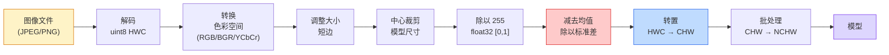
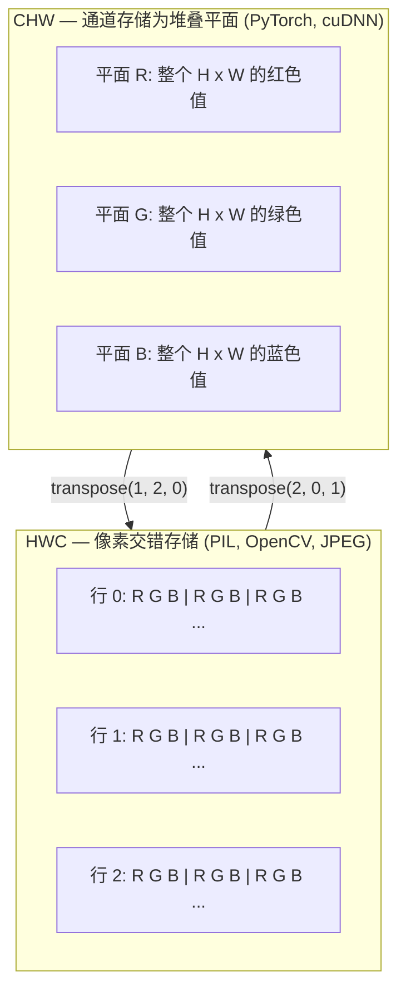

# 图像基础 — 像素、通道、色彩空间

> 图像是一个光样本张量。你将要使用的每一个视觉模型都源于这一事实。

**类型：** 构建
**语言：** Python
**前置知识：** 阶段 1 第 12 课（张量操作）、阶段 3 第 11 课（PyTorch 入门）
**时间：** ~45 分钟

## 学习目标

- 解释连续场景如何被离散化为像素，以及采样/量化决策如何为每一个下游模型设定上限
- 以 NumPy 数组的形式读取、切片和检查图像，并在 HWC 与 CHW 布局之间流畅切换
- 在 RGB、灰度、HSV 和 YCbCr 之间进行转换，并说明每种色彩空间存在的理由
- 应用像素级预处理（归一化、标准化、调整大小、通道优先），完全按照 torchvision 所期望的方式

## 问题

你读到的每一篇论文、下载的每一个预训练权重、调用的每一个视觉 API，都假设了特定的输入编码。将 `uint8` 图像传给期望 `float32` 的模型，它仍然会运行——然后默默地产生垃圾。将 BGR 喂给在 RGB 上训练的网络，准确率会下降十个点。将 channels-last 输入交给期望 channels-first 的模型，第一个卷积层会把高度当作特征通道。这些错误都不会抛出异常，它们只会毁掉你的指标，让你花一周时间寻找一个存在于文件加载方式中的 bug。

一旦你知道卷积是在什么上面滑动，它并不复杂。困难的部分在于，"图像"对相机、JPEG 解码器、PIL、OpenCV、torchvision 和 CUDA 内核来说意味着不同的东西。每个技术栈都有自己的轴顺序、字节范围和通道约定。一个不能搞清楚这些的视觉工程师会制造出有问题的流水线。

本课打好基础，以便该阶段的其余部分可以在此基础上构建。学完本课后，你将知道什么是像素、为什么每个像素有三个数字而不是一个、"用 ImageNet 统计信息归一化"实际上做了什么，以及如何在本阶段其他所有课程都将假定的两种或三种布局之间进行切换。

## 概念

### 完整的预处理流水线一览

每个生产级视觉系统都是相同的可逆变换序列。搞错一步，模型看到的输入就会与训练时的不同。



红蓝两个框是 80% 的静默故障所在：缺失标准化和错误的布局。

### 像素是一个样本，而不是一个方块

相机传感器统计落在微小探测器网格上的光子数量。每个探测器在几分之一秒内积分光线，并发出与击中它的光子数成正比的电压。传感器然后将该电压离散化为一个整数。一个探测器变成一个像素。

```
连续场景                   传感器网格                     数字图像
（无限细节）               （H x W 个探测器）             （H x W 个整数）

    ~~~~~                        +--+--+--+--+--+                 210 198 180 155 120
   ~   ~   ~                     |  |  |  |  |  |                 205 195 178 152 118
  ~ light ~      ---->           +--+--+--+--+--+     ---->       200 190 175 150 115
   ~~~~~                         |  |  |  |  |  |                 195 185 170 148 112
                                 +--+--+--+--+--+                 188 180 165 145 108
```

在此步骤中会发生两个选择，它们为之后的一切设定了上限：

- **空间采样** 决定场景每度有多少个探测器。太少，边缘会变得锯齿状（混叠）。太多，存储和计算会爆炸。
- **强度量化** 决定电压被分桶的精细程度。8 位提供 256 个级别，是显示的标准。10、12、16 位提供更平滑的渐变，对医学成像、HDR 和原始传感器流水线很重要。

像素不是一个有面积的有色方块。它是一个单一的测量值。当你调整大小或旋转时，你正在对该测量网格进行重采样。

### 为什么是三个通道

一个探测器统计整个可见光谱中的光子——这就是灰度。为了获得颜色，传感器用红色、绿色和蓝色滤光片的马赛克覆盖网格。经过去马赛克处理后，每个空间位置有三个整数：红色滤光探测器、绿色滤光探测器和蓝色滤光探测器的响应。这三个整数就是一个像素的 RGB 三元组。

```
内存中的一个像素：

    (R, G, B) = (210, 140, 30)   <- 红橙色

一张 H x W 的 RGB 图像：

    shape (H, W, 3)     存储为   H 行，每行 W 个像素，每个像素 3 个值
                                 每个值在 uint8 的 [0, 255] 范围内
```

三不是魔法。深度相机添加了一个 Z 通道。卫星添加了红外和紫外波段。医学扫描通常有一个通道（X 光、CT）或多个通道（高光谱）。通道数是最后一个轴；卷积层学习跨通道混合。

### 两种布局约定：HWC 和 CHW

同一个张量，两种顺序。每个库选择一种。

```
HWC (height, width, channels)           CHW (channels, height, width)

   W ->                                    H ->
  +-----+-----+-----+                     +-----+-----+
H |R G B|R G B|R G B|                   C |R R R R R R|
| +-----+-----+-----+                   | +-----+-----+
v |R G B|R G B|R G B|                   v |G G G G G G|
  +-----+-----+-----+                     +-----+-----+
                                          |B B B B B B|
                                          +-----+-----+

   PIL、OpenCV、matplotlib、              PyTorch、大多数深度学习
   几乎所有磁盘上的图像文件              框架、cuDNN 内核
```

CHW 存在是因为卷积核在 H 和 W 上滑动。将通道轴放在第一位意味着每个核在每个通道上看到一个连续的 2D 平面，这可以很好地向量化。磁盘格式保持 HWC，因为这匹配传感器输出扫描线的方式。

你将输入一千次的一行转换代码：

```
img_chw = img_hwc.transpose(2, 0, 1)      # NumPy
img_chw = img_hwc.permute(2, 0, 1)        # PyTorch 张量
```

内存布局，可视化：



### 字节范围和数据类型

三种约定占主导地位：

| 约定 | dtype | 范围 | 在哪里见到 |
|------------|-------|-------|------------------|
| 原始 | `uint8` | [0, 255] | 磁盘上的文件、PIL、OpenCV 输出 |
| 归一化 | `float32` | [0.0, 1.0] | 执行 `img.astype('float32') / 255` 后 |
| 标准化 | `float32` | 大约 [-2, +2] | 减去均值并除以标准差后 |

卷积网络是在标准化输入上训练的。ImageNet 统计信息 `mean=[0.485, 0.456, 0.406]`、`std=[0.229, 0.224, 0.225]` 是在完整 ImageNet 训练集上、在 [0, 1] 归一化像素上计算的三个通道的算术均值和标准差。将原始 `uint8` 馈入期望标准化浮点数的模型是应用视觉中最常见的静默故障。

### 色彩空间及其存在的原因

RGB 是采集格式，但它不总是对模型最有用的表示。

```
 RGB               HSV                       YCbCr / YUV

 R 红色             H 色相（角度 0-360）       Y 亮度
 G 绿色             S 饱和度 (0-1)            Cb 蓝色-黄色色度
 B 蓝色             V 明度 (0-1)              Cr 红色-绿色色度

 线性对应           将颜色与亮度分离。          将亮度与颜色分离。
 传感器输出         用于颜色阈值、UI 滑块、       JPEG 和大多数视频编解码器
                    简单滤镜                    对色度通道压缩更狠，因为
                                                人眼对色度细节不如对 Y 敏感。
```

对于大多数现代 CNN，你输入 RGB。你在以下情况会遇到其他空间：

- **HSV** — 经典 CV 代码、基于颜色的分割、白平衡。
- **YCbCr** — 读取 JPEG 内部结构、视频流水线、仅在 Y 上操作的超分辨率模型。
- **灰度** — OCR、文档模型、任何颜色是噪音变量而非信号的情况。

RGB 转灰度是加权和，而不是平均值，因为人眼对绿色比红色或蓝色更敏感：

```
Y = 0.299 R + 0.587 G + 0.114 B       (ITU-R BT.601，经典权重)
```

### 宽高比、调整大小和插值

每个模型都有一个固定的输入大小（大多数 ImageNet 分类器为 224x224，现代检测器为 384x384 或 512x512）。你的图像很少匹配。三个值得注意的调整大小选择：

- **调整短边，然后中心裁剪** — 标准 ImageNet 做法。保持宽高比，丢弃一长条边缘像素。
- **调整大小并填充** — 保持宽高比和每个像素，添加黑边。检测和 OCR 的标准做法。
- **直接调整为目标大小** — 拉伸图像。廉价、扭曲几何形状，对许多分类任务没问题。

插值方法决定当新网格与旧网格不对齐时如何计算中间像素：

```
最近邻              最快，块状，仅适用于掩码/标签
双线性              快速，平滑，大多数图像调整大小的默认方法
双三次              较慢，放大时更锐利
Lanczos              最慢，质量最好，用于最终显示
```

经验法则：训练用双线性，用于查看的素材用双三次或 Lanczos，包含整数类 ID 的内容用最近邻。

```figure
conv-output-size
```

## 构建

### 步骤 1：加载图像并检查其形状

使用 Pillow 加载任何 JPEG 或 PNG，转换为 NumPy，并打印你得到的内容。对于一个可离线的确定性示例，合成一个。

```python
import numpy as np
from PIL import Image

def synthetic_rgb(h=128, w=192, seed=0):
    rng = np.random.default_rng(seed)
    yy, xx = np.meshgrid(np.linspace(0, 1, h), np.linspace(0, 1, w), indexing="ij")
    r = (np.sin(xx * 6) * 0.5 + 0.5) * 255
    g = yy * 255
    b = (1 - yy) * xx * 255
    rgb = np.stack([r, g, b], axis=-1) + rng.normal(0, 6, (h, w, 3))
    return np.clip(rgb, 0, 255).astype(np.uint8)

arr = synthetic_rgb()
# 或者从磁盘加载：
# arr = np.asarray(Image.open("your_image.jpg").convert("RGB"))

print(f"type:   {type(arr).__name__}")
print(f"dtype:  {arr.dtype}")
print(f"shape:  {arr.shape}     # (H, W, C)")
print(f"min:    {arr.min()}")
print(f"max:    {arr.max()}")
print(f"pixel at (0, 0): {arr[0, 0]}")
```

预期输出：`shape: (H, W, 3)`、`dtype: uint8`、范围 `[0, 255]`。无论字节来自相机、JPEG 解码器还是合成生成器，这都是标准磁盘表示。

### 步骤 2：拆分通道并重新排列布局

分别提取 R、G、B，然后从 HWC 转换为 PyTorch 的 CHW。

```python
R = arr[:, :, 0]
G = arr[:, :, 1]
B = arr[:, :, 2]
print(f"R shape: {R.shape}, mean: {R.mean():.1f}")
print(f"G shape: {G.shape}, mean: {G.mean():.1f}")
print(f"B shape: {B.shape}, mean: {B.mean():.1f}")

arr_chw = arr.transpose(2, 0, 1)
print(f"\nHWC shape: {arr.shape}")
print(f"CHW shape: {arr_chw.shape}")
```

三个灰度平面，每个通道一个。CHW 只是重新排列轴；当内存布局允许时，严格来说不需要进行数据拷贝。

### 步骤 3：灰度和 HSV 转换

加权和灰度，然后手动 RGB 转 HSV。

```python
def rgb_to_grayscale(rgb):
    weights = np.array([0.299, 0.587, 0.114], dtype=np.float32)
    return (rgb.astype(np.float32) @ weights).astype(np.uint8)

def rgb_to_hsv(rgb):
    rgb_f = rgb.astype(np.float32) / 255.0
    r, g, b = rgb_f[..., 0], rgb_f[..., 1], rgb_f[..., 2]
    cmax = np.max(rgb_f, axis=-1)
    cmin = np.min(rgb_f, axis=-1)
    delta = cmax - cmin

    h = np.zeros_like(cmax)
    mask = delta > 0
    rmax = mask & (cmax == r)
    gmax = mask & (cmax == g)
    bmax = mask & (cmax == b)
    h[rmax] = ((g[rmax] - b[rmax]) / delta[rmax]) % 6
    h[gmax] = ((b[gmax] - r[gmax]) / delta[gmax]) + 2
    h[bmax] = ((r[bmax] - g[bmax]) / delta[bmax]) + 4
    h = h * 60.0

    s = np.where(cmax > 0, delta / cmax, 0)
    v = cmax
    return np.stack([h, s, v], axis=-1)

gray = rgb_to_grayscale(arr)
hsv = rgb_to_hsv(arr)
print(f"gray shape: {gray.shape}, range: [{gray.min()}, {gray.max()}]")
print(f"hsv   shape: {hsv.shape}")
print(f"hue range: [{hsv[..., 0].min():.1f}, {hsv[..., 0].max():.1f}] degrees")
print(f"sat range: [{hsv[..., 1].min():.2f}, {hsv[..., 1].max():.2f}]")
print(f"val range: [{hsv[..., 2].min():.2f}, {hsv[..., 2].max():.2f}]")
```

色相以度为单位输出，饱和度和明度在 [0, 1] 范围内。这与 OpenCV `hsv_full` 约定一致。

### 步骤 4：归一化、标准化并逆转

从原始字节到预训练 ImageNet 模型期望的确切张量，然后再回来。

```python
mean = np.array([0.485, 0.456, 0.406], dtype=np.float32)
std = np.array([0.229, 0.224, 0.225], dtype=np.float32)

def preprocess_imagenet(rgb_uint8):
    x = rgb_uint8.astype(np.float32) / 255.0
    x = (x - mean) / std
    x = x.transpose(2, 0, 1)
    return x

def deprocess_imagenet(chw_float32):
    x = chw_float32.transpose(1, 2, 0)
    x = x * std + mean
    x = np.clip(x * 255.0, 0, 255).astype(np.uint8)
    return x

x = preprocess_imagenet(arr)
print(f"preprocessed shape: {x.shape}     # (C, H, W)")
print(f"preprocessed dtype: {x.dtype}")
print(f"preprocessed mean per channel:  {x.mean(axis=(1, 2)).round(3)}")
print(f"preprocessed std  per channel:  {x.std(axis=(1, 2)).round(3)}")

roundtrip = deprocess_imagenet(x)
max_diff = np.abs(roundtrip.astype(int) - arr.astype(int)).max()
print(f"roundtrip max pixel diff: {max_diff}    # should be 0 or 1")
```

每个通道的均值应接近零，标准差接近一。preprocess/deprocess 对正是每个 torchvision `transforms.Normalize` 调用在底层所做的事情。

### 步骤 5：使用三种插值方法调整大小

在放大的情况下比较最近邻、双线性和双三次，以便差异可见。

```python
target = (arr.shape[0] * 3, arr.shape[1] * 3)

nearest = np.asarray(Image.fromarray(arr).resize(target[::-1], Image.NEAREST))
bilinear = np.asarray(Image.fromarray(arr).resize(target[::-1], Image.BILINEAR))
bicubic = np.asarray(Image.fromarray(arr).resize(target[::-1], Image.BICUBIC))

def local_roughness(x):
    gy = np.diff(x.astype(float), axis=0)
    gx = np.diff(x.astype(float), axis=1)
    return float(np.abs(gy).mean() + np.abs(gx).mean())

for name, out in [("nearest", nearest), ("bilinear", bilinear), ("bicubic", bicubic)]:
    print(f"{name:>8}  shape={out.shape}  roughness={local_roughness(out):6.2f}")
```

最近邻的粗糙度得分最高，因为它保留了硬边缘。双线性最平滑。双三次介于两者之间，在没有阶梯状伪影的情况下保持感知锐度。

## 使用

`torchvision.transforms` 将以上所有内容打包到一个可组合的流水线中。下面的代码精确复现了 `preprocess_imagenet` 的功能，外加调整大小和裁剪。

```python
import torch
from torchvision import transforms
from PIL import Image

img = Image.fromarray(synthetic_rgb(256, 256))

pipeline = transforms.Compose([
    transforms.Resize(256),
    transforms.CenterCrop(224),
    transforms.ToTensor(),
    transforms.Normalize(mean=[0.485, 0.456, 0.406], std=[0.229, 0.224, 0.225]),
])

x = pipeline(img)
print(f"tensor type:  {type(x).__name__}")
print(f"tensor dtype: {x.dtype}")
print(f"tensor shape: {tuple(x.shape)}      # (C, H, W)")
print(f"per-channel mean: {x.mean(dim=(1, 2)).tolist()}")
print(f"per-channel std:  {x.std(dim=(1, 2)).tolist()}")

batch = x.unsqueeze(0)
print(f"\nbatched shape: {tuple(batch.shape)}   # (N, C, H, W) — 准备好给模型了")
```

四个步骤，按照这个确切顺序：`Resize(256)` 将短边缩放到 256；`CenterCrop(224)` 从中间取一个 224x224 的块；`ToTensor()` 除以 255 并将 HWC 交换为 CHW；`Normalize` 减去 ImageNet 均值并除以标准差。颠倒这个顺序会默默地改变到达模型的内容。

## 交付

本课程产出：

- `outputs/prompt-vision-preprocessing-audit.md` — 一个提示词，将任何模型卡或数据集卡转化为团队必须遵守的精确预处理不变性检查清单。
- `outputs/skill-image-tensor-inspector.md` — 一个技能，能针对任何图像形状的张量或数组，报告数据类型、布局、范围，以及它看起来是原始、归一化还是标准化的。

## 练习

1. **（简单）** 使用 OpenCV（`cv2.imread`）和 Pillow 加载一张 JPEG。打印两个形状以及 `(0, 0)` 处的像素。解释通道顺序的差异，然后编写一行转换代码，使 OpenCV 数组与 Pillow 数组相同。
2. **（中等）** 编写 `standardize(img, mean, std)` 及其逆函数，使其在任何 uint8 图像上通过 `roundtrip_max_diff <= 1` 测试。你的函数必须能使用相同的调用在 HWC 的单张图像和 NCHW 的批次上工作。
3. **（困难）** 取一个 3 通道 ImageNet 标准化张量，通过一个 1x1 卷积运行，该卷积学习将 RGB 加权混合为单个灰度通道。将权重初始化为 `[0.299, 0.587, 0.114]`，冻结它们，并验证输出与你手写的 `rgb_to_grayscale` 在浮点误差范围内匹配。还有哪些经典的色彩空间变换可以写成 1x1 卷积？

## 关键术语

| 术语 | 人们的说法 | 实际含义 |
|------|----------------|----------------------|
| 像素 | "一个有色方块" | 一个网格位置上的一个光强度样本——彩色三个数字，灰度一个数字 |
| 通道 | "颜色" | 堆叠到图像张量中的并行空间网格之一；在 HWC 中是最后一个轴，在 CHW 中是第一个轴 |
| HWC / CHW | "形状" | 图像张量的轴顺序；磁盘和 PIL 使用 HWC，PyTorch 和 cuDNN 使用 CHW |
| 归一化 | "缩放图像" | 除以 255 使像素在 [0, 1] 范围内——必要但不充分 |
| 标准化 | "零中心化" | 每个通道减去均值并除以标准差，使输入分布匹配模型训练时的分布 |
| 灰度转换 | "平均通道" | 系数为 0.299/0.587/0.114 的加权和，匹配人类亮度感知 |
| 插值 | "调整大小时如何选取像素" | 当新网格与旧网格不对齐时决定输出值的规则——标签用最近邻，训练用双线性，显示用双三次 |
| 宽高比 | "宽度除以高度" | 区分"调整大小并填充"与"调整大小并拉伸"的比例 |

## 延伸阅读

- [Charles Poynton — A Guided Tour of Color Space](https://poynton.ca/PDFs/Guided_tour.pdf) — 对为什么有这么多色彩空间以及每种何时重要的最清晰的技术处理
- [PyTorch Vision Transforms Docs](https://pytorch.org/vision/stable/transforms.html) — 你在生产中实际组合的完整变换流水线
- [How JPEG Works (Colt McAnlis)](https://www.youtube.com/watch?v=F1kYBnY6mwg) — 关于色度子采样、DCT 以及为什么 JPEG 编码 YCbCr 而非 RGB 的精彩视觉导览
- [ImageNet Preprocessing Conventions (torchvision models)](https://pytorch.org/vision/stable/models.html) — `mean=[0.485, 0.456, 0.406]` 的真相来源，以及为什么模型动物园中的每个模型都期望它
