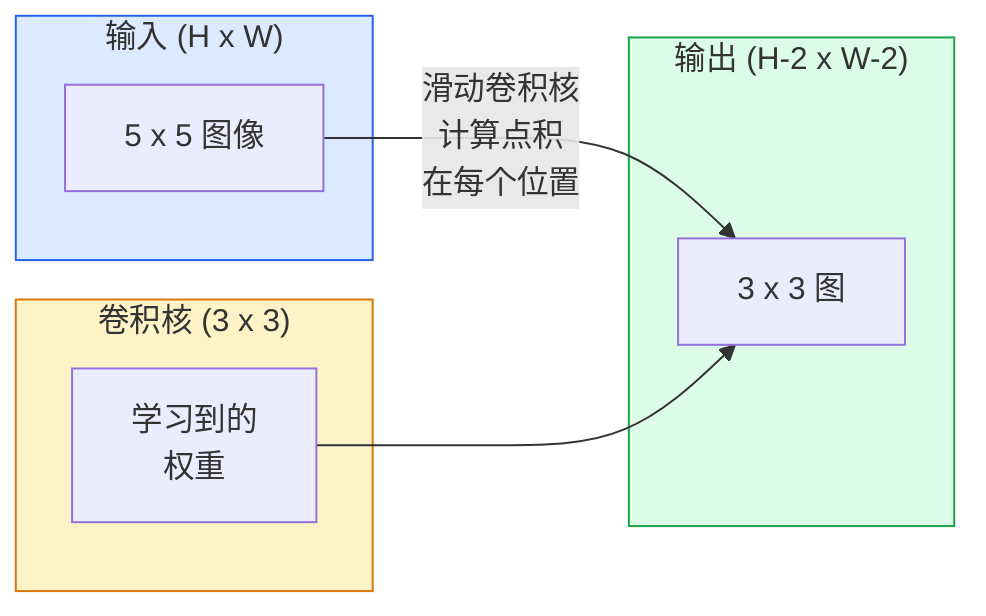
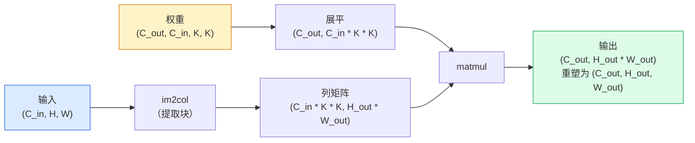

# 从零实现卷积

> 卷积是一个小型密集层，你在图像上滑动它，在每个位置共享相同的权重。

**类型：** 构建
**语言：** Python
**前置知识：** 阶段 3（深度学习核心）、阶段 4 第 01 课（图像基础）
**时间：** ~75 分钟

## 学习目标

- 仅使用 NumPy 从零实现二维卷积，包括嵌套循环版本和向量化的 `im2col` 版本
- 计算任意输入大小、卷积核大小、填充和步长组合下的输出空间尺寸，并说明 `(H - K + 2P) / S + 1` 公式的原理
- 手工设计卷积核（边缘检测、模糊、锐化、Sobel），并解释为什么每种卷积核会产生其特定的激活模式
- 将卷积堆叠成特征提取器，并将堆叠深度与感受野大小联系起来

## 问题

一个全连接层在 224x224 RGB 图像上每个神经元需要 224 * 224 * 3 = 150,528 个输入权重。一个包含 1,000 个单元的隐藏层已经是 1.5 亿个参数——在你学到任何有用的东西之前。更糟糕的是，该层没有概念认为左上角的狗和右下角的狗是相同的模式。它将每个像素位置视为独立的，这对于图像来说是完全错误的：将猫平移三个像素不应该迫使网络重新学习这个概念。

图像模型需要的两个特性是**平移等变性**（输入移动时输出也移动）和**参数共享**（相同的特征检测器在所有位置运行）。密集层两者都不提供。卷积则免费提供两者。

卷积并非为深度学习而发明。它是驱动 JPEG 压缩、Photoshop 中的高斯模糊、工业视觉中的边缘检测以及每个曾经发布的音频滤波器的相同操作。CNN 从 2012 年到 2020 年在 ImageNet 上占据主导地位的原因是，卷积对于附近值相关且相同模式可以出现在任何地方的数据来说，是正确的先验。

## 概念

### 一个卷积核，滑动

二维卷积取一个称为卷积核（或滤波器）的小权重矩阵，在输入上滑动它，在每个位置计算逐元素乘积的和。这个和成为一个输出像素。



一个具体的 3x3 例子在 5x5 输入上（无填充，步长 1）：

```
输入 X (5 x 5):                卷积核 W (3 x 3):

  1  2  0  1  2                   1  0 -1
  0  1  3  1  0                   2  0 -2
  2  1  0  2  1                   1  0 -1
  1  0  2  1  3
  2  1  1  0  1

卷积核滑过每个有效的 3 x 3 窗口。输出 Y 是 3 x 3：

 Y[0,0] = sum( W * X[0:3, 0:3] )
 Y[0,1] = sum( W * X[0:3, 1:4] )
 Y[0,2] = sum( W * X[0:3, 2:5] )
 Y[1,0] = sum( W * X[1:4, 0:3] )
 ... 以此类推
```

这一个公式——**共享权重、局部性、滑动窗口**——就是整个想法。其他一切都是簿记工作。

### 输出尺寸公式

给定输入空间尺寸 `H`、卷积核尺寸 `K`、填充 `P`、步长 `S`：

```
H_out = floor( (H - K + 2P) / S ) + 1
```

记住这个公式。你将在每个架构中计算它数十次。

| 场景 | H | K | P | S | H_out |
|----------|---|---|---|---|-------|
| 有效卷积，无填充 | 32 | 3 | 0 | 1 | 30 |
| 相同卷积（保持尺寸） | 32 | 3 | 1 | 1 | 32 |
| 下采样 2 倍 | 32 | 3 | 1 | 2 | 16 |
| 池化 2x2 | 32 | 2 | 0 | 2 | 16 |
| 大感受野 | 32 | 7 | 3 | 2 | 16 |

"相同填充"意味着选择 P 使得当 S == 1 时 H_out == H。对于奇数 K，P = (K - 1) / 2。这就是为什么 3x3 卷积核占主导地位——它们是仍然具有中心的最小奇数卷积核。

### 填充

没有填充，每个卷积都会缩小特征图。堆叠 20 个，你的 224x224 图像变成 184x184，这浪费了边界上的计算，并使需要匹配形状的残差连接复杂化。

```
在 5 x 5 输入上零填充 (P = 1)：

  0  0  0  0  0  0  0
  0  1  2  0  1  2  0
  0  0  1  3  1  0  0
  0  2  1  0  2  1  0      现在卷积核可以在像素 (0, 0)
  0  1  0  2  1  3  0      上居中，并且仍然有三行三列
  0  2  1  1  0  1  0      的值可以相乘。
  0  0  0  0  0  0  0
```

你在实践中遇到的模式：`zero`（最常见）、`reflect`（镜像边缘，避免生成模型中的硬边界）、`replicate`（复制边缘）、`circular`（环绕，用于环形问题）。

### 步长

步长是滑动的步幅大小。`stride=1` 是默认值。`stride=2` 将空间尺寸减半，是在 CNN 内进行下采样而不使用单独池化层的经典方法——每个现代架构（ResNet、ConvNeXt、MobileNet）都在某个地方使用步长卷积代替最大池化。

```
在 5 x 5 输入上步长 1，3 x 3 卷积核：

  起始位置: (0,0) (0,1) (0,2)        -> 输出行 0
            (1,0) (1,1) (1,2)        -> 输出行 1
            (2,0) (2,1) (2,2)        -> 输出行 2

  输出: 3 x 3

在相同输入上步长 2：

  起始位置: (0,0) (0,2)              -> 输出行 0
            (2,0) (2,2)              -> 输出行 1

  输出: 2 x 2
```

### 多个输入通道

真实图像有三个通道。RGB 输入上的 3x3 卷积实际上是一个 3x3x3 的体积：每个输入通道一个 3x3 切片。在每个空间位置，你跨所有三个切片进行乘法和求和，并添加偏置。

```
输入:   (C_in,  H,  W)        3 x 5 x 5
卷积核: (C_in,  K,  K)        3 x 3 x 3（一个卷积核）
输出:   (1,     H', W')       2D 图

对于一个产生 C_out 个输出通道的层，你堆叠 C_out 个卷积核：

权重:   (C_out, C_in, K, K)   例如 64 x 3 x 3 x 3
输出:   (C_out, H', W')       64 x 3 x 3

参数数量: C_out * C_in * K * K + C_out  （+ C_out 是偏置）
```

最后一行是你规划模型时要计算的。在 3 通道输入上的 64 通道 3x3 卷积有 `64 * 3 * 3 * 3 + 64 = 1,792` 个参数。很便宜。

### im2col 技巧

嵌套循环易于阅读但很慢。GPU 想要大的矩阵乘法。技巧：将输入的每个感受野窗口展平为大矩阵的一列，将卷积核展平为一行，整个卷积变成一次矩阵乘法。



每个生产级卷积实现都是这个的某种变体，加上缓存分块技巧（直接卷积、Winograd、大卷积核的 FFT 卷积）。理解 im2col 你就理解了核心。

### 感受野

单个 3x3 卷积查看 9 个输入像素。堆叠两个 3x3 卷积，第二层中的神经元查看 5x5 输入像素。三个 3x3 卷积给出 7x7。一般来说：

```
L 个堆叠的 K x K 卷积（步长 1）后的 RF = 1 + L * (K - 1)

带步长时：感受野随每层的步长乘性地增长。
```

"一路 3x3"（VGG、ResNet、ConvNeXt）有效的全部原因是，两个 3x3 卷积看到的输入区域与一个 5x5 卷积相同，但参数更少，并且中间有一个额外的非线性层。

```figure
convolution-kernel
```

## 构建

### 步骤 1：填充数组

从最小的原语开始：一个在 H x W 数组周围填充零的函数。

```python
import numpy as np

def pad2d(x, p):
    if p == 0:
        return x
    h, w = x.shape[-2:]
    out = np.zeros(x.shape[:-2] + (h + 2 * p, w + 2 * p), dtype=x.dtype)
    out[..., p:p + h, p:p + w] = x
    return out

x = np.arange(9).reshape(3, 3)
print(x)
print()
print(pad2d(x, 1))
```

尾部轴技巧 `x.shape[:-2]` 意味着相同的函数可以在 `(H, W)`、`(C, H, W)` 或 `(N, C, H, W)` 上工作而无需修改。

### 步骤 2：使用嵌套循环的二维卷积

参考实现——慢，但明确无误。这就是 `torch.nn.functional.conv2d` 原则上所做的。

```python
def conv2d_naive(x, w, b=None, stride=1, padding=0):
    c_in, h, w_in = x.shape
    c_out, c_in_w, kh, kw = w.shape
    assert c_in == c_in_w

    x_pad = pad2d(x, padding)
    h_out = (h + 2 * padding - kh) // stride + 1
    w_out = (w_in + 2 * padding - kw) // stride + 1

    out = np.zeros((c_out, h_out, w_out), dtype=np.float32)
    for oc in range(c_out):
        for i in range(h_out):
            for j in range(w_out):
                hs = i * stride
                ws = j * stride
                patch = x_pad[:, hs:hs + kh, ws:ws + kw]
                out[oc, i, j] = np.sum(patch * w[oc])
        if b is not None:
            out[oc] += b[oc]
    return out
```

四个嵌套循环（输出通道、行、列，加上对 C_in、kh、kw 的隐式求和）。这是你将用于检查每个更快实现的地面真相。

### 步骤 3：用手工设计的卷积核验证

构建一个垂直 Sobel 卷积核，应用于合成阶跃图像，观察垂直边缘亮起。

```python
def synthetic_step_image():
    img = np.zeros((1, 16, 16), dtype=np.float32)
    img[:, :, 8:] = 1.0
    return img

sobel_x = np.array([
    [[-1, 0, 1],
     [-2, 0, 2],
     [-1, 0, 1]]
], dtype=np.float32)[None]

x = synthetic_step_image()
y = conv2d_naive(x, sobel_x, padding=1)
print(y[0].round(1))
```

期望在第 7 列（从左到右亮度增加）看到大的正值，其他地方为零。这一行打印是你检验数学正确性的检查。

### 步骤 4：im2col

将输入中每个卷积核大小的窗口转换为矩阵的一列。对于 `C_in=3, K=3`，每列是 27 个数字。

```python
def im2col(x, kh, kw, stride=1, padding=0):
    c_in, h, w = x.shape
    x_pad = pad2d(x, padding)
    h_out = (h + 2 * padding - kh) // stride + 1
    w_out = (w + 2 * padding - kw) // stride + 1

    cols = np.zeros((c_in * kh * kw, h_out * w_out), dtype=x.dtype)
    col = 0
    for i in range(h_out):
        for j in range(w_out):
            hs = i * stride
            ws = j * stride
            patch = x_pad[:, hs:hs + kh, ws:ws + kw]
            cols[:, col] = patch.reshape(-1)
            col += 1
    return cols, h_out, w_out
```

它仍然是一个 Python 循环，但现在繁重的工作将是一个单一的向量化矩阵乘法。

### 步骤 5：通过 im2col + matmul 实现快速卷积

用一次矩阵乘法替换四重循环。

```python
def conv2d_im2col(x, w, b=None, stride=1, padding=0):
    c_out, c_in, kh, kw = w.shape
    cols, h_out, w_out = im2col(x, kh, kw, stride, padding)
    w_flat = w.reshape(c_out, -1)
    out = w_flat @ cols
    if b is not None:
        out += b[:, None]
    return out.reshape(c_out, h_out, w_out)
```

正确性检查：运行两个实现并比较。

```python
rng = np.random.default_rng(0)
x = rng.normal(0, 1, (3, 16, 16)).astype(np.float32)
w = rng.normal(0, 1, (8, 3, 3, 3)).astype(np.float32)
b = rng.normal(0, 1, (8,)).astype(np.float32)

y_naive = conv2d_naive(x, w, b, padding=1)
y_im2col = conv2d_im2col(x, w, b, padding=1)

print(f"max abs diff: {np.max(np.abs(y_naive - y_im2col)):.2e}")
```

`max abs diff` 应该在 `1e-5` 左右——差异来自浮点累加顺序，而不是 bug。

### 步骤 6：一组手工设计的卷积核

五个滤波器，展示了单个卷积层在训练之前可以表达什么。

```python
KERNELS = {
    "identity": np.array([[0, 0, 0], [0, 1, 0], [0, 0, 0]], dtype=np.float32),
    "blur_3x3": np.ones((3, 3), dtype=np.float32) / 9.0,
    "sharpen": np.array([[0, -1, 0], [-1, 5, -1], [0, -1, 0]], dtype=np.float32),
    "sobel_x": np.array([[-1, 0, 1], [-2, 0, 2], [-1, 0, 1]], dtype=np.float32),
    "sobel_y": np.array([[-1, -2, -1], [0, 0, 0], [1, 2, 1]], dtype=np.float32),
}

def apply_kernel(img2d, kernel):
    x = img2d[None].astype(np.float32)
    w = kernel[None, None]
    return conv2d_im2col(x, w, padding=1)[0]
```

应用于任何灰度图像，模糊使图像柔和，锐化使边缘变清晰，Sobel-x 使垂直边缘亮起，Sobel-y 使水平边缘亮起。这些正是 AlexNet 和 VGG 中第一个训练的卷积层最终学习到的模式——因为无论后续任务是什么，一个好的图像模型都需要边缘和斑点检测器。

## 使用

PyTorch 的 `nn.Conv2d` 包装了相同的操作，并带有 autograd、CUDA 内核和 cuDNN 优化。形状语义是相同的。

```python
import torch
import torch.nn as nn

conv = nn.Conv2d(in_channels=3, out_channels=64, kernel_size=3, stride=1, padding=1)
print(conv)
print(f"weight shape: {tuple(conv.weight.shape)}   # (C_out, C_in, K, K)")
print(f"bias shape:   {tuple(conv.bias.shape)}")
print(f"param count:  {sum(p.numel() for p in conv.parameters())}")

x = torch.randn(8, 3, 224, 224)
y = conv(x)
print(f"\ninput  shape: {tuple(x.shape)}")
print(f"output shape: {tuple(y.shape)}")
```

将 `padding=1` 换成 `padding=0`，输出下降到 222x222。将 `stride=1` 换成 `stride=2`，下降到 112x112。与你上面记忆的公式相同。

## 交付

本课程产出：

- `outputs/prompt-cnn-architect.md` — 一个提示词，根据输入尺寸、参数预算和目标感受野，设计具有正确 K/S/P 的 `Conv2d` 层堆叠。
- `outputs/skill-conv-shape-calculator.md` — 一个技能，逐层遍历网络规范，返回每个块的输出形状、感受野和参数数量。

## 练习

1. **（简单）** 给定一个 128x128 灰度输入和堆叠 `[Conv3x3(s=1,p=1), Conv3x3(s=2,p=1), Conv3x3(s=1,p=1), Conv3x3(s=2,p=1)]`，手动计算每层的输出空间尺寸和感受野。使用 PyTorch 的虚拟卷积 `nn.Sequential` 验证。
2. **（中等）** 扩展 `conv2d_naive` 和 `conv2d_im2col` 以接受 `groups` 参数。证明 `groups=C_in=C_out` 可以复现深度可分离卷积，其参数数量为 `C * K * K` 而不是 `C * C * K * K`。
3. **（困难）** 手动实现 `conv2d_im2col` 的反向传播：给定输出的梯度，计算 `x` 和 `w` 的梯度。在相同输入和权重上对照 `torch.autograd.grad` 进行验证。技巧：im2col 的梯度是 col2im，它必须累加重叠窗口。

## 关键术语

| 术语 | 人们的说法 | 实际含义 |
|------|----------------|----------------------|
| 卷积 | "滑动滤波器" | 在每个空间位置应用的可学习点积，权重共享；数学上是互相关，但每个人都称之为卷积 |
| 卷积核 / 滤波器 | "特征检测器" | 形状为 (C_in, K, K) 的小权重张量，其与输入窗口的点积产生一个输出像素 |
| 步长 | "跳多远" | 连续卷积核放置之间的步幅大小；步长 2 将每个空间维度减半 |
| 填充 | "边缘上的零" | 围绕输入添加的额外值，使卷积核可以在边界像素上居中；`same` 填充使输出尺寸等于输入尺寸 |
| 感受野 | "神经元看到多少" | 给定输出激活所依赖的原始输入块，随深度和步长增长 |
| im2col | "GEMM 技巧" | 将每个感受野窗口重新排列为列，使卷积变成一次大矩阵乘法——每个快速卷积核的核心 |
| 深度可分离卷积 | "每个通道一个卷积核" | `groups == C_in` 的卷积，每个输出通道只从其匹配的输入通道计算；MobileNet 和 ConvNeXt 的骨干 |
| 平移等变性 | "输入移动，输出移动" | 将输入平移 k 个像素会将输出平移 k 个像素的属性；来自共享权重的免费特性 |

## 延伸阅读

- [A guide to convolution arithmetic for deep learning (Dumoulin & Visin, 2016)](https://arxiv.org/abs/1603.07285) — 每个课程默默复制的填充/步长/膨胀的权威图表
- [CS231n: Convolutional Neural Networks for Visual Recognition](https://cs231n.github.io/convolutional-networks/) — 规范的讲座笔记，包括原始的 im2col 解释
- [The Annotated ConvNet (fast.ai)](https://nbviewer.org/github/fastai/fastbook/blob/master/13_convolutions.ipynb) — 从手动卷积到训练好的数字分类器的笔记本
- [Receptive Field Arithmetic for CNNs (Dang Ha The Hien)](https://distill.pub/2019/computing-receptive-fields/) — 论文质量的感受野计算交互式讲解
