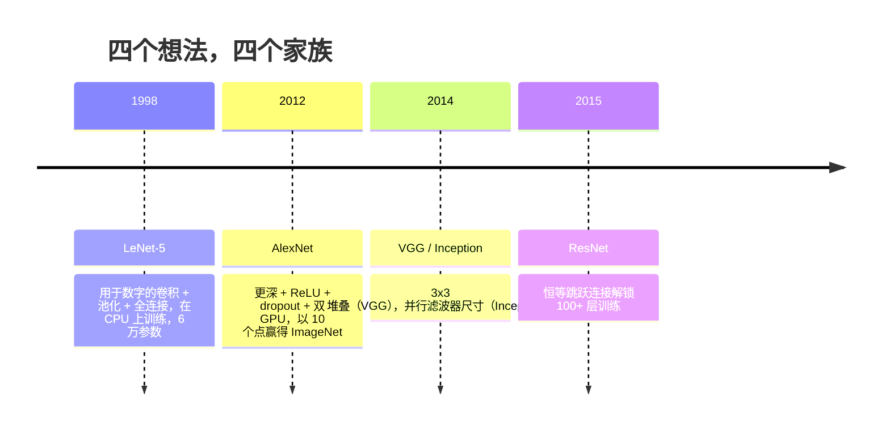
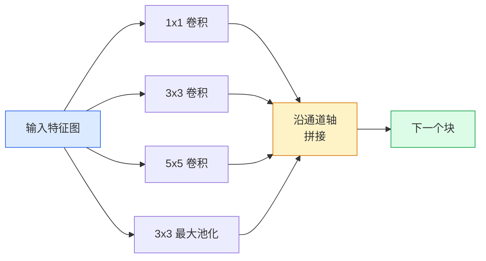
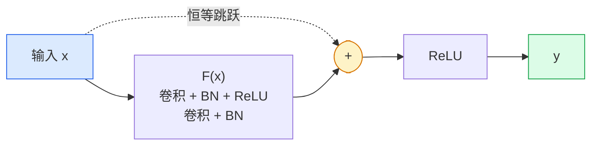

# CNN — 从 LeNet 到 ResNet

> 过去三十年每个主要的 CNN 都是相同的卷积-非线性-下采样配方，加上一个新想法。按顺序学习这些想法。

**类型：** 学习 + 构建
**语言：** Python
**前置知识：** 阶段 3 第 11 课（PyTorch）、阶段 4 第 01 课（图像基础）、阶段 4 第 02 课（从零实现卷积）
**时间：** ~75 分钟

## 学习目标

- 追溯 LeNet-5 -> AlexNet -> VGG -> Inception -> ResNet 的架构谱系，并说明每个家族贡献的单个新想法
- 在 PyTorch 中实现 LeNet-5、VGG 风格块和 ResNet BasicBlock，每个不超过 40 行
- 解释为什么残差连接将 1,000 层网络从不可训练变为最先进水平
- 阅读现代骨干网络（ResNet-18、ResNet-50）并在查看源代码之前预测其输出形状、感受野和参数数量

## 问题

2011 年，最好的 ImageNet 分类器的 top-5 准确率约为 74%。2012 年 AlexNet 达到了 85%。2015 年 ResNet 达到了 96%。没有新数据，没有新的 GPU 代际。这些收益来自架构理念。一个工作中的视觉工程师必须知道哪个想法来自哪篇论文，因为你在 2026 年交付的每个生产级骨干网络都是这些相同部分的重新组合——而且因为这些想法在持续转移：分组卷积从 CNN 到了 transformer，残差连接从 ResNet 到了每个存在的 LLM，批量归一化存在于扩散模型中。

按顺序学习这些网络也可以让你免疫于一个常见错误：当 LeNet 大小的网络就能解决问题时，却选择最大的可用模型。MNIST 不需要 ResNet。了解每个家族的扩展曲线可以告诉你在曲线上应该处于什么位置。

## 概念

### 改变视觉的四个想法



经典视觉中没有任何其他东西像这四次跳跃一样重要。

### LeNet-5 (1998)

Yann LeCun 的数字识别器。60,000 个参数。两个卷积-池化块，两个全连接层，tanh 激活。它定义了每个 CNN 继承的模板：

```
input (1, 32, 32)
  conv 5x5 -> (6, 28, 28)
  avg pool 2x2 -> (6, 14, 14)
  conv 5x5 -> (16, 10, 10)
  avg pool 2x2 -> (16, 5, 5)
  flatten -> 400
  dense -> 120
  dense -> 84
  dense -> 10
```

现代世界称为 CNN 的一切——交替的卷积和下采样，馈送给一个小的分类器头部——就是具有更多层、更大通道和更好激活的 LeNet。

### AlexNet (2012)

三个一起打破了 ImageNet 的变化：

1. **ReLU** 代替 tanh。梯度停止消失。训练速度提升了六倍。
2. **全连接头部的 Dropout**。正则化变成一个层，而不是一个技巧。
3. **深度和宽度**。五个卷积层，三个密集层，6000 万参数，在两个 GPU 上训练，模型跨 GPU 分割。

论文的图 2 仍然将 GPU 分割显示为两个并行流。这种并行性是一种硬件变通方法，而不是架构上的洞见——但上面的三个想法仍然存在于你使用的每个模型中。

### VGG (2014)

VGG 问：如果你只使用 3x3 卷积并且深入下去，会发生什么？

```
stack:   conv 3x3 -> conv 3x3 -> pool 2x2
repeat:  16 或 19 个卷积层
```

两个 3x3 卷积看到的 5x5 输入区域与一个 5x5 卷积相同，但参数更少（2*9*C^2 = 18C^2 vs 25*C^2），并且中间有一个额外的 ReLU。VGG 将这个观察转变为一个完整的架构。这种简单性——一种块类型，重复——使它成为之后一切的参考点。

代价：1.38 亿参数，训练慢，推理成本高。

### Inception（2014，同年）

Google 对"应该使用什么卷积核尺寸？"的回答是：全部，并行。



每个分支专门化——1x1 用于通道混合，3x3 用于局部纹理，5x5 用于更大模式，池化用于平移不变特征——拼接让下一层选择任何有用的分支。Inception v1 在每个分支内部使用 1x1 卷积作为瓶颈，以保持参数数量合理。

### 退化问题

到了 2015 年，VGG-19 有效而 VGG-32 无效。深度应该有帮助，但超过约 20 层后，训练和测试损失都变得更差。这不是过拟合。这是优化器未能找到有用的权重，因为梯度通过每层乘性地缩小。

```
普通深度网络：
  y = f_L( f_{L-1}( ... f_1(x) ... ) )

关于早期层的梯度：
  dL/dW_1 = dL/dy * df_L/df_{L-1} * ... * df_2/df_1 * df_1/dW_1

每个乘法项的大小大约为 (权重幅度) * (激活增益)。
堆叠 100 个增益 < 1 的项，梯度实际上为零。
```

VGG 在 19 层工作是因为批量归一化（同期发表）保持了激活的良好缩放。但即使 BN 也无法拯救超过约 30 层的深度。

### ResNet (2015)

何恺明、张祥雨、任少卿、孙剑提出了一个修复了所有问题的改变：

```
标准块：   y = F(x)
残差块：   y = F(x) + x
```

`+ x` 意味着层总可以通过驱使 `F(x)` 为零来选择什么都不做。一个 1,000 层的 ResNet 现在最多和一个 1 层网络一样差，因为每个额外的块都有一个简单的逃生出口。有了这个保证，优化器愿意让每个块*有一点*有用——而"有一点有用"，堆叠 100 次，就是最先进的水平。



两种块变体随处可见：

- **BasicBlock**（ResNet-18、ResNet-34）：两个 3x3 卷积，跳跃在两个周围。
- **Bottleneck**（ResNet-50、-101、-152）：1x1 降维，3x3 中间，1x1 升维，跳跃在三者周围。当通道数高时更便宜。

当跳跃必须穿过下采样（步长=2）时，恒等路径被替换为 1x1 步长=2 的卷积以匹配形状。

### 为什么残差在视觉之外也重要

这个想法实际上不是关于图像分类的。它是关于将深度网络从"祈祷梯度存活"转变为一种可靠、可扩展的工程工具。你在下一阶段将读到的每个 transformer 在每个块中都有完全相同的跳跃连接。没有 ResNet，就没有 GPT。

```figure
pooling
```

## 构建

### 步骤 1：LeNet-5

一个最小、忠实的 LeNet。Tanh 激活，平均池化。对现代性的唯一让步是我们在下游使用 `nn.CrossEntropyLoss` 而不是原始的 Gaussian connections。

```python
import torch
import torch.nn as nn
import torch.nn.functional as F

class LeNet5(nn.Module):
    def __init__(self, num_classes=10):
        super().__init__()
        self.conv1 = nn.Conv2d(1, 6, kernel_size=5)
        self.conv2 = nn.Conv2d(6, 16, kernel_size=5)
        self.pool = nn.AvgPool2d(2)
        self.fc1 = nn.Linear(16 * 5 * 5, 120)
        self.fc2 = nn.Linear(120, 84)
        self.fc3 = nn.Linear(84, num_classes)

    def forward(self, x):
        x = self.pool(torch.tanh(self.conv1(x)))
        x = self.pool(torch.tanh(self.conv2(x)))
        x = torch.flatten(x, 1)
        x = torch.tanh(self.fc1(x))
        x = torch.tanh(self.fc2(x))
        return self.fc3(x)

net = LeNet5()
x = torch.randn(1, 1, 32, 32)
print(f"output: {net(x).shape}")
print(f"params: {sum(p.numel() for p in net.parameters()):,}")
```

预期输出：`output: torch.Size([1, 10])`，`params: 61,706`。这就是启动了现代视觉的完整数字分类器。

### 步骤 2：VGG 块

一个可复用的块：两个 3x3 卷积、ReLU、批量归一化、最大池化。

```python
class VGGBlock(nn.Module):
    def __init__(self, in_c, out_c):
        super().__init__()
        self.conv1 = nn.Conv2d(in_c, out_c, kernel_size=3, padding=1)
        self.bn1 = nn.BatchNorm2d(out_c)
        self.conv2 = nn.Conv2d(out_c, out_c, kernel_size=3, padding=1)
        self.bn2 = nn.BatchNorm2d(out_c)
        self.pool = nn.MaxPool2d(2)

    def forward(self, x):
        x = F.relu(self.bn1(self.conv1(x)))
        x = F.relu(self.bn2(self.conv2(x)))
        return self.pool(x)

class MiniVGG(nn.Module):
    def __init__(self, num_classes=10):
        super().__init__()
        self.stack = nn.Sequential(
            VGGBlock(3, 32),
            VGGBlock(32, 64),
            VGGBlock(64, 128),
        )
        self.head = nn.Sequential(
            nn.AdaptiveAvgPool2d(1),
            nn.Flatten(),
            nn.Linear(128, num_classes),
        )

    def forward(self, x):
        return self.head(self.stack(x))

net = MiniVGG()
x = torch.randn(1, 3, 32, 32)
print(f"output: {net(x).shape}")
print(f"params: {sum(p.numel() for p in net.parameters()):,}")
```

CIFAR 尺寸输入上的三个 VGG 块，一个自适应池化，一个线性层。约 29 万参数。对于 CIFAR-10 来说足够了。

### 步骤 3：ResNet BasicBlock

ResNet-18 和 ResNet-34 的核心构建块。

```python
class BasicBlock(nn.Module):
    def __init__(self, in_c, out_c, stride=1):
        super().__init__()
        self.conv1 = nn.Conv2d(in_c, out_c, kernel_size=3, stride=stride, padding=1, bias=False)
        self.bn1 = nn.BatchNorm2d(out_c)
        self.conv2 = nn.Conv2d(out_c, out_c, kernel_size=3, stride=1, padding=1, bias=False)
        self.bn2 = nn.BatchNorm2d(out_c)
        if stride != 1 or in_c != out_c:
            self.shortcut = nn.Sequential(
                nn.Conv2d(in_c, out_c, kernel_size=1, stride=stride, bias=False),
                nn.BatchNorm2d(out_c),
            )
        else:
            self.shortcut = nn.Identity()

    def forward(self, x):
        out = F.relu(self.bn1(self.conv1(x)))
        out = self.bn2(self.conv2(out))
        out = out + self.shortcut(x)
        return F.relu(out)
```

卷积层上的 `bias=False` 是批量归一化的约定——BN 的 beta 参数已经处理了偏置，所以携带卷积偏置也是浪费。`shortcut` 只在步长或通道数改变时才需要真正的卷积；否则它是一个无操作恒等映射。

### 步骤 4：一个小型 ResNet

堆叠四组 BasicBlock，得到一个适用于 CIFAR 尺寸输入的工作 ResNet。

```python
class TinyResNet(nn.Module):
    def __init__(self, num_classes=10):
        super().__init__()
        self.stem = nn.Sequential(
            nn.Conv2d(3, 32, kernel_size=3, stride=1, padding=1, bias=False),
            nn.BatchNorm2d(32),
            nn.ReLU(inplace=True),
        )
        self.layer1 = self._make_group(32, 32, num_blocks=2, stride=1)
        self.layer2 = self._make_group(32, 64, num_blocks=2, stride=2)
        self.layer3 = self._make_group(64, 128, num_blocks=2, stride=2)
        self.layer4 = self._make_group(128, 256, num_blocks=2, stride=2)
        self.head = nn.Sequential(
            nn.AdaptiveAvgPool2d(1),
            nn.Flatten(),
            nn.Linear(256, num_classes),
        )

    def _make_group(self, in_c, out_c, num_blocks, stride):
        blocks = [BasicBlock(in_c, out_c, stride=stride)]
        for _ in range(num_blocks - 1):
            blocks.append(BasicBlock(out_c, out_c, stride=1))
        return nn.Sequential(*blocks)

    def forward(self, x):
        x = self.stem(x)
        x = self.layer1(x)
        x = self.layer2(x)
        x = self.layer3(x)
        x = self.layer4(x)
        return self.head(x)

net = TinyResNet()
x = torch.randn(1, 3, 32, 32)
print(f"output: {net(x).shape}")
print(f"params: {sum(p.numel() for p in net.parameters()):,}")
```

四组，每组两个块。第 2、3、4 组开始处步长 2。每次下采样时通道数翻倍。大约 280 万参数。这是标准配方，可以干净地扩展到 ResNet-152。

### 步骤 5：比较参数与特征效率

通过所有三个网络运行相同输入，比较参数数量。

```python
def summary(name, net, x):
    y = net(x)
    params = sum(p.numel() for p in net.parameters())
    print(f"{name:12s}  input {tuple(x.shape)} -> output {tuple(y.shape)}  params {params:>10,}")

x = torch.randn(1, 3, 32, 32)
summary("LeNet5",     LeNet5(),       torch.randn(1, 1, 32, 32))
summary("MiniVGG",    MiniVGG(),      x)
summary("TinyResNet", TinyResNet(),   x)
```

三个模型，三个时代，参数数量三个数量级。对于 CIFAR-10 准确率，你大致需要：LeNet 60%、MiniVGG 89%、TinyResNet 93%（经过几个 epoch 的训练后）。

## 使用

`torchvision.models` 为你提供了以上所有的预训练版本。不同家族之间的调用签名是相同的，这正是骨干抽象的意义所在。

```python
from torchvision.models import resnet18, ResNet18_Weights, vgg16, VGG16_Weights

r18 = resnet18(weights=ResNet18_Weights.IMAGENET1K_V1)
r18.eval()

print(f"ResNet-18 params: {sum(p.numel() for p in r18.parameters()):,}")
print(r18.layer1[0])
print()

v16 = vgg16(weights=VGG16_Weights.IMAGENET1K_V1)
v16.eval()
print(f"VGG-16   params: {sum(p.numel() for p in v16.parameters()):,}")
```

ResNet-18 有 1170 万参数。VGG-16 有 1.38 亿。相似的 ImageNet top-1 准确率（69.8% vs 71.6%）。残差连接为你带来 12 倍的参数效率优势。这就是为什么 ResNet 变体从 2016 年一直主导到 2021 年 ViT 出现——并且仍然在计算受限的实际部署中占主导地位。

对于迁移学习，配方总是相同的：加载预训练模型，冻结骨干，替换分类器头部。

```python
for p in r18.parameters():
    p.requires_grad = False
r18.fc = nn.Linear(r18.fc.in_features, 10)
```

三行代码。你现在有了一个 10 类 CIFAR 分类器，它继承了 ImageNet 付费学到的表示。

## 交付

本课程产出：

- `outputs/prompt-backbone-selector.md` — 一个提示词，根据任务、数据集大小和计算预算选择合适的 CNN 家族（LeNet/VGG/ResNet/MobileNet/ConvNeXt）。
- `outputs/skill-residual-block-reviewer.md` — 一个技能，读取 PyTorch 模块并标记跳跃连接错误（步长变化时缺少 shortcut、shortcut 激活顺序、相对于加法的 BN 放置）。

## 练习

1. **（简单）** 手动逐层计算 `TinyResNet` 的参数数量。对照 `sum(p.numel() for p in net.parameters())` 进行比较。大部分参数预算花在哪里——卷积、BN 还是分类器头部？
2. **（中等）** 实现 Bottleneck 块（1x1 -> 3x3 -> 1x1 带跳跃）并用它构建用于 CIFAR 的 ResNet-50 风格网络。参数与 `TinyResNet` 进行比较。
3. **（困难）** 从 `BasicBlock` 中移除跳跃连接，在 CIFAR-10 上分别训练一个 34 块"普通"网络和一个 34 块 ResNet，各训练 10 个 epoch。绘制两者的训练损失与 epoch 的关系图。复现 He 等人的图 1 结果，其中普通深度网络的收敛损失高于其浅层孪生网络。

## 关键术语

| 术语 | 人们的说法 | 实际含义 |
|------|----------------|----------------------|
| 骨干网络 | "模型" | 产生馈送给任务头部的特征图的卷积块堆叠 |
| 残差连接 | "跳跃连接" | `y = F(x) + x`；通过将 F 设为零让优化器学习恒等映射，使任意深度可训练 |
| BasicBlock | "两个 3x3 卷积带跳跃" | ResNet-18/34 构建块：conv-BN-ReLU-conv-BN-add-ReLU |
| Bottleneck | "1x1 降维，3x3，1x1 升维" | ResNet-50/101/152 块；在高通道数时便宜，因为 3x3 在减少的宽度上运行 |
| 退化问题 | "越深越差" | 超过约 20 个普通卷积层后，训练和测试误差都会增加；由残差连接解决，而非更多数据 |
| Stem | "第一层" | 将 3 通道输入转换为基础特征宽度的初始卷积；ImageNet 通常用 7x7 步长 2，CIFAR 用 3x3 步长 1 |
| 头部 | "分类器" | 最终骨干块之后的层：自适应池化、展平、线性层 |
| 迁移学习 | "预训练权重" | 加载在 ImageNet 上训练的骨干网络，仅在你的任务上微调头部 |

## 延伸阅读

- [Deep Residual Learning for Image Recognition (He et al., 2015)](https://arxiv.org/abs/1512.03385) — ResNet 论文；每个数字都值得研究
- [Very Deep Convolutional Networks (Simonyan & Zisserman, 2014)](https://arxiv.org/abs/1409.1556) — VGG 论文；仍然是"为什么用 3x3"的最佳参考
- [ImageNet Classification with Deep CNNs (Krizhevsky et al., 2012)](https://papers.nips.cc/paper_files/paper/2012/hash/c399862d3b9d6b76c8436e924a68c45b-Abstract.html) — AlexNet；结束了手工特征时代的论文
- [Going Deeper with Convolutions (Szegedy et al., 2014)](https://arxiv.org/abs/1409.4842) — Inception v1；并行滤波器思想，至今仍出现在视觉 transformer 中
