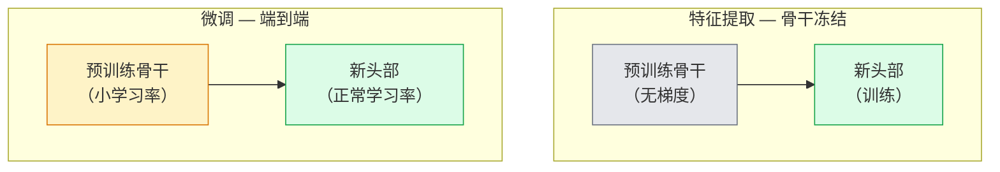

# 迁移学习与微调

> 别人花费了一百万 GPU 小时教会网络边缘、纹理和物体部分的样子。在训练你自己的网络之前，你应该借用那些特征。

**类型：** 构建
**语言：** Python
**前置知识：** 阶段 4 第 03 课（CNN）、阶段 4 第 04 课（图像分类）
**时间：** ~75 分钟

## 学习目标

- 区分特征提取和微调，并根据数据集大小、领域距离和计算预算选择正确的方法
- 加载预训练骨干网络，替换其分类器头部，并在不到 20 行代码内仅训练头部以达到工作基线
- 使用判别性学习率逐步解冻层，使早期通用特征获得比晚期任务特定特征更小的更新
- 诊断三种常见失败：解冻块的学习率过高导致特征漂移、小数据集上批归一化统计量崩溃、以及灾难性遗忘

## 问题

在 ImageNet 上训练 ResNet-50 大约需要 2,000 GPU 小时。很少有团队有预算为每个交付的任务都这样做。几乎每个团队实际交付的是预训练骨干网络加上一个新的头部，在几百或几千张任务特定图像上训练。

这不是一个捷径。任何在 ImageNet 上训练的 CNN 的第一个卷积块学习边缘和 Gabor 类滤波器。接下来的几个块学习纹理和简单模式。中间块学习物体部分。最后的块学习开始看起来像 1,000 个 ImageNet 类别的组合。这个层次结构的前 90% 几乎不做修改就能迁移到医学成像、工业检测、卫星数据和每个其他视觉任务——因为自然界的边缘和纹理词汇是有限的。最后的 10% 才是你实际训练的内容。

正确进行迁移学习有三个 bug 等着你：过高的学习率破坏预训练特征、冻结太多导致模型信息不足、以及让 BatchNorm 的运行统计量漂移到网络其余部分从未学习过的微小数据集。本课有意地逐一处理这些问题。

## 概念

### 特征提取 vs 微调

两种模式，根据你信任预训练特征的程度和你有多少数据来选择。



经验法则：

| 数据集大小 | 领域距离 | 方法 |
|--------------|-----------------|--------|
| < 1k 张图像 | 接近 ImageNet | 冻结骨干，仅训练头部 |
| 1k-10k | 接近 | 冻结前 2-3 个阶段，微调其余部分 |
| 10k-100k | 任意 | 使用判别性学习率端到端微调 |
| 100k+ | 远 | 微调所有层；如果领域足够远，考虑从头训练 |

"接近 ImageNet"大致意味着具有类似物体内容的自然 RGB 照片。医学 CT 扫描、俯拍卫星图像和显微图像属于远领域——特征仍然有帮助，但需要让更多层适应。

### 为什么冻结有效

CNN 学到的 ImageNet 特征并非专属于那 1,000 个类别。它们专属于自然图像的统计特性：特定方向的边缘、纹理、对比度模式、形状基元。这些统计量在人类能命名的几乎所有视觉领域都是稳定的。这就是为什么在 ImageNet 上训练并在 CIFAR-10 上零样本评估（仅用新的线性头部，不对骨干进行微调）就能达到 80% 以上的准确率。头部正在学习哪些已经学到的特征适合这个任务。

### 判别性学习率

当你确实解冻时，早期层应该比晚期层训练得更慢。早期层编码你想要保留的通用特征；晚期层编码你需要大幅移动的任务特定结构。

```
典型配方：

  stage 0（stem + 第一组）： lr = base_lr / 100    （基本固定）
  stage 1：                   lr = base_lr / 10
  stage 2：                   lr = base_lr / 3
  stage 3（最后骨干组）：   lr = base_lr
  head：                      lr = base_lr  （或稍高）
```

在 PyTorch 中，这只是一个传递给优化器的参数组列表。一个模型，五个学习率，零额外代码。

### BatchNorm 问题

BN 层持有在 ImageNet 上计算的 `running_mean` 和 `running_var` 缓冲区。如果你的任务具有不同的像素分布——不同的光照、不同的传感器、不同的色彩空间——这些缓冲区就是错误的。按优先顺序排列的三个选项：

1. **在训练模式下微调 BN。** 让 BN 随其他一切更新其运行统计量。当任务数据集中等规模（>= 5k 个样本）时的默认选择。
2. **在评估模式下冻结 BN。** 保留 ImageNet 统计量，仅训练权重。当你的数据集小到 BN 的移动平均会有噪声时的正确选择。
3. **用 GroupNorm 替换 BN。** 完全消除移动平均问题。用于每 GPU 批次大小很小的检测和分割骨干网络。

弄错这个会静默地使准确率下降 5-15%。

### 头部设计

分类器头部是 1-3 个线性层加一个可选的 dropout。每个 torchvision 骨干网络都带有一个默认头部，你可以替换：

```
backbone.fc = nn.Linear(backbone.fc.in_features, num_classes)          # ResNet
backbone.classifier[1] = nn.Linear(..., num_classes)                    # EfficientNet, MobileNet
backbone.heads.head = nn.Linear(..., num_classes)                       # torchvision ViT
```

对于小数据集，单个线性层通常就足够了。当任务分布与骨干训练分布相距较远时，添加隐藏层（Linear -> ReLU -> Dropout -> Linear）会有所帮助。

### 逐层学习率衰减

现代微调（BEiT、DINOv2、ViT-B 微调）中使用的更平滑的判别性学习率版本。不是将层分组为阶段，而是给每层一个略低于其上层的学习率：

```
lr_layer_k = base_lr * decay^(L - k)
```

当 decay = 0.75 且 L = 12 个 transformer 块时，第一个块以头部学习率的 `0.75^11 ≈ 0.04x` 训练。对于 transformer 微调比 CNN 更重要，CNN 中按阶段分组的学习率通常就足够了。

### 评估什么

迁移学习运行需要两个你在从头训练中不会追踪的数字：

- **仅预训练准确率** — 骨干冻结时头部的准确率。这是你的下限。
- **微调后准确率** — 端到端训练后相同模型的准确率。这是你的上限。

如果微调后低于仅预训练，你有一个学习率或 BN 的 bug。始终打印两者。

## 构建

### 步骤 1：加载预训练骨干并检查

```python
import torch
import torch.nn as nn
from torchvision.models import resnet18, ResNet18_Weights

backbone = resnet18(weights=ResNet18_Weights.IMAGENET1K_V1)
print(backbone)
print()
print("classifier head:", backbone.fc)
print("feature dim:", backbone.fc.in_features)
```

`ResNet18` 有四个阶段（`layer1..layer4`）加上一个 stem 和一个 `fc` 头部。每个 torchvision 分类骨干网络都有类似的结构。

### 步骤 2：特征提取——冻结一切，替换头部

```python
def make_feature_extractor(num_classes=10):
    model = resnet18(weights=ResNet18_Weights.IMAGENET1K_V1)
    for p in model.parameters():
        p.requires_grad = False
    model.fc = nn.Linear(model.fc.in_features, num_classes)
    return model

model = make_feature_extractor(num_classes=10)
trainable = sum(p.numel() for p in model.parameters() if p.requires_grad)
frozen = sum(p.numel() for p in model.parameters() if not p.requires_grad)
print(f"trainable: {trainable:>10,}")
print(f"frozen:    {frozen:>10,}")
```

只有 `model.fc` 是可训练的。骨干是一个冻结的特征提取器。

### 步骤 3：判别性微调

一个构建具有阶段特定学习率的参数组的工具。

```python
def discriminative_param_groups(model, base_lr=1e-3, decay=0.3):
    stages = [
        ["conv1", "bn1"],
        ["layer1"],
        ["layer2"],
        ["layer3"],
        ["layer4"],
        ["fc"],
    ]
    groups = []
    for i, names in enumerate(stages):
        lr = base_lr * (decay ** (len(stages) - 1 - i))
        params = [p for n, p in model.named_parameters()
                  if any(n.startswith(k) for k in names)]
        if params:
            groups.append({"params": params, "lr": lr, "name": "_".join(names)})
    return groups

model = resnet18(weights=ResNet18_Weights.IMAGENET1K_V1)
model.fc = nn.Linear(model.fc.in_features, 10)
for p in model.parameters():
    p.requires_grad = True

groups = discriminative_param_groups(model)
for g in groups:
    print(f"{g['name']:>10s}  lr={g['lr']:.2e}  params={sum(p.numel() for p in g['params']):>8,}")
```

`decay=0.3` 意味着每个阶段以下一个阶段 30% 的速率训练。`fc` 得到 `base_lr`，`layer4` 得到 `0.3 * base_lr`，`conv1` 得到 `0.3^5 * base_lr ≈ 0.00243 * base_lr`。听起来很极端，但经验上有效。

### 步骤 4：BatchNorm 处理

用于冻结 BN 运行统计量而不冻结其权重的辅助函数。

```python
def freeze_bn_stats(model):
    for m in model.modules():
        if isinstance(m, (nn.BatchNorm1d, nn.BatchNorm2d, nn.BatchNorm3d)):
            m.eval()
            for p in m.parameters():
                p.requires_grad = False
    return model
```

在每个 epoch 开始时设置 `model.train()` 后调用它。`model.train()` 将所有层翻转为训练模式；这仅对 BN 层反转此操作。

### 步骤 5：最小的端到端微调循环

```python
from torch.optim import SGD
from torch.utils.data import DataLoader
from torch.optim.lr_scheduler import CosineAnnealingLR
import torch.nn.functional as F

def fine_tune(model, train_loader, val_loader, device, epochs=5, base_lr=1e-3, freeze_bn=False):
    model = model.to(device)
    groups = discriminative_param_groups(model, base_lr=base_lr)
    optimizer = SGD(groups, momentum=0.9, weight_decay=1e-4, nesterov=True)
    scheduler = CosineAnnealingLR(optimizer, T_max=epochs)

    for epoch in range(epochs):
        model.train()
        if freeze_bn:
            freeze_bn_stats(model)
        tr_loss, tr_correct, tr_total = 0.0, 0, 0
        for x, y in train_loader:
            x, y = x.to(device), y.to(device)
            logits = model(x)
            loss = F.cross_entropy(logits, y, label_smoothing=0.1)
            optimizer.zero_grad()
            loss.backward()
            optimizer.step()
            tr_loss += loss.item() * x.size(0)
            tr_total += x.size(0)
            tr_correct += (logits.argmax(-1) == y).sum().item()
        scheduler.step()

        model.eval()
        va_total, va_correct = 0, 0
        with torch.no_grad():
            for x, y in val_loader:
                x, y = x.to(device), y.to(device)
                pred = model(x).argmax(-1)
                va_total += x.size(0)
                va_correct += (pred == y).sum().item()
        print(f"epoch {epoch}  train {tr_loss/tr_total:.3f}/{tr_correct/tr_total:.3f}  "
              f"val {va_correct/va_total:.3f}")
    return model
```

在 CIFAR-10 上使用上述配方五个 epoch，将 `ResNet18-IMAGENET1K_V1` 从约 70% 的零样本线性探测准确率提升到约 93% 的微调准确率。仅头部训练会在约 86% 处停滞，从未触及骨干。

### 步骤 6：渐进式解冻

一个调度，从末端向开始每个 epoch 解冻一个阶段。以一些额外 epoch 为代价缓解特征漂移。

```python
def progressive_unfreeze_schedule(model):
    stages = ["layer4", "layer3", "layer2", "layer1"]
    yielded = set()

    def start():
        for p in model.parameters():
            p.requires_grad = False
        for p in model.fc.parameters():
            p.requires_grad = True

    def unfreeze(epoch):
        if epoch < len(stages):
            name = stages[epoch]
            yielded.add(name)
            for n, p in model.named_parameters():
                if n.startswith(name):
                    p.requires_grad = True
            return name
        return None

    return start, unfreeze
```

在第一个 epoch 之前调用一次 `start()`。在每个 epoch 开始时调用 `unfreeze(epoch)`。每当可训练参数集合变化时重建优化器，否则冻结的参数仍持有使优化器混淆的缓存时刻。

## 使用

对于大多数实际任务，`torchvision.models` + 三行代码就足够了。当遇到库默认值无法修复的问题时，上述更重的机制才需要。

```python
from torchvision.models import resnet50, ResNet50_Weights

model = resnet50(weights=ResNet50_Weights.IMAGENET1K_V2)
model.fc = nn.Linear(model.fc.in_features, num_classes)
optimizer = torch.optim.AdamW(model.parameters(), lr=1e-4, weight_decay=1e-4)
```

另外两个生产级默认值：

- `timm` 提供约 800 个预训练视觉骨干网络，具有一致的 API（`timm.create_model("resnet50", pretrained=True, num_classes=10)`）。对于任何超出 torchvision 动物园的微调，它是标准选择。
- 对于 transformer，`transformers.AutoModelForImageClassification.from_pretrained(name, num_labels=N)` 为你提供 ViT / BEiT / DeiT，具有与文本模型相同的加载语义。

## 交付

本课程产出：

- `outputs/prompt-fine-tune-planner.md` — 一个提示词，根据数据集大小、领域距离和计算预算选择特征提取 vs 渐进式 vs 端到端微调。
- `outputs/skill-freeze-inspector.md` — 一个技能，给定 PyTorch 模型，报告哪些参数可训练、哪些 BatchNorm 层处于评估模式，以及优化器是否实际上在消耗可训练参数。

## 练习

1. **（简单）** 在相同的合成 CIFAR 数据集上，将 `ResNet18` 分别作为线性探测（骨干冻结）和完整微调训练。并排报告两种准确率。解释哪个差距告诉你特征迁移良好，哪个告诉你特征迁移不足。
2. **（中等）** 有意引入一个 bug：在骨干阶段而不是头部设置 `base_lr = 1e-1`。展示训练损失爆炸，然后通过应用 `discriminative_param_groups` 辅助函数恢复。记录每个阶段开始发散时的学习率。
3. **（困难）** 取一个医学成像数据集（例如 CheXpert-small、PatchCamelyon 或 HAM10000）并比较三种方法：(a) ImageNet 预训练冻结骨干 + 线性头部；(b) ImageNet 预训练端到端微调；(c) 从头训练。报告每种方法的准确率和计算成本。在什么数据集大小下从头训练变得有竞争力？

## 关键术语

| 术语 | 人们的说法 | 实际含义 |
|------|----------------|----------------------|
| 特征提取 | "冻结并训练头部" | 骨干参数冻结，仅新的分类器头部接收梯度 |
| 微调 | "端到端重新训练" | 所有参数可训练，通常使用比从头训练小得多的学习率 |
| 判别性学习率 | "早期层更小的学习率" | 优化器参数组，早期阶段的学习率是后期阶段学习率的一小部分 |
| 逐层学习率衰减 | "平滑的学习率梯度" | 每层学习率乘以 decay^(L - k)；在 transformer 微调中常见 |
| 灾难性遗忘 | "模型忘记了 ImageNet" | 过高的学习率在新的任务信号被学习之前覆盖了预训练特征 |
| BN 统计量漂移 | "运行均值是错的" | BatchNorm 的 running_mean/var 在与当前任务不同的分布上计算，静默地损害准确率 |
| 线性探测 | "冻结骨干 + 线性头部" | 预训练特征的评估——冻结表示上最佳线性分类器的准确率 |
| 灾难性崩溃 | "一切都预测一个类别" | 发生在微调时，学习率足够高，在头部梯度能够稳定之前就破坏了特征 |

## 延伸阅读

- [How transferable are features in deep neural networks? (Yosinski et al., 2014)](https://arxiv.org/abs/1411.1792) — 量化跨层特征可迁移性的论文
- [Universal Language Model Fine-tuning (ULMFiT, Howard & Ruder, 2018)](https://arxiv.org/abs/1801.06146) — 原始的判别性学习率/渐进式解冻配方；这些想法直接迁移到视觉
- [timm documentation](https://huggingface.co/docs/timm) — 现代视觉骨干网络的参考，以及它们训练时使用的确切微调默认值
- [A Simple Framework for Linear-Probe Evaluation (Kornblith et al., 2019)](https://arxiv.org/abs/1805.08974) — 为什么线性探测准确率重要以及如何正确报告它
