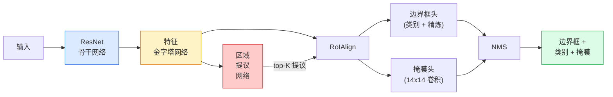

# 实例分割 — Mask R-CNN

> 在 Faster R-CNN 检测器上添加一个小型掩膜分支，你就得到了实例分割。困难的部分是 RoIAlign，它比看起来要难得多。

**类型：** 构建 + 学习
**语言：** Python
**前置知识：** 第4阶段第06课（YOLO），第4阶段第07课（U-Net）
**时间：** ~75分钟

## 学习目标

- 完整追溯 Mask R-CNN 架构：骨干网络、FPN、RPN、RoIAlign、边界框头、掩膜头
- 从零开始实现 RoIAlign 并解释为什么 RoIPool 不再使用
- 使用 torchvision 的 `maskrcnn_resnet50_fpn_v2` 预训练模型获得生产质量的实例掩膜，并正确读取其输出格式
- 通过替换边界框头和掩膜头并保持骨干网络冻结，在小规模自定义数据集上微调 Mask R-CNN

## 问题

语义分割为每个类别提供一个掩膜。实例分割为每个物体提供一个掩膜，即使两个物体共享同一个类别。计数个体、跨帧追踪以及测量事物（墙壁中每块砖的边界框、显微镜图像中的每个细胞）都需要实例分割。

Mask R-CNN（He 等人，2017）通过将实例分割重新定义为检测加掩膜来解决这个问题。这个设计如此简洁，以至于在接下来的五年里，几乎每篇实例分割论文都是 Mask R-CNN 的变体，并且 torchvision 的实现仍然是中小型数据集的生产默认选择。

困难的工程问题是采样：如何从一个角点不与像素边界对齐的提议框中裁剪出固定大小的特征区域？搞错这个问题会在各个方面损失十分之几的 mAP 点。RoIAlign 就是答案。

## 概念

### 架构



需要理解的五个部分：

1. **骨干网络** — 在 ImageNet 上训练的 ResNet-50 或 ResNet-101。产生步长为 4、8、16、32 的特征图层级结构。
2. **FPN（特征金字塔网络）** — 自顶向下 + 侧向连接，使每个层级都有 C 个通道的语义丰富特征。检测根据物体大小查询匹配的 FPN 层级。
3. **RPN（区域提议网络）** — 一个小型卷积头，在每个锚点位置预测"这里是否有物体？"和"如何精炼边界框？"。每张图像产生约 1000 个提议。
4. **RoIAlign** — 从任意 FPN 层级上的任意边界框中采样一个固定大小（例如 7x7）的特征块。双线性采样，无量化。
5. **头部** — 两层边界框头，用于精炼边界框和选择类别，加上一个小型卷积头，为每个提议输出一个 `28x28` 的二值掩膜。

### 为什么用 RoIAlign 而不是 RoIPool

最初的 Fast R-CNN 使用 RoIPool，它将提议框分割成一个网格，取每个单元格中的最大特征，并将所有坐标四舍五入为整数。这种四舍五入会导致特征图与输入像素坐标产生最多一个完整特征图像素的偏移 — 在 224x224 图像上很小，但当特征图步长为 32 时是灾难性的。

```
RoIPool:
  box (34.7, 51.3, 98.2, 142.9)
  round -> (34, 51, 98, 142)
  split grid -> round each cell boundary
  misalignment accumulates at every step

RoIAlign:
  box (34.7, 51.3, 98.2, 142.9)
  sample at exact float coordinates using bilinear interpolation
  no rounding anywhere
```

RoIAlign 在 COCO 上免费将掩膜 AP 提升了 3-4 个点。每个关心定位的检测器现在都使用它 — YOLOv7 seg、RT-DETR、Mask2Former 等都是如此。

### 一段话解释 RPN

在特征图的每个位置上，放置 K 个不同大小和形状的锚点框。为每个锚点预测一个物体性得分和一个回归偏移量，将锚点变成一个更拟合的边界框。保留得分最高的约 1000 个框，在 IoU 0.7 处应用 NMS，将幸存者交给头部。RPN 使用自己的小损失函数进行训练 — 与第 6 课的 YOLO 损失结构相同，只是有两个类别（有物体 / 无物体）。

### 掩膜头

对于每个提议（RoIAlign 之后），掩膜头是一个小型 FCN：四个 3x3 卷积、一个 2x 反卷积、一个最终的 1x1 卷积，在 `28x28` 分辨率下产生 `num_classes` 个输出通道。只保留与预测类别对应的通道；其他通道被忽略。这解耦了掩膜预测与分类。

将 28x28 掩膜上采样到提议的原始像素大小，以产生最终的二值掩膜。

### 损失函数

Mask R-CNN 有四个损失函数相加：

```
L = L_rpn_cls + L_rpn_box + L_box_cls + L_box_reg + L_mask
```

- `L_rpn_cls`、`L_rpn_box` — RPN 提议的物体性 + 边界框回归。
- `L_box_cls` — 分类器头上 (C+1) 个类别（包括背景）的交叉熵。
- `L_box_reg` — 头部边界框精炼上的 smooth L1。
- `L_mask` — 28x28 掩膜输出上的逐像素二值交叉熵。

每个损失都有其自己的默认权重；torchvision 的实现将它们作为构造函数参数暴露出来。

### 输出格式

`torchvision.models.detection.maskrcnn_resnet50_fpn_v2` 返回一个字典列表，每张图像一个：

```
{
    "boxes":  (N, 4) 像素坐标 (x1, y1, x2, y2),
    "labels": (N,) 类别 ID，0 = 背景，因此索引从 1 开始,
    "scores": (N,) 置信度得分,
    "masks":  (N, 1, H, W) 浮点掩膜，取值 [0, 1] — 阈值为 0.5 得到二值掩膜,
}
```

掩膜已经是全图像分辨率。28x28 的头部输出已在内部上采样。

## 构建

### 第1步：从零实现 RoIAlign

这是 Mask R-CNN 中唯一一个用代码比用文字更容易理解的组件。

```python
import torch
import torch.nn.functional as F

def roi_align_single(feature, box, output_size=7, spatial_scale=1 / 16.0):
    """
    feature: (C, H, W) 单图像特征图
    box: (x1, y1, x2, y2) 原始图像像素坐标
    output_size: 输出网格边长（边界框头为 7，掩膜头为 14）
    spatial_scale: 特征图步长的倒数
    """
    C, H, W = feature.shape
    x1, y1, x2, y2 = [c * spatial_scale - 0.5 for c in box]
    bin_w = (x2 - x1) / output_size
    bin_h = (y2 - y1) / output_size

    grid_y = torch.linspace(y1 + bin_h / 2, y2 - bin_h / 2, output_size)
    grid_x = torch.linspace(x1 + bin_w / 2, x2 - bin_w / 2, output_size)
    yy, xx = torch.meshgrid(grid_y, grid_x, indexing="ij")

    gx = 2 * (xx + 0.5) / W - 1
    gy = 2 * (yy + 0.5) / H - 1
    grid = torch.stack([gx, gy], dim=-1).unsqueeze(0)
    sampled = F.grid_sample(feature.unsqueeze(0), grid, mode="bilinear",
                            align_corners=False)
    return sampled.squeeze(0)
```

每个数字都位于一个双线性采样位置。没有四舍五入，没有量化，没有梯度丢失。

### 第2步：与 torchvision 的 RoIAlign 比较

```python
from torchvision.ops import roi_align

feature = torch.randn(1, 16, 50, 50)
boxes = torch.tensor([[0, 10, 20, 100, 90]], dtype=torch.float32)  # (batch_idx, x1, y1, x2, y2)

ours = roi_align_single(feature[0], boxes[0, 1:].tolist(), output_size=7, spatial_scale=1/4)
theirs = roi_align(feature, boxes, output_size=(7, 7), spatial_scale=1/4, sampling_ratio=1, aligned=True)[0]

print(f"我们的形状:   {tuple(ours.shape)}")
print(f"torchvision形状: {tuple(theirs.shape)}")
print(f"最大|差|:    {(ours - theirs).abs().max().item():.3e}")
```

在 `sampling_ratio=1` 和 `aligned=True` 的情况下，两者匹配到 `1e-5` 以内。

### 第3步：加载预训练的 Mask R-CNN

```python
import torch
from torchvision.models.detection import maskrcnn_resnet50_fpn_v2, MaskRCNN_ResNet50_FPN_V2_Weights

model = maskrcnn_resnet50_fpn_v2(weights=MaskRCNN_ResNet50_FPN_V2_Weights.DEFAULT)
model.eval()
print(f"参数量: {sum(p.numel() for p in model.parameters()):,}")
print(f"类别数（包括背景）: {len(model.roi_heads.box_predictor.cls_score.out_features * [0])}")
```

4600 万参数，91 个类别（COCO）。第一个类别（ID 0）是背景；模型实际检测到的所有内容从 ID 1 开始。

### 第4步：运行推理

```python
with torch.no_grad():
    x = torch.randn(3, 400, 600)
    predictions = model([x])
p = predictions[0]
print(f"边界框:  {tuple(p['boxes'].shape)}")
print(f"标签: {tuple(p['labels'].shape)}")
print(f"得分: {tuple(p['scores'].shape)}")
print(f"掩膜:  {tuple(p['masks'].shape)}")
```

掩膜张量的形状为 `(N, 1, H, W)`。阈值为 0.5 得到每个物体的二值掩膜：

```python
binary_masks = (p['masks'] > 0.5).squeeze(1)  # (N, H, W) 布尔值
```

### 第5步：为自定义类别数替换头部

常见的微调方案：重用骨干网络、FPN 和 RPN；替换两个分类头。

```python
from torchvision.models.detection.faster_rcnn import FastRCNNPredictor
from torchvision.models.detection.mask_rcnn import MaskRCNNPredictor

def build_custom_maskrcnn(num_classes):
    model = maskrcnn_resnet50_fpn_v2(weights=MaskRCNN_ResNet50_FPN_V2_Weights.DEFAULT)
    in_features = model.roi_heads.box_predictor.cls_score.in_features
    model.roi_heads.box_predictor = FastRCNNPredictor(in_features, num_classes)
    in_features_mask = model.roi_heads.mask_predictor.conv5_mask.in_channels
    hidden_layer = 256
    model.roi_heads.mask_predictor = MaskRCNNPredictor(in_features_mask, hidden_layer, num_classes)
    return model

custom = build_custom_maskrcnn(num_classes=5)
print(f"自定义 cls_score.out_features: {custom.roi_heads.box_predictor.cls_score.out_features}")
```

`num_classes` 必须包含背景类别，因此一个有 4 个目标类别的数据集使用 `num_classes=5`。

### 第6步：冻结不需要训练的层

在小数据集上，冻结骨干网络和 FPN。只有 RPN 物体性 + 回归和两个头部进行学习。

```python
def freeze_backbone_and_fpn(model):
    # torchvision Mask R-CNN 将 FPN 打包在 `model.backbone` 内（作为
    # `model.backbone.fpn`），因此遍历 `model.backbone.parameters()` 会覆盖
    # ResNet 特征层和 FPN 侧向/输出卷积。
    for p in model.backbone.parameters():
        p.requires_grad = False
    return model

custom = freeze_backbone_and_fpn(custom)
trainable = sum(p.numel() for p in custom.parameters() if p.requires_grad)
print(f"冻结后可训练参数量: {trainable:,}")
```

在 500 张图像的数据集上，这就是收敛与过拟合的区别。

## 使用

torchvision 中 Mask R-CNN 的完整训练循环只有 40 行代码，且在不同任务之间不会有实质性变化 — 切换数据集即可运行。

```python
def train_step(model, images, targets, optimizer):
    model.train()
    loss_dict = model(images, targets)
    losses = sum(loss for loss in loss_dict.values())
    optimizer.zero_grad()
    losses.backward()
    optimizer.step()
    return {k: v.item() for k, v in loss_dict.items()}
```

`targets` 列表必须包含每张图像的字典，包含 `boxes`、`labels` 和 `masks`（作为 `(num_instances, H, W)` 二值张量）。模型在训练期间返回一个包含四个损失的字典，在评估期间返回预测列表，通过 `model.training` 控制。

`pycocotools` 评估器产生 mAP@IoU=0.5:0.95，包括边界框和掩膜；你需要这两个数字来知道是边界框头还是掩膜头是瓶颈。

## 交付物

本课产出：

- `outputs/prompt-instance-vs-semantic-router.md` — 一个提示，询问三个问题并选择实例 vs 语义 vs 全景分割以及确切的首选模型。
- `outputs/skill-mask-rcnn-head-swapper.md` — 一个技能，针对给定的新 `num_classes`，为任何 torchvision 检测模型生成替换头部的 10 行代码。

## 练习

1. **（简单）** 在 100 个随机边界框上验证你的 RoIAlign 与 `torchvision.ops.roi_align`。报告最大绝对差异。同时运行 RoIPool（2017 年之前的行为）并展示在靠近边界的框上它偏离约 1-2 个特征图像素。
2. **（中等）** 在 50 张图像的自定义数据集（任意两个类别：气球、鱼、坑洞、标志）上微调 `maskrcnn_resnet50_fpn_v2`。冻结骨干网络，训练 20 个周期，报告 mask AP@0.5。
3. **（困难）** 将 Mask R-CNN 的掩膜头替换为在 56x56 而非 28x28 上进行预测。测量之前和之后的 mAP@IoU=0.75。解释为什么增益（或缺乏增益）符合预期的边界精度 / 内存权衡。

## 关键术语

| 术语 | 人们说的 | 实际含义 |
|------|---------|---------|
| Mask R-CNN | "检测加掩膜" | Faster R-CNN + 一个小型 FCN 头，为每个提议每个类别预测 28x28 掩膜 |
| FPN | "特征金字塔" | 自顶向下 + 侧向连接，使每个步长级别都有 C 个通道的语义丰富特征 |
| RPN | "区域提议器" | 一个小型卷积头，每张图像产生约 1000 个有/无物体的提议 |
| RoIAlign | "无四舍五入的裁剪" | 从任何浮点坐标边界框中双线性采样固定大小的特征网格 |
| RoIPool | "2017 年之前的裁剪" | 与 RoIAlign 目的相同，但四舍五入边界框坐标；已过时 |
| Mask AP | "实例 mAP" | 使用掩膜 IoU 而非边界框 IoU 计算的平均精度；COCO 实例分割指标 |
| 二值掩膜头 | "每类掩膜" | 为每个提议的每个类别预测一个二值掩膜；只保留预测类别对应的通道 |
| 背景类别 | "类别 0" | 包罗一切的"无物体"类别；真实类别的索引从 1 开始 |

## 延伸阅读

- [Mask R-CNN (He et al., 2017)](https://arxiv.org/abs/1703.06870) — 原始论文；第 3 节关于 RoIAlign 是必读内容
- [FPN: Feature Pyramid Networks (Lin et al., 2017)](https://arxiv.org/abs/1612.03144) — FPN 论文；每个现代检测器都使用它
- [torchvision Mask R-CNN tutorial](https://pytorch.org/tutorials/intermediate/torchvision_tutorial.html) — 微调循环的参考
- [Detectron2 model zoo](https://github.com/facebookresearch/detectron2/blob/main/MODEL_ZOO.md) — 包含几乎所有检测和分割变体训练权重的生产实现
