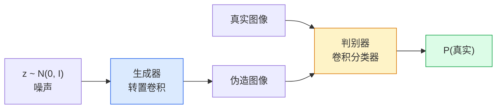
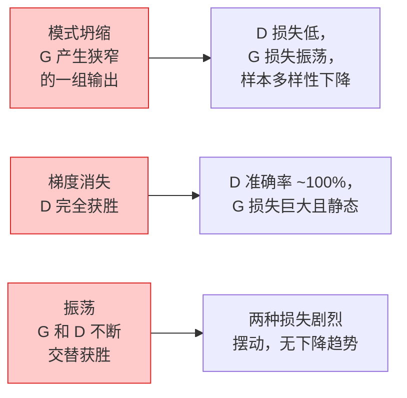

# 图像生成 — GAN

> GAN 是两个神经网络在进行的固定博弈。一个绘制，一个评判。它们一起进步，直到绘制的图像能骗过评判者。

**类型：** 构建
**语言：** Python
**前置知识：** 第4阶段第03课（CNN），第3阶段第06课（优化器），第3阶段第07课（正则化）
**时间：** ~75分钟

## 学习目标

- 解释生成器和判别器之间的极小化极大博弈，以及为什么均衡对应 p_模型 = p_数据
- 用 PyTorch 实现 DCGAN，并在不到 60 行代码内使其生成连贯的 32x32 合成图像
- 使用三个标准技巧稳定 GAN 训练：非饱和损失、谱归一化、TTUR（双时间尺度更新规则）
- 读取能够区分健康收敛与模式坍缩、振荡和判别器完全获胜的训练曲线

## 问题

分类教网络将图像映射到标签。生成则反转问题：采样看起来来自同一分布的新图像。没有可以用来做差异对比的"正确"输出；只有一个你想要模仿的分布。

标准损失函数（MSE、交叉熵）无法衡量"这个样本是否来自真实分布"。最小化逐像素误差会产生模糊的平均值，而不是真实的样本。突破性进展是学习损失函数：训练第二个网络，其任务是区分真实与伪造，并使用它的判断来推动生成器。

GAN（Goodfellow 等人，2014）定义了那个框架。到 2018 年，StyleGAN 已经能产生与照片无异的 1024x1024 人脸。扩散模型后来在质量和可控性方面夺得了王位，但使得扩散模型实用化的每一个技巧 — 归一化选择、潜在空间、特征损失 — 都是先在 GAN 上被理解的。

## 概念

### 两个网络



**生成器** G 接收噪声向量 `z` 并输出图像。**判别器** D 接收图像并输出一个标量：该图像为真实的概率。

### 博弈

G 希望 D 犯错。D 希望正确。形式化地：

```
min_G max_D  E_x[log D(x)] + E_z[log(1 - D(G(z)))]
```

从右往左读：D 在最大化真实图像（`log D(real)`）和伪造图像（`log (1 - D(fake))`）上的准确率。G 在最小化 D 在伪造图像上的准确率 — 它希望 `D(G(z))` 很高。

Goodfellow 证明了这个极小化极大问题有一个全局均衡，其中 `p_G = p_data`，D 在所有地方输出 0.5，生成分布与真实分布之间的 Jensen-Shannon 散度为零。困难的部分是如何达到这个均衡。

### 非饱和损失

上面的形式在数值上不稳定。在训练早期，`D(G(z))` 对每个伪造图像都接近零，因此 `log(1 - D(G(z)))` 对 G 的梯度趋近于零。解决方法：翻转 G 的损失。

```
L_D = -E_x[log D(x)] - E_z[log(1 - D(G(z)))]
L_G = -E_z[log D(G(z))]                          # 非饱和
```

现在当 `D(G(z))` 接近零时，G 的损失很大，其梯度也包含丰富信息。每个现代 GAN 都使用这个变体进行训练。

### DCGAN 架构规则

Radford、Metz、Chintala（2015）将多年的失败实验提炼为五个规则，使 GAN 训练变得稳定：

1. 用步长卷积替换池化（两个网络都适用）。
2. 在生成器和判别器中使用批归一化，但 G 的输出和 D 的输入除外。
3. 在更深的架构中移除全连接层。
4. G 在所有层使用 ReLU（输出使用 tanh，范围在 [-1, 1]）。
5. D 在所有层使用 LeakyReLU（negative_slope=0.2）。

每个现代基于卷积的 GAN（StyleGAN、BigGAN、GigaGAN）仍然从这些规则开始，然后逐个替换部分。

### 失败模式及其特征



- **模式坍缩**：G 找到了一个能骗过 D 的图像，只产生这一个。解决方法：添加小批量判别、谱归一化或标签条件。
- **判别器获胜**：D 变得太快太强，G 的梯度消失。解决方法：让 D 更小、降低 D 学习率，或在真实标签上应用标签平滑。
- **振荡**：两个网络交替获胜，从未接近均衡。解决方法：TTUR（D 的学习速度是 G 的 2-4 倍），或切换到 Wasserstein 损失。

### 评估

GAN 没有真实值，那么如何知道它们是否在工作？

- **样本检查** — 在每个周期结束时观察 64 个样本。不可妥协。
- **FID（Fréchet Inception Distance）** — 真实集和生成集的 Inception-v3 特征分布之间的距离。越低越好。社区标准。
- **Inception Score** — 较旧，更脆弱；优先使用 FID。
- **生成模型的精度/召回率** — 分别衡量质量（精度）和覆盖率（召回率）。比单独使用 FID 提供更多信息。

对于小的合成数据运行，样本检查就够了。

## 构建

### 第1步：生成器

一个小型 DCGAN 生成器，接收 64 维噪声并产生 32x32 图像。

```python
import torch
import torch.nn as nn

class Generator(nn.Module):
    def __init__(self, z_dim=64, img_channels=3, feat=64):
        super().__init__()
        self.net = nn.Sequential(
            nn.ConvTranspose2d(z_dim, feat * 4, kernel_size=4, stride=1, padding=0, bias=False),
            nn.BatchNorm2d(feat * 4),
            nn.ReLU(inplace=True),
            nn.ConvTranspose2d(feat * 4, feat * 2, kernel_size=4, stride=2, padding=1, bias=False),
            nn.BatchNorm2d(feat * 2),
            nn.ReLU(inplace=True),
            nn.ConvTranspose2d(feat * 2, feat, kernel_size=4, stride=2, padding=1, bias=False),
            nn.BatchNorm2d(feat),
            nn.ReLU(inplace=True),
            nn.ConvTranspose2d(feat, img_channels, kernel_size=4, stride=2, padding=1, bias=False),
            nn.Tanh(),
        )

    def forward(self, z):
        return self.net(z.view(z.size(0), -1, 1, 1))
```

四个转置卷积，每个使用 `kernel_size=4, stride=2, padding=1`，以便干净地加倍空间尺寸。通过 tanh 将输出激活限制在 [-1, 1]。

### 第2步：判别器

生成器的镜像。LeakyReLU、步长卷积，最后输出标量 logit。

```python
class Discriminator(nn.Module):
    def __init__(self, img_channels=3, feat=64):
        super().__init__()
        self.net = nn.Sequential(
            nn.Conv2d(img_channels, feat, kernel_size=4, stride=2, padding=1),
            nn.LeakyReLU(0.2, inplace=True),
            nn.Conv2d(feat, feat * 2, kernel_size=4, stride=2, padding=1, bias=False),
            nn.BatchNorm2d(feat * 2),
            nn.LeakyReLU(0.2, inplace=True),
            nn.Conv2d(feat * 2, feat * 4, kernel_size=4, stride=2, padding=1, bias=False),
            nn.BatchNorm2d(feat * 4),
            nn.LeakyReLU(0.2, inplace=True),
            nn.Conv2d(feat * 4, 1, kernel_size=4, stride=1, padding=0),
        )

    def forward(self, x):
        return self.net(x).view(-1)
```

最后一个卷积将 `4x4` 特征图缩小到 `1x1`。每张图像输出一个标量；仅在损失计算期间应用 sigmoid。

### 第3步：训练步骤

交替进行：每批先更新 D 一次，然后更新 G 一次。

```python
import torch.nn.functional as F

def train_step(G, D, real, z, opt_g, opt_d, device):
    real = real.to(device)
    bs = real.size(0)

    # D 步骤
    opt_d.zero_grad()
    d_real = D(real)
    d_fake = D(G(z).detach())
    loss_d = (F.binary_cross_entropy_with_logits(d_real, torch.ones_like(d_real))
              + F.binary_cross_entropy_with_logits(d_fake, torch.zeros_like(d_fake)))
    loss_d.backward()
    opt_d.step()

    # G 步骤
    opt_g.zero_grad()
    d_fake = D(G(z))
    loss_g = F.binary_cross_entropy_with_logits(d_fake, torch.ones_like(d_fake))
    loss_g.backward()
    opt_g.step()

    return loss_d.item(), loss_g.item()
```

D 步骤中的 `G(z).detach()` 至关重要：我们不希望梯度在 D 更新期间流入 G。忘记这一点是经典的初学者错误。

### 第4步：在合成形状上的完整训练循环

```python
from torch.utils.data import DataLoader, TensorDataset
import numpy as np

def synthetic_images(num=2000, size=32, seed=0):
    rng = np.random.default_rng(seed)
    imgs = np.zeros((num, 3, size, size), dtype=np.float32) - 1.0
    for i in range(num):
        r = rng.uniform(6, 12)
        cx, cy = rng.uniform(r, size - r, size=2)
        yy, xx = np.meshgrid(np.arange(size), np.arange(size), indexing="ij")
        mask = (xx - cx) ** 2 + (yy - cy) ** 2 < r ** 2
        color = rng.uniform(-0.5, 1.0, size=3)
        for c in range(3):
            imgs[i, c][mask] = color[c]
    return torch.from_numpy(imgs)

device = "cuda" if torch.cuda.is_available() else "cpu"
data = synthetic_images()
loader = DataLoader(TensorDataset(data), batch_size=64, shuffle=True)

G = Generator(z_dim=64, img_channels=3, feat=32).to(device)
D = Discriminator(img_channels=3, feat=32).to(device)
opt_g = torch.optim.Adam(G.parameters(), lr=2e-4, betas=(0.5, 0.999))
opt_d = torch.optim.Adam(D.parameters(), lr=2e-4, betas=(0.5, 0.999))

for epoch in range(10):
    for (batch,) in loader:
        z = torch.randn(batch.size(0), 64, device=device)
        ld, lg = train_step(G, D, batch, z, opt_g, opt_d, device)
    print(f"周期 {epoch}  D {ld:.3f}  G {lg:.3f}")
```

`Adam(lr=2e-4, betas=(0.5, 0.999))` 是 DCGAN 的默认配置 — 较低的 beta1 使动量项不至于过度稳定对抗博弈。

### 第5步：采样

```python
@torch.no_grad()
def sample(G, n=16, z_dim=64, device="cpu"):
    G.eval()
    z = torch.randn(n, z_dim, device=device)
    imgs = G(z)
    imgs = (imgs + 1) / 2
    return imgs.clamp(0, 1)
```

在采样前始终切换到评估模式。对于 DCGAN 这很重要，因为此时使用的是批归一化的运行统计量，而不是批次的统计量。

### 第6步：谱归一化

判别器中 BN 的即插即用替代方案，保证网络是 1-Lipschitz 的。修复大多数"D 赢得太狠"的失败情况。

```python
from torch.nn.utils import spectral_norm

def build_sn_discriminator(img_channels=3, feat=64):
    return nn.Sequential(
        spectral_norm(nn.Conv2d(img_channels, feat, 4, 2, 1)),
        nn.LeakyReLU(0.2, inplace=True),
        spectral_norm(nn.Conv2d(feat, feat * 2, 4, 2, 1)),
        nn.LeakyReLU(0.2, inplace=True),
        spectral_norm(nn.Conv2d(feat * 2, feat * 4, 4, 2, 1)),
        nn.LeakyReLU(0.2, inplace=True),
        spectral_norm(nn.Conv2d(feat * 4, 1, 4, 1, 0)),
    )
```

将 `Discriminator` 替换为 `build_sn_discriminator()`，你通常就不需要 TTUR 技巧了。谱归一化是你能应用的最简单的单一鲁棒性升级。

## 使用

对于严肃的生成任务，使用预训练权重或切换到扩散模型。两个标准库：

- `torch_fidelity` 可以在你的生成器上计算 FID / IS，无需编写自定义评估代码。
- `pytorch-gan-zoo`（遗留）和 `StudioGAN` 提供了经过测试的 DCGAN、WGAN-GP、SN-GAN、StyleGAN 和 BigGAN 实现。

在 2026 年，GAN 仍然是以下场景的最佳选择：实时图像生成（延迟 <10 毫秒）、风格迁移、需要精确控制的图像到图像转换（Pix2Pix、CycleGAN）。扩散模型在照片级真实感和文本条件方面胜出。

## 交付物

本课产出：

- `outputs/prompt-gan-training-triage.md` — 一个提示，读取训练曲线描述并选择失败模式（模式坍缩、D 获胜、振荡）加上单一推荐修复方案。
- `outputs/skill-dcgan-scaffold.md` — 一个技能，根据 `z_dim`、目标 `image_size` 和 `num_channels` 编写 DCGAN 脚手架，包括训练循环和样本保存器。

## 练习

1. **（简单）** 在合成圆形数据集上训练上述 DCGAN，并在每个周期结束时保存 16 个样本的网格。到第几个周期时生成的圆形变得明显呈圆形？
2. **（中等）** 将判别器的批归一化替换为谱归一化。并排训练两个版本。哪一个收敛更快？哪一个在三个随机种子上的方差更低？
3. **（困难）** 实现条件 DCGAN：将类别标签馈送到 G 和 D 中（在 G 中将 one-hot 与噪声拼接，在 D 中拼接类别嵌入通道）。在第 7 课的合成"圆形 vs 正方形"数据集上训练，并通过用特定标签采样来展示类别条件起作用。

## 关键术语

| 术语 | 人们说的 | 实际含义 |
|------|---------|---------|
| 生成器（G） | "画东西的网络" | 将噪声映射到图像；训练目标是骗过判别器 |
| 判别器（D） | "评判者" | 二值分类器；训练目标是区分真实图像和生成图像 |
| 极小化极大 | "博弈" | 对 G 取最小、对 D 取最大的对抗损失；均衡是 p_G = p_data |
| 非饱和损失 | "数值上更合理的版本" | G 的损失是 -log(D(G(z))) 而不是 log(1 - D(G(z)))，以避免训练早期梯度消失 |
| 模式坍缩 | "生成器只产一种东西" | G 只产生数据分布的一小部分子集；通过 SN、小批量判别或更大批次修复 |
| TTUR | "两个学习率" | D 比 G 学得快，通常是 2-4 倍；稳定训练 |
| 谱归一化 | "1-Lipschitz 层" | 一种权重归一化方法，限制每层的 Lipschitz 常数；阻止 D 变得任意陡峭 |
| FID | "Fréchet Inception Distance" | 真实集和生成集的 Inception-v3 特征分布之间的距离；标准评估指标 |

## 延伸阅读

- [Generative Adversarial Networks (Goodfellow et al., 2014)](https://arxiv.org/abs/1406.2661) — 开创一切的论文
- [DCGAN (Radford, Metz, Chintala, 2015)](https://arxiv.org/abs/1511.06434) — 使 GAN 可训练的架构规则
- [Spectral Normalization for GANs (Miyato et al., 2018)](https://arxiv.org/abs/1802.05957) — 最有用的单一稳定化技巧
- [StyleGAN3 (Karras et al., 2021)](https://arxiv.org/abs/2106.12423) — SOTA GAN；读起来像过去十年所有技巧的最佳精选集
