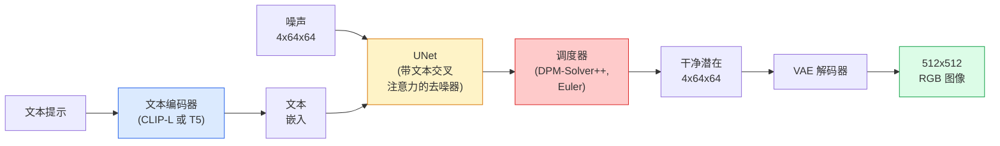

# Stable Diffusion — 架构与微调

> Stable Diffusion 是一个在预训练 VAE 的潜在空间中运行的 DDPM，通过交叉注意力以文本为条件，使用快速的确定性 ODE 求解器采样，并由无分类器引导控制。

**类型：** 学习 + 使用
**语言：** Python
**前置知识：** 第4阶段第10课（扩散），第7阶段第02课（自注意力）
**时间：** ~75分钟

## 学习目标

- 追溯 Stable Diffusion 流水线的五个组成部分：VAE、文本编码器、U-Net、调度器、安全检查器 — 以及每个组件的实际作用
- 解释潜在扩散，以及为什么在 4x64x64 的潜在空间（而不是 3x512x512 的图像）中训练可以减少 48 倍的计算量而不损失质量
- 使用 `diffusers` 生成图像、运行图像到图像、图像修复和 ControlNet 引导生成
- 在小规模自定义数据集上使用 LoRA 微调 Stable Diffusion，并在推理时加载 LoRA 适配器

## 问题

直接在 512x512 RGB 图像上训练 DDPM 成本高昂。每个训练步骤都要反向传播通过一个看到 3x512x512 = 786,432 个输入值的 U-Net，而采样需要 50 次以上的前向传播通过同一个 U-Net。在 Stable Diffusion 1.5（2022 年发布）的质量水平上，像素空间扩散大约需要 256 GPU 月的训练时间，在消费级 GPU 上每张图像需要 10-30 秒。

使开放权重文本到图像实用化的技巧是**潜在扩散**（Rombach 等人，CVPR 2022）。训练一个 VAE，将 3x512x512 图像映射到 4x64x64 的潜在张量并返回，然后在该潜在空间中进行扩散。计算量减少 `(3*512*512)/(4*64*64) = 48 倍`。采样从几十秒降至不到两秒，使用相同的 GPU。

几乎所有现代图像生成模型 — SDXL、SD3、FLUX、HunyuanDiT、Wan-Video — 都是潜在扩散模型，在自编码器、去噪器（U-Net 或 DiT）和文本条件上有所变化。学会 Stable Diffusion，你就学会了这个模板。

## 概念

### 流水线



- **VAE** — 冻结的自编码器。编码器将图像转换为潜在（用于 img2img 和训练）。解码器将潜在转换回图像。
- **文本编码器** — CLIP 文本编码器（SD 1.x/2.x）、CLIP-L + CLIP-G（SDXL）或 T5-XXL（SD3/FLUX）。产生一系列 token 嵌入。
- **U-Net** — 去噪器。具有交叉注意力层，在每个分辨率层级从潜在向文本嵌入进行注意力。
- **调度器** — 采样算法（DDIM、Euler、DPM-Solver++）。选择 sigma，将预测的噪声混合回潜在中。
- **安全检查器** — 可选的输出图像 NSFW / 非法内容过滤器。

### 无分类器引导（CFG）

纯文本条件学习 `epsilon_theta(x_t, t, c)` 用于每个提示 `c`。CFG 使用相同的网络，但在 10% 的时间丢弃 `c`（替换为空嵌入），得到同时预测条件和无条件噪声的单一模型。推理时：

```
eps = eps_uncond + w * (eps_cond - eps_uncond)
```

`w` 是引导尺度。`w=0` 是无条件，`w=1` 是纯条件，`w>1` 将输出推向"更受提示约束"的方向，代价是多样性。SD 默认值为 `w=7.5`。

CFG 是文本到图像能达到生产质量的原因。没有它，提示对输出的影响较弱；有了它，提示主导输出。

### 潜在空间几何

VAE 的 4 通道潜在不仅仅是一个压缩图像。它是一个流形，其中算术大致对应语义编辑（提示工程和插值都在这里进行），并且扩散 U-Net 已被训练将其全部建模预算用于此。解码随机的 4x64x64 潜在不会产生看起来随机的图像 — 它会产生垃圾，因为只有特定的潜在子流形才能解码为有效图像。

两个后果：

1. **Img2img** = 将图像编码为潜在，添加部分噪声，运行去噪器，解码。图像结构得以保留，因为编码几乎是可逆的；内容根据提示变化。
2. **Inpainting** = 与 img2img 相同，但去噪器只更新掩膜区域；未掩膜区域保持在编码后的潜在状态。

### U-Net 架构

SD U-Net 是第10课中 TinyUNet 的大版本，有三个新增功能：

- **Transformer 块** 在每个空间分辨率上，包含自注意力和对文本嵌入的交叉注意力。
- **时间嵌入** 通过正弦编码上的 MLP。
- **跳跃连接** 在编码器和解码器之间匹配分辨率。

SD 1.5 的总参数量：约 8.6 亿。SDXL：约 26 亿。FLUX：约 120 亿。参数的增长主要来自注意力层。

### LoRA 微调

Stable Diffusion 的完整微调需要 20+ GB 的 VRAM 并更新 8.6 亿个参数。LoRA（低秩适配）保持基础模型冻结，并在注意力层中注入小的秩分解矩阵。SD 的 LoRA 适配器通常为 10-50 MB，在单块消费级 GPU 上训练 10-60 分钟，并在推理时作为即插即用的修改加载。

```
原始：W_q : (d_in, d_out)   冻结
LoRA：W_q + alpha * (A @ B)   其中 A : (d_in, r), B : (r, d_out)

r 通常为 4-32。
```

LoRA 几乎是每个社区微调模型的发布方式。CivitAI 和 Hugging Face 托管了数百万个这样的模型。

### 你会遇到的调度器

- **DDIM** — 确定性，约 50 步，简单。
- **Euler ancestral** — 随机，30-50 步，稍具创造性的样本。
- **DPM-Solver++ 2M Karras** — 确定性，20-30 步，生产默认值。
- **LCM / TCD / Turbo** — 一致性模型和蒸馏变体；1-4 步，以一定质量为代价。

在 `diffusers` 中切换调度器是一行代码的改变，有时无需重新训练就能修复样本问题。

## 构建

本课端到端使用 `diffusers`，而不是从头重建 Stable Diffusion。你需要重建的部分（VAE、文本编码器、U-Net、调度器）是独立课程的主题；这里的目标是熟练掌握生产 API。

### 第1步：文本到图像

```python
import torch
from diffusers import StableDiffusionPipeline

pipe = StableDiffusionPipeline.from_pretrained(
    "runwayml/stable-diffusion-v1-5",
    torch_dtype=torch.float16,
).to("cuda")

image = pipe(
    prompt="一只狗在东京滑滑板，吉卜力风格",
    guidance_scale=7.5,
    num_inference_steps=25,
    generator=torch.Generator("cuda").manual_seed(42),
).images[0]
image.save("dog.png")
```

`float16` 将 VRAM 减半，无明显质量损失。默认 DPM-Solver++ 的 `num_inference_steps=25` 与 DDIM 的 `num_inference_steps=50` 质量相当。

### 第2步：切换调度器

```python
from diffusers import DPMSolverMultistepScheduler, EulerAncestralDiscreteScheduler

pipe.scheduler = DPMSolverMultistepScheduler.from_config(pipe.scheduler.config)
pipe.scheduler = EulerAncestralDiscreteScheduler.from_config(pipe.scheduler.config)
```

调度器状态与 U-Net 权重解耦。你可以用 DDPM 训练，用任何调度器采样。

### 第3步：图像到图像

```python
from diffusers import StableDiffusionImg2ImgPipeline
from PIL import Image

img2img = StableDiffusionImg2ImgPipeline.from_pretrained(
    "runwayml/stable-diffusion-v1-5",
    torch_dtype=torch.float16,
).to("cuda")

init_image = Image.open("dog.png").convert("RGB").resize((512, 512))
out = img2img(
    prompt="一只狗滑滑板，油画风格",
    image=init_image,
    strength=0.6,
    guidance_scale=7.5,
).images[0]
```

`strength` 是在去噪前添加多少噪声（0.0 = 不变，1.0 = 完全重新生成）。0.5-0.7 是风格迁移的标准范围。

### 第4步：图像修复

```python
from diffusers import StableDiffusionInpaintPipeline

inpaint = StableDiffusionInpaintPipeline.from_pretrained(
    "runwayml/stable-diffusion-inpainting",
    torch_dtype=torch.float16,
).to("cuda")

image = Image.open("dog.png").convert("RGB").resize((512, 512))
mask = Image.open("dog_mask.png").convert("L").resize((512, 512))

out = inpaint(
    prompt="一只猫",
    image=image,
    mask_image=mask,
    guidance_scale=7.5,
).images[0]
```

掩膜中的白色像素是要重新生成的区域。黑色像素保持不变。

### 第5步：LoRA 加载

```python
pipe.load_lora_weights("sayakpaul/sd-lora-ghibli")
pipe.fuse_lora(lora_scale=0.8)

image = pipe(prompt="一个吉卜力风格的村庄广场").images[0]
```

`lora_scale` 控制强度；0.0 = 无效果，1.0 = 完全效果。`fuse_lora` 将适配器即时融合到权重中以加快速度，但会阻止切换。在加载不同适配器之前调用 `pipe.unfuse_lora()`。

### 第6步：LoRA 训练（概要）

真正的 LoRA 训练在 `peft` 或 `diffusers.training` 中。概要：

```python
# 伪代码
for step, batch in enumerate(dataloader):
    images, prompts = batch
    latents = vae.encode(images).latent_dist.sample() * 0.18215

    t = torch.randint(0, num_train_timesteps, (batch_size,))
    noise = torch.randn_like(latents)
    noisy_latents = scheduler.add_noise(latents, noise, t)

    text_emb = text_encoder(tokenizer(prompts))

    pred_noise = unet(noisy_latents, t, text_emb)  # 这里注入了 LoRA 权重

    loss = F.mse_loss(pred_noise, noise)
    loss.backward()
    optimizer.step()
```

只有 LoRA 矩阵接收梯度；基础 U-Net、VAE 和文本编码器被冻结。使用批次大小为 1 和梯度检查点，这可以适配在 8 GB VRAM 中。

## 使用

在生产中，你需要做的实际决策：

- **模型系列**：对于开源社区微调模型使用 SD 1.5，对于更高保真度使用 SDXL，对于最先进技术和严格的许可要求使用 SD3 / FLUX。
- **调度器**：20-30 步使用 DPM-Solver++ 2M Karras，延迟低于 1s 时使用 LCM-LoRA。
- **精度**：在 4080/4090 上使用 `float16`，在 A100 及更新型号上使用 `bfloat16`，VRAM 紧张时使用 `int8`（通过 `bitsandbytes` 或 `compel`）。
- **条件控制**：纯文本有效；如需更强控制，在基础流水线之上添加 ControlNet（canny、depth、pose）。

对于批量生成，`AUTO1111` / `ComfyUI` 是社区工具；对于生产 API，使用 `diffusers` + `accelerate` 或 `optimum-nvidia` 配合 TensorRT 编译。

## 交付物

本课产出：

- `outputs/prompt-sd-pipeline-planner.md` — 一个提示，根据延迟预算、保真度目标和许可约束选择 SD 1.5 / SDXL / SD3 / FLUX 以及调度器和精度。
- `outputs/skill-lora-training-setup.md` — 一个技能，为包含标题、秩、批次大小和学习率的自定义数据集编写完整的 LoRA 训练配置。

## 练习

1. **（简单）** 使用 `guidance_scale` 在 `[1, 3, 5, 7.5, 10, 15]` 中生成相同的提示。描述图像如何变化。在什么引导值下出现伪影？
2. **（中等）** 取一张真实照片，用 `StableDiffusionImg2ImgPipeline` 在 `strength` 为 `[0.2, 0.4, 0.6, 0.8, 1.0]` 时运行。哪个强度在改变风格的同时保留了构图？为什么 1.0 完全忽略了输入？
3. **（困难）** 在 10-20 张单一主题（宠物、标志、角色）的图像上训练 LoRA，并生成包含该主题的新场景。报告产生最佳身份保留而不对输入图像过拟合的 LoRA 秩和训练步数。

## 关键术语

| 术语 | 人们说的 | 实际含义 |
|------|---------|---------|
| 潜在扩散 | "在潜在空间中扩散" | 在 VAE 潜在空间（4x64x64）而不是像素空间（3x512x512）中运行整个 DDPM；节省 48 倍计算量 |
| VAE 缩放因子 | "0.18215" | 将 VAE 的原始潜在重新缩放到大致单位方差的常数；在每个 SD 流水线中硬编码 |
| 无分类器引导 | "CFG" | 混合条件和无条件噪声预测；最有影响力的单一推理旋钮 |
| 调度器 | "采样器" | 将噪声 + 模型预测转化为去噪潜在轨迹的算法 |
| LoRA | "低秩适配器" | 微调注意力层的小型秩分解矩阵，不触及基础权重 |
| 交叉注意力 | "文本-图像注意力" | 从潜在 token 到文本 token 的注意力；在每个 U-Net 层级注入提示信息 |
| ControlNet | "结构条件" | 一个单独训练的适配器，通过额外输入（canny、depth、pose、分割）引导 SD |
| DPM-Solver++ | "默认调度器" | 二阶确定性 ODE 求解器；2026 年在低步数（20-30）下质量最佳 |

## 延伸阅读

- [High-Resolution Image Synthesis with Latent Diffusion (Rombach et al., 2022)](https://arxiv.org/abs/2112.10752) — Stable Diffusion 论文；包含证明该设计的每个消融实验
- [Classifier-Free Diffusion Guidance (Ho & Salimans, 2022)](https://arxiv.org/abs/2207.12598) — CFG 论文
- [LoRA: Low-Rank Adaptation of Large Language Models (Hu et al., 2021)](https://arxiv.org/abs/2106.09685) — LoRA 最初用于 NLP；几乎原封不动地迁移到 SD
- [diffusers documentation](https://huggingface.co/docs/diffusers) — 每个 SD / SDXL / SD3 / FLUX 流水线的参考
