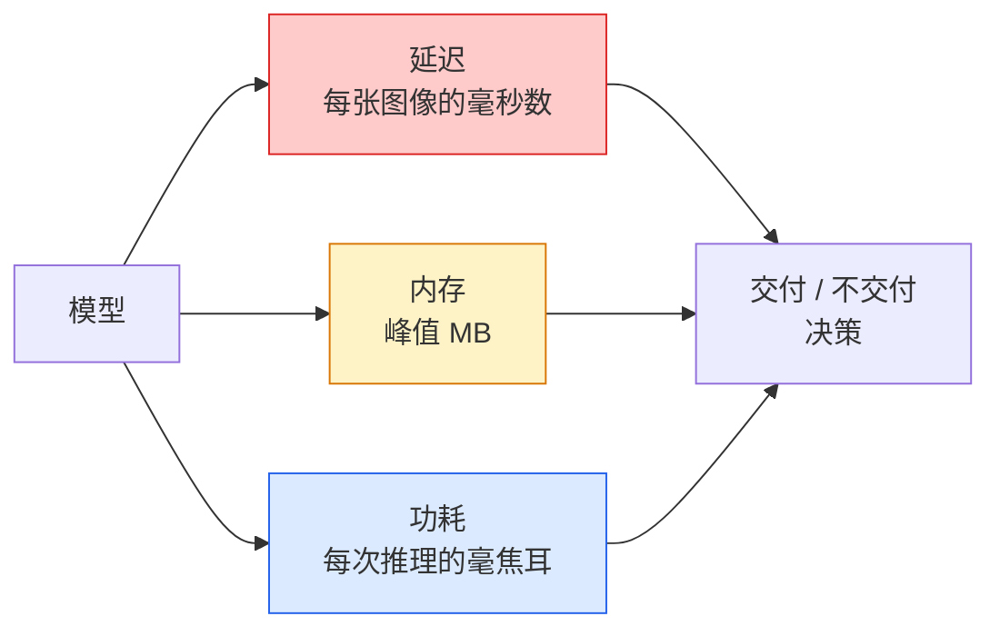

# 实时视觉——边缘部署

> 边缘推理是一门让 90% 精度的模型在 2GB 内存的设备上以 30fps 运行的技术。每一个百分点的精度都要与毫秒级的延迟进行权衡。

**类型：** 学习 + 构建
**语言：** Python
**前置条件：** 阶段 4 第 04 课（图像分类），阶段 10 第 11 课（量化）
**时间：** ~75 分钟

## 学习目标

- 测量任意 PyTorch 模型的推理延迟、峰值内存和吞吐量，理解 FLOPs/参数量/延迟之间的权衡
- 使用 PyTorch 的训练后量化将视觉模型量化为 INT8，并验证精度损失 < 1%
- 导出为 ONNX 并使用 ONNX Runtime 或 TensorRT 编译；列举三种最常见的导出失败及其修复方法
- 解释在边缘约束下何时选择 MobileNetV3、EfficientNet-Lite、ConvNeXt-Tiny 或 MobileViT

## 问题

训练时的视觉模型是一个浮点数怪兽：1 亿参数、每次前向传播 10 GFLOPs、2 GB 显存。这些在手机、汽车信息娱乐系统、工业相机或无人机上都不适用。交付一个视觉系统意味着将同样的预测能力适配到一个小 100 倍的预算中。

三个主要调节手段：模型选择（使用相同方法但更小的架构）、量化（INT8 替代 FP32）和推理运行时（ONNX Runtime、TensorRT、Core ML、TFLite）。正确使用它们，决定了你是在工作站上跑通一个演示，还是能在 30 美元的相机模组上交付产品。

本课首先建立测量规范（无法测量就无法优化），然后讲解三个调节手段。目标不是学习每一个边缘运行时，而是了解存在哪些杠杆，以及如何验证每个杠杆是否按预期工作。

## 概念

### 三个预算



- **延迟**：p50、p95、p99。仅取 p50 平均值会掩盖尾部延迟，这对实时系统至关重要。
- **峰值内存**：设备曾达到的最大内存，而非稳态平均值。在嵌入式目标上，OOM（内存耗尽）是致命问题。
- **功耗 / 能量**：在电池供电设备上每次推理的毫焦耳数。通常通过 CPU/GPU 利用率乘以时间来估算。

（模型、延迟、内存、精度）的表格是边缘决策的依据。每个数值都必须在目标设备上测量，而非工作站上。

### 测量规范

每个边缘性能分析应遵循三条规则：

1. **预热**模型——先进行 5-10 次虚拟前向传播再开始测量。冷缓存和 JIT 编译会得出不具代表性的初始数值。
2. **同步** GPU 工作负载——在计时代码块前后使用 `torch.cuda.synchronize()`。否则你测量的只是内核调度时间，而非内核执行时间。
3. **固定输入尺寸**为生产时的分辨率。224x224 上的延迟不等于 512x512 上的延迟。

### FLOPs 作为代理指标

FLOPs（每次推理的浮点运算次数）是一个廉价、与设备无关的延迟代理指标。适合用于架构比较，但在绝对时钟时间上具有误导性。一个 FLOPs 多 10% 的模型在实际中可能快 2 倍，因为它使用了硬件友好的运算（深度可分离卷积编译效果好，而大的 7x7 卷积则不然）。

规则：使用 FLOPs 进行架构搜索，使用设备实测延迟进行部署决策。

### 量化概述

将 FP32 权重和激活替换为 INT8。模型大小减少 4 倍，内存带宽减少 4 倍，在有 INT8 内核的硬件上计算速度提升 2-4 倍（所有现代移动 SoC、所有带 Tensor Cores 的 NVIDIA GPU）。视觉任务的精度损失通常在 0.1-1 个百分点之间（使用训练后静态量化）。

类型：

- **动态** —— 权重量化为 INT8，激活使用 FP 计算。简单，加速效果不大。
- **静态（训练后）** —— 权重量化 + 在少量校准集上校准激活范围。比动态快得多。
- **量化感知训练** —— 在训练过程中模拟量化，让模型学会适应量化。精度最好，需要标注数据。

对于视觉任务，训练后静态量化以 5% 的工作量换来 95% 的收益。仅在 PTQ 精度损失不可接受时才使用 QAT。

### 剪枝和蒸馏

- **剪枝** —— 移除不重要的权重（基于幅值）或通道（结构化）。在过参数化的模型上效果良好；在已经很紧凑的架构上帮助较小。
- **蒸馏** —— 训练一个小的学生模型来模仿大教师模型的 logits。通常能恢复大部分因模型缩小而损失的精度。生产环境边缘模型的标准做法。

### 推理运行时

- **PyTorch eager** —— 慢，不用于部署。仅用于开发。
- **TorchScript** —— 遗留方案。已被 `torch.compile` 和 ONNX 导出取代。
- **ONNX Runtime** —— 中性运行时。CPU、CUDA、CoreML、TensorRT、OpenVINO 都有 ONNX 提供程序。从这里开始。
- **TensorRT** —— NVIDIA 的编译器。在 NVIDIA GPU（工作站和 Jetson）上延迟最低。可集成 ONNX Runtime 或独立使用。
- **Core ML** —— Apple 用于 iOS/macOS 的运行时。需要 `.mlmodel` 或 `.mlpackage`。
- **TFLite** —— Google 用于 Android/ARM 的运行时。需要 `.tflite`。
- **OpenVINO** —— Intel 用于 CPU/VPU 的运行时。需要 `.xml` + `.bin`。

实际做法：PyTorch -> ONNX -> 为目标平台选择运行时。ONNX 是通用语言。

### 边缘架构选择器

| 预算 | 模型 | 原因 |
|--------|-------|-----|
| < 3M 参数 | MobileNetV3-Small | 到处可编译，良好的基线 |
| 3-10M | EfficientNet-Lite-B0 | TFLite 上每参数精度最佳 |
| 10-20M | ConvNeXt-Tiny | 每参数精度最佳，CPU 友好 |
| 20-30M | MobileViT-S 或 EfficientViT | 达到 ImageNet 精度的 Transformer |
| 30-80M | Swin-V2-Tiny | 如果框架支持窗口注意力 |

除非有特定理由不这样做，否则将这些模型全部量化为 INT8。

```figure
cnn-param-count
```

## 构建

### 步骤 1：正确测量延迟

```python
import time
import torch

def measure_latency(model, input_shape, device="cpu", warmup=10, iters=50):
    model = model.to(device).eval()
    x = torch.randn(input_shape, device=device)
    with torch.no_grad():
        for _ in range(warmup):
            model(x)
        if device == "cuda":
            torch.cuda.synchronize()
        times = []
        for _ in range(iters):
            if device == "cuda":
                torch.cuda.synchronize()
            t0 = time.perf_counter()
            model(x)
            if device == "cuda":
                torch.cuda.synchronize()
            times.append((time.perf_counter() - t0) * 1000)
    times.sort()
    return {
        "p50_ms": times[len(times) // 2],
        "p95_ms": times[int(len(times) * 0.95)],
        "p99_ms": times[int(len(times) * 0.99)],
        "mean_ms": sum(times) / len(times),
    }
```

预热、同步、使用 `time.perf_counter()`。报告百分位数，而非仅平均值。

### 步骤 2：参数和 FLOPs 计数

```python
def parameter_count(model):
    return sum(p.numel() for p in model.parameters())

def flops_estimate(model, input_shape):
    """
    粗略的 FLOPs 计数（适用于仅含卷积/线性层的模型）。
    生产环境请使用 `fvcore` 或 `ptflops`。
    """
    total = 0
    def conv_hook(m, inp, out):
        nonlocal total
        c_out, c_in, kh, kw = m.weight.shape
        h, w = out.shape[-2:]
        total += 2 * c_in * c_out * kh * kw * h * w
    def linear_hook(m, inp, out):
        nonlocal total
        total += 2 * m.in_features * m.out_features
    hooks = []
    for m in model.modules():
        if isinstance(m, torch.nn.Conv2d):
            hooks.append(m.register_forward_hook(conv_hook))
        elif isinstance(m, torch.nn.Linear):
            hooks.append(m.register_forward_hook(linear_hook))
    model.eval()
    with torch.no_grad():
        model(torch.randn(input_shape))
    for h in hooks:
        h.remove()
    return total
```

实际项目中使用 `fvcore.nn.FlopCountAnalysis` 或 `ptflops`；它们能正确处理所有模块类型。

### 步骤 3：训练后静态量化

```python
def quantise_ptq(model, calibration_loader, backend="x86"):
    import torch.ao.quantization as tq
    model = model.eval().cpu()
    model.qconfig = tq.get_default_qconfig(backend)
    tq.prepare(model, inplace=True)
    with torch.no_grad():
        for x, _ in calibration_loader:
            model(x)
    tq.convert(model, inplace=True)
    return model
```

三个步骤：配置、准备（插入观察器）、用真实数据校准、转换（融合 + 量化）。要求模型已融合（`Conv -> BN -> ReLU` -> `ConvBnReLU`），`torch.ao.quantization.fuse_modules` 处理此操作。

### 步骤 4：导出 ONNX

```python
def export_onnx(model, sample_input, path="model.onnx"):
    model = model.eval()
    torch.onnx.export(
        model,
        sample_input,
        path,
        input_names=["input"],
        output_names=["output"],
        dynamic_axes={"input": {0: "batch"}, "output": {0: "batch"}},
        opset_version=17,
    )
    return path
```

`opset_version=17` 是 2026 年的安全默认值。`dynamic_axes` 允许 ONNX 模型使用任意批次大小。

### 步骤 5：基准测试与方案对比

```python
import torch.nn as nn
from torchvision.models import mobilenet_v3_small

def compare_regimes():
    model = mobilenet_v3_small(weights=None, num_classes=10)
    params = parameter_count(model)
    flops = flops_estimate(model, (1, 3, 224, 224))
    lat_fp32 = measure_latency(model, (1, 3, 224, 224), device="cpu")
    print(f"FP32 MobileNetV3-Small: {params:,} params  {flops/1e9:.2f} GFLOPs  "
          f"p50={lat_fp32['p50_ms']:.2f}ms  p95={lat_fp32['p95_ms']:.2f}ms")
```

对 `resnet50`、`efficientnet_v2_s` 和 `convnext_tiny` 运行相同的函数，你就得到了部署决策所需的对比表。

## 使用

生产环境通常选择以下三条路径之一：

- **Web / serverless**：PyTorch -> ONNX -> ONNX Runtime（CPU 或 CUDA 提供程序）。最简单，对大多数场景已足够。
- **NVIDIA 边缘（Jetson、GPU 服务器）**：PyTorch -> ONNX -> TensorRT。延迟最低，工程投入最大。
- **移动端**：PyTorch -> ONNX -> Core ML（iOS）或 TFLite（Android）。导出前先量化。

对于测量，`torch-tb-profiler`、`nvprof` / `nsys` 和 macOS 上的 Instruments 可提供逐层分解。`benchmark_app`（OpenVINO）和 `trtexec`（TensorRT）提供独立的 CLI 数值。

## 交付

本课程产出：

- `outputs/prompt-edge-deployment-planner.md` — 一个提示词，根据目标设备和延迟 SLA 选择骨干网络、量化策略和运行时。
- `outputs/skill-latency-profiler.md` — 一个技能，编写包含预热、同步、百分位数和内存追踪的完整延迟基准测试脚本。

## 练习

1. **（简单）** 测量 `resnet18`、`mobilenet_v3_small`、`efficientnet_v2_s` 和 `convnext_tiny` 在 224x224 CPU 上的 p50 延迟。报告表格，确定每毫秒精度最佳的架构。
2. **（中等）** 对 `mobilenet_v3_small` 应用训练后静态量化。报告 FP32 与 INT8 的延迟对比以及在 CIFAR-10 或类似数据集上保留子集的精度损失。
3. **（困难）** 导出 `convnext_tiny` 为 ONNX，使用 `onnxruntime` 的 `CPUExecutionProvider` 运行，并与 PyTorch eager 基线比较延迟。确定 ONNX Runtime 第一个速度更快的层并解释原因。

## 关键术语

| 术语 | 人们说的 | 实际含义 |
|------|---------|---------|
| 延迟 | "多快" | 从输入到输出的时间；p50/p95/p99 百分位数，而非平均值 |
| FLOPs | "模型大小" | 每次前向传播的浮点运算次数；计算成本的粗略代理指标 |
| INT8 量化 | "8 位" | 将 FP32 权重/激活替换为 8 位整数；约小 4 倍，快 2-4 倍 |
| PTQ | "训练后量化" | 对训练好的模型进行量化而无需重新训练；简单，通常已足够 |
| QAT | "量化感知训练" | 在训练过程中模拟量化；精度最好，需要标注数据 |
| ONNX | "中立格式" | 得到所有主流推理运行时支持的模型交换格式 |
| TensorRT | "NVIDIA 编译器" | 将 ONNX 编译为 NVIDIA GPU 的优化引擎 |
| 蒸馏 | "教师 -> 学生" | 训练小模型模仿大模型的 logits；恢复大部分精度损失 |

## 延伸阅读

- [EfficientNet (Tan & Le, 2019)](https://arxiv.org/abs/1905.11946) — 高效架构的复合缩放
- [MobileNetV3 (Howard et al., 2019)](https://arxiv.org/abs/1905.02244) — 移动优先架构，含 h-swish 和 squeeze-excite
- [A Practical Guide to TensorRT Optimization (NVIDIA)](https://developer.nvidia.com/blog/accelerating-model-inference-with-tensorrt-tips-and-best-practices-for-pytorch-users/) — 如何真正获得论文中的吞吐量数据
- [ONNX Runtime docs](https://onnxruntime.ai/docs/) — 量化、图优化、提供程序选择
