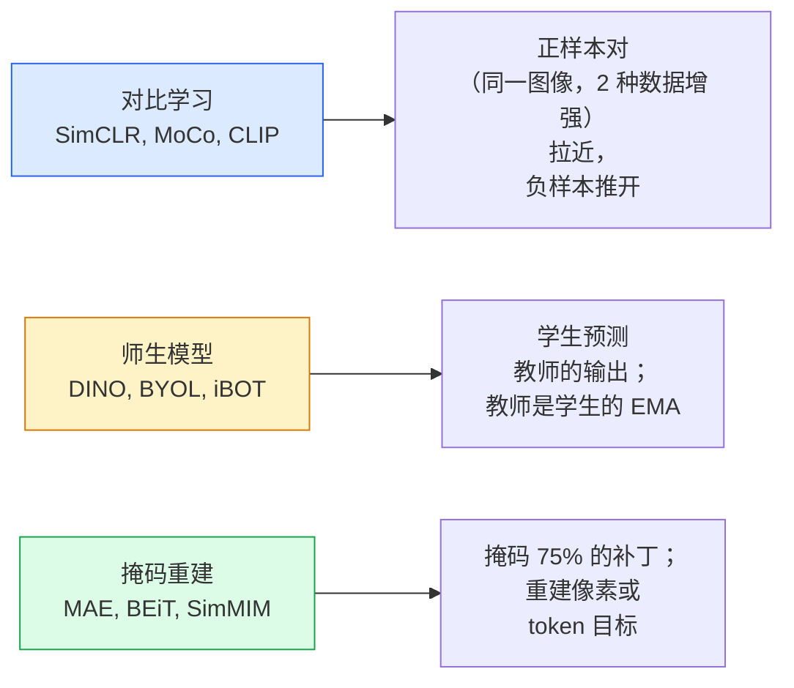

# 自监督视觉——SimCLR、DINO、MAE

> 标签是有监督视觉的瓶颈。自监督预训练消除了它们：从 1 亿张无标签图像中学习视觉特征，在 1 万张有标签图像上微调。

**类型：** 学习 + 构建
**语言：** Python
**前置条件：** 阶段 4 第 04 课（图像分类），阶段 4 第 14 课（ViT）
**时间：** ~75 分钟

## 学习目标

- 梳理三大自监督家族——对比学习（SimCLR）、师生模型（DINO）、掩码重建（MAE）——并说明各自优化什么
- 从头实现 InfoNCE 损失，解释为什么批次大小 512 有效而 32 失败
- 解释为什么 MAE 的 75% 掩码比例不是随意选择的，以及它与 BERT 在文本上的 15% 有何不同
- 使用 DINOv2 或 MAE ImageNet 检查点进行线性探针和零样本检索

## 问题

有监督的 ImageNet 有 130 万张标注图像，其注释成本估计为 1000 万美元。医学和工业数据集更小，标注成本更高。每个视觉团队都会问：我们能否在廉价的未标注数据上预训练——YouTube 帧、网络爬取、网络摄像头画面、卫星扫描——然后在少量标注集上微调？

自监督学习就是答案。在 LAION 或 JFT 上训练的现代自监督 ViT 在微调后达到或超过有监督的 ImageNet 精度。它在下游任务（检测、分割、深度估计）上的迁移效果也优于有监督预训练。DINOv2（Meta，2023）和 MAE（Meta，2022）是目前可迁移视觉特征的生产默认选择。

概念上的转变在于：前置任务——模型被训练去做的事情——不一定非得是下游任务。重要的是它迫使模型学习有用的特征。预测灰度图像的颜色、旋转图像并让模型分类旋转角度、掩码补丁并重建它们——所有这些都有效。能够扩展的三种方法是对比学习、师生蒸馏和掩码重建。

## 概念

### 三大家族



### 对比学习（SimCLR）

取一张图像，应用两次随机数据增强，得到两个视图。两者都通过相同的编码器加上投影头。最小化一个损失函数，该函数要求"这两个嵌入应该接近"，同时"这个嵌入应该远离批次中其他所有图像的嵌入"。

```
批次中 2N 个视图中正样本对 (z_i, z_j) 的损失：

   L_ij = -log( exp(sim(z_i, z_j) / tau) / sum_k in batch \ {i} exp(sim(z_i, z_k) / tau) )

sim = 余弦相似度
tau = 温度（标准为 0.1）
```

这就是 InfoNCE 损失。每个正样本需要许多负样本，因此批次大小很重要——SimCLR 需要 512-8192。MoCo 引入了过去批次的动量队列，将负样本数量与批次大小解耦。

### 师生模型（DINO）

两个具有相同架构的网络：学生和教师。教师是学生权重的指数移动平均（EMA）。两者都看到图像的增强视图。学生的输出被训练来匹配教师的输出——没有显式负样本。

```
loss = CE( student_output(view_1),  teacher_output(view_2) )
     + CE( student_output(view_2),  teacher_output(view_1) )

teacher_weights = m * teacher_weights + (1 - m) * student_weights   (m ≈ 0.996)
```

为什么它不会坍缩到"预测常量"：教师的输出被中心化（减去每维均值）和锐化（除以小的温度）。中心化阻止一个维度主导；锐化阻止输出坍缩为均匀分布。

DINOv2 将 DINO 扩展到 1.42 亿张精选图像。生成的特征是目前零样本视觉检索和密集预测的 SOTA。

### 掩码重建（MAE）

掩码 ViT 输入的 75% 补丁。仅将可见的 25% 传递通过编码器。一个小型解码器接收编码器的输出加上掩码位置的掩码 token，并被训练来重建掩码补丁的像素。

```
编码器：  可见的 25% 补丁 -> 特征
解码器：  特征 + 掩码位置的掩码 token -> 重建像素
损失：     仅掩码补丁上重建像素与原始像素之间的 MSE
```

使 MAE 工作的关键设计选择：

- **75% 掩码比例** —— 高。迫使编码器学习语义特征；重建 25% 几乎是无关紧要的（相邻像素高度相关，CNN 可以轻松完成）。
- **不对称编码器/解码器** —— 大型 ViT 编码器仅看到可见补丁；小型解码器（8 层，512 维）处理重建。比朴素的 BEiT 快 3 倍。
- **像素空间重建目标** —— 比 BEiT 的 token 化目标更简单，在 ViT 上效果更好。

预训练后，丢弃解码器。编码器就是特征提取器。

### 为什么是 75% 而不是 15%

BERT 掩码 15% 的 token。MAE 掩码 75%。差异在于信息密度。

- 自然语言每 token 熵高。预测 15% 的 token 仍然困难，因为每个掩码位置有许多合理的补全。
- 图像补丁熵低——未掩码的邻域通常几乎完全确定掩码补丁的像素。要使预测需要语义理解，你必须激进地掩码。

75% 足够高，以至于简单的空间外推无法解决该任务；编码器必须表示图像内容。

### 线性探针评估

自监督预训练后的标准评估是**线性探针**：冻结编码器，在 ImageNet 标签上训练一个简单的线性分类器。报告 top-1 准确率。

- SimCLR ResNet-50：~71%（2020）
- DINO ViT-S/16：~77%（2021）
- MAE ViT-L/16：~76%（2022）
- DINOv2 ViT-g/14：~86%（2023）

线性探针是特征质量的纯粹度量；微调通常会额外增加 2-5 个百分点，但也混合了头重训练的效果。

## 构建

### 步骤 1：两视图数据增强管线

```python
import torch
import torchvision.transforms as T

two_view_train = lambda: T.Compose([
    T.RandomResizedCrop(96, scale=(0.2, 1.0)),
    T.RandomHorizontalFlip(),
    T.ColorJitter(0.4, 0.4, 0.4, 0.1),
    T.RandomGrayscale(p=0.2),
    T.ToTensor(),
])


class TwoViewDataset(torch.utils.data.Dataset):
    def __init__(self, base):
        self.base = base
        self.aug = two_view_train()

    def __len__(self):
        return len(self.base)

    def __getitem__(self, i):
        img, _ = self.base[i]
        v1 = self.aug(img)
        v2 = self.aug(img)
        return v1, v2
```

每个 `__getitem__` 返回同一图像的两个增强视图；不需要标签。

### 步骤 2：InfoNCE 损失

```python
import torch.nn.functional as F

def info_nce(z1, z2, tau=0.1):
    """
    z1, z2: (N, D) 配对视图的 L2 归一化嵌入
    """
    N, D = z1.shape
    z = torch.cat([z1, z2], dim=0)  # (2N, D)
    sim = z @ z.T / tau              # (2N, 2N)

    mask = torch.eye(2 * N, dtype=torch.bool, device=z.device)
    sim = sim.masked_fill(mask, float("-inf"))

    targets = torch.cat([torch.arange(N, 2 * N), torch.arange(0, N)]).to(z.device)
    return F.cross_entropy(sim, targets)
```

调用前将嵌入 L2 归一化。`tau=0.1` 是 SimCLR 默认值；越低损失越尖锐，需要的负样本越多。

### 步骤 3：InfoNCE 合理性检查

```python
z1 = F.normalize(torch.randn(16, 32), dim=-1)
z2 = z1.clone()
loss_same = info_nce(z1, z2, tau=0.1).item()
z2_random = F.normalize(torch.randn(16, 32), dim=-1)
loss_random = info_nce(z1, z2_random, tau=0.1).item()
print(f"InfoNCE with identical pairs:  {loss_same:.3f}")
print(f"InfoNCE with random pairs:     {loss_random:.3f}")
```

相同对应给出低损失（对大批次和冷温度接近 0）。随机对应给出 log(2N-1) = ~log(31) = ~3.4（16 对的批次）。

### 步骤 4：MAE 风格掩码

```python
def random_mask_indices(num_patches, mask_ratio=0.75, seed=0):
    g = torch.Generator().manual_seed(seed)
    n_keep = int(num_patches * (1 - mask_ratio))
    perm = torch.randperm(num_patches, generator=g)
    visible = perm[:n_keep]
    masked = perm[n_keep:]
    return visible.sort().values, masked.sort().values


num_patches = 196
visible, masked = random_mask_indices(num_patches, mask_ratio=0.75)
print(f"visible: {len(visible)} / {num_patches}")
print(f"masked:  {len(masked)} / {num_patches}")
```

简单、快速，对给定种子是确定性的。真实的 MAE 实现会批处理此操作并保持每个样本的掩码。

## 使用

DINOv2 是 2026 年的生产标准：

```python
import torch
from transformers import AutoImageProcessor, AutoModel

processor = AutoImageProcessor.from_pretrained("facebook/dinov2-base")
model = AutoModel.from_pretrained("facebook/dinov2-base")
model.eval()

# 用于零样本检索的每图像嵌入
with torch.no_grad():
    inputs = processor(images=[pil_image], return_tensors="pt")
    outputs = model(**inputs)
    embedding = outputs.last_hidden_state[:, 0]  # CLS token
```

生成的 768 维嵌入是现代图像检索、密集对应和零样本迁移管线的基础。在下游任务上微调很少需要超过一个线性头。

对于图像-文本嵌入，等价的模型是 SigLIP 或 OpenCLIP；对于 MAE 风格的微调，`timm` 仓库提供所有 MAE 检查点。

## 交付

本课程产出：

- `outputs/prompt-ssl-pretraining-picker.md` — 一个提示词，根据数据集大小、计算资源和下游任务选择 SimCLR / MAE / DINOv2。
- `outputs/skill-linear-probe-runner.md` — 一个技能，为任意冻结编码器 + 标注数据集编写线性探针评估。

## 练习

1. **（简单）** 验证当降低温度时 InfoNCE 损失对于对齐良好的嵌入下降，而对于随机嵌入上升。绘制 `tau in [0.05, 0.1, 0.2, 0.5]` 与损失的关系图。
2. **（中等）** 实现 DINO 风格的中心缓冲区。展示没有中心化时，学生会在几个 epoch 内坍缩为常量向量。
3. **（困难）** 使用第 10 课的 TinyUNet 作为骨干，在 CIFAR-100 上训练 MAE。报告 10、50 和 200 个 epoch 时的线性探针准确率。展示 MAE 预训练的线性探针在相同的 1000 图像子集上优于从头训练的有监督线性探针。

## 关键术语

| 术语 | 人们说的 | 实际含义 |
|------|---------|---------|
| 自监督 | "无标签" | 从无标签数据中产生有用表示的前置任务 |
| 前置任务 | "假任务" | SSL 中使用的目标（重建补丁、匹配视图）；预训练后丢弃 |
| 线性探针 | "冻结编码器 + 线性头" | 标准 SSL 评估：在冻结特征之上仅训练线性分类器 |
| InfoNCE | "对比损失" | 余弦相似度上的 softmax；正样本对是目标类别，其他都是负样本 |
| EMA 教师 | "移动平均教师" | 权重是学生权重的指数移动平均的教师；被 BYOL、MoCo、DINO 使用 |
| 掩码比例 | "隐藏补丁的百分比" | MAE 期间掩码补丁的比例；视觉 75%，文本 15% |
| 表示坍缩 | "常量输出" | SSL 失败模式，编码器对所有输入输出常量向量；通过中心化、锐化或负样本防止 |
| DINOv2 | "生产 SSL 骨干" | Meta 2023 年的自监督 ViT；2026 年最强通用图像特征 |

## 延伸阅读

- [SimCLR (Chen et al., 2020)](https://arxiv.org/abs/2002.05709) — 对比学习参考文献
- [DINO (Caron et al., 2021)](https://arxiv.org/abs/2104.14294) — 带动量、中心化、锐化的师生模型
- [MAE (He et al., 2022)](https://arxiv.org/abs/2111.06377) — ViT 的掩码自编码器预训练
- [DINOv2 (Oquab et al., 2023)](https://arxiv.org/abs/2304.07193) — 将自监督 ViT 扩展到生产级特征
