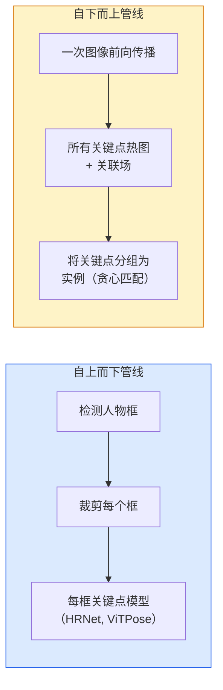

# 关键点检测与姿态估计

> 姿态是一组有序的关键点。关键点检测器是一个热图回归器。其他都是辅助性工作。

**类型：** 构建
**语言：** Python
**前置条件：** 阶段 4 第 06 课（检测），阶段 4 第 07 课（U-Net）
**时间：** ~45 分钟

## 学习目标

- 区分自上而下和自下而上的姿态估计，并说明各自的使用场景
- 使用每个关键点的高斯目标回归 K 个关键点的热图，并在推理时提取关键点坐标
- 解释部分亲和场（PAF）以及自下而上管线如何将关键点关联到实例
- 使用 MediaPipe Pose 或 MMPose 进行生产级关键点估计，并理解其输出格式

## 问题

关键点任务有许多名称：人体姿态（17 个身体关节点）、人脸标志点（68 或 478 个点）、手部（21 个点）、动物姿态、机器人物体姿态、医学解剖标志点。每一个都共享相同的结构：检测对象上的 K 个离散点并输出其 (x, y) 坐标。

姿态估计是动作捕捉、健身应用、运动分析、手势控制、动画、AR 试穿和机器人抓取的基础。2D 情况已经成熟；3D 姿态（从单摄像头估计世界坐标中的关节点位置）是当前的研究前沿。

工程问题是规模。单图像、单人姿态是一个 20ms 的问题。在人群中以 30fps 进行多人姿态是一个完全不同的问题，需要不同的架构。

## 概念

### 自上而下 vs 自下而上



- **自上而下** —— 先检测人物，然后在每个裁剪结果上运行每人的关键点模型。准确率最高；随人数线性扩展。
- **自下而上** —— 一次前向传播预测所有关键点加上一个关联场；进行分组。无论人群大小，时间恒定。

自上而下（HRNet、ViTPose）是准确率领先者；自下而上（OpenPose、HigherHRNet）是拥挤场景的吞吐量领先者。

### 热图回归

不直接回归 `(x, y)`，而是为每个关键点预测一个 H x W 的热图，其高斯斑点以真实位置为中心。

```
target[k, y, x] = exp(-((x - cx_k)^2 + (y - cy_k)^2) / (2 sigma^2))
```

在推理时，每个热图的 argmax 就是预测的关键点位置。

为什么热图比直接回归更有效：网络的空间结构（卷积特征图）自然地与空间输出对齐。高斯目标也起到正则化作用——小的定位误差产生小的损失，而不是零。

### 亚像素定位

Argmax 给出整数坐标。为了亚像素精度，通过拟合抛物线到 argmax 及其邻居来细化，或使用众所周知的偏移量 `(dx, dy) = 0.25 * (heatmap[y, x+1] - heatmap[y, x-1], ...)` 方向。

### 部分亲和场（PAF）

OpenPose 用于自下而上关联的技巧。对每对连接的关键点（例如左肩到左肘），预测一个 2 通道的场，编码从一个指向另一个的单位向量。为了将肩部与其肘部关联，沿连接候选对的线积分 PAF；积分最高的对即匹配。

```
对每个连接（肢体）：
  PAF 通道：2（单位向量 x, y）
  线积分：对采样点求和 (PAF . line_direction)
  积分越高 = 匹配越强
```

优雅且可扩展到任意人群大小，无需逐人裁剪。

### COCO 关键点

标准人体姿态数据集：每人 17 个关键点，PCK（正确关键点百分比）和 OKS（对象关键点相似度）作为指标。OKS 是关键点的 IoU 类比，是 COCO mAP@OKS 报告的内容。

### 2D vs 3D

- **2D 姿态** —— 图像坐标；已达到生产质量（MediaPipe、HRNet、ViTPose）。
- **3D 姿态** —— 世界/相机坐标；仍在活跃研究中。常见方法：
  - 用小型 MLP 将 2D 预测提升到 3D（VideoPose3D）。
  - 从图像直接 3D 回归（PyMAF、MHFormer）。
  - 多视角设置（CMU Panoptic）用于真实值。

## 构建

### 步骤 1：高斯热图目标

```python
import numpy as np
import torch

def gaussian_heatmap(size, cx, cy, sigma=2.0):
    yy, xx = np.meshgrid(np.arange(size), np.arange(size), indexing="ij")
    return np.exp(-((xx - cx) ** 2 + (yy - cy) ** 2) / (2 * sigma ** 2)).astype(np.float32)

hm = gaussian_heatmap(64, 32, 32, sigma=2.0)
print(f"peak: {hm.max():.3f} at ({hm.argmax() % 64}, {hm.argmax() // 64})")
```

每个关键点的热图沿通道轴堆叠，给出完整的目标张量。

### 步骤 2：小型关键点头

输出 K 个热图通道的 U-Net 风格模型。

```python
import torch.nn as nn
import torch.nn.functional as F

class TinyKeypointNet(nn.Module):
    def __init__(self, num_keypoints=4, base=16):
        super().__init__()
        self.down1 = nn.Sequential(nn.Conv2d(3, base, 3, 2, 1), nn.ReLU(inplace=True))
        self.down2 = nn.Sequential(nn.Conv2d(base, base * 2, 3, 2, 1), nn.ReLU(inplace=True))
        self.mid = nn.Sequential(nn.Conv2d(base * 2, base * 2, 3, 1, 1), nn.ReLU(inplace=True))
        self.up1 = nn.ConvTranspose2d(base * 2, base, 2, 2)
        self.up2 = nn.ConvTranspose2d(base, num_keypoints, 2, 2)

    def forward(self, x):
        h1 = self.down1(x)
        h2 = self.down2(h1)
        h3 = self.mid(h2)
        u1 = self.up1(h3)
        return self.up2(u1)
```

输入 `(N, 3, H, W)`，输出 `(N, K, H, W)`。损失是针对高斯目标的逐像素 MSE。

### 步骤 3：推理——提取关键点坐标

```python
def heatmap_to_coords(heatmaps):
    """
    heatmaps: (N, K, H, W)
    returns:  (N, K, 2) 浮点坐标，单位：图像像素
    """
    N, K, H, W = heatmaps.shape
    hm = heatmaps.reshape(N, K, -1)
    idx = hm.argmax(dim=-1)
    ys = (idx // W).float()
    xs = (idx % W).float()
    return torch.stack([xs, ys], dim=-1)

coords = heatmap_to_coords(torch.randn(2, 4, 32, 32))
print(f"coords: {coords.shape}")  # (2, 4, 2)
```

推理时一行代码。对于亚像素细化，在 argmax 周围进行插值。

### 步骤 4：合成关键点数据集

简单：在白色画布上画四个点，学习预测它们。

```python
def make_synthetic_sample(size=64):
    img = np.ones((3, size, size), dtype=np.float32)
    rng = np.random.default_rng()
    kps = rng.integers(8, size - 8, size=(4, 2))
    for cx, cy in kps:
        img[:, cy - 2:cy + 2, cx - 2:cx + 2] = 0.0
    hms = np.stack([gaussian_heatmap(size, cx, cy) for cx, cy in kps])
    return img, hms, kps
```

足够简单，小模型可以在分钟内学会。

### 步骤 5：训练

```python
model = TinyKeypointNet(num_keypoints=4)
opt = torch.optim.Adam(model.parameters(), lr=3e-3)

for step in range(200):
    batch = [make_synthetic_sample() for _ in range(16)]
    imgs = torch.from_numpy(np.stack([b[0] for b in batch]))
    hms = torch.from_numpy(np.stack([b[1] for b in batch]))
    pred = model(imgs)
    # 上采样预测到完整分辨率
    pred = F.interpolate(pred, size=hms.shape[-2:], mode="bilinear", align_corners=False)
    loss = F.mse_loss(pred, hms)
    opt.zero_grad(); loss.backward(); opt.step()
```

## 使用

- **MediaPipe Pose** —— Google 的生产级姿态估计器；提供 WebGL + 移动端运行时，延迟低于 10ms。
- **MMPose**（OpenMMLab） —— 综合研究代码库；每个 SOTA 架构都带有预训练权重。
- **YOLOv8-pose** —— 最快的实时多人姿态估计，单次前向传播。
- **transformers HumanDPT / PoseAnything** —— 更新的视觉语言方法，用于开放词汇姿态（任意对象，任意关键点集）。

## 交付

本课程产出：

- `outputs/prompt-pose-stack-picker.md` — 一个提示词，根据延迟、人群规模和 2D vs 3D 需求选择 MediaPipe / YOLOv8-pose / HRNet / ViTPose。
- `outputs/skill-heatmap-to-coords.md` — 一个技能，编写每个生产级姿态模型使用的亚像素热图到坐标的例程。

## 练习

1. **（简单）** 在合成 4 点数据集上训练小型关键点模型。200 步后报告预测与真实关键点之间的平均 L2 误差。
2. **（中等）** 添加亚像素细化：给定 argmax 位置，从相邻像素沿 x 和 y 拟合一维抛物线。报告与整数 argmax 相比的准确率提升。
3. **（困难）** 构建包含两人的合成数据集，每张图像显示两个 4 关键点模式的实例。训练带有 PAF 的自下而上管线，预测哪个关键点属于哪个实例，并评估 OKS。

## 关键术语

| 术语 | 人们说的 | 实际含义 |
|------|---------|---------|
| 关键点 | "地标点" | 对象上的特定有序点（关节点、角点、特征点） |
| 姿态 | "骨架" | 属于一个实例的一组有序关键点 |
| 自上而下 | "先检测再姿态" | 两阶段管线：人物检测器 + 每裁剪关键点模型；准确率最高 |
| 自下而上 | "先姿态，后分组" | 单次全部关键点预测 + 分组；人群规模下时间恒定 |
| 热图 | "高斯目标" | 每个关键点的 H x W 张量，在真实位置有峰值；首选的回归目标 |
| PAF | "部分亲和场" | 编码肢体方向的 2 通道单位向量场；用于将关键点分组为实例 |
| OKS | "关键点 IoU" | 对象关键点相似度；COCO 的姿态指标 |
| HRNet | "高分辨率网络" | 主导的自上而下关键点架构；全程保持高分辨率特征 |

## 延伸阅读

- [OpenPose (Cao et al., 2017)](https://arxiv.org/abs/1812.08008) — 带 PAF 的自下而上方法；仍是对该方法的最佳阐述
- [HRNet (Sun et al., 2019)](https://arxiv.org/abs/1902.09212) — 自上而下参考架构
- [ViTPose (Xu et al., 2022)](https://arxiv.org/abs/2204.12484) — 普通 ViT 作为姿态骨干；当前许多基准上的 SOTA
- [MediaPipe Pose](https://developers.google.com/mediapipe/solutions/vision/pose_landmarker) — 生产级实时姿态；2026 年最快的已部署框架
