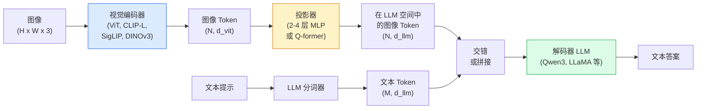

# 视觉语言模型——ViT-MLP-LLM 模式

> 视觉编码器将图像转换为 Token。MLP 投影器将这些 Token 映射到 LLM 的嵌入空间。语言模型负责其余工作。这个模式——ViT-MLP-LLM——是 2026 年每个生产级 VLM 的基础。

**类型：** 学习 + 使用
**语言：** Python
**前置知识：** 阶段 4 第 14 课（ViT），阶段 4 第 18 课（CLIP），阶段 7 第 02 课（自注意力）
**时间：** ~75 分钟

## 学习目标

- 阐述 ViT-MLP-LLM 架构并解释三个组件各自的作用
- 比较 Qwen3-VL、InternVL3.5、LLaVA-Next 和 GLM-4.6V 在参数量、上下文长度和基准性能上的差异
- 解释 DeepStack：为什么多级 ViT 特征比单个最后一层特征能更好地对齐视觉和语言
- 在实际生产中用跨模态错误率（CMER）衡量 VLM 的幻觉问题并据此采取行动

## 问题

CLIP（阶段 4 第 18 课）为图像和文本提供了一个共享的嵌入空间，足以进行零样本分类和检索。但它无法回答"这张图里有几辆红车？"，因为 CLIP 不生成文本——它只计算相似度。

视觉语言模型（VLM）——Qwen3-VL、InternVL3.5、LLaVA-Next、GLM-4.6V——将 CLIP 系列的图像编码器与完整的大型语言模型相结合。模型看到图像和问题，然后生成答案。2026 年，开源 VLM 在多项模态基准（MMMU、MMBench、DocVQA、ChartQA、MathVista、OSWorld）上可与 GPT-5 和 Gemini-2.5-Pro 媲美甚至超越。

三个组件（ViT、投影器、LLM）是标准范式。不同模型之间的差异在于使用哪个 ViT、哪个投影器、哪个 LLM、训练数据以及对齐方式。一旦理解了这个模式，替换任何组件都是机械性的操作。

## 概念

### ViT-MLP-LLM 架构



1. **视觉编码器**——一个预训练的 ViT（CLIP-L/14、SigLIP、DINOv3 或其微调变体）。生成图像块 Token。
2. **投影器**——一个小型模块（2-4 层 MLP，或 Q-former），将视觉 Token 映射到 LLM 的嵌入维度。这是大多数微调发生的地方。
3. **LLM**——一个仅解码器的大型语言模型（Qwen3、Llama、Mistral、GLM、InternLM）。按顺序读取视觉和文本 Token，生成文本。

原则上这三个组件都是可训练的。在实践中，视觉编码器和 LLM 大多保持冻结，只有投影器进行训练——用几十亿参数的信号实现低成本适应。

### DeepStack

普通的投影仅使用最后一层 ViT 特征。DeepStack（Qwen3-VL）从多个 ViT 深度采样特征并进行堆叠。深层携带高层语义；浅层携带细粒度空间和纹理信息。将两者都输入 LLM 缩小了"图像包含什么"（语义）和"具体在哪里"（空间定位）之间的差距。

### 三个阶段训练

现代 VLM 分阶段训练：

1. **对齐**——冻结 ViT 和 LLM。仅训练图像-描述对上的投影器。教会投影器将视觉空间映射到语言空间。
2. **预训练**——解冻所有部分。在大规模交错图像-文本数据上训练（5 亿对以上）。构建模型的视觉知识。
3. **指令微调**——在精心策划的（图像、问题、答案）三元组上微调。教会对话行为和任务格式。这是将"能感知视觉的 LM"转变为可用助手的关键步骤。

大多数 LoRA 微调针对第三阶段，使用少量标注数据集。

### 模型家族对比（2026 年初）

| 模型 | 参数量 | 视觉编码器 | LLM | 上下文 | 优势 |
|------|--------|------------|-----|--------|------|
| Qwen3-VL-235B-A22B (MoE) | 235B (22B 激活) | 自定义 ViT + DeepStack | Qwen3 | 256K | 通用 SOTA，GUI 智能体 |
| Qwen3-VL-30B-A3B (MoE) | 30B (3B 激活) | 自定义 ViT + DeepStack | Qwen3 | 256K | 较小的 MoE 替代方案 |
| Qwen3-VL-8B (密集) | 8B | 自定义 ViT | Qwen3 | 128K | 生产环境密集模型默认选择 |
| InternVL3.5-38B | 38B | InternViT-6B | Qwen3 + GPT-OSS | 128K | MMBench / MMVet 强劲 |
| InternVL3.5-241B-A28B | 241B (28B 激活) | InternViT-6B | Qwen3 | 128K | 与 GPT-4o 竞争 |
| LLaVA-Next 72B | 72B | SigLIP | Llama-3 | 32K | 开源，易于微调 |
| GLM-4.6V | ~70B | 自定义 | GLM | 64K | 开源，强 OCR |
| MiniCPM-V-2.6 | 8B | SigLIP | MiniCPM | 32K | 适合边缘设备 |

### 视觉智能体

Qwen3-VL-235B 在 OSWorld 基准上达到全球顶级性能——这是一个用于评估**视觉智能体**操作 GUI（桌面、移动端、网页）的基准。模型看到屏幕截图，理解 UI，并发出操作（点击、输入、滚动）。结合工具，它可以完成常见的桌面任务闭环。这是 2026 年大多数"AI PC"演示的底层技术。

### 智能体能力与 RoPE 变体

VLM 需要知道视频中某帧的**时间位置**。Qwen3-VL 从 T-RoPE（时间旋转位置编码）演进到**基于文本的时间对齐**——显式的时间戳文本 Token 与视频帧交错。模型看到"`<timestamp 00:32>` 帧，提示"并且能够推理时间关系。

### 对齐问题

在爬取的数据集中，12% 的图像-文本对的描述并未完全基于图像内容。在此数据上训练的 VLM 会悄悄地学会产生幻觉——虚构对象、误读数字、编造关系。在生产中这是最主要的失败模式。

Skywork.ai 引入了**跨模态错误率（CMER）**来追踪这个问题：

```
CMER = 文本置信度高但图像-文本相似度（通过 CLIP 系列检查器）低的输出占比
```

高 CMER 意味着模型在自信地陈述图像中不存在的内容。监控 CMER 并将其作为生产 KPI，可将部署中的幻觉率降低约 35%。诀窍不在于"修复模型"，而在于"将高 CMER 的输出路由到人工审核"。

### 使用 LoRA / QLoRA 微调

对 70B 的 VLM 进行完整微调对大多数团队来说遥不可及。在注意力层和投影器上进行 LoRA（秩 16-64），或使用 4 位基础权重的 QLoRA，可以单张 A100 / H100 上运行。成本：5,000-50,000 个样本，$100-$5,000 算力，2-10 小时训练。

### 空间推理仍然薄弱

当前 VLM 在空间推理基准（上下、左右、计数、距离）上得分 50-60%。如果你的用例依赖"哪个对象在哪个上面"，请充分验证——通用 VLM 性能低于人类水平。空间任务的更优替代方案：专门的关键点/姿态估计器、深度模型或带有边界框几何后处理的检测模型。

## 构建

### 步骤 1：投影器

你最常训练的部分。2-4 层 MLP 加 GELU 激活。

```python
import torch
import torch.nn as nn


class Projector(nn.Module):
    def __init__(self, vit_dim=768, llm_dim=4096, hidden=4096):
        super().__init__()
        self.net = nn.Sequential(
            nn.Linear(vit_dim, hidden),
            nn.GELU(),
            nn.Linear(hidden, llm_dim),
        )

    def forward(self, x):
        return self.net(x)
```

输入为 `(N_patches, d_vit)` 的 Token 张量。输出为 `(N_patches, d_llm)`。LLM 将每个输出行视为一个普通 Token。

### 步骤 2：端到端组装 ViT-MLP-LLM

最小 VLM 前向传播的骨架。实际代码使用 `transformers`；这里是概念布局。

```python
class MinimalVLM(nn.Module):
    def __init__(self, vit, projector, llm, image_token_id):
        super().__init__()
        self.vit = vit
        self.projector = projector
        self.llm = llm
        self.image_token_id = image_token_id  # 文本提示中的占位符 Token

    def forward(self, image, input_ids, attention_mask):
        # 1. 视觉特征
        vision_tokens = self.vit(image)                     # (B, N_patches, d_vit)
        vision_embeds = self.projector(vision_tokens)       # (B, N_patches, d_llm)

        # 2. 文本嵌入
        text_embeds = self.llm.get_input_embeddings()(input_ids)  # (B, M, d_llm)

        # 3. 用视觉嵌入替换图像占位符 Token
        merged = self._merge(text_embeds, vision_embeds, input_ids)

        # 4. 运行 LLM
        return self.llm(inputs_embeds=merged, attention_mask=attention_mask)

    def _merge(self, text_embeds, vision_embeds, input_ids):
        out = text_embeds.clone()
        expected = vision_embeds.size(1)
        for b in range(input_ids.size(0)):
            positions = (input_ids[b] == self.image_token_id).nonzero(as_tuple=True)[0]
            if len(positions) != expected:
                raise ValueError(
                    f"批次第 {b} 项有 {len(positions)} 个图像 Token，但 vision_embeds 有 {expected} 个块。"
                    " 批次中的每个样本必须预先填充相同数量的图像占位符 Token。")
            out[b, positions] = vision_embeds[b]
        return out
```

文本中的 `<image>` 占位符 Token 被替换为真实的图像嵌入——LLaVA、Qwen-VL 和 InternVL 都使用相同的模式。

### 步骤 3：CMER 计算

一个轻量级的运行时检查。

```python
import torch.nn.functional as F


def cross_modal_error_rate(image_emb, text_emb, text_confidence, sim_threshold=0.25, conf_threshold=0.8):
    """
    image_emb, text_emb: 图像和生成文本的嵌入（内部归一化）
    text_confidence:     每个 Token 的平均概率，范围 [0, 1]
    返回：                 高置信度输出中图像-文本对齐度低的占比
    """
    image_emb = F.normalize(image_emb, dim=-1)
    text_emb = F.normalize(text_emb, dim=-1)
    sim = (image_emb * text_emb).sum(dim=-1)        # 余弦相似度
    high_conf_low_sim = (text_confidence > conf_threshold) & (sim < sim_threshold)
    return high_conf_low_sim.float().mean().item()
```

将 CMER 视为生产 KPI。按端点、提示类型、客户进行监控。CMER 上升表明模型开始在某种输入分布上产生幻觉。

### 步骤 4：玩具 VLM 分类器（可运行）

演示投影器可以训练。输入伪造的"ViT 特征"；一个小型 LLM 风格的 Token 预测类别。

```python
class ToyVLM(nn.Module):
    def __init__(self, vit_dim=32, llm_dim=64, num_classes=5):
        super().__init__()
        self.projector = Projector(vit_dim, llm_dim, hidden=64)
        self.head = nn.Linear(llm_dim, num_classes)

    def forward(self, vision_tokens):
        projected = self.projector(vision_tokens)
        pooled = projected.mean(dim=1)
        return self.head(pooled)
```

可以在合成（特征，类别）对上用不到 200 步拟合——足以证明投影器模式有效。

## 使用

2026 年生产团队使用 VLM 的三种方式：

- **托管 API**——OpenAI Vision、Anthropic Claude Vision、Google Gemini Vision。零基础设施，供应商风险。
- **开源自托管**——通过 `transformers` 和 `vllm` 使用 Qwen3-VL 或 InternVL3.5。完全控制，前期投入较高。
- **领域微调**——加载 Qwen2.5-VL-7B 或 LLaVA-1.6-7B，在 5k-50k 自定义样本上使用 LoRA，通过 `vllm` 或 `TGI` 提供服务。

```python
from transformers import AutoProcessor, AutoModelForVision2Seq
import torch
from PIL import Image

model_id = "Qwen/Qwen3-VL-8B-Instruct"
processor = AutoProcessor.from_pretrained(model_id)
model = AutoModelForVision2Seq.from_pretrained(model_id, torch_dtype=torch.bfloat16, device_map="auto")

messages = [{
    "role": "user",
    "content": [
        {"type": "image", "image": Image.open("plot.png")},
        {"type": "text", "text": "这张图表显示了什么？"},
    ],
}]
inputs = processor.apply_chat_template(messages, add_generation_prompt=True, tokenize=True, return_dict=True, return_tensors="pt").to("cuda")
generated = model.generate(**inputs, max_new_tokens=256)
answer = processor.decode(generated[0][inputs["input_ids"].shape[1]:], skip_special_tokens=True)
```

`apply_chat_template` 隐藏了 `<image>` 占位符 Token 的处理；模型在内部处理合并。

## 交付

本课产出：

- `outputs/prompt-vlm-selector.md` —— 根据准确性、延迟、上下文长度和预算选择 Qwen3-VL / InternVL3.5 / LLaVA-Next / API。
- `outputs/skill-cmer-monitor.md` —— 提供代码，为生产 VLM 端点添加跨模态错误率的检测仪表、按端点划分的仪表盘和告警阈值。

## 练习

1. **(简单)** 在五张图像上通过任意开源 VLM 运行三个提示（"这是什么？"、"数一下物体"、"描述场景"）。手工将每个答案评为正确 / 部分正确 / 产生幻觉。计算初版的类 CMER 指标。
2. **(中等)** 使用 LoRA（秩 16）在 500 张目标领域图像及其描述上微调 Qwen2.5-VL-3B 或 LLaVA-1.6-7B。比较零样本与微调后的 MMBench 风格准确性。
3. **(困难)** 将 VLM 的图像编码器替换为 DINOv3（取代默认的 SigLIP/CLIP）。仅重新训练投影器（冻结 LLM + 冻结 DINOv3）。测量密集预测任务（计数、空间推理）是否有所改进。

## 关键术语

| 术语 | 人们说的 | 实际含义 |
|------|----------|----------|
| ViT-MLP-LLM | "VLM 模式" | 视觉编码器 + 投影器 + 语言模型；每个 2026 年 VLM 的基础 |
| 投影器 | "桥梁" | 2-4 层 MLP（或 Q-former），将视觉 Token 映射到 LLM 嵌入空间 |
| DeepStack | "Qwen3-VL 特征技巧" | 堆叠多个 ViT 层级的特征，而非仅使用最后一层 |
| 图像 Token | "<image> 占位符" | 文本流中由投影后的视觉嵌入替换的特殊 Token |
| CMER | "幻觉 KPI" | 跨模态错误率；文本置信度高但图像-文本相似度低时反映幻觉 |
| 视觉智能体 | "会点击的 VLM" | 通过工具调用操作 GUI 的 VLM（OSWorld、移动端、网页） |
| Q-former | "固定数量 Token 桥" | BLIP-2 风格的投影器，生成固定数量的视觉查询 Token |
| 对齐 / 预训练 / 指令微调 | "三个阶段" | 标准 VLM 训练流程 |

## 延伸阅读

- [Qwen3-VL Technical Report (arXiv 2511.21631)](https://arxiv.org/abs/2511.21631)
- [InternVL3.5 Advancing Open-Source Multimodal Models (arXiv 2508.18265)](https://arxiv.org/html/2508.18265v1)
- [LLaVA-Next series](https://llava-vl.github.io/blog/2024-05-10-llava-next-stronger-llms/)
- [BentoML: Best Open-Source VLMs 2026](https://www.bentoml.com/blog/multimodal-ai-a-guide-to-open-source-vision-language-models)
- [MMMU: Multi-discipline Multimodal Understanding benchmark](https://mmmu-benchmark.github.io/)
- [VLMs in manufacturing (Robotics Tomorrow, March 2026)](https://www.roboticstomorrow.com/story/2026/03/when-machines-learn-to-see-like-experts-the-rise-of-vision-language-models-in-manufacturing/26335/)
