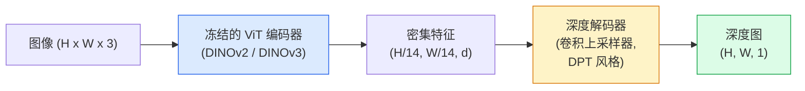

# 单目深度与几何估计

> 深度图是一个单通道图像，其中每个像素代表与相机的距离。在没有立体视觉或 LiDAR 的情况下，仅凭一帧 RGB 图像预测深度曾经是不可能的。2026 年，一个冻结的 ViT 编码器加上轻量级头部就能达到与真实值相差几个百分点的精度。

**类型：** 构建 + 使用
**语言：** Python
**前置知识：** 阶段 4 第 14 课（ViT），阶段 4 第 17 课（自监督视觉），阶段 4 第 07 课（U-Net）
**时间：** ~60 分钟

## 学习目标

- 区分相对深度和度量深度，并说明每个生产模型（MiDaS、Marigold、Depth Anything V3、ZoeDepth）解决的是哪种
- 使用 Depth Anything V3（DINOv2 骨干网络）对任意单张图像进行深度预测，无需标定
- 解释为什么单目深度能仅凭单张图像起作用（透视线索、纹理梯度、学习先验）以及它无法恢复什么（绝对尺度、被遮挡的几何结构）
- 使用深度图和小孔相机内参将 2D 检测结果提升为 3D 点

## 问题

深度是 2D 计算机视觉中缺失的维度。给定 RGB 图像，你知道事物在图像平面中的位置，但不知道它们有多远。深度传感器（立体相机、LiDAR、飞行时间）可以直接解决这个问题，但价格昂贵、易损坏且范围有限。

单目深度估计——从单个 RGB 帧预测深度——曾经产生模糊、不可靠的输出。到 2026 年，大规模预训练编码器改变了这一点：Depth Anything V3 使用冻结的 DINOv2 骨干网络，生成的深度图可以泛化到室内、室外、医学和卫星等各个领域。Marigold 将深度重构为条件扩散问题。ZoeDepth 回归出真实的度量距离。

深度也是 2D 检测和 3D 理解之间的桥梁：将检测到的边界框的像素乘以深度，就能将 2D 对象提升到 3D 点云中。这是每个 AR 遮挡系统、每个避障流水线和每个"捡起杯子"机器人的核心。

## 概念

### 相对深度 vs 度量深度

- **相对深度**——有序的 `z` 值，没有真实世界单位。"像素 A 比像素 B 近，但距离比例不以米为单位。"
- **度量深度**——从相机出发的绝对距离（米）。要求模型学习了图像线索与真实距离之间的统计关系。

MiDaS 和 Depth Anything V3 生成相对深度。Marigold 生成相对深度。ZoeDepth、UniDepth 和 Metric3D 生成度量深度。度量模型对相机内参敏感；相对模型则不敏感。

### 编码器-解码器模式



Depth Anything V3 冻结编码器，仅训练 DPT 风格解码器。编码器提供丰富的特征；解码器将其插值回图像分辨率并回归出深度。

### 为什么单张图像能产生深度

2D 图像包含许多与深度相关的单目线索：

- **透视**——3D 中的平行线在 2D 中汇聚。
- **纹理梯度**——远处的表面纹理更小、更密集。
- **遮挡顺序**——近处物体遮挡远处物体。
- **大小恒常性**——已知物体（汽车、人类）提供大致尺度。
- **大气透视**——远处的物体在户外场景中显得更朦胧、更蓝。

在数十亿张图像上训练过的 ViT 内化了这些线索。有了足够的数据和强大的骨干网络，单目深度无需任何显式的 3D 监督就能达到合理的精度。

### 单目深度做不到的事情

- **绝对度量尺度**——没有内参或场景中的已知物体就无法确定。网络可以预测"杯子是勺子距离的两倍"，但不知道杯子是 1 米还是 10 米远。
- **被遮挡的几何结构**——椅子的背面不可见，无法可靠推断。
- **真正无纹理/反射表面**——镜子、玻璃、均匀的墙壁。网络会报告貌似合理但错误的深度。

### 2026 年的 Depth Anything V3

- 普通 DINOv2 ViT-L/14 作为编码器（冻结）。
- DPT 解码器。
- 在来自多种来源的带位姿图像对（不需要光度一致性之外的显式深度监督）上训练。
- 从**任意数量的视觉输入中预测空间一致的几何结构，无论是否有已知的相机位姿**。
- 在单目深度、任意视角几何、视觉渲染、相机位姿估计方面达到 SOTA。

这是 2026 年需要深度时可即用的模型。

### Marigold——扩散用于深度

Marigold（Ke 等人，CVPR 2024）将深度估计重构为条件图像到图像扩散。条件：RGB。目标：深度图。使用预训练的 Stable Diffusion 2 U-Net 作为骨干网络。输出的深度图在对象边界处异常清晰。权衡：推理速度比前馈模型慢（10-50 步去噪）。

### 内参与小孔相机

要将具有深度 `d` 的像素 `(u, v)` 提升到相机坐标中的 3D 点 `(X, Y, Z)`：

```
fx, fy, cx, cy = 相机内参
X = (u - cx) * d / fx
Y = (v - cy) * d / fy
Z = d
```

内参来自 EXIF 元数据、标定板或单目内参估计器（Perspective Fields、UniDepth）。没有内参时，仍然可以通过假设 60-70° 视场角和中等分辨率来渲染点云——可用于可视化，不可用于测量。

### 评估

两个标准指标：

- **AbsRel**（绝对相对误差）：`mean(|d_pred - d_gt| / d_gt)`。越低越好。生产模型在 0.05-0.1 之间。
- **delta < 1.25**（阈值准确率）：`max(d_pred/d_gt, d_gt/d_pred) < 1.25` 的像素占比。越高越好。SOTA 在 0.9 以上。

对于相对深度（Depth Anything V3、MiDaS），评估使用两个指标的尺度和平移不变版本。

## 构建

### 步骤 1：深度指标

```python
import torch

def abs_rel_error(pred, target, mask=None):
    if mask is not None:
        pred = pred[mask]
        target = target[mask]
    return (torch.abs(pred - target) / target.clamp(min=1e-6)).mean().item()


def delta_accuracy(pred, target, threshold=1.25, mask=None):
    if mask is not None:
        pred = pred[mask]
        target = target[mask]
    ratio = torch.maximum(pred / target.clamp(min=1e-6), target / pred.clamp(min=1e-6))
    return (ratio < threshold).float().mean().item()
```

在评估之前，始终屏蔽无效的深度像素（零、NaN、饱和值）。

### 步骤 2：尺度和平移对齐

对于相对深度模型，在计算指标之前将预测与真实值对齐。最小二乘拟合 `a * pred + b = target`：

```python
def align_scale_shift(pred, target, mask=None):
    if mask is not None:
        p = pred[mask]
        t = target[mask]
    else:
        p = pred.flatten()
        t = target.flatten()
    A = torch.stack([p, torch.ones_like(p)], dim=1)
    coeffs, *_ = torch.linalg.lstsq(A, t.unsqueeze(-1))
    a, b = coeffs[:2, 0]
    return a * pred + b
```

在评估 MiDaS / Depth Anything 时，在 `abs_rel_error` 之前运行 `align_scale_shift`。

### 步骤 3：将深度提升为点云

```python
import numpy as np

def depth_to_point_cloud(depth, intrinsics):
    H, W = depth.shape
    fx, fy, cx, cy = intrinsics
    v, u = np.meshgrid(np.arange(H), np.arange(W), indexing="ij")
    z = depth
    x = (u - cx) * z / fx
    y = (v - cy) * z / fy
    return np.stack([x, y, z], axis=-1)


depth = np.random.uniform(0.5, 4.0, (240, 320))
intr = (320.0, 320.0, 160.0, 120.0)
pc = depth_to_point_cloud(depth, intr)
print(f"点云形状: {pc.shape}  (H, W, 3)")
```

一个函数，适用于所有 3D 提升应用。将点云导出为 `.ply` 并在 MeshLab 或 CloudCompare 中打开。

### 步骤 4：使用合成深度场景进行冒烟测试

```python
def synthetic_depth(size=96):
    yy, xx = np.meshgrid(np.arange(size), np.arange(size), indexing="ij")
    # 地面：从近（顶部）到远（底部）的线性梯度
    depth = 1.0 + (yy / size) * 4.0
    # 中间的盒子：更近
    mask = (np.abs(xx - size / 2) < size / 6) & (np.abs(yy - size * 0.6) < size / 6)
    depth[mask] = 2.0
    return depth.astype(np.float32)


gt = torch.from_numpy(synthetic_depth(96))
pred = gt + 0.3 * torch.randn_like(gt)  # 模拟预测
aligned = align_scale_shift(pred, gt)
print(f"对齐前  absRel = {abs_rel_error(pred, gt):.3f}")
print(f"对齐后   absRel = {abs_rel_error(aligned, gt):.3f}")
```

### 步骤 5：Depth Anything V3 使用（参考）

```python
import torch
from transformers import pipeline
from PIL import Image

pipe = pipeline(task="depth-estimation", model="LiheYoung/depth-anything-v2-large")

image = Image.open("street.jpg").convert("RGB")
out = pipe(image)
depth_np = np.array(out["depth"])
```

三行代码。`out["depth"]` 是 PIL 灰度图；转换为 numpy 用于计算。对于 Depth Anything V3，在发布后切换模型 ID；API 不变。

## 使用

- **Depth Anything V3**（Meta AI / ByteDance，2024-2026）——相对深度的默认选择。生产中最快的 ViT-large 骨干模型。
- **Marigold**（ETH，2024）——最高视觉质量，推理速度慢。
- **UniDepth**（ETH，2024）——度量深度，带相机内参估计。
- **ZoeDepth**（Intel，2023）——度量深度；较老但仍可靠。
- **MiDaS v3.1**——遗留但稳定；作为比较的好基线。

典型集成模式：

1. RGB 帧到达。
2. 深度模型生成深度图。
3. 检测器生成边界框。
4. 通过深度将边界框质心提升到 3D；如有可用点云则合并。
5. 下游：AR 遮挡、路径规划、物体尺寸估计、立体替换。

对于实时使用，Depth Anything V2 Small（INT8 量化）在消费级 GPU 上以 518x518 分辨率可达约 30 fps。

## 交付

本课产出：

- `outputs/prompt-depth-model-picker.md` —— 根据延迟、度量 vs 相对需求以及场景类型，在 Depth Anything V3、Marigold、UniDepth、MiDaS 之间进行选择。
- `outputs/skill-depth-to-pointcloud.md` —— 一项技能，从深度图构建点云，正确处理内参并导出为 `.ply` 格式。

## 练习

1. **(简单)** 在桌面的任意 10 张图像上运行 Depth Anything V2。将深度保存为灰度 PNG 并检查。识别一个预测深度看起来错误的物体，并解释为什么单目线索失效了。
2. **(中等)** 给定 Depth Anything V2 的 RGB + 深度结果，提升为点云并使用 `open3d` 渲染。比较两个场景（室内/室外），指出哪个看起来更可信。
3. **(困难)** 取五对仅因已知物体位置不同而不同的图像（例如瓶子向相机移动了 30 厘米）。使用 UniDepth 预测两者的度量深度。报告预测的距离差与真实的 30 厘米之间的对比。

## 关键术语

| 术语 | 人们说的 | 实际含义 |
|------|----------|----------|
| 单目深度 | "单张图像深度" | 从一帧 RGB 图像估计深度，无需立体视觉或 LiDAR |
| 相对深度 | "有序深度" | 有序的 z 值，没有真实世界单位 |
| 度量深度 | "绝对距离" | 以米为单位的深度；需要标定或使用度量监督训练的模型 |
| AbsRel | "绝对相对误差" | |d_pred - d_gt| / d_gt 的均值；标准深度指标 |
| Delta 准确率 | "delta < 1.25" | 预测值在真实值 25% 以内的像素占比 |
| 小孔相机 | "fx, fy, cx, cy" | 用于将 (u, v, d) 提升到 (X, Y, Z) 的相机模型 |
| DPT | "密集预测 Transformer" | 在冻结的 ViT 编码器之上使用的基于卷积的解码器，用于深度估计 |
| DINOv2 骨干网络 | "它有效的原因" | 无需深度标签即可跨领域泛化的自监督特征 |

## 延伸阅读

- [Depth Anything V3 paper page](https://depth-anything.github.io/) —— 使用 DINOv2 编码器的 SOTA 单目深度
- [Marigold (Ke et al., CVPR 2024)](https://marigoldmonodepth.github.io/) —— 基于扩散的深度估计
- [UniDepth (Piccinelli et al., 2024)](https://arxiv.org/abs/2403.18913) —— 带内参的度量深度
- [MiDaS v3.1 (Intel ISL)](https://github.com/isl-org/MiDaS) —— 经典的相对深度基线
- [DINOv3 blog post (Meta)](https://ai.meta.com/blog/dinov3-self-supervised-vision-model/) —— 提升深度精度的编码器家族
