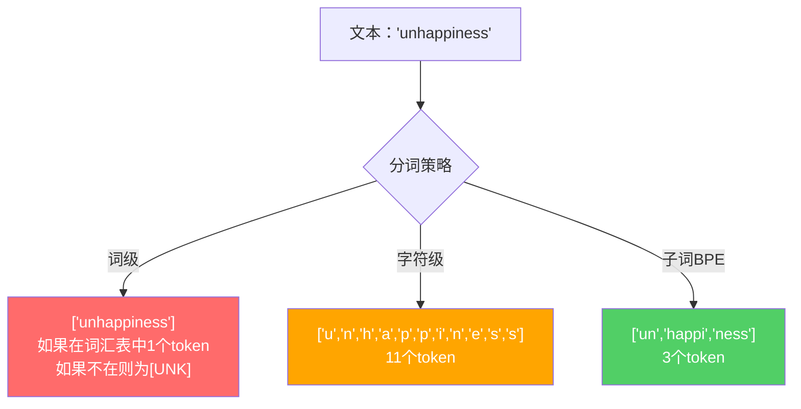
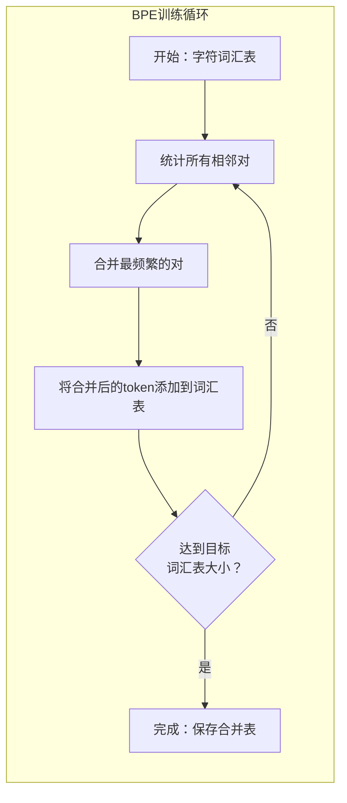
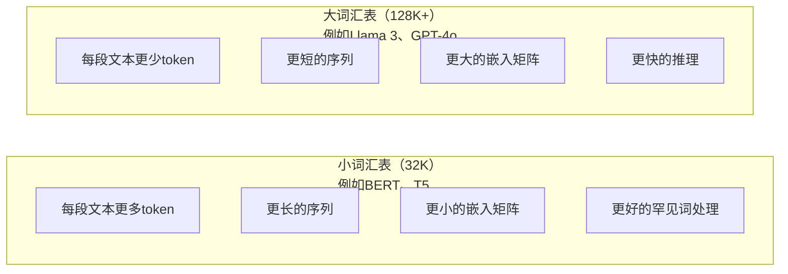

# 分词器：BPE、WordPiece、SentencePiece

> 你的LLM并不阅读英语。它阅读整数。分词器决定了这些整数是承载意义还是浪费意义。

**类型：** 构建
**语言：** Python
**前置知识：** Phase 05（NLP基础）
**时间：** ~90分钟

## 学习目标

- 从零实现BPE、WordPiece和Unigram分词算法，并比较它们的合并策略
- 解释词汇表大小如何影响模型效率：太小产生长序列，太大浪费嵌入参数
- 分析跨语言和代码的分词伪影，识别特定分词器失效之处
- 使用tiktoken和sentencepiece库对文本进行分词并检查生成的token ID

## 问题

你的LLM并不阅读英语。它不阅读任何语言。它阅读数字。

从"Hello, world!"到[15496, 11, 995, 0]之间的差距就是分词器。每个单词、每个空格、每个标点符号都必须转换成整数，模型才能处理。这种转换不是中性的。它把假设嵌入模型中，以后无法撤销。

如果搞错了，你的模型会用多个token来编码常见单词，浪费容量。"unfortunately"会变成四个token而不是一个。你的128K上下文窗口对于多音节词密集的文本缩小了75%。如果做对了，同样的上下文窗口能容纳两倍的意义。"这个模型处理代码很好"和"这个模型在Python上表现很差"之间的差异，往往归结于分词器是如何训练的。

你对GPT-4或Claude的每次API调用都是按token计价的。模型生成的每个token都消耗计算资源。表示一个输出所需的token越少，端到端推理就越快。分词不是预处理。它是架构的一部分。

## 概念

### 三种失败的方法（以及一种成功的）

有三种显而易见的方法可以将文本转换为数字。其中两种在大规模下行不通。

**词级分词**按空格和标点分割。"The cat sat"变成["The", "cat", "sat"]。很简单。但是"tokenization"呢？或者"GPT-4o"？或者德语复合词"Geschwindigkeitsbegrenzung"？词级分词需要巨大的词汇表才能覆盖每种语言中的每个单词。漏掉一个单词，你就会得到可怕的`[UNK]`token——模型在说"我不知道这是什么"。仅英语就有超过一百万个词形。加上代码、URL、科学符号和100种其他语言，你需要一个无限的词汇表。

**字符级分词**走向另一个方向。"hello"变成["h", "e", "l", "l", "o"]。词汇表很小（几百个字符）。永远不会出现未知token。但序列变得极长。一个在词级中是10个token的句子会变成50个字符级token。模型必须学会"t"、"h"、"e"在一起意味着"the"——把注意力容量浪费在人类三岁就学会的东西上。

**子词分词**找到了最佳平衡点。常见单词保持完整："the"是一个token。罕见词分解成有意义的片段："unhappiness"变成["un", "happi", "ness"]。词汇表保持可控（30K到128K个token）。序列保持简短。未知token基本上消失了，因为任何单词都可以由子词片段构建。

每个现代LLM都使用子词分词。GPT-2、GPT-4、BERT、Llama 3、Claude——都是如此。问题在于使用哪种算法。



### BPE：字节对编码

BPE是一种为分词而改造的贪心压缩算法。这个想法简单到可以写在一张索引卡上。

从单个字符开始。统计训练语料中每个相邻对的频率。将最频繁的对合并成一个新token。重复直到达到目标词汇表大小。

```figure
tokenizer-bpe
```

以下是在包含"lower"、"lowest"和"newest"的小型语料上运行BPE的过程：

```
语料（含词频）：
  "lower"  x5
  "lowest" x2
  "newest" x6

第0步——从字符开始：
  l o w e r       (x5)
  l o w e s t     (x2)
  n e w e s t     (x6)

第1步——统计相邻对：
  (e,s): 8    (s,t): 8    (l,o): 7    (o,w): 7
  (w,e): 13   (e,r): 5    (n,e): 6    ...

第2步——合并最频繁的对 (w,e) -> "we"：
  l o we r        (x5)
  l o we s t      (x2)
  n e we s t      (x6)

第3步——重新计数，合并 (e,s) -> "es"：
  l o we r        (x5)
  l o we s t      (x2)
  n e we s t      (x6)

实际精确跟踪：
  合并"we"后，剩余的对：
  (l,o): 7   (o,we): 7   (we,r): 5   (we,s): 8
  (s,t): 8   (n,e): 6    (e,we): 6

第3步——合并 (we,s) -> "wes" 或 (s,t) -> "st"（都是8次，选第一个）：
  合并 (we,s) -> "wes"：
  l o we r        (x5)
  l o wes t       (x2)
  n e wes t       (x6)

第4步——合并 (wes,t) -> "west"：
  l o we r        (x5)
  l o west        (x2)
  n e west        (x6)

...继续直到达到目标词汇表大小。
```

合并表就是分词器。要编码新文本，按学习到的顺序应用合并。训练语料决定了存在哪些合并，这一选择永久性地塑造了模型所看到的内容。



### 字节级BPE（GPT-2、GPT-3、GPT-4）

标准BPE操作于Unicode字符。字节级BPE操作于原始字节（0-255）。这给你一个恰好256的基础词汇表，处理任何语言或编码，并且永远不会产生未知token。

GPT-2引入了这种方法。基础词汇表覆盖每个可能的字节。BPE合并在此基础上构建。OpenAI的tiktoken库实现了字节级BPE，具有以下词汇表大小：

- GPT-2：50,257个token
- GPT-3.5/GPT-4：~100,256个token（cl100k_base编码）
- GPT-4o：200,019个token（o200k_base编码）

### WordPiece（BERT）

WordPiece看起来与BPE类似，但选择合并的方式不同。它最大化训练数据的似然性，而不是原始频率：

```
BPE合并标准：      count(A, B)
WordPiece合并标准： count(AB) / (count(A) * count(B))
```

BPE问："哪一对出现得最多？"WordPiece问："哪一对一起出现的频率超出偶然预期？"这种微妙的差异产生了不同的词汇表。WordPiece偏好共现令人惊讶而非仅频繁的合并。

WordPiece还使用"##"前缀来表示继续子词：

```
"unhappiness" -> ["un", "##happi", "##ness"]
"embedding"   -> ["em", "##bed", "##ding"]
```

"##"前缀告诉你这部分延续了前一个token。BERT使用WordPiece，词汇表大小为30,522个token。每个BERT变体——DistilBERT、RoBERTa的分词器实际上用的是BPE，但BERT本身是WordPiece。

### SentencePiece（Llama、T5）

SentencePiece将输入视为原始的Unicode字符流，包括空白。没有预分词步骤。没有关于词边界的语言特定规则。这使其真正与语言无关——它适用于中文、日文、泰语和其他不以空格分隔单词的语言。

SentencePiece支持两种算法：
- **BPE模式**：与标准BPE相同的合并逻辑，应用于原始字符序列
- **Unigram模式**：从一个大型词汇表开始，迭代删除对整体似然性影响最小的token。BPE的反向——剪枝而不是合并。

Llama 2使用SentencePiece BPE，词汇表大小为32,000个token。T5使用SentencePiece Unigram，32,000个token。注意：Llama 3切换到了基于tiktoken的字节级BPE分词器，词汇表大小为128,256个token。

### 词汇表大小权衡

这是一个真实的工程决策，具有可衡量的后果。



具体数字。对于128K词汇表，4,096维嵌入，嵌入矩阵本身是128,000 x 4,096 = 5.24亿参数。对于32K词汇表，是1.31亿参数。仅分词器选择就造成了4亿参数的差异。

但更大的词汇表能更激进地压缩文本。同一个英文段落，用32K词汇表需要100个token，用128K词汇表可能只需要70个token。这意味着在生成过程中少30%的前向传播。对于服务于数百万请求的模型，这直接降低了计算成本。

趋势很明显：词汇表大小在增长。GPT-2使用了50,257。GPT-4使用约100K。Llama 3使用128K。GPT-4o使用200K。

| 模型 | 词汇表大小 | 分词器类型 | 每个英语单词的平均token数 |
|-------|-----------|----------------|---------------------------|
| BERT | 30,522 | WordPiece | ~1.4 |
| GPT-2 | 50,257 | 字节级BPE | ~1.3 |
| Llama 2 | 32,000 | SentencePiece BPE | ~1.4 |
| GPT-4 | ~100,256 | 字节级BPE | ~1.2 |
| Llama 3 | 128,256 | 字节级BPE（tiktoken） | ~1.1 |
| GPT-4o | 200,019 | 字节级BPE | ~1.0 |

### 多语言税

主要基于英语训练的分词器对其他语言非常残酷。韩语文本在GPT-2的分词器中平均每个单词需要2-3个token。中文可能更糟。这意味着韩语用户实际上拥有的上下文窗口只有英语用户的一半大小——为更少的信息密度支付相同的价格。

这就是为什么Llama 3将其词汇表从32K增加了四倍到128K。更多的token分配给非英语文字意味着跨语言更公平的压缩。

```figure
tokenizer-tradeoff
```

## 动手构建

### 第1步：字符级分词器

从基础开始。字符级分词器将每个字符映射到其Unicode码点。无需训练。无未知token。只是一个直接的映射。

```python
class CharTokenizer:
    def encode(self, text):
        return [ord(c) for c in text]

    def decode(self, tokens):
        return "".join(chr(t) for t in tokens)
```

"hello"变成[104, 101, 108, 108, 111]。每个字符都是自己的token。这是我们改进的基线。

### 第2步：从头实现BPE分词器

真正的实现。我们在原始字节上训练（像GPT-2一样），统计对，合并最频繁的，并按顺序记录每次合并。合并表就是分词器。

```python
from collections import Counter

class BPETokenizer:
    def __init__(self):
        self.merges = {}
        self.vocab = {}

    def _get_pairs(self, tokens):
        pairs = Counter()
        for i in range(len(tokens) - 1):
            pairs[(tokens[i], tokens[i + 1])] += 1
        return pairs

    def _merge_pair(self, tokens, pair, new_token):
        merged = []
        i = 0
        while i < len(tokens):
            if i < len(tokens) - 1 and tokens[i] == pair[0] and tokens[i + 1] == pair[1]:
                merged.append(new_token)
                i += 2
            else:
                merged.append(tokens[i])
                i += 1
        return merged

    def train(self, text, num_merges):
        tokens = list(text.encode("utf-8"))
        self.vocab = {i: bytes([i]) for i in range(256)}

        for i in range(num_merges):
            pairs = self._get_pairs(tokens)
            if not pairs:
                break
            best_pair = max(pairs, key=pairs.get)
            new_token = 256 + i
            tokens = self._merge_pair(tokens, best_pair, new_token)
            self.merges[best_pair] = new_token
            self.vocab[new_token] = self.vocab[best_pair[0]] + self.vocab[best_pair[1]]

        return self

    def encode(self, text):
        tokens = list(text.encode("utf-8"))
        for pair, new_token in self.merges.items():
            tokens = self._merge_pair(tokens, pair, new_token)
        return tokens

    def decode(self, tokens):
        byte_sequence = b"".join(self.vocab[t] for t in tokens)
        return byte_sequence.decode("utf-8", errors="replace")
```

训练循环是BPE的核心：统计对，合并赢家，重复。每次合并都会减少总token数。经过 `num_merges` 轮后，词汇表从256（基础字节）增长到256 + num_merges。

编码按它们被学习的精确顺序应用合并。这很重要。如果合并1创建了"th"，合并5创建了"the"，编码必须首先应用合并1，这样"the"才能在合并5中由"th" + "e"形成。

解码是反过程：在词汇表中查找每个token ID，连接字节，解码为UTF-8。

### 第3步：编码和解码往返

```python
corpus = (
    "The cat sat on the mat. The cat ate the rat. "
    "The dog sat on the log. The dog ate the frog. "
    "Natural language processing is the study of how computers "
    "understand and generate human language. "
    "Tokenization is the first step in any NLP pipeline."
)

tokenizer = BPETokenizer()
tokenizer.train(corpus, num_merges=40)

test_sentences = [
    "The cat sat on the mat.",
    "Natural language processing",
    "tokenization pipeline",
    "unhappiness",
]

for sentence in test_sentences:
    encoded = tokenizer.encode(sentence)
    decoded = tokenizer.decode(encoded)
    raw_bytes = len(sentence.encode("utf-8"))
    ratio = len(encoded) / raw_bytes
    print(f"'{sentence}'")
    print(f"  Tokens: {len(encoded)} (from {raw_bytes} bytes) -- ratio: {ratio:.2f}")
    print(f"  Roundtrip: {'PASS' if decoded == sentence else 'FAIL'}")
```

压缩比告诉你分词器的效率。比率为0.50意味着分词器将文本压缩到了原始字节的一半token数。越低越好。在训练语料上，比率会很好。在分布外的文本如"unhappiness"（未出现在语料中）上，比率会更差——分词器对于未见过的模式退回到字符级编码。

### 第4步：与tiktoken比较

```python
import tiktoken

enc = tiktoken.get_encoding("cl100k_base")

texts = [
    "The cat sat on the mat.",
    "unhappiness",
    "Hello, world!",
    "def fibonacci(n): return n if n < 2 else fibonacci(n-1) + fibonacci(n-2)",
    "Geschwindigkeitsbegrenzung",
]

for text in texts:
    our_tokens = tokenizer.encode(text)
    tiktoken_tokens = enc.encode(text)
    tiktoken_pieces = [enc.decode([t]) for t in tiktoken_tokens]
    print(f"'{text}'")
    print(f"  Our BPE:   {len(our_tokens)} tokens")
    print(f"  tiktoken:  {len(tiktoken_tokens)} tokens -> {tiktoken_pieces}")
```

tiktoken使用完全相同的算法，但在数百GB文本上训练了100,000次合并。算法是相同的。区别在于训练数据和合并次数。你在一个段落上用40次合并训练的分词器无法与tiktoken在大型语料上的100K次合并竞争。但机制是相同的。

### 第5步：词汇表分析

```python
def analyze_vocabulary(tokenizer, test_texts):
    total_tokens = 0
    total_chars = 0
    token_usage = Counter()

    for text in test_texts:
        encoded = tokenizer.encode(text)
        total_tokens += len(encoded)
        total_chars += len(text)
        for t in encoded:
            token_usage[t] += 1

    print(f"Vocabulary size: {len(tokenizer.vocab)}")
    print(f"Total tokens across all texts: {total_tokens}")
    print(f"Total characters: {total_chars}")
    print(f"Avg tokens per character: {total_tokens / total_chars:.2f}")

    print(f"\nMost used tokens:")
    for token_id, count in token_usage.most_common(10):
        token_bytes = tokenizer.vocab[token_id]
        display = token_bytes.decode("utf-8", errors="replace")
        print(f"  Token {token_id:4d}: '{display}' (used {count} times)")

    unused = [t for t in tokenizer.vocab if t not in token_usage]
    print(f"\nUnused tokens: {len(unused)} out of {len(tokenizer.vocab)}")
```

这揭示了词汇表中的Zipf分布。少数token占主导地位（空格、"the"、"e"）。大多数token很少使用。生产分词器针对这种分布进行了优化——常见模式得到短的token ID，罕见模式得到更长的表示。

## 应用

你的自建BPE能工作了。现在来看看生产工具是什么样的。

### tiktoken（OpenAI）

```python
import tiktoken

enc = tiktoken.get_encoding("cl100k_base")

text = "Tokenizers convert text to integers"
tokens = enc.encode(text)
print(f"Tokens: {tokens}")
print(f"Pieces: {[enc.decode([t]) for t in tokens]}")
print(f"Roundtrip: {enc.decode(tokens)}")
```

tiktoken用Rust编写，带有Python绑定。它每秒编码数百万个token。相同的BPE算法，工业级实现。

### Hugging Face tokenizers

```python
from tokenizers import Tokenizer
from tokenizers.models import BPE
from tokenizers.trainers import BpeTrainer
from tokenizers.pre_tokenizers import ByteLevel

tokenizer = Tokenizer(BPE())
tokenizer.pre_tokenizer = ByteLevel()

trainer = BpeTrainer(vocab_size=1000, special_tokens=["<pad>", "<eos>", "<unk>"])
tokenizer.train(["corpus.txt"], trainer)

output = tokenizer.encode("The cat sat on the mat.")
print(f"Tokens: {output.tokens}")
print(f"IDs: {output.ids}")
```

Hugging Face tokenizers库底层也是Rust。它可以在几秒钟内在GB级语料上训练BPE。这是你在训练自己的模型时要用的。

### 加载Llama的分词器

```python
from transformers import AutoTokenizer

tokenizer = AutoTokenizer.from_pretrained("meta-llama/Llama-3.1-8B")

text = "Tokenizers are the unsung heroes of LLMs"
tokens = tokenizer.encode(text)
print(f"Token IDs: {tokens}")
print(f"Tokens: {tokenizer.convert_ids_to_tokens(tokens)}")
print(f"Vocab size: {tokenizer.vocab_size}")

multilingual = ["Hello world", "Hola mundo", "Bonjour le monde"]
for text in multilingual:
    ids = tokenizer.encode(text)
    print(f"'{text}' -> {len(ids)} tokens")
```

Llama 3的128K词汇表对非英语文本的压缩明显优于GPT-2的50K词汇表。你可以自己验证——用多种语言编码同样的句子并统计token数。

## 交付

本课程产出 `outputs/prompt-tokenizer-analyzer.md`——一个可复用的提示，用于分析任何文本和模型组合的分词效率。输入一个文本样本，它会告诉你哪种模型的分词器处理得最好。

## 练习

1. 修改BPE分词器，使其在每个合并步骤打印词汇表。观察"t" + "h"如何变成"th"，然后"th" + "e"如何变成"the"。追踪常见英语单词如何逐步组装起来。

2. 向BPE分词器添加特殊token（`<pad>`、`<eos>`、`<unk>`）。为它们分配ID 0、1、2，并将所有其他token相应移位。实现一个预分词步骤，在运行BPE之前按空白分割。

3. 实现WordPiece合并标准（似然比而不是频率）。在同一语料上用相同次数的合并训练BPE和WordPiece。比较生成的词汇表——哪个产生更多语言学上有意义的子词？

4. 构建一个多语言分词器效率基准。取10个英语、西班牙语、中文、韩语和阿拉伯语句子。用tiktoken（cl100k_base）对每个句子进行分词，并测量平均每个字符的token数。量化每种语言的"多语言税"。

5. 在更大的语料上训练你的BPE分词器（下载一篇维基百科文章）。调整合并次数，使压缩比在同一文本上达到tiktoken的10%以内。这迫使你理解语料大小、合并次数和压缩质量之间的关系。

## 关键术语

| 术语 | 人们说的 | 实际含义 |
|------|----------------|----------------------|
| Token | "一个词" | 模型词汇表中的一个单元——可以是字符、子词、词或多词块 |
| BPE | "某种压缩技术" | 字节对编码——迭代合并最频繁的相邻token对，直到达到目标词汇表大小 |
| WordPiece | "BERT的分词器" | 类似BPE，但合并最大化似然比 count(AB)/(count(A)*count(B)) 而非原始频率 |
| SentencePiece | "一个分词器库" | 语言无关的分词器，操作于原始Unicode，无需预分词，支持BPE和Unigram算法 |
| 词汇表大小 | "它知道多少词" | 唯一token的总数：GPT-2有50,257个，BERT有30,522个，Llama 3有128,256个 |
| 生育率 | "不是分词术语" | 每个单词的平均token数——衡量分词器跨语言的效率（1.0为完美，3.0意味着模型工作三倍努力） |
| 字节级BPE | "GPT的分词器" | BPE操作于原始字节（0-255）而非Unicode字符，保证任何输入都不会产生未知token |
| 合并表 | "分词器文件" | 训练期间学习的成对合并的有序列表——这就是分词器，顺序很重要 |
| 预分词 | "按空格分割" | 在子词分词之前应用的规则：空白分割、数字分离、标点处理 |
| 压缩比 | "分词器的效率如何" | 生成的token数除以输入字节数——越低表示压缩越好，推理越快 |

## 延伸阅读

- [Sennrich等人，2016年——"使用子词单元进行罕见词的神经机器翻译"](https://arxiv.org/abs/1508.07909) — 将BPE引入NLP的论文，将1994年的压缩算法转化为现代分词的基础
- [Kudo & Richardson，2018年——"SentencePiece：一个简单且语言无关的子词分词器"](https://arxiv.org/abs/1808.06226) — 使多语言模型成为可能的语言无关分词技术
- [OpenAI tiktoken仓库](https://github.com/openai/tiktoken) — Rust实现的生产级BPE，带Python绑定，被GPT-3.5/4/4o使用
- [Hugging Face Tokenizers文档](https://huggingface.co/docs/tokenizers) — 具有Rust性能的生产级分词器训练
