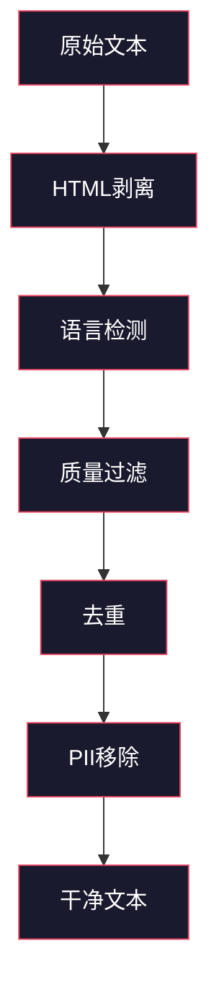
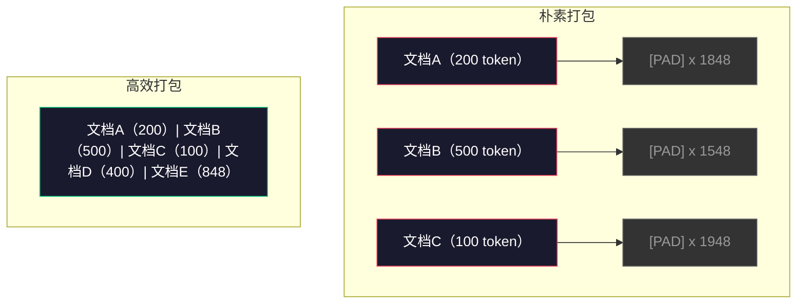

# 预训练数据管道

> 模型是一面镜子。它反射你喂给它的任何数据。喂它垃圾，它就完美流利地反射垃圾。

**类型：** 构建
**语言：** Python
**前置知识：** Phase 10，第01-02课（分词器、构建分词器）
**时间：** ~90分钟

## 学习目标

- 构建一个流式数据管道，对数TB文本进行分词、分块、洗牌和批处理，而无需全部加载到内存中
- 实现真实预训练管道中使用的数据质量过滤器（去重、语言检测、内容过滤）
- 创建具有正确注意力掩码和文档边界处理的固定长度训练序列
- 分析管道吞吐量，确保数据加载器能跟上GPU训练速度

## 问题

你已经有了分词器。现在你需要数据。

不是一个数据集。不是一个CSV文件。是TB级别的文本——经过清洗、去重、质量过滤、分词为固定长度序列，并以随机化批次提供服务，速度要快到你的8-GPU集群永远不需要等待下一个批次。

大多数人认为训练LLM是关于模型架构的。不是的。Llama 3使用了15.6万亿个token。GPT-3使用了3000亿。DeepSeek-V2使用了8.1万亿。这三个模型的架构大致相同：带有注意力和前馈网络的堆叠变压器块。输出质量的差异主要来自数据。

DeepMind的Chinchilla论文对此进行了精确阐述。对于给定的计算预算，存在一个模型参数与训练token的最优比率。Chinchilla表明，2022年的大多数模型都严重训练不足——它们拥有的参数相对于看到的数据量来说太多了。一个70B参数的模型在1.4万亿个token上训练（Chinchilla最优）超过了在3000亿个token上训练的280B模型（Gopher）。

你的数据管道决定了你的模型是学习语言还是学习噪声。

## 概念

### 数据来源

每个大语言模型都在混合来源上训练。确切的组成对大多数实验室来说是严密保守的秘密，但我们知道足够的信息来理解各类别。

| 来源 | 大小 | 质量 | 使用方 |
|--------|------|---------|---------|
| Common Crawl | ~250 TB原始 | 低（需要大量过滤） | GPT-3、Llama、大多数开源模型 |
| 维基百科 | ~20 GB | 高 | 每个主要LLM |
| GitHub代码 | ~1 TB+ | 中（大量重复、死代码） | StarCoder、CodeLlama、DeepSeek-Coder |
| 书籍（BookCorpus、Pile） | ~100 GB | 高 | GPT-2、GPT-3、早期模型 |
| 学术论文（arXiv、S2ORC） | ~100 GB | STEM领域高 | Llama、Galactica |
| StackOverflow、Reddit | ~100 GB | 中 | Llama、Falcon |
| 精选网络（C4、RefinedWeb） | ~5 TB | 中高（预过滤） | T5、Falcon |

Llama 3披露了其数据混合比例：大约50%网络数据、25%代码、13%书籍和学术论文、8%数学数据和4%多语言网络数据。总计15.6万亿个token，来自超过5 TB的原始文本。

比率和总量同样重要。网络数据太多，模型会变成Reddit复读机。代码太少，它就无法编程。数学太少，它在推理上就会失败。把这个混合比例搞对是训练LLM最困难的部分之一，而且没有公式——需要实验和评估。

### 数据清洗

原始网络数据是肮脏的。一个典型的Common Crawl转储包含：

- HTML标签和JavaScript
- 样板页眉、页脚、导航菜单
- 重复页面（精确和近似重复）
- 机器生成的垃圾信息
- 个人身份信息（PII）
- 低质量文本（关键词列表、SEO垃圾）
- 编码为文本的非文本内容

清洗这些不是可选的。它是生成连贯段落的模型和输出HTML标签混产品列表的模型之间的区别。



每一步消除一类噪声：

**HTML剥离：** 移除所有标记。仅保留可见文本内容。像 `trafilatura` 或 `readability` 这样的库提取文章内容，同时丢弃导航、广告和样板。

**语言检测：** 使用fastText的语言识别模型（lid.176.bin）对每个文档进行分类。过滤到目标语言。一个分类为英语但置信度低于0.8的文档很可能不是干净的英语。

**质量过滤：** 这正是有趣的地方。RefinedWeb（Falcon背后的数据集）使用基于困惑度的过滤器：在维基百科上训练一个小型语言模型，然后对每个文档进行评分。高困惑度意味着文档不像维基百科——很可能是垃圾信息、关键词列表或机器生成的内容。困惑度高于阈值的文档被移除。

**去重：** 影响最大的清洗步骤。Common Crawl包含大量重复页面——法律免责声明、Cookie通知、服务条款。在重复数据上训练浪费计算资源，并且可能导致模型逐字记忆和复述特定段落。

**PII移除：** 姓名、电子邮件地址、电话号码、社会安全号码。基于正则表达式检测结构化PII，NER模型检测上下文中的姓名。

### 使用MinHash去重

精确去重很简单：对每个文档进行哈希，移除重复项。但近似重复才是真正的问题。同一篇新闻文章的两个副本，周围有略微不同的广告，就是近似重复。内容95%相同，但逐字节比较时它们不同。

MinHash + 局部敏感哈希（LSH）高效地解决了这个问题。


思路：

1. **分片：** 将每个文档转换为一组n-gram（例如，5-gram的词或字符）。"the quick brown fox"使用3词分片变成{"the quick brown", "quick brown fox"}。

2. **MinHash：** 对于每个文档的分片集合，计算k个哈希值。每个哈希值是在不同哈希函数下所有分片中的最小哈希值。这创建了一个固定大小的"签名"，近似于任意两个文档之间的Jaccard相似度。

3. **LSH：** 基于MinHash签名的波段将文档分组到桶中。在同一桶中的文档是候选近似重复。这避免了比较每一对——你只需要比较候选对。

4. **验证：** 对于每个候选对，计算精确的Jaccard相似度。如果相似度超过阈值（通常为0.8），移除一个副本。

Llama团队报告通过去重移除了大约38%的网络数据。这不是一个小数字。超过三分之一的Common Crawl是重复或近似重复内容。

### 序列打包

你的模型期望固定长度的输入序列。你的文档是可变长度的。有些是50个token。有些是50,000个token。

朴素方法：将每个文档填充到最大序列长度。这在填充token上浪费了大量计算资源，而这些token对学习没有任何贡献。

更好的方法：将多个文档打包到一个序列中，用序列结束token分隔。一个2048个token的序列可能包含三个用[EOS]token分隔的短文档。



注意力掩码必须正确设置。在同一个打包序列中，文档A的token不应关注文档B的token。这需要一个块对角注意力掩码。

长文档在序列边界处被截断或分割成块。分割点很重要：在句子中间分割迫使模型看到不完整的想法。一些管道在可能时在段落或句子边界对齐分割。

### Chinchilla缩放定律

对于固定的计算预算C（以FLOPs衡量），最优模型大小N和数据集大小D遵循：

```
N_opt ~ C^0.5
D_opt ~ C^0.5
```

在实践中，这意味着你应该大致等比例地缩放模型大小和数据集大小。一个有10倍更多参数的模型需要大致10倍更多的训练token才能达到相同的损失。

| 模型 | 参数 | 训练token | Chinchilla最优？ |
|-------|-----------|----------------|-------------------|
| GPT-3 | 175B | 300B | 否（训练不足3-4倍） |
| Chinchilla | 70B | 1.4T | 是（按设计） |
| Llama 2 | 70B | 2T | 过度训练（有意为之） |
| Llama 3 | 70B | 15T | 严重过度训练 |

Llama 3故意违反了Chinchilla定律。Meta发现，在远超计算最优比率的数据上进行过度训练，可以产生更好的推理模型。额外的训练成本是一次性支付的，但更小的模型可以永远以更低的成本提供服务。这有时被称为"推理最优"缩放方法，自2024年以来已成为行业标准。

## 动手构建

### 第1步：文本清洗

剥离HTML、归一化空白、移除非文本内容。我们将使用一个公有领域文本（Project Gutenberg）作为小型语料。

```python
import re

def clean_text(text):
    text = re.sub(r"<[^>]+>", "", text)
    text = re.sub(r"http\S+", "", text)
    text = re.sub(r"[^\x20-\x7E\n]", "", text)
    text = re.sub(r"\n{3,}", "\n\n", text)
    text = re.sub(r" {2,}", " ", text)
    return text.strip()

def quality_filter(text, min_words=50, max_ratio_caps=0.3, max_ratio_special=0.1):
    words = text.split()
    if len(words) < min_words:
        return False
    caps_ratio = sum(1 for w in words if w.isupper()) / len(words)
    if caps_ratio > max_ratio_caps:
        return False
    special_chars = sum(1 for c in text if not c.isalnum() and not c.isspace())
    if special_chars / max(len(text), 1) > max_ratio_special:
        return False
    return True
```

质量过滤器捕获SEO垃圾信息（全大写）、机器生成的噪声（高特殊字符比率）和短页面（太短）。仅这三个检查就能从网络抓取数据中移除令人惊讶的大量垃圾。

### 第2步：MinHash去重

从头实现MinHash。不需要外部库——只需 `hashlib`。

```python
import hashlib
from collections import defaultdict

def get_shingles(text, k=5):
    words = text.lower().split()
    if len(words) < k:
        return set()
    return {" ".join(words[i:i+k]) for i in range(len(words) - k + 1)}

def minhash_signature(shingles, num_hashes=128):
    signature = []
    for i in range(num_hashes):
        min_hash = float("inf")
        for shingle in shingles:
            h = int(hashlib.sha256(f"{i}:{shingle}".encode()).hexdigest(), 16)
            min_hash = min(min_hash, h)
        signature.append(min_hash)
    return signature

def lsh_buckets(signature, bands=16):
    rows_per_band = len(signature) // bands
    buckets = []
    for b in range(bands):
        start = b * rows_per_band
        band_data = tuple(signature[start:start + rows_per_band])
        bucket_hash = hashlib.md5(str(band_data).encode()).hexdigest()
        buckets.append((b, bucket_hash))
    return buckets

def deduplicate(documents, threshold=0.8, num_hashes=128, bands=16):
    signatures = []
    shingle_sets = []
    for doc in documents:
        shingles = get_shingles(doc)
        shingle_sets.append(shingles)
        signatures.append(minhash_signature(shingles, num_hashes))

    bucket_map = defaultdict(list)
    for doc_idx, sig in enumerate(signatures):
        for band_id, bucket_hash in lsh_buckets(sig, bands):
            bucket_map[(band_id, bucket_hash)].append(doc_idx)

    duplicate_pairs = set()
    for bucket_docs in bucket_map.values():
        if len(bucket_docs) < 2:
            continue
        for i in range(len(bucket_docs)):
            for j in range(i + 1, len(bucket_docs)):
                duplicate_pairs.add((bucket_docs[i], bucket_docs[j]))

    removed = set()
    for i, j in duplicate_pairs:
        if i in removed or j in removed:
            continue
        s1, s2 = shingle_sets[i], shingle_sets[j]
        if not s1 or not s2:
            continue
        jaccard = len(s1 & s2) / len(s1 | s2)
        if jaccard >= threshold:
            removed.add(j)

    return [doc for idx, doc in enumerate(documents) if idx not in removed], len(removed)
```

`num_hashes=128` 和 `bands=16` 参数控制精确率-召回率的权衡。更多哈希值给出更准确的相似度估计。更多波段增加召回率（捕获更多重复），代价是更多的假阳性。这些值对于典型的网络文本效果很好。

### 第3步：分词并打包序列

取清洗、去重后的文本，进行分词并打包成固定长度的训练序列。

```python
def tokenize_corpus(documents, tokenizer):
    all_tokens = []
    for doc in documents:
        tokens = tokenizer.encode(doc)
        all_tokens.extend(tokens)
        all_tokens.append(tokenizer.eos_id)
    return all_tokens

def pack_sequences(token_ids, seq_length, pad_id=0):
    sequences = []
    attention_masks = []
    for i in range(0, len(token_ids), seq_length):
        seq = token_ids[i:i + seq_length]
        mask = [1] * len(seq)
        if len(seq) < seq_length:
            pad_count = seq_length - len(seq)
            seq = seq + [pad_id] * pad_count
            mask = mask + [0] * pad_count
        sequences.append(seq)
        attention_masks.append(mask)
    return sequences, attention_masks
```

### 第4步：训练用DataLoader

生成打包序列的随机化批次。这是训练循环消耗的内容。

```python
import random

class PreTrainingDataLoader:
    def __init__(self, sequences, attention_masks, batch_size, shuffle=True):
        self.sequences = sequences
        self.attention_masks = attention_masks
        self.batch_size = batch_size
        self.shuffle = shuffle

    def __len__(self):
        return (len(self.sequences) + self.batch_size - 1) // self.batch_size

    def __iter__(self):
        indices = list(range(len(self.sequences)))
        if self.shuffle:
            random.shuffle(indices)
        for start in range(0, len(indices), self.batch_size):
            batch_idx = indices[start:start + self.batch_size]
            batch_seqs = [self.sequences[i] for i in batch_idx]
            batch_masks = [self.attention_masks[i] for i in batch_idx]
            yield batch_seqs, batch_masks
```

### 第5步：数据集统计

计算重要的数字：总token数、唯一token数、压缩比、文档长度分布。

```python
from collections import Counter

def compute_statistics(documents, token_ids, sequences, tokenizer_vocab_size):
    total_chars = sum(len(d) for d in documents)
    total_tokens = len(token_ids)
    unique_tokens = len(set(token_ids))
    compression_ratio = total_chars / total_tokens

    doc_lengths = [len(d.split()) for d in documents]
    avg_doc_length = sum(doc_lengths) / max(len(doc_lengths), 1)
    max_doc_length = max(doc_lengths) if doc_lengths else 0
    min_doc_length = min(doc_lengths) if doc_lengths else 0

    token_counts = Counter(token_ids)
    top_tokens = token_counts.most_common(10)

    non_pad_tokens = sum(sum(1 for t in seq if t != 0) for seq in sequences)
    total_positions = sum(len(seq) for seq in sequences)
    utilization = non_pad_tokens / max(total_positions, 1)

    stats = {
        "total_documents": len(documents),
        "total_characters": total_chars,
        "total_tokens": total_tokens,
        "unique_tokens": unique_tokens,
        "vocab_utilization": unique_tokens / tokenizer_vocab_size,
        "compression_ratio": compression_ratio,
        "avg_doc_length_words": avg_doc_length,
        "max_doc_length_words": max_doc_length,
        "min_doc_length_words": min_doc_length,
        "num_sequences": len(sequences),
        "sequence_utilization": utilization,
        "top_10_tokens": top_tokens,
    }
    return stats
```

压缩比告诉你分词器在这个语料上的效率。英语文本通常压缩到每个token约3-4个字符。如果你看到每个token 1.5个字符，你的分词器分割过于激进。如果你看到8+个字符，它学到了非常特定领域的合并。

序列利用率告诉你打包序列中有多少是真实数据相对于填充。低于90%意味着你的打包效率低下——你在填充token上浪费计算资源。

## 应用

### 与HuggingFace Datasets比较

通过HuggingFace的datasets库加载相同的语料，并比较管道速度。

```python
from datasets import load_dataset
from transformers import AutoTokenizer

ds = load_dataset("wikitext", "wikitext-2-raw-v1", split="train")
tokenizer = AutoTokenizer.from_pretrained("meta-llama/Meta-Llama-3-8B")

import time

start = time.time()
tokenized = ds.map(
    lambda x: tokenizer(x["text"], truncation=True, max_length=2048),
    batched=True,
    num_proc=4,
)
hf_time = time.time() - start
total_tokens = sum(len(t) for t in tokenized["input_ids"])
print(f"HuggingFace: {total_tokens:,} tokens in {hf_time:.2f}s ({total_tokens/hf_time:,.0f} tokens/sec)")
```

HuggingFace管道底层使用Rust分词器和跨4个核的并行处理。你的纯Python管道将慢10-50倍。这个差距就是为什么生产团队使用编译后的分词器。算法是相同的。实现语言是区别所在。

## 交付

本课程产出一个用于验证和调试LLM训练管道中数据质量的提示。见 `outputs/prompt-data-quality-checker.md`。

## 练习

1. **简单：** 使用简单启发式（字符集分析）向清洗管道添加语言检测。仅过滤英语文档，并测量有多少文档被移除。
2. **中等：** 在使用SHA-256哈希的精确去重旁边实现MinHash近似去重。比较在网络抓取语料上每种方法捕获的重复数量。
3. **困难：** 构建一个基于困惑度的质量过滤器。在维基百科文本上训练一个小的二元语言模型，按困惑度对每个文档评分，并移除底部20%。比较在过滤和未过滤数据上训练时的模型输出质量。

## 关键术语

| 术语 | 人们说的 | 实际含义 |
|------|----------------|----------------------|
| Common Crawl | "互联网" | 一家非营利组织，每月爬取网络——约250TB原始数据，大多数LLM训练数据的起点 |
| MinHash | "某种哈希技巧" | 使用固定大小签名估计集合间Jaccard相似度的技术——实现大规模近似重复检测 |
| LSH | "局部敏感哈希" | 将相似项目分到同一桶的方法——将成对比较从O(n^2)减少到近线性 |
| 序列打包 | "连接文档" | 将多个文档放入固定长度序列，使用正确的注意力掩码——消除填充浪费 |
| Chinchilla缩放 | "在更多数据上训练" | 对于固定计算预算，最优性能需要大致等比例缩放模型大小和训练token数 |
| 生育率 | "每个词的token数" | 每个单词的平均token数——GPT-4英语为1.3，非拉丁文字更高 |
| 数据混合 | "选择训练数据" | 代码 vs 文本 vs 数学 vs 多语言数据的比率——没有公式，需要实验 |
| 困惑度过滤器 | "质量评分" | 使用小型语言模型对文档进行评分——高困惑度意味着文本不像干净的参考数据 |
| 去重 | "移除副本" | 消除精确和近似重复的文档——通常移除30-40%的原始网络数据 |
| 注意力掩码 | "看哪些token" | 防止在打包序列中跨文档边界的注意力的二元掩码 |

## 延伸阅读

- [Hoffmann等人，2022年——"训练计算最优的大语言模型（Chinchilla）"](https://arxiv.org/abs/2203.15556) — 改变了我们对数据规模看法的论文
- [Penedo等人，2023年——"Falcon LLM的RefinedWeb数据集"](https://arxiv.org/abs/2306.01116) — 如何将Common Crawl过滤为高质量数据
- [Touvron等人，2023年——"Llama 2：开放基础与微调聊天模型"](https://arxiv.org/abs/2307.09288) — Llama 2的数据管道细节
- [Lee等人，2022年——"去重训练数据使语言模型更好"](https://arxiv.org/abs/2107.06499) — 为什么去重比你想象的更重要
- [Broder，1997年——"关于文档的相似性和包含性"](https://ieeexplore.ieee.org/document/666900) — 原始的MinHash论文
- [Meta，2024年——"Llama 3技术报告"](https://arxiv.org/abs/2407.21783) — 15.6T token、数据混合比率、过滤管道
