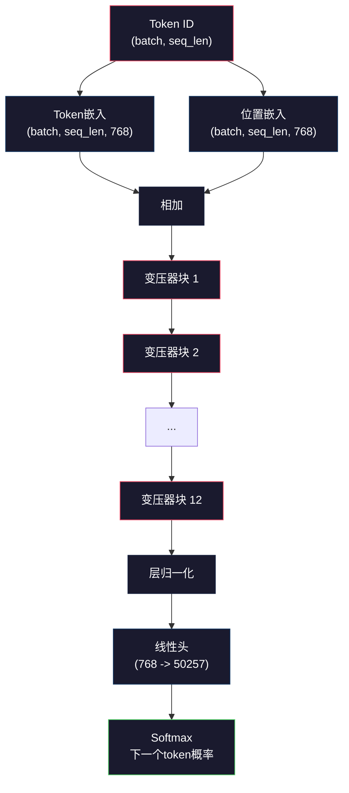
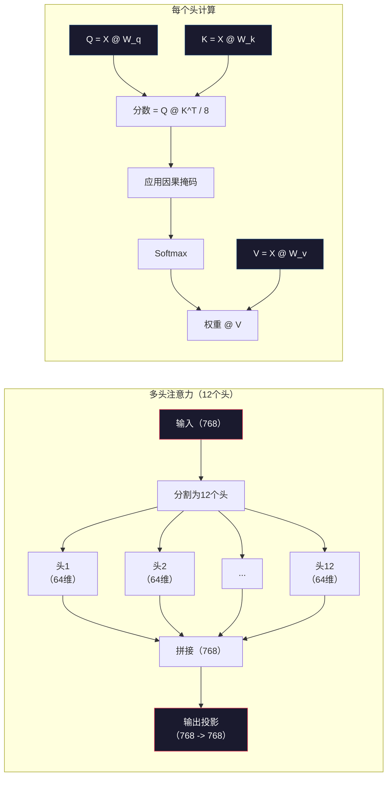
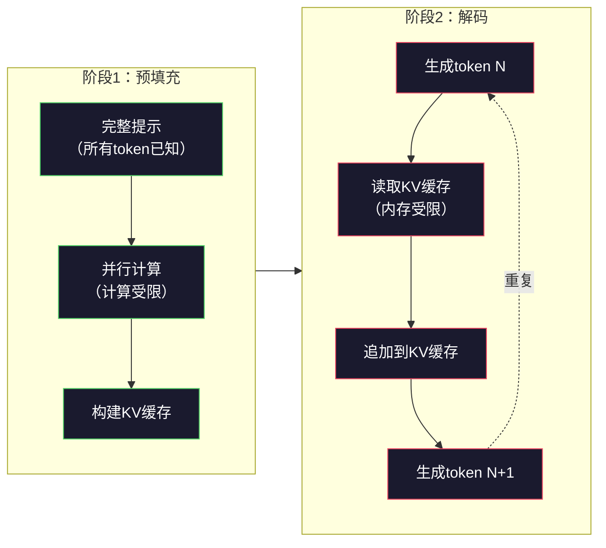

# 预训练一个迷你GPT（124M参数）

> GPT-2 Small有1.24亿参数。那是12个变压器层、12个注意力头和768维嵌入。你可以在单个GPU上在几小时内从零开始训练它。大多数人从未这样做过。他们使用预训练好的检查点。但如果你不亲自训练一个，你就不真正理解你正在构建产品时模型内部发生了什么。

**类型：** 构建
**语言：** Python（使用numpy）
**前置知识：** Phase 10，第01-03课（分词器、构建分词器、数据管道）
**时间：** ~120分钟

## 学习目标

- 从头实现完整的GPT-2架构（124M参数）：token嵌入、位置嵌入、变压器块和语言模型头
- 使用下一个token预测和交叉熵损失在文本语料上训练GPT模型
- 实现具有温度采样和top-k/top-p过滤的自回归文本生成
- 监控训练损失曲线，并验证模型学习到连贯的语言模式

## 问题

你知道什么是transformer。你读过那些示意图。你能背诵"注意力就是一切"，并在白板上画出标有"多头注意力"的方框。

但这都不意味着你理解模型生成文本时发生了什么。

GPT-2 Small中有124,438,272个参数（带权重绑定）。每一个都是通过运行训练循环设置的：前向传播、计算损失、反向传播、更新权重。十二个变压器块。每块十二个注意力头。一个768维的嵌入空间。一个50,257个token的词汇表。每次模型生成一个token时，全部1.24亿参数都参与到一个单一的矩阵乘法链中，该链将一个token ID序列变成下一个token的概率分布。

如果你从未自己构建过这个，你是在与一个黑箱打交道。你可以使用API。你可以微调。但当出问题时——当模型产生幻觉、重复自己、拒绝遵循指令时——你对*为什么*没有心理模型。

本课程从头构建GPT-2 Small。不在PyTorch中。在numpy中。每个矩阵乘法都是可见的。每个梯度都由你的代码计算。你将看到1.24亿个数字究竟如何共同预测下一个词。

## 概念

### GPT架构

GPT是一个自回归语言模型。"自回归"意味着它一次生成一个token，每个token都基于所有之前的token进行条件化。其架构是一堆变压器解码器块。

以下是从token ID到下一个token概率的完整计算图：

1. Token ID输入。形状：(batch_size, seq_len)。
2. Token嵌入查找。每个ID映射到一个768维向量。形状：(batch_size, seq_len, 768)。
3. 位置嵌入查找。每个位置（0, 1, 2, ...）映射到一个768维向量。形状相同。
4. 相加：token嵌入 + 位置嵌入。
5. 通过12个变压器块。
6. 最终层归一化。
7. 线性投影到词汇表大小。形状：(batch_size, seq_len, vocab_size)。
8. Softmax得到概率。

这就是整个模型。没有卷积。没有循环。只有嵌入、注意力、前馈网络和层归一化堆叠12次。



### 变压器块

12个块每个都遵循相同的模式。预归一化架构（GPT-2使用预归一化，而不是原始transformer的后归一化）：

1. LayerNorm
2. 多头自注意力
3. 残差连接（加回输入）
4. LayerNorm
5. 前馈网络（MLP）
6. 残差连接（加回输入）

残差连接至关重要。没有它们，梯度在反向传播时到达块1之前就已经消失了。有了它们，梯度可以通过"跳跃"路径从损失直接流向任何层。这就是为什么你可以堆叠12、32甚至96个块（据传GPT-4使用了120个）。

### 注意力：核心机制

自注意力让每个token查看所有之前的token，并决定对每个token关注多少。以下是数学原理。

对于每个token位置，从输入计算三个向量：
- **查询（Q）**："我在找什么？"
- **键（K）**："我包含什么？"
- **值（V）**："我携带什么信息？"

```
Q = input @ W_q    (768 -> 768)
K = input @ W_k    (768 -> 768)
V = input @ W_v    (768 -> 768)

attention_scores = Q @ K^T / sqrt(d_k)
attention_scores = mask(attention_scores)   # 因果掩码：未来位置为 -inf
attention_weights = softmax(attention_scores)
output = attention_weights @ V
```

因果掩码是使GPT自回归的原因。位置5可以关注位置0-5，但不能关注6、7、8等。这防止模型在训练期间通过查看未来token来"作弊"。

**多头注意力**将768维空间分成12个头，每个64维。每个头学习不同的注意力模式。一个头可能跟踪句法关系（主谓一致）。另一个可能跟踪语义相似性（同义词）。再一个可能跟踪位置邻近性（附近词）。所有12个头的输出被拼接并投影回768维。



除以 sqrt(d_k)——sqrt(64) = 8——是缩放。没有它，高维向量的点积会变得很大，将softmax推入梯度几乎为零的区域。这是原始"注意力就是一切"论文中的关键见解之一。

### KV缓存：为什么推理很快

在训练期间，你一次性处理整个序列。在推理期间，你一次生成一个token。没有优化的情况下，生成token N需要重新计算所有N-1个之前token的注意力。每个生成的token是O(N^2)，对于长度为N的序列总计O(N^3)。

KV缓存解决了这个问题。在计算每个token的K和V之后，存储它们。生成token N+1时，你只需要计算新token的Q，并查找所有之前token的缓存K和V。这将每个token的K和V计算成本从O(N)降低到O(1)。注意力分数计算仍然是O(N)，因为你要关注所有之前的位置，但是你避免了输入上的冗余矩阵乘法。

对于具有12层和12个头的GPT-2，KV缓存存储2（K + V）× 12层 × 12个头 × 64维 = 每个token 18,432个值。对于1024个token的序列，在FP32中约为75MB。对于具有128层的Llama 3 405B，单个序列的KV缓存可以超过10GB。这就是为什么长上下文推理受内存限制。

### 预填充与解码：推理的两个阶段

当你向LLM发送提示时，推理发生在两个不同的阶段。

**预填充**并行处理你的整个提示。所有token都已知，因此模型可以同时计算所有位置的注意力。这个阶段是计算受限的——GPU以满吞吐量进行矩阵乘法。对于一个1000个token的提示在A100上，预填充大约需要20-50ms。

**解码**一次生成一个token。每个新token依赖于所有之前的token。这个阶段是内存受限的——瓶颈是从GPU内存读取模型权重和KV缓存，而不是矩阵数学本身。GPU的计算核心在等待内存读取时大部分处于空闲状态。对于GPT-2，每个解码步骤花费的时间大致相同，无论矩阵乘法需要多少FLOPs，因为内存带宽是约束。

这个区别对生产系统很重要。预填充吞吐量与GPU计算能力成正比（更多FLOPS = 更快的预填充）。解码吞吐量与内存带宽成正比（更快的内存 = 更快的解码）。这就是为什么NVIDIA的H100专注于比A100改进内存带宽——它直接加速token生成。



### 训练循环

训练LLM就是下一个token预测。给定token [0, 1, 2, ..., N-1]，预测token [1, 2, 3, ..., N]。损失函数是模型预测的概率分布与实际下一个token之间的交叉熵。

一个训练步骤：

1. **前向传播**：让批次通过所有12个块。获取每个位置的logits（softmax前的分数）。
2. **计算损失**：logits与目标token（输入偏移一个位置）之间的交叉熵。
3. **反向传播**：使用反向传播计算所有1.24亿参数的梯度。
4. **优化器步骤**：更新权重。GPT-2使用Adam，带学习率预热和余弦衰减。

学习率调度比你想象的更重要。GPT-2在前2,000步从0预热到峰值学习率，然后按照余弦曲线衰减。以高学习率开始会导致模型发散。保持恒定高学习率会导致训练后期振荡。预热-然后-衰减的模式被每个主要LLM使用。

### GPT-2 Small：数据

| 组件 | 形状 | 参数 |
|-----------|-------|------------|
| Token嵌入 | (50257, 768) | 38,597,376 |
| 位置嵌入 | (1024, 768) | 786,432 |
| 每块注意力（W_q, W_k, W_v, W_out） | 4 x (768, 768) | 2,359,296 |
| 每块FFN（up + down） | (768, 3072) + (3072, 768) | 4,718,592 |
| 每块LayerNorm（2x） | 2 x 768 x 2 | 3,072 |
| 最终LayerNorm | 768 x 2 | 1,536 |
| **每块总计** | | **7,080,960** |
| **总计（12块）** | | **85,054,464 + 39,383,808 = 124,438,272** |

输出投影（logits头）与token嵌入矩阵共享权重。这称为权重绑定——它将参数计数减少了38M，并通过强制模型对输入和输出使用相同的表示空间来提高性能。

## 动手构建

### 第1步：嵌入层

Token嵌入将50,257个可能的token中的每一个映射到一个768维向量。位置嵌入添加每个token在序列中位置的信息。两者相加。

```python
import numpy as np

class Embedding:
    def __init__(self, vocab_size, embed_dim, max_seq_len):
        self.token_embed = np.random.randn(vocab_size, embed_dim) * 0.02
        self.pos_embed = np.random.randn(max_seq_len, embed_dim) * 0.02

    def forward(self, token_ids):
        seq_len = token_ids.shape[-1]
        tok_emb = self.token_embed[token_ids]
        pos_emb = self.pos_embed[:seq_len]
        return tok_emb + pos_emb
```

0.02的标准差初始化来自GPT-2论文。太大则初始前向传播产生极端值，破坏训练稳定性。太小则初始输出对所有输入几乎相同，使早期梯度信号无用。

### 第2步：带因果掩码的自注意力

首先是单头注意力。因果掩码在softmax之前将未来位置设置为负无穷，确保每个位置只能关注自身和更早的位置。

```python
def attention(Q, K, V, mask=None):
    d_k = Q.shape[-1]
    scores = Q @ K.transpose(0, -1, -2 if Q.ndim == 4 else 1) / np.sqrt(d_k)
    if mask is not None:
        scores = scores + mask
    weights = np.exp(scores - scores.max(axis=-1, keepdims=True))
    weights = weights / weights.sum(axis=-1, keepdims=True)
    return weights @ V
```

Softmax实现先减去最大值再取指数。没有这个，exp(大数)会溢出到无穷大。这是一个数值稳定性技巧，不会改变输出，因为对于任何常数c，softmax(x - c) = softmax(x)。

### 第3步：多头注意力

将768维输入分割为12个64维的头。每个头独立计算注意力。拼接结果并投影回768维。

```python
class MultiHeadAttention:
    def __init__(self, embed_dim, num_heads):
        self.num_heads = num_heads
        self.head_dim = embed_dim // num_heads
        self.W_q = np.random.randn(embed_dim, embed_dim) * 0.02
        self.W_k = np.random.randn(embed_dim, embed_dim) * 0.02
        self.W_v = np.random.randn(embed_dim, embed_dim) * 0.02
        self.W_out = np.random.randn(embed_dim, embed_dim) * 0.02

    def forward(self, x, mask=None):
        batch, seq_len, d = x.shape
        Q = (x @ self.W_q).reshape(batch, seq_len, self.num_heads, self.head_dim).transpose(0, 2, 1, 3)
        K = (x @ self.W_k).reshape(batch, seq_len, self.num_heads, self.head_dim).transpose(0, 2, 1, 3)
        V = (x @ self.W_v).reshape(batch, seq_len, self.num_heads, self.head_dim).transpose(0, 2, 1, 3)

        scores = Q @ K.transpose(0, 1, 3, 2) / np.sqrt(self.head_dim)
        if mask is not None:
            scores = scores + mask
        weights = np.exp(scores - scores.max(axis=-1, keepdims=True))
        weights = weights / weights.sum(axis=-1, keepdims=True)
        attn_out = weights @ V

        attn_out = attn_out.transpose(0, 2, 1, 3).reshape(batch, seq_len, d)
        return attn_out @ self.W_out
```

reshape-transpose-reshape的舞蹈是多头注意力中最令人困惑的部分。过程如下：(batch, seq_len, 768) 张量变成 (batch, seq_len, 12, 64)，然后 (batch, 12, seq_len, 64)。现在12个头每个都有自己的 (seq_len, 64) 矩阵来运行注意力。注意力之后，我们逆转这个过程：(batch, 12, seq_len, 64) 变成 (batch, seq_len, 12, 64) 变成 (batch, seq_len, 768)。

### 第4步：变压器块

一个完整的变压器块：LayerNorm、带残差的多头注意力、LayerNorm、带残差的前馈网络。

```python
class LayerNorm:
    def __init__(self, dim, eps=1e-5):
        self.gamma = np.ones(dim)
        self.beta = np.zeros(dim)
        self.eps = eps

    def forward(self, x):
        mean = x.mean(axis=-1, keepdims=True)
        var = x.var(axis=-1, keepdims=True)
        return self.gamma * (x - mean) / np.sqrt(var + self.eps) + self.beta


class FeedForward:
    def __init__(self, embed_dim, ff_dim):
        self.W1 = np.random.randn(embed_dim, ff_dim) * 0.02
        self.b1 = np.zeros(ff_dim)
        self.W2 = np.random.randn(ff_dim, embed_dim) * 0.02
        self.b2 = np.zeros(embed_dim)

    def forward(self, x):
        h = x @ self.W1 + self.b1
        h = np.maximum(0, h)  # GELU近似：为简单起见使用ReLU
        return h @ self.W2 + self.b2


class TransformerBlock:
    def __init__(self, embed_dim, num_heads, ff_dim):
        self.ln1 = LayerNorm(embed_dim)
        self.attn = MultiHeadAttention(embed_dim, num_heads)
        self.ln2 = LayerNorm(embed_dim)
        self.ffn = FeedForward(embed_dim, ff_dim)

    def forward(self, x, mask=None):
        x = x + self.attn.forward(self.ln1.forward(x), mask)
        x = x + self.ffn.forward(self.ln2.forward(x))
        return x
```

前馈网络将768维输入扩展到3,072维（4倍），应用非线性，然后投影回768。这种扩展-收缩模式给模型在每个位置提供了更宽的内部表示。GPT-2使用GELU激活，但这里为简单起见使用ReLU——对于理解架构来说差异很小。

### 第5步：完整GPT模型

堆叠12个变压器块。在前面添加嵌入层，在后面添加输出投影。

```python
class MiniGPT:
    def __init__(self, vocab_size=50257, embed_dim=768, num_heads=12,
                 num_layers=12, max_seq_len=1024, ff_dim=3072):
        self.embedding = Embedding(vocab_size, embed_dim, max_seq_len)
        self.blocks = [
            TransformerBlock(embed_dim, num_heads, ff_dim)
            for _ in range(num_layers)
        ]
        self.ln_f = LayerNorm(embed_dim)
        self.vocab_size = vocab_size
        self.embed_dim = embed_dim

    def forward(self, token_ids):
        seq_len = token_ids.shape[-1]
        mask = np.triu(np.full((seq_len, seq_len), -1e9), k=1)

        x = self.embedding.forward(token_ids)
        for block in self.blocks:
            x = block.forward(x, mask)
        x = self.ln_f.forward(x)

        logits = x @ self.embedding.token_embed.T
        return logits

    def count_parameters(self):
        total = 0
        total += self.embedding.token_embed.size
        total += self.embedding.pos_embed.size
        for block in self.blocks:
            total += block.attn.W_q.size + block.attn.W_k.size
            total += block.attn.W_v.size + block.attn.W_out.size
            total += block.ffn.W1.size + block.ffn.b1.size
            total += block.ffn.W2.size + block.ffn.b2.size
            total += block.ln1.gamma.size + block.ln1.beta.size
            total += block.ln2.gamma.size + block.ln2.beta.size
        total += self.ln_f.gamma.size + self.ln_f.beta.size
        return total
```

注意权重绑定：`logits = x @ self.embedding.token_embed.T`。输出投影重用token嵌入矩阵（转置）。这不仅仅是一个节省参数的技巧。这意味着模型使用相同的向量空间来理解token（嵌入）和预测token（输出）。

### 第6步：训练循环

对于真正的124M参数训练，你需要GPU和PyTorch。这个训练循环在一个纯numpy运行的小型模型上演示了机制。我们使用一个小型模型（4层、4头、128维）使其易于处理。

```python
def cross_entropy_loss(logits, targets):
    batch, seq_len, vocab_size = logits.shape
    logits_flat = logits.reshape(-1, vocab_size)
    targets_flat = targets.reshape(-1)

    max_logits = logits_flat.max(axis=-1, keepdims=True)
    log_softmax = logits_flat - max_logits - np.log(
        np.exp(logits_flat - max_logits).sum(axis=-1, keepdims=True)
    )

    loss = -log_softmax[np.arange(len(targets_flat)), targets_flat].mean()
    return loss


def train_mini_gpt(text, vocab_size=256, embed_dim=128, num_heads=4,
                   num_layers=4, seq_len=64, num_steps=200, lr=3e-4):
    tokens = np.array(list(text.encode("utf-8")[:2048]))
    model = MiniGPT(
        vocab_size=vocab_size, embed_dim=embed_dim, num_heads=num_heads,
        num_layers=num_layers, max_seq_len=seq_len, ff_dim=embed_dim * 4
    )

    print(f"Model parameters: {model.count_parameters():,}")
    print(f"Training tokens: {len(tokens):,}")
    print(f"Config: {num_layers} layers, {num_heads} heads, {embed_dim} dims")
    print()

    for step in range(num_steps):
        start_idx = np.random.randint(0, max(1, len(tokens) - seq_len - 1))
        batch_tokens = tokens[start_idx:start_idx + seq_len + 1]

        input_ids = batch_tokens[:-1].reshape(1, -1)
        target_ids = batch_tokens[1:].reshape(1, -1)

        logits = model.forward(input_ids)
        loss = cross_entropy_loss(logits, target_ids)

        if step % 20 == 0:
            print(f"Step {step:4d} | Loss: {loss:.4f}")

    return model
```

损失起始值接近 ln(vocab_size)——对于256个token的字节级词汇表，那是 ln(256) = 5.55。随机模型对每个token分配相等的概率。随着训练进行，损失下降，因为模型学会预测常见模式："th"在"t"之后、句号后的空格等。

在生产中，你会使用Adam优化器，配合梯度累积、学习率预热和梯度裁剪。前向-损失-反向-更新循环是相同的。优化器更复杂。

### 第7步：文本生成

生成使用训练好的模型一次预测一个token。每个预测从输出分布中采样（或贪心地取argmax）。

```python
def generate(model, prompt_tokens, max_new_tokens=100, temperature=0.8):
    tokens = list(prompt_tokens)
    seq_len = model.embedding.pos_embed.shape[0]

    for _ in range(max_new_tokens):
        context = np.array(tokens[-seq_len:]).reshape(1, -1)
        logits = model.forward(context)
        next_logits = logits[0, -1, :]

        next_logits = next_logits / temperature
        probs = np.exp(next_logits - next_logits.max())
        probs = probs / probs.sum()

        next_token = np.random.choice(len(probs), p=probs)
        tokens.append(next_token)

    return tokens
```

温度控制随机性。温度1.0使用原始分布。温度0.5使其更尖锐（更确定性——模型更频繁地选择其首选）。温度1.5使其更平坦（更随机——低概率token有更大机会）。温度0.0是贪心解码（总是选择最高概率的token）。

`tokens[-seq_len:]` 窗口是必需的，因为模型有最大上下文长度（GPT-2为1024）。一旦超过，你必须丢弃最旧的token。这就是每个人都谈论的"上下文窗口"。

```figure
sampling-decoder
```

## 应用

### 完整训练和生成演示

```python
corpus = """The transformer architecture has revolutionized natural language processing.
Attention mechanisms allow the model to focus on relevant parts of the input.
Self-attention computes relationships between all pairs of positions in a sequence.
Multi-head attention splits the representation into multiple subspaces.
Each attention head can learn different types of relationships.
The feedforward network provides nonlinear transformations at each position.
Residual connections enable gradient flow through deep networks.
Layer normalization stabilizes training by normalizing activations.
Position embeddings give the model information about token ordering.
The causal mask ensures autoregressive generation during training.
Pre-training on large text corpora teaches the model general language understanding.
Fine-tuning adapts the pre-trained model to specific downstream tasks."""

model = train_mini_gpt(corpus, num_steps=200)

prompt = list("The transformer".encode("utf-8"))
output_tokens = generate(model, prompt, max_new_tokens=100, temperature=0.8)
generated_text = bytes(output_tokens).decode("utf-8", errors="replace")
print(f"\nGenerated: {generated_text}")
```

在小型语料和小型模型上，生成的文本充其量是半连贯的。它会从训练文本中学到一些字节级别的模式，但无法像GPT-2用40GB训练数据和完整的124M参数架构那样泛化。重点不在于输出质量。重点在于你可以追踪每一步：嵌入查找、注意力计算、前馈变换、logit投影、softmax和采样。每个操作都是可见的。

## 交付

本课程产出 `outputs/prompt-gpt-architecture-analyzer.md`——一个分析任何GPT风格模型架构选择的提示。输入一个模型卡或技术报告，它会分解参数分配、注意力设计和缩放决策。

## 练习

1. 修改模型使用24层和16个头，而不是12/12。计算参数。将深度加倍与宽度加倍（嵌入维度）相比如何？
2. 实现GELU激活函数（GELU(x) = x * 0.5 * (1 + erf(x / sqrt(2)))），并替换前馈网络中的ReLU。用每种激活运行500步训练，比较最终损失。
3. 在生成函数中添加KV缓存。在第一次前向传播后为每层存储K和V张量，并在后续token中重用它们。测量加速：有和没有缓存的情况下生成200个token，比较挂钟时间。
4. 实现top-k采样（只考虑k个最高概率的token）和top-p采样（核采样：考虑累积概率超过p的最小token集）。比较temperature=0.8时top-k=50 vs top-p=0.95的输出质量。
5. 构建一个训练损失曲线绘制器。训练模型1000步，绘制损失 vs 步数曲线。识别三个阶段：快速初始下降（学习常见字节）、较慢的中间阶段（学习字节模式）和平坦期（在小语料上过拟合）。这个曲线的形状无论你训练的是128维模型还是GPT-4都是相同的。

## 关键术语

| 术语 | 人们说的 | 实际含义 |
|------|----------------|----------------------|
| 自回归 | "它一次生成一个词" | 每个输出token基于所有之前token进行条件化——模型预测 P(token_n | token_0, ..., token_{n-1}) |
| 因果掩码 | "它看不到未来" | 一个上三角负无穷矩阵，在训练期间防止关注未来位置 |
| 多头注意力 | "多种注意力模式" | 将Q、K、V分割为并行头（例如GPT-2的12个头各64维），使每个头能学习不同类型的关系 |
| KV缓存 | "缓存以加速" | 存储之前token的键和值张量，避免在自回归生成期间重复计算 |
| 预填充 | "处理提示" | 第一个推理阶段，所有提示token并行处理——计算受限，取决于GPU FLOPS |
| 解码 | "生成token" | 第二个推理阶段，token一次生成一个——内存受限，取决于GPU带宽 |
| 权重绑定 | "共享嵌入" | 输入token嵌入和输出投影头使用相同的矩阵——GPT-2中节省了38M参数 |
| 残差连接 | "跳跃连接" | 将输入直接加到子层输出上（x + sublayer(x)）——使得深层网络中的梯度流动成为可能 |
| 层归一化 | "归一化激活值" | 在特征维度上归一化为均值0方差1，带有可学习的缩放和偏置参数 |
| 交叉熵损失 | "预测有多错误" | -log(分配给正确下一个token的概率)，所有位置取平均——标准LLM训练目标 |

## 延伸阅读

- [Radford等人，2019年——"语言模型是无监督多任务学习者"（GPT-2）](https://cdn.openai.com/better-language-models/language_models_are_unsupervised_multitask_learners.pdf) — 引入124M到1.5B参数系列的GPT-2论文
- [Vaswani等人，2017年——"注意力就是一切"](https://arxiv.org/abs/1706.03762) — 具有缩放点积注意力和多头注意力的原始transformer论文
- [Llama 3技术报告](https://arxiv.org/abs/2407.21783) — Meta如何将GPT架构扩展到405B参数，使用16K GPU
- [Pope等人，2022年——"高效扩展Transformer推理"](https://arxiv.org/abs/2211.05102) — 形式化预填充与解码和KV缓存分析的论文
