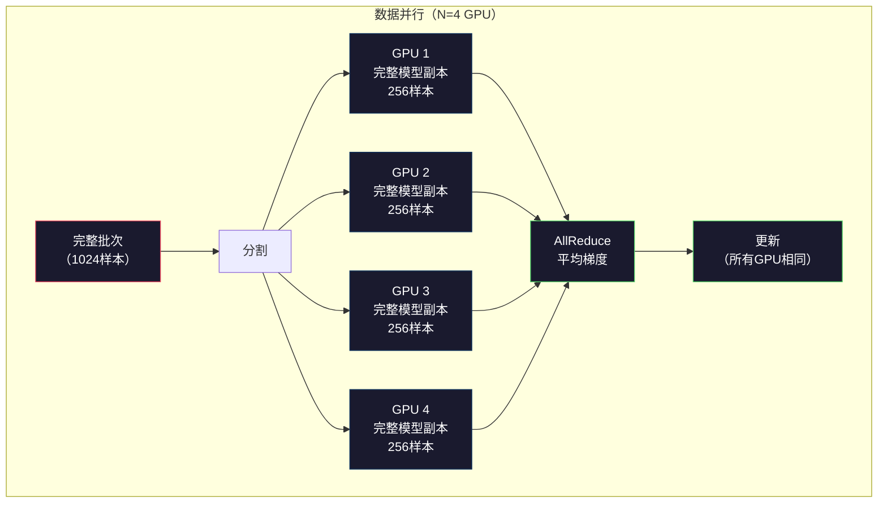
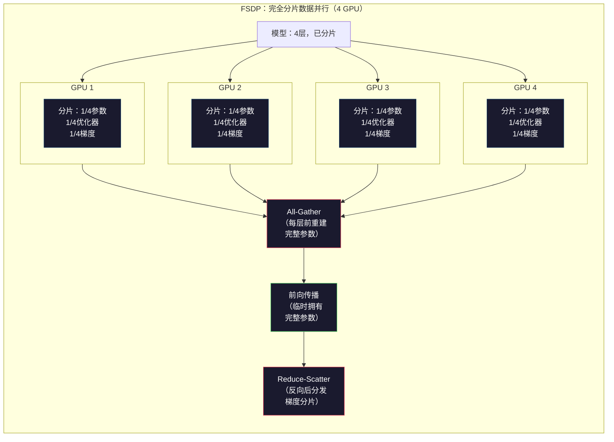
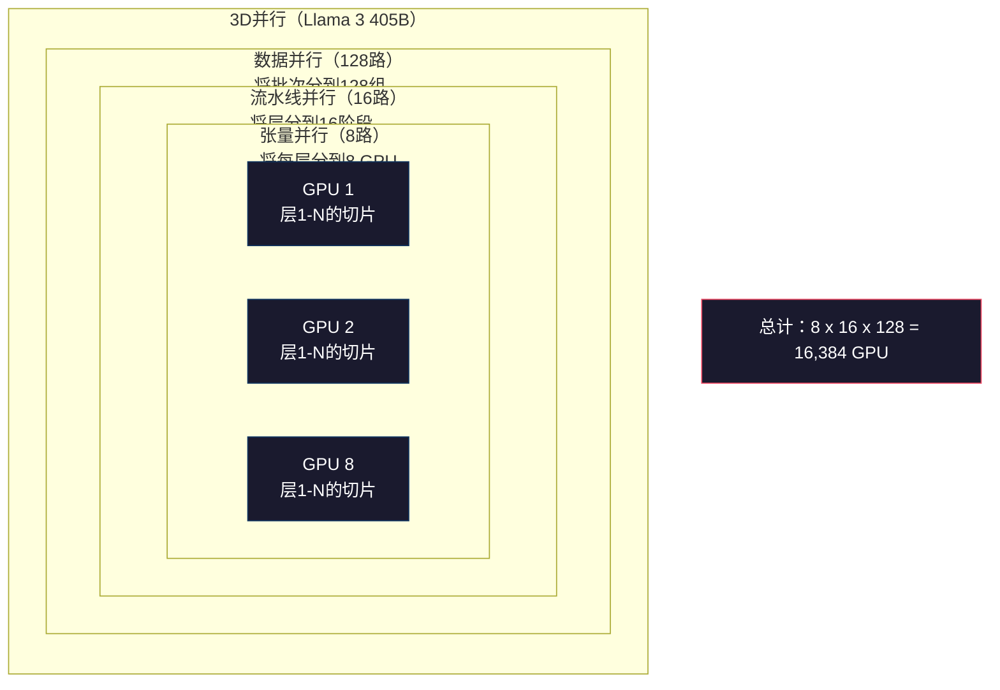

# 缩放：分布式训练、FSDP、DeepSpeed

> 你的124M模型在一张GPU上训练。现在试试70亿个参数。模型装不进内存。数据在单台机器上需要数周。分布式训练在大规模下不是可选项。它是唯一的前进道路。

**类型：** 构建
**语言：** Python
**前置知识：** Phase 10，第04课（预训练一个迷你GPT）
**时间：** ~120分钟

## 学习目标

- 解释三种并行化类型（数据、张量、流水线）以及何时需要每种类型，基于模型和集群大小
- 使用PyTorch DDP实现数据并行训练，跨多个GPU同步梯度
- 计算给定模型大小的内存预算（权重 + 优化器状态 + 梯度 + 激活值），以确定最小硬件需求
- 配置FSDP或DeepSpeed ZeRO阶段以在GPU间分片模型状态，并装下超过单GPU内存的模型

## 问题

一个7B参数的FP16模型仅权重就需要14GB。Adam优化器存储每个参数的额外两个副本（一阶和二阶矩估计）。这又是28GB。反向传播期间的梯度再添加14GB。在存储单个激活值之前，你已经到了56GB。

NVIDIA A100有80GB内存。

80GB中的56GB被消耗。剩下24GB用于激活值——前向传播期间计算的中间值，必须为反向传播保留。对于2048个token序列，4096维模型，单层的激活值使用约64MB。32层需要每个样本2GB。批次大小8需要16GB。你有24GB。批次大小12就会爆炸。

现在试试70B参数。仅权重：FP16下140GB。一张GPU放不下。你至少需要2个A100（2 x 80GB = 160GB）来仅容纳权重。加上优化器状态和梯度，你需要更多：至少3+ GPU，实际上取决于分片策略为8-16个。

Llama 3 405B在16,384张NVIDIA H100 GPU上训练。训练运行估计在计算上花费了1亿美元。DeepSeek V3通过巧妙的架构（混合专家意味着每个token只激活一小部分参数）和训练效率，以大约560万美元训练了可比的模型。

本课程涵盖了使大规模训练成为可能的四种策略：数据并行性、张量并行性、流水线并行性和完全分片数据并行性。你将在纯Python中模拟每种策略，以在接触分布式训练框架之前理解其机制。

## 概念

### 为什么需要分布式

以下是真实模型的内存计算。每个数字都是计算出来的，而非估算的。

| 模型 | 参数 | 权重（FP16）| Adam状态 | 梯度（FP16）| 总计（不含激活值） |
|-------|--------|----------------|-------------|------------------|----------------------|
| GPT-2 Small | 124M | 248 MB | 992 MB | 248 MB | 1.5 GB |
| Llama 3 8B | 8B | 16 GB | 64 GB | 16 GB | 96 GB |
| Llama 3 70B | 70B | 140 GB | 560 GB | 140 GB | 840 GB |
| Llama 3 405B | 405B | 810 GB | 3,240 GB | 810 GB | 4,860 GB |

"Adam状态"列是杀手。Adam为每个参数存储运行均值（m）和运行方差（v），两者都是FP32。对于70B模型，那是70B x 4字节 x 2 = 560GB。仅优化器就需要七个A100。

单张H100有80GB。Llama 3 405B至少需要61张H100来容纳权重、优化器和梯度。加上激活值，数量进一步增长。Meta使用16,384张GPU不是因为他们想要——而是因为他们必须。

### 数据并行性

最简单的分布式策略。将完整模型复制到N张GPU。将每个训练批次分成N等份。每张GPU在其数据分片上运行前向和反向传播。反向传播后，跨所有GPU平均梯度。每张GPU用相同的平均梯度更新其权重复制，保持所有副本同步。

**优点：** 线性吞吐量缩放。N张GPU每步处理N倍的数据。通信仅限于梯度平均，与计算重叠。

**缺点：** 每张GPU持有模型、优化器状态和梯度的完整副本。对于70B模型，每张GPU需要840GB。数据并行性不减少每GPU内存。它只减少训练时间。

**数学：** 有效批次大小 = per_gpu_batch_size x N。对于N=64 GPU，每GPU批次为16，有效批次为1,024。Llama 3使用了每步1600万个token的有效批次大小。



### 张量并行性

将单个层拆分到多张GPU。一个矩阵乘法被分割到多张GPU上，每张计算部分结果。

考虑一个形状为(8192, 8192)的权重矩阵在前馈层中。使用4路张量并行，每张GPU持有一个(8192, 2048)的分片。每张GPU将输入与其分片相乘，产生部分结果。部分结果被组合（通过all-reduce或all-gather）以产生完整输出。

**优点：** 减少每GPU模型权重的内存。一个70B模型分到8张GPU意味着每张GPU持有约8.75B参数的权重。

**优点：** 需要快时性。**缺点：** 每层之后需要快速GPU间通信。每个矩阵乘法后的all-reduce增加延迟。这在同一节点内使用NVLink（GPU间900 GB/s）效果好，但在跨节点通过InfiniBand（400 Gb/s，约50 GB/s）连接时效果差。张量并行几乎总是限制在单个节点内（8 GPU）。

**实际使用：** Megatron-LM开创了张量并行。Llama 3 405B在每个节点内使用8路张量并行。

### 流水线并行性

按层分割模型。GPU 1运行层1-8。GPU 2运行层9-16。GPU 3运行层17-24。GPU 4运行层25-32。数据流过流水线：GPU 1计算其层并将激活值发送给GPU 2，后者计算其层并发送给GPU 3，依此类推。

**优点：** GPU间通信最少——只是层边界处的激活值，相比梯度或权重较小。跨节点工作良好，因为带宽要求低。

**缺点：** 流水线气泡。当GPU 4在微批次1上计算前向传播时，GPU 1、2和3处于空闲状态（它们已经完成了自己的部分）。在反向传播期间，模式反转。使用朴素流水线，对于N个流水线阶段，GPU利用率仅为1/N。

**GPipe和PipeDream**通过将批次分割为微批次来解决气泡问题。GPU 1在前向传播微批次1完成后立即开始微批次2。这使计算在流水线阶段间重叠。使用M个微批次和N个阶段，气泡比例降至(N-1)/M。使用M=16微批次和N=4阶段，气泡为3/16 = 18.75%空闲时间。

### FSDP：完全分片数据并行

FSDP结合了数据并行的可扩展性和分片的内存效率。每张GPU不持有模型的完整副本，而是只持有1/N的参数、梯度和优化器状态。

在某一层的前向传播之前，FSDP运行一个**all-gather**从所有GPU收集完整参数到每张GPU的内存中。前向传播之后，每张GPU丢弃非本地的参数。在反向传播期间，再次运行all-gather以重建参数用于梯度计算。反向传播之后，一个**reduce-scatter**分发梯度分片，使得每张GPU只存储1/N的梯度。

**8张GPU上70B模型的数学计算：**

| 组件 | 无FSDP | 有FSDP |
|-----------|-------------|-----------|
| 权重（FP16） | 每GPU 140 GB | 每GPU 17.5 GB |
| Adam状态（FP32） | 每GPU 560 GB | 每GPU 70 GB |
| 梯度（FP16） | 每GPU 140 GB | 每GPU 17.5 GB |
| **总计** | **每GPU 840 GB** | **每GPU 105 GB** |

没有FSDP，你无法在单张80GB GPU上装下70B模型。使用8张GPU的FSDP，每张GPU使用105GB——等等，这仍然装不下。你至少需要16张GPU才能降到每张80GB以下，或者将FSDP与激活检查点结合（在反向传播期间重新计算激活值，而不是存储它们）。

通信成本高于普通数据并行，因为每层之前有all-gather。但内存节省使以前不可能的训练运行变为可能。



### DeepSpeed ZeRO

DeepSpeed的ZeRO（零冗余优化器）在概念上与FSDP相同，但由微软独立开发。它定义了三个阶段，每个阶段更激进地分片：

| 阶段 | 分片内容 | 内存节省 | 通信 |
|-------|--------|---------------|---------------|
| ZeRO-1 | 仅优化器状态 | ~4倍减少 | 与数据并行相同 |
| ZeRO-2 | + 梯度 | ~8倍减少 | 略多 |
| ZeRO-3 | + 参数 | ~N倍减少（N GPU） | 每层all-gather |

ZeRO-3等同于FSDP。命名不同，机制相同。PyTorch在DeepSpeed证明概念后添加了FSDP作为原生实现。

DeepSpeed还引入了ZeRO-Offload（将优化器状态卸载到CPU RAM，更便宜且更大）和ZeRO-Infinity（卸载到NVMe SSD）。这些以计算速度换取内存容量——卸载的操作更慢但释放了GPU内存。

### 混合精度训练

现代训练同时使用多种浮点格式：

- **前向传播**：FP16或BF16（16位）。内存为FP32的一半。矩阵乘法在张量核心上运行2倍快。
- **主权重**：FP32（32位）。由优化器维护，用于权重更新期间的数值精度。
- **损失缩放**：在反向传播前将损失乘以一个大常数，以防止FP16梯度下溢为零。在优化器步骤前除以相同常数。

BF16（脑浮点16）与FP32具有相同的指数范围（8位指数），但精度降低（7位尾数 vs FP32的23位）。它很少需要损失缩放，因为它能表示相同范围的值。FP16有5位指数和10位尾数——它可以表示细粒度的值，但在极端幅度时会溢出/下溢。

Google的TPU原生使用BF16。NVIDIA的A100和H100同时支持FP16和BF16。业界已基本转向BF16，因为它消除了损失缩放的问题。

**7B模型的内存比较：**

| 精度 | 权重 | 优化器 | 梯度 | 总计 |
|-----------|---------|-----------|-----------|-------|
| 全FP32 | 28 GB | 56 GB | 28 GB | 112 GB |
| 混合（BF16 + FP32主权重） | 14 GB | 56 GB | 14 GB | 84 GB |

混合精度在这个模型上节省了28GB。优化器状态始终保持在FP32——这是大部分内存的去向。

### Megatron-LM与3D并行

真正的大规模训练结合了所有三种并行化：

- **数据并行**跨节点组（缩放批次大小）
- **张量并行**在节点内（将层分到8张GPU）
- **流水线并行**跨节点（将层组分到多台机器）

Llama 3 405B在16,384张H100上：
- 每个节点内8路张量并行（每节点8 GPU）
- 跨节点16路流水线并行（16个流水线阶段）
- 跨剩余维度的128路数据并行（16,384 / 8 / 16 = 128）

这种3D分解（8 x 16 x 128 = 16,384）是你如何扩展到数千张GPU的方式。每张GPU看到不同的数据分片（数据并行）、持有每层的一个切片（张量并行）、计算不同的层集合（流水线并行）。

DeepSeek V3采取了不同的方法。其混合专家架构每个token只激活671B参数中的37B。这意味着每张GPU只需要计算（和存储激活值）活跃参数。他们在2,048张H800 GPU上训练——不到Meta GPU数量的1/8——花费560万美元 vs Meta估计的1亿美元。



```figure
paged-kv-cache
```

## 动手构建

### 第1步：模拟数据并行

在模拟GPU间分割一个批次。每张GPU在其分片上计算前向传播。平均"梯度"（我们将其模拟为损失值）。

```python
import numpy as np

def simulate_data_parallelism(data, num_gpus, model_fn):
    batch_size = len(data)
    shard_size = batch_size // num_gpus
    remainder = batch_size % num_gpus

    gpu_losses = []
    gpu_gradients = []

    offset = 0
    for gpu_id in range(num_gpus):
        extra = 1 if gpu_id < remainder else 0
        shard = data[offset:offset + shard_size + extra]
        offset += shard_size + extra

        loss, grad = model_fn(shard)
        gpu_losses.append(loss)
        gpu_gradients.append(grad)

    avg_loss = np.mean(gpu_losses)
    avg_gradient = np.mean(gpu_gradients, axis=0)

    return avg_loss, avg_gradient
```

All-reduce操作（平均梯度）是数据并行中唯一的通信。在实践中，这使用NVIDIA GPU上的NCCL库，实现环形all-reduce：每张GPU发送1/N的梯度给邻居，从另一个邻居接收1/N，经过N-1步后每张GPU都有完整的平均值。总通信量：2 x gradient_size x (N-1)/N，对大的N接近2倍梯度大小。

### 第2步：模拟张量并行

在GPU间分割一个权重矩阵。每张GPU计算部分矩阵乘法。组合结果。

```python
def simulate_tensor_parallelism(input_data, weight_matrix, num_gpus):
    d_in, d_out = weight_matrix.shape
    assert d_out % num_gpus == 0, f"d_out {d_out} not divisible by num_gpus {num_gpus}"
    shard_size = d_out // num_gpus

    partial_results = []
    for gpu_id in range(num_gpus):
        start = gpu_id * shard_size
        end = start + shard_size
        weight_shard = weight_matrix[:, start:end]

        partial = input_data @ weight_shard
        partial_results.append(partial)

    full_output = np.concatenate(partial_results, axis=-1)

    direct_output = input_data @ weight_matrix
    error = np.abs(full_output - direct_output).max()

    return full_output, error
```

误差应该恰好为零（或机器精度）。张量并行在数学上是精确的——它产生与在一张GPU上计算完整矩阵乘法相同的结果。分割沿输出维度进行，所以每张GPU产生不同的列块，拼接重构完整结果。

对于列并行线性层（分割输出维度），你进行拼接。对于行并行（分割输入维度），你进行求和。在transformer FFN中，第一个线性层（扩展）使用列并行，第二个线性层（收缩）使用行并行。这避免了两个层之间的all-reduce。

### 第3步：模拟流水线并行

将模型的层分割到虚拟GPU上。展示早期阶段在后期阶段计算时空闲的气泡问题。

```python
def simulate_pipeline_parallelism(num_layers, num_stages, num_microbatches):
    layers_per_stage = num_layers // num_stages

    timeline = {}
    clock = 0

    for mb in range(num_microbatches):
        for stage in range(num_stages):
            start_time = max(
                timeline.get((stage, mb - 1, "fwd"), (0, 0))[1] if mb > 0 else 0,
                timeline.get((stage - 1, mb, "fwd"), (0, 0))[1] if stage > 0 else 0,
            )
            end_time = start_time + layers_per_stage
            timeline[(stage, mb, "fwd")] = (start_time, end_time)

    last_fwd_end = max(v[1] for v in timeline.values())

    for mb in range(num_microbatches - 1, -1, -1):
        for stage in range(num_stages - 1, -1, -1):
            deps = [last_fwd_end]
            if mb < num_microbatches - 1 and (stage, mb + 1, "bwd") in timeline:
                deps.append(timeline[(stage, mb + 1, "bwd")][1])
            if stage < num_stages - 1 and (stage + 1, mb, "bwd") in timeline:
                deps.append(timeline[(stage + 1, mb, "bwd")][1])
            start_time = max(deps)
            end_time = start_time + layers_per_stage
            timeline[(stage, mb, "bwd")] = (start_time, end_time)

    total_time = max(v[1] for v in timeline.values())
    compute_time = num_microbatches * num_stages * layers_per_stage * 2
    bubble_fraction = 1.0 - compute_time / (total_time * num_stages)

    return timeline, total_time, bubble_fraction
```

使用4个阶段和1个微批次，气泡比例为75%——四分之三的GPU在任何时刻空闲。使用16个微批次，它下降到约19%。消除气泡的代价是内存：你必须同时存储所有正在进行的微批次的激活值。

### 第4步：内存计算器

计算训练任何模型大小的精确内存需求。

```python
def memory_calculator(
    params_billions,
    precision_bytes=2,
    optimizer="adam",
    num_gpus=1,
    sharding="none",
    sequence_length=2048,
    batch_size_per_gpu=1,
    hidden_dim=None,
    num_layers=None,
):
    params = params_billions * 1e9

    weight_memory = params * precision_bytes

    if optimizer == "adam":
        optimizer_memory = params * 4 * 2
    elif optimizer == "sgd":
        optimizer_memory = params * 4
    else:
        optimizer_memory = 0

    gradient_memory = params * precision_bytes

    total_no_activation = weight_memory + optimizer_memory + gradient_memory

    if hidden_dim and num_layers:
        activation_per_layer = (
            sequence_length * batch_size_per_gpu * hidden_dim * precision_bytes * 4
        )
        activation_memory = activation_per_layer * num_layers
    else:
        activation_memory = params * precision_bytes * 0.5

    if sharding == "fsdp" or sharding == "zero3":
        weight_memory /= num_gpus
        optimizer_memory /= num_gpus
        gradient_memory /= num_gpus
    elif sharding == "zero2":
        optimizer_memory /= num_gpus
        gradient_memory /= num_gpus
    elif sharding == "zero1":
        optimizer_memory /= num_gpus

    per_gpu_total = weight_memory + optimizer_memory + gradient_memory + activation_memory

    return {
        "params_billions": params_billions,
        "weights_gb": weight_memory / 1e9,
        "optimizer_gb": optimizer_memory / 1e9,
        "gradients_gb": gradient_memory / 1e9,
        "activations_gb": activation_memory / 1e9,
        "per_gpu_total_gb": per_gpu_total / 1e9,
        "total_across_gpus_gb": per_gpu_total * num_gpus / 1e9,
        "fits_on_80gb": per_gpu_total / 1e9 <= 80,
        "num_gpus": num_gpus,
        "sharding": sharding,
    }
```

这个计算器回答了每个机器学习工程师都会问的问题："我需要多少张GPU？"输入模型大小，看看是否装得下。调整分片策略，直到每GPU总内存降到80GB以下。

### 第5步：混合精度模拟

比较FP32、FP16和混合精度训练之间的内存使用。

```python
def mixed_precision_comparison(params_billions):
    params = params_billions * 1e9

    fp32_weights = params * 4
    fp32_optimizer = params * 4 * 2
    fp32_gradients = params * 4
    fp32_total = fp32_weights + fp32_optimizer + fp32_gradients

    fp16_weights = params * 2
    fp16_master = params * 4
    fp16_optimizer = params * 4 * 2
    fp16_gradients = params * 2
    fp16_total = fp16_weights + fp16_master + fp16_optimizer + fp16_gradients

    mixed_weights = params * 2
    mixed_optimizer = params * 4 * 2
    mixed_gradients = params * 2
    mixed_total = mixed_weights + mixed_optimizer + mixed_gradients

    return {
        "fp32_total_gb": fp32_total / 1e9,
        "fp16_with_master_gb": fp16_total / 1e9,
        "mixed_bf16_gb": mixed_total / 1e9,
        "savings_vs_fp32": 1 - mixed_total / fp32_total,
    }
```

对大多数人来说最大的惊喜：混合精度并不会将内存减半。优化器状态（Adam的m和v）不管精度如何都保持在FP32。对于7B模型，FP32训练使用112GB。混合精度使用84GB。那是25%的减少，不是50%。优化器占主导地位。

## 应用

### 运行所有模拟

```python
def run_all_demos():
    print("=" * 70)
    print("数据并行模拟")
    print("=" * 70)

    np.random.seed(42)
    data = np.random.randn(64, 32)
    weight = np.random.randn(32, 16)

    def model_fn(batch):
        output = batch @ weight
        loss = np.mean(output ** 2)
        grad = 2 * batch.T @ (batch @ weight) / len(batch)
        return loss, grad

    for n_gpus in [1, 2, 4, 8]:
        loss, grad = simulate_data_parallelism(data, n_gpus, model_fn)
        print(f"  {n_gpus} GPUs: loss={loss:.4f}, grad_norm={np.linalg.norm(grad):.4f}")

    print()
    print("=" * 70)
    print("张量并行模拟")
    print("=" * 70)

    x = np.random.randn(4, 8192)
    W = np.random.randn(8192, 8192)

    for n_gpus in [1, 2, 4, 8]:
        output, error = simulate_tensor_parallelism(x, W, n_gpus)
        print(f"  {n_gpus} GPUs: output_shape={output.shape}, max_error={error:.2e}")

    print()
    print("=" * 70)
    print("流水线并行模拟")
    print("=" * 70)

    for n_mb in [1, 4, 8, 16, 32]:
        _, total_t, bubble = simulate_pipeline_parallelism(32, 4, n_mb)
        print(f"  {n_mb:2d} micro-batches: total_time={total_t:4d}, bubble={bubble:.1%}")

    print()
    print("=" * 70)
    print("内存计算器")
    print("=" * 70)

    configs = [
        (7, "none", 1),
        (7, "fsdp", 8),
        (70, "none", 1),
        (70, "fsdp", 8),
        (70, "fsdp", 16),
        (405, "fsdp", 64),
        (405, "fsdp", 128),
    ]

    print(f"  {'Model':>8} {'Sharding':>8} {'GPUs':>5} {'Per-GPU':>10} {'Fits 80GB':>10}")
    print("  " + "-" * 50)
    for params, shard, gpus in configs:
        result = memory_calculator(params, num_gpus=gpus, sharding=shard)
        fits = "Yes" if result["fits_on_80gb"] else "No"
        print(f"  {params:>6}B {shard:>8} {gpus:>5} {result['per_gpu_total_gb']:>8.1f}GB {fits:>10}")

    print()
    print("=" * 70)
    print("混合精度比较")
    print("=" * 70)

    for params_b in [7, 13, 70, 405]:
        result = mixed_precision_comparison(params_b)
        print(f"  {params_b}B: FP32={result['fp32_total_gb']:.0f}GB, "
              f"Mixed BF16={result['mixed_bf16_gb']:.0f}GB, "
              f"Savings={result['savings_vs_fp32']:.0%}")
```

## 交付

本课程产出 `outputs/prompt-distributed-training-planner.md`——一个提示，输入模型大小和可用硬件，输出完整的分布式训练计划：并行策略、内存预算、通信开销和预期吞吐量。

## 练习

1. 修改内存计算器以包含激活检查点。使用检查点时，只在每第K层存储激活值（典型K=1，表示全部重新计算）。展示内存-计算权衡：检查点节省多少内存，它使训练变慢多少（完全检查点大约增加33%计算量）？

2. 扩展流水线并行模拟，实现PipeDream使用的1F1B（一前向一反向）调度。比较4个阶段和8个微批次下的气泡比例与朴素调度。1F1B调度应该具有更小的峰值内存，因为它更早开始反向传播。

3. 实现一个梯度累积模拟器。不在每个微批次后all-reduce，而是本地累积梯度K步，然后all-reduce。展示这如何减少K倍的通信量，但产生相同的最终梯度（因此训练相同）。

4. 构建一个成本估算器。给定模型大小、目标token数、GPU类型（A100每小时2美元、H100每小时3.50美元）和并行策略，估算总训练成本（美元）。对照已知成本验证：Llama 3 405B据报约1亿美元，DeepSeek V3约560万美元。

5. 向内存计算器添加ZeRO-Offload。假设每节点CPU RAM为512GB、NVMe为2TB。展示将优化器状态卸载到CPU如何允许70B模型在4张GPU上训练而不是16张，代价是优化器步骤慢30-50%。

## 关键术语

| 术语 | 人们说的 | 实际含义 |
|------|----------------|----------------------|
| 数据并行 | "将模型复制到每张GPU" | 每张GPU处理不同的数据分片；每步后通过all-reduce平均梯度 |
| 张量并行 | "将一层分到多张GPU" | 分割权重矩阵，使每张GPU计算部分矩阵乘法；需要快速NVLink互连 |
| 流水线并行 | "将层分到多张GPU" | 每张GPU运行不同的层组；数据流过流水线，使用微批次减少气泡 |
| FSDP | "分片一切" | 完全分片数据并行——每张GPU持有1/N的权重、梯度和优化器状态；计算前all-gather |
| ZeRO | "DeepSpeed版的FSDP" | 零冗余优化器，3个阶段：分片优化器（阶段1）、+梯度（阶段2）、+参数（阶段3） |
| All-reduce | "跨GPU平均" | 集体操作，每张GPU最终得到所有GPU输入的和（或平均值）——通常实现为环形all-reduce |
| All-gather | "从所有GPU收集" | 集体操作，每张GPU最终得到所有GPU数据的拼接——FSDP中用于重建完整参数 |
| Reduce-scatter | "求和并分发" | 集体操作，归约（求和）数据并将不同块分散到不同GPU——FSDP中用于梯度分片 |
| 混合精度 | "以半精度训练" | 前向/反向使用FP16/BF16，优化器状态使用FP32——节省约25%内存，而非50%，因为优化器占主导 |
| 流水线气泡 | "流水线中的空闲时间" | GPU等待上一阶段数据时空闲的时间比例——通过使用更多微批次减少 |

## 延伸阅读

- [Rajbhandari等人，2020年——"ZeRO：迈向训练万亿参数模型的内存优化"](https://arxiv.org/abs/1910.02054) — 定义三个分片阶段的DeepSpeed ZeRO论文
- [Shoeybi等人，2020年——"Megatron-LM：使用模型并行训练数十亿参数语言模型"](https://arxiv.org/abs/1909.08053) — NVIDIA的transformer张量并行
- [Narayanan等人，2021年——"在GPU集群上使用Megatron-LM高效训练大规模语言模型"](https://arxiv.org/abs/2104.04473) — 组合数据、张量和流水线的3D并行
- [Zhao等人，2023年——"PyTorch FSDP：扩展完全分片数据并行的经验"](https://arxiv.org/abs/2304.11277) — PyTorch的原生FSDP实现
- [Llama 3技术报告](https://arxiv.org/abs/2407.21783) — 16,384 GPU训练及3D并行细节
- [DeepSeek-V3技术报告](https://arxiv.org/abs/2412.19437) — MoE架构如何将训练成本降低一个数量级
