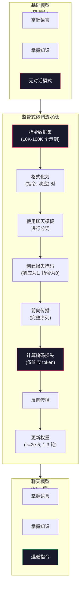

# 指令微调 (SFT)

> 基础模型只做一件事：预测下一个 token。它不会遵循指令、回答问题或拒绝有害请求。SFT 是将 token 预测器转变为有用助手的桥梁。你使用过的每一个模型——Claude、GPT、Llama Chat——都经历过这个步骤。

**类型：** 构建
**语言：** Python (使用 numpy)
**前置知识：** 阶段10，第04课（预训练迷你GPT）
**时间：** ~90分钟

## 学习目标

- 实现监督式微调（SFT），将基础语言模型转换为能遵循指令的助手
- 使用包含系统、用户和助手角色的聊天模板格式化训练数据，并对非助手 token 进行损失掩码
- 解释为什么需要SFT：基础模型是延续文本而不是回答问题
- 通过在保留的指令集上比较基础模型与微调模型的响应来评估SFT质量

## 问题

你在第04课训练了一个模型。它可以根据给定的序列预测下一个 token。输入"Transformer 架构"，它可能会继续输出"彻底改变了自然语言处理。"这对于一个 next-token 预测器来说已经很了不起了。

现在试试这个：输入"法国的首都是什么？"基础模型不会回答"巴黎"。它会延续模式。它可能会输出"德国的首都是什么？西班牙的首都是什么？"因为它从包含问题列表的文档中学习过。或者它可能会输出"是一个很多人都会问的问题"，因为这是一个合理的 next-token 延续。模型没有*回答*的概念。它只知道*延续*。

这就是 GPT-3（基础模型，2020年6月发布）和 ChatGPT（指令微调，2022年11月发布）之间的差距。相同的架构。相同的预训练。区别在于20,000到100,000个精心制作的（指令，响应）配对，教会了模型遵循对话模式。

斯坦福 Alpaca 证明了你不需要数百万个示例。2023年3月，他们在仅52,000个由 GPT-3.5 生成的指令-响应配对上微调了 Llama 7B。总成本：600美元。结果是一个能够遵循指令、回答问题和进行对话的聊天机器人。虽然没有 ChatGPT 那么好，但对于600美元和几小时的训练来说，已经惊人地接近了。

Meta 的 Llama 2 Chat 在其初始 SFT 阶段只使用了约27,000个高质量示例。关键洞察：质量比数量更重要。由熟练标注员编写的27,000个示例胜过从互联网抓取的100万个嘈杂示例。

## 概念

### SFT 实际做了什么

监督式微调延续了与预训练相同的训练循环——前向传播、计算损失、反向传播、更新权重——但使用不同类型的数据。不再是原始文本，而是在结构化对话上训练：

```json
{
  "system": "你是一个有用的助手。",
  "user": "法国的首都是什么？",
  "assistant": "法国的首都是巴黎。"
}
```

模型已经知道巴黎是法国的首都。它在预训练期间从维基百科、教科书和网页上学到了这一点。SFT 并没有教模型新的事实。它教模型一种新的*行为*：当你看到一个问题时，产生一个答案。当你看到一条指令时，产生一个完成。当你看到有害请求时，产生拒绝。

可以这样理解。预训练赋予模型知识。SFT 赋予模型礼仪。

### 数据格式

业界主导三种格式。每种都使用不同的分隔符编码相同的信息——谁说了什么。

**Alpaca 格式**（斯坦福，2023年3月）：

```json
{
  "instruction": "用三句话总结以下文章。",
  "input": "欧洲央行提高了利率...",
  "output": "欧洲央行将利率上调了25个基点..."
}
```

简单且广泛使用。`input` 字段是可选的——许多指令不需要额外的上下文。斯坦福发布了52,000个这种格式的示例，由 GPT-3.5 生成，花费600美元。这开启了开源指令微调运动。

**ShareGPT 格式**（社区，2023年）：

```json
{
  "conversations": [
    {"from": "system", "value": "你是一个有用的助手。"},
    {"from": "human", "value": "潮汐是什么引起的？"},
    {"from": "gpt", "value": "潮汐是由月球的引力引起的..."},
    {"from": "human", "value": "它们多久发生一次？"},
    {"from": "gpt", "value": "大多数沿海地区每天经历两次高潮和两次低潮..."}
  ]
}
```

支持多轮对话。"from"字段按惯例使用"human"和"gpt"，无论实际模型是什么。Vicuna 在70,000个从用户共享的 ChatGPT 转录中抓取的 ShareGPT 对话上训练。

**ChatML 格式**（OpenAI，被许多开源模型使用）：

```
<|im_start|>system
你是一个有用的助手。<|im_end|>
<|im_start|>user
法国的首都是什么？<|im_end|>
<|im_start|>assistant
法国的首都是巴黎。<|im_end|>
```

使用特殊token（`<|im_start|>`、`<|im_end|>`）来分隔角色。这些token在微调期间被添加到分词器的词汇表中。Qwen、Yi 和许多其他模型使用 ChatML。

所有三种格式实现相同的事情：它们告诉模型"这是指令，这是响应，学习这个模式。"

### 为什么有效

模型已经从预训练中掌握了语言。它已经见过数十亿个问答对、指令与完成对以及人际对话的例子。这些模式已经编码在权重中。

SFT 集中了这种潜在能力。模型不再需要根据上下文来判断是应该回答问题还是延续文档，SFT 直接在对话模式上训练。经过几千个示例后，模型学会了：当你看到助手角色标记时，生成有用的响应。

这就是为什么27,000个示例就足够了。你不是在教模型英语。你不是在教它关于世界的事实。你在教它一个简单的行为：响应指令。知识已经在那里了。

### 掩码损失

这是SFT中最重要的技术细节，大多数教程都跳过了它。

在预训练期间，你在每个 token 上计算损失。模型学会预测序列中的每个下一个 token。在SFT期间，你只在*响应* token 上计算损失。指令 token 用于提供上下文，但模型不会因为"预测"它们不正确而受到惩罚。

为什么？因为你不希望模型学会*生成*指令。你希望它学会*响应*指令。如果你在指令 token 上计算损失，你就是在训练模型预测"法国的首都是什么？"好像它是提问者一样。这会浪费梯度信号，并可能混淆模型关于其角色的认知。

在实践中，你创建一个损失掩码：响应 token 为1，指令 token 为0。在平均之前，将每个 token 的损失乘以这个掩码。

```
Tokens:    [SYS] You are helpful [USER] What is the capital? [ASST] Paris is the capital [EOS]
Loss mask:   0    0    0     0      0     0   0  0     0       1     1    1   1     1      1
```

只有 `[ASST]` 之后的 token 对损失有贡献。模型在前向传播期间看到完整的对话（它需要指令来产生正确的响应），但只根据它对响应的预测来更新权重。

### 训练超参数

SFT 使用与预训练截然不同的超参数。你不是从头开始训练。你在调整一个已经工作的模型。

| 参数 | 预训练 (Llama 2 7B) | SFT (Llama 2 Chat) |
|-----------|---------------------------|---------------------|
| 学习率 | 3e-4 (峰值) | 2e-5 |
| 轮数 | 1 (单次遍历数据) | 2 |
| 批量大小 | 4M tokens | 64 个示例 |
| 预热步数 | 2,000 | 0-100 |
| 权重衰减 | 0.1 | 0.0-0.1 |
| 数据量 | 2T tokens | 27,000 个示例 |

SFT 的学习率低15倍。这至关重要。微调期间的高学习率会破坏预训练的知识。模型"忘记"了所学内容，并过拟合到小的微调数据集。这就是灾难性遗忘。

两个轮次意味着模型看到每个训练示例两次。在小数据集上超过3个轮次会导致记忆化——模型开始逐字复现训练示例，而不是泛化。

### 灾难性遗忘

微调会破坏通用能力。在指令遵循数据上训练太久，模型会失去编写代码、做数学或生成创意文本的能力。它变得非常擅长其训练数据的特定格式，但在其他方面表现糟糕。

三种缓解方法：

1. **低学习率。** 1e-5 到 5e-5。更小的更新意味着更少的预训练特征被破坏。

2. **短训练。** 1-3 轮。在模型过拟合之前停止。

3. **混合预训练数据。** Llama 2 Chat 将一小部分（2-5%）原始预训练数据混入 SFT 数据集。这"提醒"模型其通用能力，同时学习新的指令遵循行为。

### 实际数字

在单个 NVIDIA A100 80GB GPU 上，对7B模型在10,000个高质量指令对上进行微调大约需要1小时。计算如下：

- 10,000 个示例 x 平均512 tokens = 5.12M tokens
- 2 轮 = 10.24M tokens 总计
- A100 对7B模型微调的吞吐量：~3,000 tokens/秒
- 10.24M / 3,000 = ~3,400 秒 = ~57 分钟

对于我们的迷你 GPT（4层，128维），训练几乎是即时的。重点在于理解机制，而不是规模。



## 构建

### 步骤 1：指令数据集

创建一个合成指令数据集。在生产中，Scale AI 和 Anthropic 等公司雇佣人类标注员来编写这些数据。我们通过编程方式创建它们来演示格式。

```python
import numpy as np

INSTRUCTION_DATA = [
    {
        "instruction": "法国的首都是什么？",
        "response": "法国的首都是巴黎。"
    },
    {
        "instruction": "用一句话解释重力。",
        "response": "重力是吸引有质量物体相互靠近的力。"
    },
    {
        "instruction": "写一首关于海洋的俳句。",
        "response": "海浪拍打岸边，阳光下盐沫飞舞，无尽的蓝色。"
    },
    {
        "instruction": "15 乘以 7 等于多少？",
        "response": "15 乘以 7 等于 105。"
    },
    {
        "instruction": "说出三种编程语言。",
        "response": "三种编程语言是 Python、Rust 和 TypeScript。"
    },
    {
        "instruction": "总结光合作用。",
        "response": "光合作用将阳光、水和二氧化碳转化为葡萄糖和氧气。"
    },
    {
        "instruction": "第二次世界大战在哪一年结束？",
        "response": "第二次世界大战于1945年结束。"
    },
    {
        "instruction": "定义机器学习。",
        "response": "机器学习是一个让算法从数据中学习模式以进行预测的领域。"
    },
]
```

八个示例非常少。斯坦福 Alpaca 使用了52,000个。但无论你有8个还是52,000个，机制都是相同的：分词、掩码、仅计算响应的损失。

### 步骤 2：使用聊天模板分词

将指令-响应对转换为带有特殊角色标记的 token 序列。这些标记告诉模型指令在哪里结束、响应在哪里开始。

```python
SPECIAL_TOKENS = {
    "INST_START": 253,
    "INST_END": 254,
    "RESP_START": 255,
}


def tokenize_instruction_pair(instruction, response, vocab_size=256):
    inst_tokens = list(instruction.encode("utf-8"))
    resp_tokens = list(response.encode("utf-8"))

    inst_tokens = [min(t, vocab_size - 4) for t in inst_tokens]
    resp_tokens = [min(t, vocab_size - 4) for t in resp_tokens]

    tokens = (
        [SPECIAL_TOKENS["INST_START"]]
        + inst_tokens
        + [SPECIAL_TOKENS["INST_END"]]
        + [SPECIAL_TOKENS["RESP_START"]]
        + resp_tokens
    )

    return tokens


def create_loss_mask(tokens):
    mask = np.zeros(len(tokens), dtype=np.float32)
    in_response = False

    for i, token in enumerate(tokens):
        if token == SPECIAL_TOKENS["RESP_START"]:
            in_response = True
            continue
        if in_response:
            mask[i] = 1.0

    return mask
```

损失掩码对指令 token 全为零，对响应 token 全为一。`RESP_START` token 本身被标记为0，因为它是分隔符，不是响应内容的一部分。

### 步骤 3：掩码交叉熵损失

标准交叉熵，但乘以损失掩码。只有响应 token 对梯度有贡献。

```python
def masked_cross_entropy_loss(logits, targets, loss_mask):
    batch, seq_len, vocab_size = logits.shape
    logits_flat = logits.reshape(-1, vocab_size)
    targets_flat = targets.reshape(-1)
    mask_flat = loss_mask.reshape(-1)

    max_logits = logits_flat.max(axis=-1, keepdims=True)
    log_softmax = logits_flat - max_logits - np.log(
        np.exp(logits_flat - max_logits).sum(axis=-1, keepdims=True)
    )

    per_token_loss = -log_softmax[np.arange(len(targets_flat)), targets_flat]

    masked_loss = per_token_loss * mask_flat
    num_response_tokens = mask_flat.sum()
    if num_response_tokens == 0:
        return 0.0
    loss = masked_loss.sum() / num_response_tokens

    return loss
```

分母是 `num_response_tokens`，而不是 `seq_len`。如果除以总序列长度，较长的指令会稀释梯度信号。除以响应 token 计数确保无论指令长度如何，每个响应 token 获得相同的权重。

### 步骤 4：SFT 训练循环

复用第04课的 MiniGPT。训练循环看起来与预训练几乎相同，但加入了指令格式化和掩码损失。

```python
import sys
import os
sys.path.insert(0, os.path.join(os.path.dirname(__file__), "..", "..", "04-pre-training-mini-gpt", "code"))
from main import MiniGPT, LayerNorm, FeedForward, MultiHeadAttention, TransformerBlock, Embedding


def sft_train(model, dataset, num_epochs=2, lr=2e-5, seq_len=64):
    formatted_data = []
    for example in dataset:
        tokens = tokenize_instruction_pair(example["instruction"], example["response"])
        mask = create_loss_mask(tokens)
        formatted_data.append((tokens, mask))

    print(f"SFT 训练: {len(formatted_data)} 个示例, {num_epochs} 轮, lr={lr}")
    print(f"总 token 数: {sum(len(t) for t, _ in formatted_data):,}")
    print()

    losses = []

    for epoch in range(num_epochs):
        epoch_loss = 0.0
        num_batches = 0

        indices = np.random.permutation(len(formatted_data))

        for idx in indices:
            tokens, mask = formatted_data[idx]

            if len(tokens) < 3:
                continue
            if len(tokens) > seq_len:
                tokens = tokens[:seq_len]
                mask = mask[:seq_len]

            input_ids = np.array(tokens[:-1]).reshape(1, -1)
            target_ids = np.array(tokens[1:]).reshape(1, -1)
            loss_mask = np.array(mask[1:]).reshape(1, -1)

            logits = model.forward(input_ids)
            loss = masked_cross_entropy_loss(logits, target_ids, loss_mask)

            batch_size, s_len, v_size = logits.shape
            probs = np.exp(logits - logits.max(axis=-1, keepdims=True))
            probs = probs / probs.sum(axis=-1, keepdims=True)
            dlogits = probs.copy()
            dlogits[np.arange(batch_size)[:, None], np.arange(s_len), target_ids] -= 1.0

            mask_expanded = loss_mask[:, :, np.newaxis]
            num_resp = loss_mask.sum()
            if num_resp > 0:
                dlogits = dlogits * mask_expanded / num_resp

            for block in model.blocks:
                block.ffn.W1 -= lr * np.random.randn(*block.ffn.W1.shape) * 0.01
                block.ffn.W2 -= lr * np.random.randn(*block.ffn.W2.shape) * 0.01
                block.ffn.b1 -= lr * np.random.randn(*block.ffn.b1.shape) * 0.01
                block.ffn.b2 -= lr * np.random.randn(*block.ffn.b2.shape) * 0.01

            epoch_loss += loss
            num_batches += 1
            losses.append(loss)

        avg_loss = epoch_loss / max(num_batches, 1)
        print(f"轮次 {epoch + 1}/{num_epochs} | 平均损失: {avg_loss:.4f}")

    return model, losses
```

学习率为 2e-5，与 Llama 2 Chat 一致。与预训练中使用的 3e-4 相比——小了15倍。梯度被掩码：指令 token 产生零梯度。只有响应 token 推动权重更新。

### 步骤 5：比较基础模型与 SFT 模型

SFT 的全部意义在于行为改变。让我们通过检查模型如何响应指令格式输入与原始文本来衡量这一点。

```python
def generate_response(model, prompt_tokens, max_new_tokens=50, temperature=0.8):
    tokens = list(prompt_tokens)
    seq_len = model.embedding.pos_embed.shape[0]

    for _ in range(max_new_tokens):
        context = np.array(tokens[-seq_len:]).reshape(1, -1)
        logits = model.forward(context)
        next_logits = logits[0, -1, :]

        next_logits = next_logits / max(temperature, 1e-8)
        probs = np.exp(next_logits - next_logits.max())
        probs = probs / probs.sum()
        probs = np.clip(probs, 1e-10, 1.0)
        probs = probs / probs.sum()

        next_token = np.random.choice(len(probs), p=probs)
        tokens.append(int(next_token))

    return tokens


def evaluate_instruction_following(model, instructions):
    print("评估指令遵循能力:")
    print("-" * 50)

    for instruction in instructions:
        tokens = (
            [SPECIAL_TOKENS["INST_START"]]
            + [min(t, 252) for t in list(instruction.encode("utf-8"))]
            + [SPECIAL_TOKENS["INST_END"]]
            + [SPECIAL_TOKENS["RESP_START"]]
        )

        output = generate_response(model, tokens, max_new_tokens=30, temperature=0.6)
        response_start = len(tokens)
        response_tokens = output[response_start:]
        response_bytes = bytes([t for t in response_tokens if t < 128])
        response_text = response_bytes.decode("utf-8", errors="replace")

        print(f"  Q: {instruction}")
        print(f"  A: {response_text[:80]}")
        print()
```

在只有8个示例的小模型上，响应不会有意义。这是意料之中的。重要的是*结构*：模型学会在响应标记后产生输出，而不是继续生成更多指令。

### 步骤 6：衡量灾难性遗忘

比较模型在SFT前后对 next-token 的预测能力。如果SFT损害了通用能力，原始文本上的损失会增加。

```python
def measure_forgetting(model, test_text, seq_len=64):
    tokens = np.array(list(test_text.encode("utf-8")[:512]))

    total_loss = 0.0
    num_windows = 0

    for start in range(0, len(tokens) - seq_len - 1, seq_len):
        input_ids = tokens[start:start + seq_len].reshape(1, -1)
        target_ids = tokens[start + 1:start + seq_len + 1].reshape(1, -1)

        logits = model.forward(input_ids)

        batch, s_len, vocab_size = logits.shape
        logits_flat = logits.reshape(-1, vocab_size)
        targets_flat = target_ids.reshape(-1)

        max_logits = logits_flat.max(axis=-1, keepdims=True)
        log_softmax = logits_flat - max_logits - np.log(
            np.exp(logits_flat - max_logits).sum(axis=-1, keepdims=True)
        )

        loss = -log_softmax[np.arange(len(targets_flat)), targets_flat].mean()
        total_loss += loss
        num_windows += 1

    return total_loss / max(num_windows, 1)
```

在实际微调中，你会在整个训练过程中跟踪这个指标。如果原始文本损失增加超过10-15%，说明你的SFT过于激进。降低学习率或减少轮次。

## 使用

### 完整 SFT 流水线演示

```python
if __name__ == "__main__":
    np.random.seed(42)

    test_text = """The transformer architecture processes sequences through self-attention.
Each layer applies multi-head attention followed by a feedforward network.
Residual connections and layer normalization stabilize deep networks.
The model learns to predict the next token given all previous tokens."""

    print("=" * 70)
    print("指令微调 (SFT) 演示")
    print("=" * 70)
    print()

    model = MiniGPT(
        vocab_size=256, embed_dim=128, num_heads=4,
        num_layers=4, max_seq_len=128, ff_dim=512
    )
    print(f"模型: {model.count_parameters():,} 参数")
    print(f"配置: 4层, 4头, 128维 (来自第04课的迷你 GPT)")
    print()

    print("SFT前: 测量基础模型在原始文本上的损失")
    base_loss = measure_forgetting(model, test_text)
    print(f"  基础模型损失: {base_loss:.4f}")
    print()

    print("=" * 70)
    print("SFT 训练")
    print("=" * 70)

    model, losses = sft_train(
        model, INSTRUCTION_DATA, num_epochs=3, lr=2e-5, seq_len=128
    )

    print()
    print("SFT后: 测量微调模型在原始文本上的损失")
    sft_loss = measure_forgetting(model, test_text)
    print(f"  SFT 模型损失: {sft_loss:.4f}")
    print(f"  变化: {((sft_loss - base_loss) / base_loss * 100):+.1f}%")
    if abs(sft_loss - base_loss) / base_loss < 0.15:
        print("  轻微遗忘 (< 15% 变化)")
    else:
        print("  检测到显著遗忘")
    print()

    print("=" * 70)
    print("指令遵循评估")
    print("=" * 70)
    print()

    test_instructions = [
        "法国的首都是什么？",
        "说出一种编程语言。",
        "定义重力。",
    ]
    evaluate_instruction_following(model, test_instructions)

    print("=" * 70)
    print("数据格式示例")
    print("=" * 70)
    print()

    for i, example in enumerate(INSTRUCTION_DATA[:3]):
        tokens = tokenize_instruction_pair(example["instruction"], example["response"])
        mask = create_loss_mask(tokens)
        resp_count = int(mask.sum())
        total_count = len(tokens)
        print(f"  示例 {i + 1}: {total_count} 个 token, {resp_count} 个响应 token ({resp_count/total_count:.0%} 的序列)")
        print(f"    指令: {example['instruction']}")
        print(f"    响应: {example['response']}")
        print()

    print("=" * 70)
    print("训练损失曲线")
    print("=" * 70)
    print()

    if losses:
        window = max(1, len(losses) // 5)
        for i in range(0, len(losses), window):
            chunk = losses[i:i + window]
            avg = sum(chunk) / len(chunk)
            print(f"  步骤 {i:3d}-{i + len(chunk) - 1:3d}: 平均损失 = {avg:.4f}")
```

## 交付

本课程产出 `outputs/prompt-sft-data-curator.md` —— 一个帮助你设计和策划 SFT 指令数据集的提示词。给定一个目标能力（代码生成、数学、对话），它会生成一份包含格式规范、质量标准和多样性要求的数据收集计划。

## 练习

1. 添加系统提示支持。修改 `tokenize_instruction_pair` 以接受系统消息并在指令前添加。创建5个具有不同系统提示（"你是一个诗人"、"你是一个数学导师"）的示例，并验证模型在训练中看到了不同的系统提示。

2. 实现数据混合。创建一个函数，接受一个 SFT 数据集和一个原始文本语料库，然后生成训练批次，其中5%的示例是原始文本（无掩码），95%是指令对（有掩码）。运行3轮，并将遗忘指标与纯 SFT 训练进行比较。

3. 构建数据质量评分器。对于每个指令-响应对，计算：（a）响应长度（以 token 为单位），（b）指令与响应比率，（c）词汇多样性（唯一 token / 总 token）。过滤掉响应长度 < 10 tokens 或多样性 < 0.3 的示例。显示过滤如何影响最终损失。

4. 实现多轮对话训练。扩展分词以处理3轮对话（用户-助手-用户-助手-用户-助手）。损失掩码应覆盖所有三个助手的轮次。通过打印一个示例的 token-掩码对齐来验证掩码是否正确。

5. 比较学习率。用 lr=1e-4、lr=2e-5 和 lr=1e-6 分别训练同一个模型三次。绘制损失曲线。1e-4 的运行应显示快速初始下降但最终损失更高（过拟合）。1e-6 的运行应几乎不动。2e-5 的运行应是最佳点。

## 关键术语

| 术语 | 通常的说法 | 实际含义 |
|------|----------------|----------------------|
| SFT | "对话微调" | 监督式微调：在（指令，响应）对上继续训练，损失仅计算在响应 token 上 |
| 指令微调 | "教模型遵循指令" | 在明确的指令-响应对上训练，使基础模型学习对话模式，而非新知识 |
| 损失掩码 | "忽略提示" | 将指令 token 的损失设为零，使梯度只来自响应 token 的预测 |
| ChatML | "聊天标记语言" | 一种使用 `<\|im_start\|>` 和 `<\|im_end\|>` 分隔符来标记对话中说话者角色的 token 格式 |
| Alpaca 格式 | "斯坦福的格式" | 一种包含 instruction/input/output 字段的 JSON 格式，用于52K个花费600美元的 GPT-3.5 生成的示例 |
| 灾难性遗忘 | "模型变笨了" | 微调会破坏预训练能力，因为梯度更新会用任务特定模式覆盖通用知识 |
| 权重绑定 | "共享嵌入" | 使用相同的矩阵进行输入 token 嵌入和输出预测头，节省参数并提高一致性 |
| 聊天模板 | "如何格式化提示" | 构造对话的特定 token 序列（角色标记、分隔符） |

## 延伸阅读

- [Ouyang et al., 2022 -- "Training language models to follow instructions with human feedback" (InstructGPT)](https://arxiv.org/abs/2203.02155) —— 在 OpenAI 引入指令微调 + RLHF 的论文
- [Taori et al., 2023 -- "Stanford Alpaca: An Instruction-following LLaMA Model"](https://github.com/tatsu-lab/stanford_alpaca) —— 52K 个指令示例花费600美元，证明 SFT 在小数据集上有效
- [Touvron et al., 2023 -- "Llama 2: Open Foundation and Fine-Tuned Chat Models"](https://arxiv.org/abs/2307.09288) —— Meta 的 SFT + RLHF 管道，包含27K个高质量示例
- [Chiang et al., 2023 -- "Vicuna: An Open-Source Chatbot Impressing GPT-4"](https://lmsys.org/blog/2023-03-30-vicuna/) —— 在70K个 ShareGPT 对话上训练
- [Zhou et al., 2023 -- "LIMA: Less Is More for Alignment"](https://arxiv.org/abs/2305.11206) —— 证明1,000个精心策划的示例可以与更大数据集上的 SFT 匹敌
