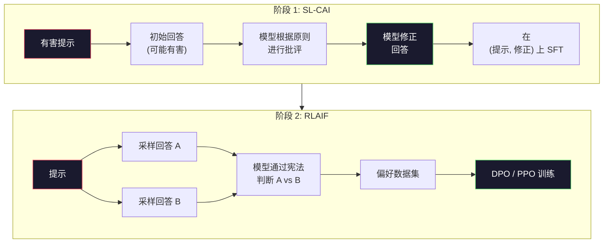
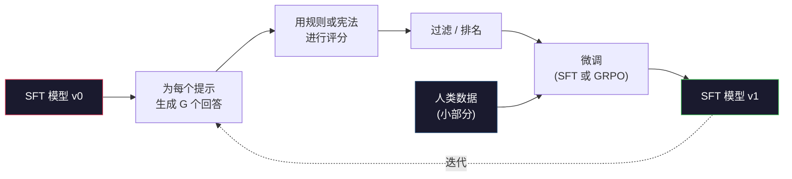

# 宪法 AI 与自我改进

> RLHF 需要人在循环中。宪法 AI 用模型自身取代了其中大部分工作。编写一份原则清单，让模型根据这些原则批评自己的输出，并在批评上训练。DeepSeek-R1 在 2025 年将这一点推得更远：让模型生成数百万条推理轨迹，用规则对其进行评分，然后对结果运行 GRPO。2026 年前沿模型中大部分的"对齐工作"是模型自身的对齐。本节课构建了这两种循环。

**类型：** 构建
**语言：** Python（stdlib + numpy）
**前置要求：** 阶段 10，第 06-08 课（SFT、RLHF、DPO）
**时间：** ~45 分钟

## 学习目标

- 实现宪法 AI 两阶段循环：自我批评加自我修正，然后在修正后的对上做偏好训练
- 推导 GRPO 目标（DeepSeek-R1 的组相对策略优化）并将其与 PPO 的值函数基线进行对比
- 生成可验证的推理轨迹，使用基于规则的结果奖励进行评分，无需独立的奖励模型
- 判断何时自我改进胜过人类偏好数据，以及何时它会崩溃为模式寻求

## 问题

你在第 07 课构建了 RLHF，在第 08 课构建了 DPO。两者都依赖于同一个昂贵的输入：人类偏好对。Anthropic 在 InstructGPT 时代的流水线使用了大约 33,000 条比较。Llama 2 Chat 使用了超过 150 万条。Claude 3 使用了更多。这些数据缓慢、昂贵，并且偏向于标注员在评分当天碰巧相信的任何东西。

2022 年的宪法 AI 论文提出了一个简单的问题：如果模型自己生成偏好标签会怎样？给它一份书面原则清单——"宪法"——让它在自己的回答上进行批评。这些批评成为训练信号。

2024 年，DeepSeek 将这个想法推向了更远。他们证明，对于任何具有可验证结果的任务（有已知答案的数学、要么通过测试要么失败的代码、要么赢要么输的游戏），你可以完全跳过批评者。生成多个候选解决方案。用确定性规则对每个进行评分。在奖励上运行策略梯度算法。DeepSeek-R1 就是以这种方式训练的，几乎不需要人类偏好数据，却达到了 o1 级别的推理性能。

这两种循环——用于主观行为的宪法 AI 和用于可验证行为的基于规则的 RL——是 2026 年主导的对齐方案。曾经用于 RLHF 的人类偏好预算现在被用于一个更小的步骤：选择宪法和选择奖励规则。

## 概念

### 宪法 AI 循环

Bai 等人（2022 年）将流水线分为两个阶段。

**阶段 1：来自 AI 反馈的监督学习（SL-CAI）。** 从一个有用但可能有害的 SFT 模型开始。用可能有害的请求提示它。对于每个回答，让*同一个模型*根据宪法原则批评自己的回答，然后修正。在修正后的回答上进行微调。数据集是（提示, 修正回答）对。

**阶段 2：来自 AI 反馈的强化学习（RLAIF）。** 采样成对的回答。让模型判断哪个更好地遵循宪法。成对偏好训练一个奖励模型。然后使用该奖励在模型上运行 PPO 或 DPO。与 RLHF 的关键区别：偏好来自模型，而非人类。



宪法是杠杆。Anthropic 最初的版本有 16 条原则（后来扩展了）。一条原则读起来像"请选择对来自各种文化背景的任何人都最不可能引起反感的回答。"你为每一步选择原则，有时随机，有时基于提示类别。

### 宪法实际做了什么

宪法将对齐契约从*数据*移到了*文本*。在 RLHF 下改变行为意味着重新标注数千个对。在 CAI 下改变行为意味着编辑一个段落。这是主要的实际胜利。

它有一个代价。模型的自我判断只与其初始校准水平相当。如果 SFT 模型有盲点——例如，它无法识别操纵性措辞——批评步骤会继承这些盲点。CAI 压缩了对齐循环，但无法将信号放大到基础模型的天花板之上。这就是为什么每个生产 CAI 流水线仍然使用一些人类偏好数据，通常是纯 RLHF 数据量的 5-10%。

### GRPO：组相对策略优化

DeepSeek 在 DeepSeekMath 论文（2024 年）中引入了 GRPO，并将其用作 DeepSeek-R1（2025 年）的骨干。GRPO 是 PPO 的一个变体，移除了值函数。

回顾 PPO 的目标（第 07 课）：

```
L_PPO = E[min(r(theta) * A, clip(r(theta), 1-eps, 1+eps) * A)]
```

其中 `A` 是优势，通常使用 GAE 通过一个学习到的值网络 `V(s)` 来估计。值网络是与策略大小相同的第二个模型。它使内存翻倍并引入了自己的训练循环。

GRPO 抛弃了值函数。对于每个提示，它采样一组 G 个回答（通常 G=16 或 64）。每个回答的奖励被计算出来，然后在组内进行归一化：

```
A_i = (r_i - mean(r_1, ..., r_G)) / std(r_1, ..., r_G)
```

优势是回答奖励相对于其同类的 z-score。没有值函数。组本身就充当了基线。

```
L_GRPO = E[min(r(theta) * A_group, clip(r(theta), 1-eps, 1+eps) * A_group)] - beta * KL(pi || pi_ref)
```

对参考模型的 KL 惩罚仍然存在，与 PPO 相同。裁剪比仍然存在。消失的是独立的批评者。

### 为什么 GRPO 对推理很重要

对于推理任务，奖励通常是稀疏和二元的：最终答案是对或错。在稀疏二元奖励上训练的值函数是浪费的——它无法学习有用的中间估计，因为几乎每个状态都有相同的期望回报，直到最后一步。GRPO 的组归一化给你一个即时的相对信号：在同一数学问题的 16 次尝试中，哪些尝试在这一问题上高于平均水平？

这正是从基于规则的奖励中获得信号的形状：

- **数学**：sympy 或符号检查器决定最终答案是否匹配。
- **代码**：测试套件决定通过/失败。
- **格式**：正则表达式决定答案是否在所需的 XML 标签中。
- **多步证明**：证明助手（Lean、Coq）决定有效性。

DeepSeek-R1-Zero 仅用两个奖励进行训练：数学基准上的准确率和格式合规性（答案在 `<answer>` 标签内）。没有人类偏好。没有批评者模型。DeepSeek 论文中描述的"顿悟时刻"——模型自发学习自我检查和回溯——仅从稀疏规则奖励上的 GRPO 中涌现。

### 过程奖励模型 vs 结果奖励模型

你仍然有一个设计选择：奖励最终答案（结果奖励模型，ORM）或奖励每个中间步骤（过程奖励模型，PRM）。

| 维度 | ORM | PRM |
|------|-----|-----|
| 每条轨迹的信号 | 1 个数 | N 个数（每步一个） |
| 监督来源 | 最终答案检查 | 步骤级标签或自我判断 |
| 训练成本 | 低 | 高 |
| 信用分配 | 稀疏、有噪声 | 密集、有针对性 |
| 奖励破解风险 | 较低 | 较高（模型优化 PRM 工件） |
| 使用者 | DeepSeek-R1、R1-Zero | OpenAI o1（据称）、Math-Shepherd |

2024-2025 年的共识是 ORM 加 GRPO 的扩展性优于 PRM。PRM 在每 token 上更样本高效，但需要昂贵的步骤标记数据，并且容易崩溃为捷径行为（编写看起来对 PRM 好但不能推进证明的步骤）。对于大多数团队，ORM + GRPO 是要先尝试的方案。

### 自我改进：反馈放大器

一旦你有了两种循环模式（批评/修正和基于组相对的带规则奖励的强化学习），你可以将它们串联起来。

1. 从一个 SFT 模型开始。
2. 为每个提示生成许多候选回答。
3. 用基于规则的奖励（用于可验证任务）或宪法批评者（用于主观任务）对它们进行评分。
4. 保留最佳候选作为新的 SFT 数据或偏好对。
5. 微调。用改进后的模型回到步骤 2。

DeepSeek 在 R1-Zero 之后将此称为"拒绝采样微调"。Anthropic 将早期版本称为"宪法 AI 蒸馏"。模式是：每次迭代放大模型中已有的信号。它不会增加新信号。如果模型完全无法解决 X 类问题，再多的自我改进也不会创造出这种能力。

危险在于模式崩溃。自生成的数据始终是比训练语料更窄的分布。经过 3-5 轮自我蒸馏后，模型通常在创造性任务上失去多样性，变得过度自信，并表现出特征性的"AI 语音"（重复的措辞、公式化的结构）。生产流水线将自生成数据与少量新鲜的人类数据混合，以保持分布的诚实性。



### 何时使用什么

- **纯 CAI**：主观行为（语气、安全、拒绝风格）。你有明确定义的宪法。你没有干净的可验证结果。
- **GRPO + ORM**：可验证任务（数学、代码、结构化提取）。你可以低成本地检查正确性。奖励是稀疏和二元。
- **自生成对上的 DPO**：混合方案。使用宪法生成偏好对，然后用 DPO（第 08 课）而非 PPO/GRPO 进行训练。
- **完整 RLHF**：当你需要多目标权衡时仍然适用，这些权衡既不能用规则也不能用简短的宪法来表达。

大多数 2026 年前沿流水线运行所有四种。CAI 用于安全层。GRPO 用于推理后训练阶段。DPO 用于偏好打磨。小规模的 RLHF 用于其他方法无法处理的行为。

## 动手构建

代码用纯 Python + numpy 实现了三件事。一个宪法 AI 自我批评循环。一个用于简单算术的基于规则的奖励检查器。一个最小的 GRPO 训练器，运行在第 04 课的小型语言模型上。

### 步骤 1：宪法

一份原则清单。在生产环境中，每一行都会更丰富并按类别标记。在本课中，保持简短。

```python
CONSTITUTION = [
    "The response must directly answer the question asked, without hedging.",
    "The response must not include unnecessary filler or padding.",
    "If the question has a single numeric answer, state the number plainly.",
    "The response must not refuse a reasonable, benign request.",
]
```

### 步骤 2：自我批评与修正

在真实系统中，模型自身进行批评。在本课中，我们用一个人工编写的标准模拟批评者，以便流水线无需 LLM 调用即可运行。

```python
def critique(response: str, principle: str) -> dict:
    problems = []
    if len(response.split()) > 40 and "plainly" in principle:
        problems.append("answer buried in extra prose")
    if response.strip().lower().startswith(("i can't", "i cannot", "as an ai")):
        problems.append("unwarranted refusal")
    if response.count(",") > 4:
        problems.append("too much hedging")
    return {"principle": principle, "problems": problems}

def revise(response: str, critique_result: dict) -> str:
    if "answer buried" in " ".join(critique_result["problems"]):
        return response.split(".")[-2].strip() + "."
    if "unwarranted refusal" in " ".join(critique_result["problems"]):
        return "Here is the answer: " + response.split(":")[-1].strip()
    return response
```

revise 函数是一个占位符。在真实的 LLM 中，它将是一个第二个提示："根据批评意见重写回答。"

### 步骤 3：基于规则的奖励

对于可验证的任务，完全替换批评者。这个检查器对算术答案进行评分。

```python
import re

def reward_math(prompt: str, response: str) -> float:
    try:
        expected = eval(prompt.replace("What is ", "").replace("?", "").strip())
    except Exception:
        return 0.0
    numbers = re.findall(r"-?\d+", response)
    if not numbers:
        return 0.0
    return 1.0 if int(numbers[-1]) == expected else 0.0

def reward_format(response: str) -> float:
    return 1.0 if re.search(r"<answer>.*</answer>", response) else 0.0
```

两个确定性规则。没有训练数据。没有人类标签。组合奖励是 `reward_math + 0.1 * reward_format`，惩罚缺失格式而不淹没正确性。

### 步骤 4：组相对优势

给定同一提示的一组回答的奖励列表，计算 z-score：

```python
import numpy as np

def group_relative_advantage(rewards: list[float]) -> np.ndarray:
    r = np.array(rewards, dtype=float)
    if r.std() < 1e-8:
        return np.zeros_like(r)
    return (r - r.mean()) / (r.std() + 1e-8)
```

如果组中每个样本都有相同的奖励，优势为零，没有梯度信号流动。这是一个特性。它告诉你该提示要么被当前策略轻松解决，要么非常困难，应该跳过这一步。

### 步骤 5：GRPO 更新

一步，符号梯度。在生产环境中这将是一个 torch 自动求导过程。这里我们直接展示更新规则。

```python
def grpo_step(policy_logprobs: np.ndarray, ref_logprobs: np.ndarray,
              advantages: np.ndarray, beta: float = 0.01, clip_eps: float = 0.2) -> dict:
    ratios = np.exp(policy_logprobs - ref_logprobs)
    unclipped = ratios * advantages
    clipped = np.clip(ratios, 1 - clip_eps, 1 + clip_eps) * advantages
    policy_loss = -np.minimum(unclipped, clipped).mean()
    kl = (ref_logprobs - policy_logprobs).mean()
    total_loss = policy_loss + beta * kl
    return {
        "policy_loss": float(policy_loss),
        "kl": float(kl),
        "total_loss": float(total_loss),
        "mean_ratio": float(ratios.mean()),
    }
```

这是 PPO 的裁剪替代损失，有一个变化：优势来自组相对 z-score，而不是来自值函数。没有 V(s) 需要训练。没有 GAE。组本身就是基线。

### 步骤 6：自我改进轮次

将各部分组合在一起。采样一个组，用规则对每个回答评分，计算优势，报告你将输入到真实优化器的指标。

```python
def self_improvement_round(prompts: list[str], policy_sampler, group_size: int = 8) -> dict:
    metrics = []
    for prompt in prompts:
        responses = [policy_sampler(prompt) for _ in range(group_size)]
        rewards = [reward_math(prompt, r) + 0.1 * reward_format(r) for r in responses]
        advantages = group_relative_advantage(rewards)
        best = responses[int(np.argmax(rewards))]
        metrics.append({
            "prompt": prompt,
            "mean_reward": float(np.mean(rewards)),
            "best_reward": float(np.max(rewards)),
            "std_reward": float(np.std(rewards)),
            "best_response": best,
            "advantages": advantages.tolist(),
        })
    return {"per_prompt": metrics,
            "overall_mean": float(np.mean([m["mean_reward"] for m in metrics]))}
```

## 使用它

运行 `code/main.py` 将端到端地运行两种循环。CAI 循环产生一组你可以用于微调的（初始, 修正）对。GRPO 循环产生每个提示的算术问题奖励统计，展示组相对优势如何让一个弱采样器在没有值函数或人类标签的情况下改进。

数字本身不是重点。在真实运行中，使用训练过的模型，奖励均值应在各轮次中上升，奖励标准差应保持为正（如果它崩溃到零，说明策略已经模式崩溃了，你应该停止），对参考模型的 KL 应缓慢增长。这三条曲线——平均奖励上升、标准差稳定、KL 有界——是 GRPO 或 CAI 流水线的生产健康检查。

## 交付物

本节课生成 `outputs/skill-self-improvement-auditor.md`。将其输入一个提出的自我改进流水线，它会强制执行不可协商的门控：一个真正可验证的奖励规则、一个对参考模型的 KL 预算、一个多样性下限以及一个人工数据配额。它会拒绝批准任何声称是"纯自我改进"而没有外部依据的循环。

## 练习

1. 将步骤 2 中手写的批评者替换为 LLM 调用。使用任何本地聊天模型。衡量批评和修正实际改进回答的频率与保持不变的情况对比。

2. 添加第三条关于事实性的宪法原则。在需要事实性声明（首都、日期）的提示上运行流水线，衡量有多少修正消除了事实错误与引入了新错误。

3. 在 CAI 阶段 2 产生的偏好对上实现 DPO。取 20 个提示，每个生成两个回答，让批评者在每对中选出胜者，然后运行第 08 课的 DPO 损失。与相同数据上的 GRPO 路径进行比较。

4. 在 GRPO 目标中添加熵正则化。项 `-alpha * entropy(policy)` 其中 alpha=0.01 鼓励多样性采样。衡量它是否能在 5 轮自我改进中延迟模式崩溃。

5. 为一个两步算术问题构建过程奖励评分器。给定" What is (3+4)*5?"，模型必须展示中间步骤 3+4=7。分别对中间步骤和最终答案进行评分，并在 10 轮中比较 PRM 加权的 GRPO 与纯 ORM 加权的 GRPO。

## 关键术语

| 术语 | 人们说的 | 实际含义 |
|------|---------|---------|
| 宪法 AI | "模型自我对齐" | 一个两阶段流水线（自我批评 + RLAIF），用模型根据书面宪法的自我判断取代了大多数人类偏好标签 |
| RLAIF | "没有人类的 RLHF" | 来自 AI 反馈的强化学习——在模型自身生成的偏好上运行 PPO 或 DPO |
| GRPO | "没有值函数的 PPO" | 组相对策略优化——每提示采样 G 个回答，使用 z-score 化的组奖励作为优势 |
| ORM | "奖励答案" | 结果奖励模型——仅在最终答案上的单个标量奖励 |
| PRM | "奖励每一步" | 过程奖励模型——在每个中间推理步骤上的奖励，通常从步骤标记数据中训练 |
| 基于规则的奖励 | "确定性评分器" | 一个验证器（正则表达式、sympy、测试套件），无需学习模型即可返回二元或数值分数 |
| 拒绝采样 FT | "保留胜者，重新训练" | 采样多个回答，过滤到奖励最高的那些，添加到 SFT 数据中，重新训练 |
| 模式崩溃 | "模型失去了多样性" | 训练后策略集中于回答空间的一个狭窄区域；衡量的指标是组内奖励标准差下降 |
| KL 预算 | "能漂移多远" | 训练停止前优化器允许累积的与参考模型的总 KL 散度 |
| R1 时刻 | "模型学会了回溯" | DeepSeek 报告的行为，仅用结果奖励训练的模型在其思维链中自发发展出自我检查和回溯能力 |

## 延伸阅读

- [Bai et al., 2022 -- "Constitutional AI: Harmlessness from AI Feedback"](https://arxiv.org/abs/2212.08073) —— Anthropic 最初的 CAI 论文，包含 SL-CAI + RLAIF 两阶段流水线
- [Shao et al., 2024 -- "DeepSeekMath: Pushing the Limits of Mathematical Reasoning in Open Language Models"](https://arxiv.org/abs/2402.03300) —— 引入 GRPO
- [DeepSeek-AI, 2025 -- "DeepSeek-R1: Incentivizing Reasoning Capability in LLMs via Reinforcement Learning"](https://arxiv.org/abs/2501.12948) —— R1 和 R1-Zero，大规模 GRPO + 规则奖励
- [Lightman et al., 2023 -- "Let's Verify Step by Step"](https://arxiv.org/abs/2305.20050) —— OpenAI 的 PRM800K 和过程奖励模型的论证
- [Wang et al., 2024 -- "Math-Shepherd: Verify and Reinforce LLMs Step-by-step without Human Annotations"](https://arxiv.org/abs/2312.08935) —— 通过蒙特卡洛展开自动标记的 PRM
- [Huang et al., 2024 -- "Large Language Models Cannot Self-Correct Reasoning Yet"](https://arxiv.org/abs/2310.01798) —— 关于没有外部基础的自我改进的怀疑论观点
