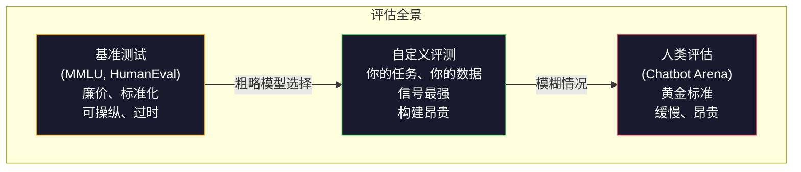
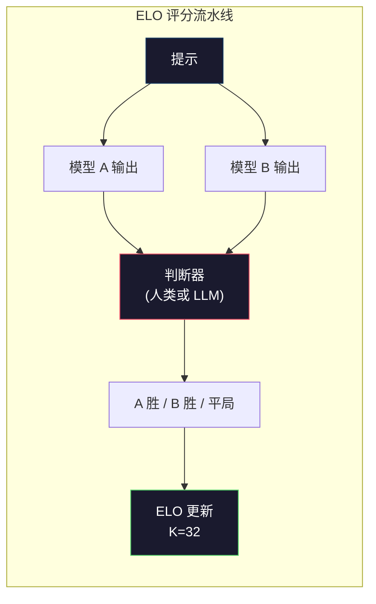

# 评估：基准测试、评测、LM Harness

> 古德哈特定律：当一个指标成为目标时，它就不再是一个好指标。每个前沿实验室都在玩弄基准测试。MMLU 分数在上升，但模型仍然无法可靠地计算"strawberry"中有几个字母 R。唯一重要的评测是你的评测——在你的任务上、用你的数据。

**类型：** 构建
**语言：** Python
**前置要求：** 阶段 10，第 01-05 课（从头开始构建 LLM）
**时间：** ~90 分钟

## 学习目标

- 构建一个自定义的评估框架，对语言模型运行多项选择和开放式基准测试
- 解释为什么标准基准测试（MMLU、HumanEval）会饱和，无法区分前沿模型
- 使用适当的指标实现任务特定的评测：精确匹配、F1、BLEU 和 LLM-as-judge 评分
- 设计一个针对你特定用例的自定义评测套件，而非仅依赖公开排行榜

## 问题

MMLU 于 2020 年发布，包含 57 个学科的 15,908 个问题。三年之内，前沿模型就让它饱和了。GPT-4 得分为 86.4%。Claude 3 Opus 得分为 86.8%。Llama 3 405B 得分为 88.6%。排行榜被压缩到一个 3 个百分点的范围内，差异只是统计噪声，而非真实能力差距。

与此同时，这些相同的模型在那些 10 岁孩子毫不费力就能完成的任务上失败了。Claude 3.5 Sonnet 在 MMLU 上得分 88.7%，但最初无法计算"strawberry"中的字母数——这是一个不需要任何世界知识或推理、只需要字符级迭代的任务。HumanEval 用 164 个问题测试代码生成。模型得分 90% 以上，但仍然会产生任何初级开发人员都能发现的边界情况崩溃的代码。

基准测试性能与真实世界可靠性之间的差距是 LLM 评估的核心问题。基准测试告诉你模型在基准测试上的表现。它们几乎无法告诉你该模型在你的特定任务上、用你的特定数据、在你的特定失败模式下会如何表现。如果你正在构建一个客服机器人，MMLU 是不相关的。如果你正在构建一个代码助手，HumanEval 只覆盖函数级生成——它对跨文件的调试、重构或解释代码毫无说明。

你需要自定义评测。不是因为基准测试无用——它们对粗略的模型选择很有用——而是因为最终评估必须精确匹配你的部署条件。

## 概念

### 评估全景

有三种评估类别，各有不同的成本和信号质量。

**基准测试**是标准化的测试套件。MMLU、HumanEval、SWE-bench、MATH、ARC、HellaSwag。你让模型运行基准测试并得到一个分数。优点：每个人都使用相同的测试，所以你可以比较模型。缺点：模型和训练数据越来越多地污染这些基准测试。实验室在包含基准测试问题的数据上训练。分数上升。能力可能没有。

**自定义评测**是你为你特定用例构建的测试套件。你定义输入、期望输出和评分函数。法律文档摘要器在法律文档上评估。SQL 生成器在你的数据库模式上评估。这些创建起来很昂贵，但它们是唯一能预测生产性能的评估。

**人类评估**使用付费标注员根据有用性、正确性、流畅性和安全性等标准来判断模型输出。这是开放式任务的黄金标准，其中自动评分失败。Chatbot Arena 已在 100+ 个模型中收集了超过 200 万个人类偏好投票。缺点：成本（每个判断 $0.10-$2.00）和速度（数小时到数天）。



### 为什么基准测试会失效

三种机制导致基准测试分数不再反映真实能力。

**数据污染。** 训练语料会抓取互联网。基准测试问题存在于互联网上。模型在训练期间看到了答案。这并非传统意义上的作弊——实验室并非故意包含基准测试数据。但网络级别的抓取使得几乎不可能排除它们。

**应试教学。** 实验室优化训练混合以提升基准测试性能。如果训练混合中 5% 是 MMLU 风格的多项选择题，模型学会了格式和答案分布。MMLU 是 4 选 1 的多选题。模型学会了答案在 A/B/C/D 上大致均匀分布，这即使在模型不知道答案时也有帮助。

**饱和。** 当每个前沿模型在基准测试上得分 85-90% 时，基准测试不再具有区分度。剩余 10-15% 的问题可能是模棱两可的、标记错误的，或需要晦涩的领域知识。在 MMLU 上从 87% 提高到 89% 可能意味着模型多记住了两个晦涩的问题，而不是变得更聪明了。

### 困惑度：快速健康检查

困惑度衡量模型对 token 序列的惊讶程度。形式上，它是指数化的平均负对数似然：

```
PPL = exp(-1/N * sum(log P(token_i | context)))
```

困惑度为 10 意味着模型在每个 token 位置上平均与从 10 个选项中均匀选择一样不确定。越低越好。GPT-2 在 WikiText-103 上的困惑度约为 30。GPT-3 约为 20。Llama 3 8B 约为 7。

困惑度对于在相同测试集上比较模型很有用，但它有盲点。一个模型可以通过擅长预测常见模式而具有低困惑度，同时对罕见但重要的模式表现糟糕。它也无法说明指令遵循、推理或事实准确性。将其用作合理性检查，而非最终结论。

### LLM-as-Judge

使用一个强模型来评估一个弱模型的输出。想法很简单：让 GPT-4o 或 Claude Sonnet 按 1-5 分对回答的正确性、有用性和安全性进行评分。使用 GPT-4o-mini 每个判断大约花费 $0.01，与人类判断的相关性出奇地好——大多数任务上约 80% 的一致性。

评分提示比模型本身更重要。模糊的提示（"给这个回答评分"）会产生有噪声的分数。带有评分标准的结构化提示（"如果答案事实正确并引用来源给 5 分，正确但未引用来源给 4 分，部分正确给 3 分……"）会产生一致、可重复的分数。

失败模式：判断模型表现出位置偏差（在成对比较中偏好第一个回答）、冗长偏差（偏好更长的回答）和自我偏好（GPT-4 对 GPT-4 输出的评分高于同等的 Claude 输出）。缓解措施：随机化顺序、按长度归一化、使用与被评估模型不同的判断模型。

### 来自成对比较的 ELO 评分

Chatbot Arena 的方法。展示来自不同模型对同一提示的两个回答。人类（或 LLM 判断器）选出更好的。从数千次这样的比较中，为每个模型计算一个 ELO 评分——与象棋中使用的相同系统。

ELO 的优势：相对排名比绝对评分更可靠、优雅地处理平局、并且在收敛时需要的比较次数少于独立评分每个输出。截至 2026 年初，Chatbot Arena 排名显示 GPT-4o、Claude 3.5 Sonnet 和 Gemini 1.5 Pro 在顶部彼此差距在 20 ELO 分以内。



### 评估框架

**lm-evaluation-harness**（EleutherAI）：标准的开源评估框架。支持 200+ 个基准测试。一个命令即可让任何 Hugging Face 模型运行 MMLU、HellaSwag、ARC 等。被 Open LLM Leaderboard 使用。

**RAGAS**：专门用于 RAG 流水线的评估框架。衡量忠实度（回答是否匹配检索到的上下文？）、相关性（检索到的上下文是否与问题相关？）和答案正确性。

**promptfoo**：用于提示工程的配置驱动评估。在 YAML 中定义测试用例，在多个模型上运行，获得通过/失败报告。对于回归测试提示很有用——确保提示更改不会破坏现有的测试用例。

### 构建自定义评测

唯一对生产环境重要的评测。过程：

1. **定义任务。** 模型到底应该做什么？要精确。"回答问题"太模糊。"给定一封客户投诉邮件，提取产品名称、问题类别和情感"是一个你可以评估的任务。

2. **创建测试用例。** 原型评测最少 50 个，生产环境 200+ 个。每个测试用例是一个 (输入, 期望输出) 对。包括边界情况：空输入、对抗性输入、模糊输入、其他语言的输入。

3. **定义评分方式。** 结构化输出用精确匹配。文本相似度用 BLEU/ROUGE。开放式质量用 LLM-as-judge。提取任务用 F1。用权重组合多个指标。

4. **自动化。** 每个评测用一个命令运行。没有手动步骤。以允许随时间比较的格式存储结果。

5. **随时间跟踪。** 一个评测分数在没有上下文的情况下是没有意义的。你需要趋势线。分数在上次提示更改后提高了吗？在切换模型后退步了吗？随提示一起对你的评测进行版本管理。

| 评测类型 | 每判断成本 | 与人类的一致性 | 最适合 |
|---------|-----------|---------------|-------|
| 精确匹配 | ~$0 | 100%（适用时） | 结构化输出、分类 |
| BLEU/ROUGE | ~$0 | ~60% | 翻译、摘要 |
| LLM-as-judge | ~$0.01 | ~80% | 开放结束生成 |
| 人类评估 | $0.10-$2.00 | N/A（是真实数据） | 模糊、高风险任务 |

```figure
perplexity-loss
```

## 动手构建

### 步骤 1：最小评估框架

定义核心抽象。一个评估用例有一个输入、一个期望输出和一个可选的元数据字典。评分器接受预测值和参考值并返回 0 到 1 之间的分数。

```python
import json
from collections import Counter

class EvalCase:
    def __init__(self, input_text, expected, metadata=None):
        self.input_text = input_text
        self.expected = expected
        self.metadata = metadata or {}

class EvalSuite:
    def __init__(self, name, cases, scorers):
        self.name = name
        self.cases = cases
        self.scorers = scorers

    def run(self, model_fn):
        results = []
        for case in self.cases:
            prediction = model_fn(case.input_text)
            scores = {}
            for scorer_name, scorer_fn in self.scorers.items():
                scores[scorer_name] = scorer_fn(prediction, case.expected)
            results.append({
                "input": case.input_text,
                "expected": case.expected,
                "prediction": prediction,
                "scores": scores,
            })
        return results
```

### 步骤 2：评分函数

构建精确匹配、token F1 和模拟的 LLM-as-judge 评分器。

```python
def exact_match(prediction, expected):
    return 1.0 if prediction.strip().lower() == expected.strip().lower() else 0.0

def token_f1(prediction, expected):
    pred_tokens = set(prediction.lower().split())
    exp_tokens = set(expected.lower().split())
    if not pred_tokens or not exp_tokens:
        return 0.0
    common = pred_tokens & exp_tokens
    precision = len(common) / len(pred_tokens)
    recall = len(common) / len(exp_tokens)
    if precision + recall == 0:
        return 0.0
    return 2 * (precision * recall) / (precision + recall)

def llm_judge_simulated(prediction, expected):
    pred_words = set(prediction.lower().split())
    exp_words = set(expected.lower().split())
    if not exp_words:
        return 0.0
    overlap = len(pred_words & exp_words) / len(exp_words)
    length_penalty = min(1.0, len(prediction) / max(len(expected), 1))
    return round(overlap * 0.7 + length_penalty * 0.3, 3)
```

### 步骤 3：ELO 评分系统

实现带 ELO 更新的成对比较。这正是 Chatbot Arena 用来给模型排名的系统。

```python
class ELOTracker:
    def __init__(self, k=32, initial_rating=1500):
        self.ratings = {}
        self.k = k
        self.initial_rating = initial_rating
        self.history = []

    def _ensure_player(self, name):
        if name not in self.ratings:
            self.ratings[name] = self.initial_rating

    def expected_score(self, rating_a, rating_b):
        return 1 / (1 + 10 ** ((rating_b - rating_a) / 400))

    def record_match(self, player_a, player_b, outcome):
        self._ensure_player(player_a)
        self._ensure_player(player_b)

        ea = self.expected_score(self.ratings[player_a], self.ratings[player_b])
        eb = 1 - ea

        if outcome == "a":
            sa, sb = 1.0, 0.0
        elif outcome == "b":
            sa, sb = 0.0, 1.0
        else:
            sa, sb = 0.5, 0.5

        self.ratings[player_a] += self.k * (sa - ea)
        self.ratings[player_b] += self.k * (sb - eb)

        self.history.append({
            "a": player_a, "b": player_b,
            "outcome": outcome,
            "rating_a": round(self.ratings[player_a], 1),
            "rating_b": round(self.ratings[player_b], 1),
        })

    def leaderboard(self):
        return sorted(self.ratings.items(), key=lambda x: -x[1])
```

### 步骤 4：困惑度计算

使用 token 概率计算困惑度。在实践中你会从模型的 logits 中获得这些。这里我们用概率分布来模拟。

```python
import numpy as np

def perplexity(log_probs):
    if not log_probs:
        return float("inf")
    avg_neg_log_prob = -np.mean(log_probs)
    return float(np.exp(avg_neg_log_prob))

def token_log_probs_simulated(text, model_quality=0.8):
    np.random.seed(hash(text) % 2**31)
    tokens = text.split()
    log_probs = []
    for i, token in enumerate(tokens):
        base_prob = model_quality
        if len(token) > 8:
            base_prob *= 0.6
        if i == 0:
            base_prob *= 0.7
        prob = np.clip(base_prob + np.random.normal(0, 0.1), 0.01, 0.99)
        log_probs.append(float(np.log(prob)))
    return log_probs
```

### 步骤 5：聚合结果

计算评估运行中的汇总统计：均值、中位数、阈值通过率以及按指标划分的细分。

```python
def summarize_results(results, threshold=0.8):
    all_scores = {}
    for r in results:
        for metric, score in r["scores"].items():
            all_scores.setdefault(metric, []).append(score)

    summary = {}
    for metric, scores in all_scores.items():
        arr = np.array(scores)
        summary[metric] = {
            "mean": round(float(np.mean(arr)), 3),
            "median": round(float(np.median(arr)), 3),
            "std": round(float(np.std(arr)), 3),
            "min": round(float(np.min(arr)), 3),
            "max": round(float(np.max(arr)), 3),
            "pass_rate": round(float(np.mean(arr >= threshold)), 3),
            "n": len(scores),
        }
    return summary

def print_summary(summary, suite_name="Eval"):
    print(f"\n{'=' * 60}")
    print(f"  {suite_name} Summary")
    print(f"{'=' * 60}")
    for metric, stats in summary.items():
        print(f"\n  {metric}:")
        print(f"    Mean:      {stats['mean']:.3f}")
        print(f"    Median:    {stats['median']:.3f}")
        print(f"    Std:       {stats['std']:.3f}")
        print(f"    Range:     [{stats['min']:.3f}, {stats['max']:.3f}]")
        print(f"    Pass rate: {stats['pass_rate']:.1%} (threshold >= 0.8)")
        print(f"    N:         {stats['n']}")
```

### 步骤 6：运行完整流水线

将所有部分组合在一起。定义一个任务，创建测试用例，模拟两个模型，运行评测，从成对比较中计算 ELO，并打印排行榜。

```python
def demo_model_good(prompt):
    responses = {
        "What is the capital of France?": "Paris",
        "What is 2 + 2?": "4",
        "Who wrote Hamlet?": "William Shakespeare",
        "What language is PyTorch written in?": "Python and C++",
        "What is the boiling point of water?": "100 degrees Celsius",
    }
    return responses.get(prompt, "I don't know")

def demo_model_bad(prompt):
    responses = {
        "What is the capital of France?": "Paris is the capital city of France",
        "What is 2 + 2?": "The answer is four",
        "Who wrote Hamlet?": "Shakespeare",
        "What language is PyTorch written in?": "Python",
        "What is the boiling point of water?": "212 Fahrenheit",
    }
    return responses.get(prompt, "Unknown")

cases = [
    EvalCase("What is the capital of France?", "Paris"),
    EvalCase("What is 2 + 2?", "4"),
    EvalCase("Who wrote Hamlet?", "William Shakespeare"),
    EvalCase("What language is PyTorch written in?", "Python and C++"),
    EvalCase("What is the boiling point of water?", "100 degrees Celsius"),
]

suite = EvalSuite(
    name="General Knowledge",
    cases=cases,
    scorers={
        "exact_match": exact_match,
        "token_f1": token_f1,
        "llm_judge": llm_judge_simulated,
    },
)

results_good = suite.run(demo_model_good)
results_bad = suite.run(demo_model_bad)

print_summary(summarize_results(results_good), "Model A (concise)")
print_summary(summarize_results(results_bad), "Model B (verbose)")
```

"好"模型给出精确答案。"坏"模型给出冗长的意译。精确匹配严重惩罚了冗长的模型。Token F1 和 LLM-as-judge 更加宽容。这说明了为什么指标选择很重要：同一个模型根据你如何评分看起来可以很好或很糟糕。

### 步骤 7：ELO 锦标赛

在多个回合中运行模型之间的成对比较。

```python
elo = ELOTracker(k=32)

for case in cases:
    pred_a = demo_model_good(case.input_text)
    pred_b = demo_model_bad(case.input_text)

    score_a = token_f1(pred_a, case.expected)
    score_b = token_f1(pred_b, case.expected)

    if score_a > score_b:
        outcome = "a"
    elif score_b > score_a:
        outcome = "b"
    else:
        outcome = "tie"

    elo.record_match("model_a_concise", "model_b_verbose", outcome)

print("\nELO Leaderboard:")
for name, rating in elo.leaderboard():
    print(f"  {name}: {rating:.0f}")
```

### 步骤 8：困惑度比较

比较不同质量水平的"模型"的困惑度。

```python
test_text = "The quick brown fox jumps over the lazy dog in the garden"

for quality, label in [(0.9, "Strong model"), (0.7, "Medium model"), (0.4, "Weak model")]:
    log_probs = token_log_probs_simulated(test_text, model_quality=quality)
    ppl = perplexity(log_probs)
    print(f"  {label} (quality={quality}): perplexity = {ppl:.2f}")
```

## 使用它

### lm-evaluation-harness (EleutherAI)

在任何模型上运行基准测试的标准工具。

```python
# pip install lm-eval
# Command line:
# lm_eval --model hf --model_args pretrained=meta-llama/Llama-3.1-8B --tasks mmlu --batch_size 8

# Python API:
# import lm_eval
# results = lm_eval.simple_evaluate(
#     model="hf",
#     model_args="pretrained=meta-llama/Llama-3.1-8B",
#     tasks=["mmlu", "hellaswag", "arc_easy"],
#     batch_size=8,
# )
# print(results["results"])
```

### promptfoo

用于提示工程的配置驱动评估。在 YAML 中定义测试，并在多个提供商上运行。

```yaml
# promptfoo.yaml
providers:
  - openai:gpt-4o-mini
  - anthropic:claude-3-haiku

prompts:
  - "Answer in one word: {{question}}"

tests:
  - vars:
      question: "What is the capital of France?"
    assert:
      - type: contains
        value: "Paris"
  - vars:
      question: "What is 2 + 2?"
    assert:
      - type: equals
        value: "4"
```

### RAGAS 用于 RAG 评估

```python
# pip install ragas
# from ragas import evaluate
# from ragas.metrics import faithfulness, answer_relevancy, context_precision
#
# result = evaluate(
#     dataset,
#     metrics=[faithfulness, answer_relevancy, context_precision],
# )
# print(result)
```

RAGAS 衡量通用评测无法衡量的内容：模型的答案是否基于检索到的上下文，而不仅仅是抽象的"正确"。

## 交付物

本节课生成 `outputs/prompt-eval-designer.md`——一个可复用的提示，为任何任务设计自定义评测套件。给它一个任务描述，它会生成测试用例、评分函数和通过/失败阈值建议。

它还生成 `outputs/skill-llm-evaluation.md`——一个基于任务类型、预算和延迟要求选择正确评估策略的决策框架。

## 练习

1. 添加一个"一致性"评分器，将相同输入通过模型运行 5 次，并衡量输出匹配的频率。确定性输入上的不一致回答揭示了脆弱的提示或高温设置。

2. 扩展 ELO 跟踪器以支持多个判断函数（精确匹配、F1、LLM-as-judge）并对其进行加权。比较当你高度加权精确匹配与高度加权 F1 时，排行榜如何变化。

3. 为特定任务构建评测套件：将电子邮件分类为 5 个类别。创建 100 个包含多样化示例的测试用例，包括边界情况（可能属于多个类别的电子邮件、空电子邮件、其他语言的电子邮件）。衡量不同的"模型"（基于规则、关键词匹配、模拟 LLM）的表现。

4. 实现污染检测：给定一组评测问题和训练语料，检查有多少百分比的评测问题（或接近的意译）出现在训练数据中。这是研究人员审计基准有效性的方式。

5. 构建一个"模型差异"工具。给定两个模型版本的评测结果，突出显示哪些特定测试用例改进了、哪些退步了、哪些保持不变。这是评测等效于代码差异的工具——对于理解更改是否有帮助或有害至关重要。

## 关键术语

| 术语 | 人们说的 | 实际含义 |
|------|---------|---------|
| MMLU | "那个基准测试" | 大规模多任务语言理解——57 个学科的 15,908 道多项选择题，到 2025 年在 88% 以上饱和 |
| HumanEval | "代码评估" | 来自 OpenAI 的 164 道 Python 函数补全问题，仅测试孤立的函数生成 |
| SWE-bench | "真实编码评估" | 来自 12 个 Python 仓库的 2,294 个 GitHub issue，测量端到端的 bug 修复包括测试生成 |
| 困惑度 | "模型有多困惑" | exp(-avg(log P(token_i given context)))——越低意味着模型对实际 token 分配的概率越高 |
| ELO 评分 | "模型的象棋排名" | 从成对胜负记录计算的相对技能评分，被 Chatbot Arena 用于给 100+ 个模型排名 |
| LLM-as-judge | "用 AI 给 AI 评分" | 强模型根据评分标准对弱模型的输出进行评分，约 80% 与人类判断一致，每个判断约 $0.01 |
| 数据污染 | "模型见过测试" | 训练数据中包含基准测试问题，虚高分数而不反映真实能力 |
| 评测套件 | "一堆测试" | 一个版本化的 (输入, 期望输出, 评分器) 三元组集合，衡量特定能力 |
| 通过率 | "正确率百分比" | 评分超过阈值的评测用例比例——比均值分数更可操作，因为它衡量可靠性 |
| Chatbot Arena | "模型排名网站" | LMSYS 平台，拥有 200 万+ 人类偏好投票，通过 ELO 评分产生最受信任的 LLM 排行榜 |

## 延伸阅读

- [Hendrycks et al., 2021 -- "Measuring Massive Multitask Language Understanding"](https://arxiv.org/abs/2009.03300) —— MMLU 论文，尽管已经饱和但仍然是引用最多的 LLM 基准测试
- [Chen et al., 2021 -- "Evaluating Large Language Models Trained on Code"](https://arxiv.org/abs/2107.03374) —— OpenAI 的 HumanEval 论文，建立了代码生成评估方法
- [Zheng et al., 2023 -- "Judging LLM-as-a-Judge"](https://arxiv.org/abs/2306.05685) —— 使用 LLM 评估 LLM 的系统性分析，包括位置偏差和冗长偏差发现
- [LMSYS Chatbot Arena](https://chat.lmsys.org/) —— 众包模型比较平台，拥有 200 万+ 投票，最受信任的真实世界 LLM 排名
