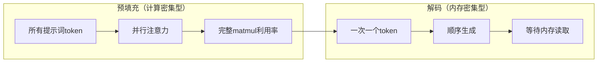
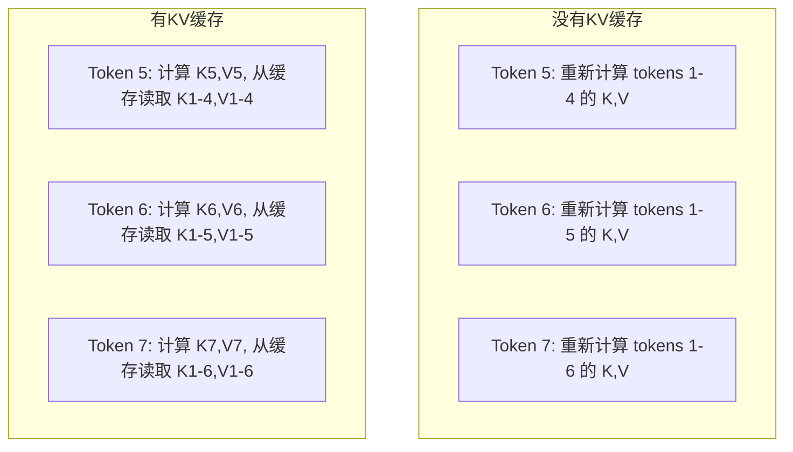
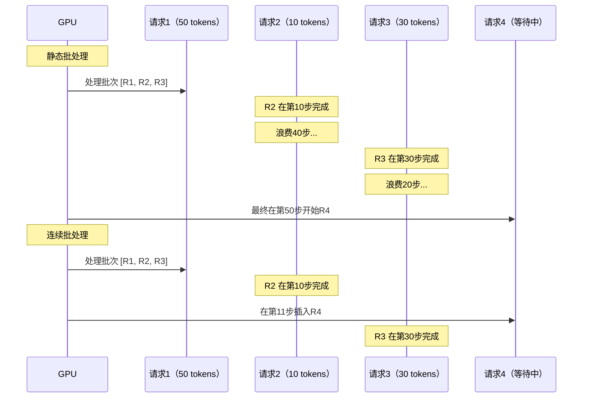
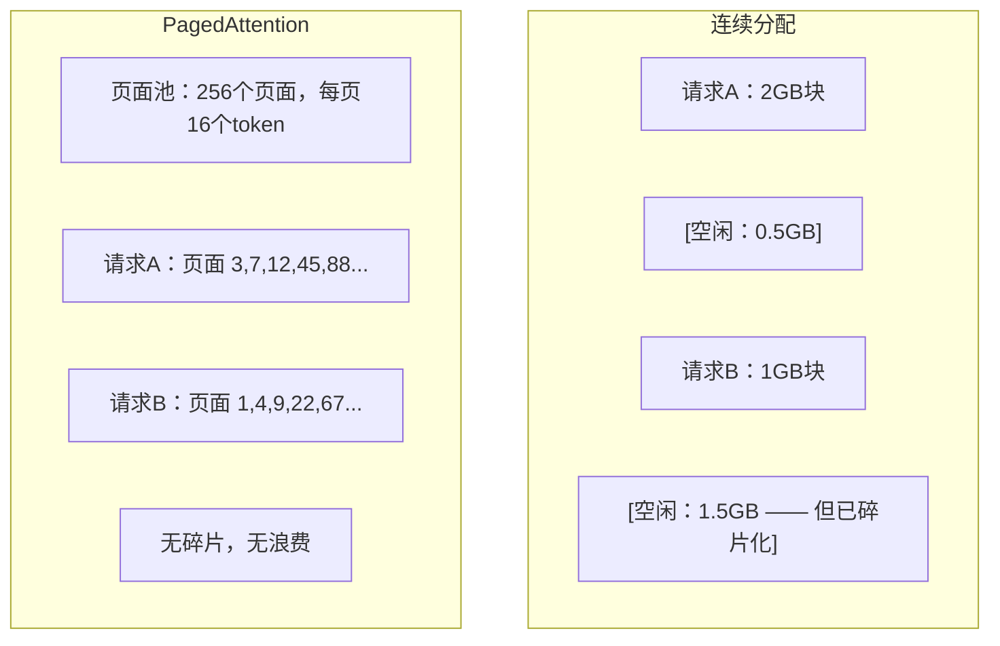
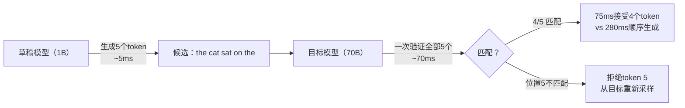

# 推理优化

> 两个阶段定义了LLM推理。预填充阶段并行处理你的提示词——计算密集型。解码阶段逐个生成token——内存密集型。每一个优化都针对其中一个或两个阶段。

**类型：** 构建
**语言：** Python
**前置知识：** 阶段10，课程01-08（Transformer架构，注意力机制）
**时间：** ~120分钟

## 学习目标

- 实现KV缓存，消除自回归token生成过程中的冗余计算
- 解释LLM推理的预填充与解码阶段，以及为什么每个阶段有不同的瓶颈（计算密集型 vs 内存密集型）
- 实现连续批处理和PagedAttention概念，以最大化并发请求下的GPU利用率
- 比较推理优化技术（KV缓存、推测解码、Flash Attention）及其吞吐量/延迟权衡

## 问题

你在4块A100 GPU上部署了Llama 3 70B。单个用户获得约50 tokens/秒。感觉很快。然后100个用户同时访问端点。吞吐量下降到3 tokens/秒/用户。你每月25,000美元的GPU账单提供的响应速度比人类打字还慢。

模型本身在1个用户和100个用户之间没有变化。相同的权重，相同的架构，相同的数学计算。变化的是你如何调度工作。朴素推理浪费了90%以上的可用GPU计算资源。一个等待第47个token的用户持有一个完整的批处理槽，而GPU内存总线在矩阵乘法之间处于空闲状态。与此同时，一个新用户的2,000 token提示词可以用有用的计算填满那段空闲时间。

这不是一个扩展问题。这是一个调度问题。本课程中的技术——KV缓存、连续批处理、PagedAttention、推测解码、前缀缓存——是将每月25,000美元的推理账单变为每月5,000美元而服务相同流量的关键。

vLLM在4块A100-80GB上服务Llama 3 70B时，低并发下约50 tokens/秒/用户，在100个并发请求时通过连续批处理和PagedAttention维持15-25 TPS/用户。没有这些优化，相同硬件在该并发下只能提供5 TPS/用户。相同的GPU，相同的模型，4倍的吞吐量。

## 概念

### 预填充 vs 解码

每个LLM推理请求有两个不同的阶段。

**预填充**处理整个输入提示词。所有token都是已知的，因此注意力可以在整个序列上并行计算。这是一个大型矩阵乘法——GPU核心保持繁忙。瓶颈是计算：你的硬件每秒能提供多少FLOPS。一块A100可提供312 TFLOPS（BF16）。在70B模型上对4,096 token的提示词进行预填充，单块A100大约需要400ms。

**解码**一次生成一个输出token。每个新token关注所有之前的token，但每次前向传播只产生一个token。权重矩阵与预填充时相同，但你是用一个向量而不是一个矩阵乘以它们。GPU核心在微秒内完成计算，然后等待下一批权重从内存中到达。瓶颈是内存带宽：你能以多快的速度将模型权重从HBM传输到计算单元。一块A100有2 TB/s的带宽。FP16的70B模型为140 GB。完整读取模型一次需要70ms——这是单次解码步骤的下限。



**ops:byte比率**（也称为算术强度）捕捉了这种权衡。它衡量你每从内存加载一个字节执行多少次运算。

```
ops:byte比率 = 每token的FLOPs / 从内存读取的字节数
```

在批大小为4,096个token的预填充期间，每加载一个权重执行约4,096次乘加运算。比率很高——你是计算密集型的。在批大小为1的解码期间，每加载一个权重执行约1次运算。比率很低——你是内存密集型的。

基本洞察：*解码是内存密集型的，因为你要读取整个模型来生成一个token*。下面的每一个优化要么减少读取量，要么增加每次读取处理的token批次大小，要么完全避免读取。

### KV缓存

在注意力机制中，每个token的查询关注所有之前token的键和值向量。没有缓存，生成第N个token需要重新计算所有前N-1个token的键和值投影。第1个token在生成第2个token时被投影，然后在第3个token时再次被投影，然后在第4个token时再次被投影。到第1,000个token时，第1个token已经被投影了总共999次。

KV缓存存储所有之前token的键和值投影。当生成第N个token时，你只计算第N个token的键和值，然后将它们与缓存的第1到N-1个token的K/V拼接起来。



**KV缓存的内存公式：**

```
KV缓存大小 = 2 * 层数 * KV头数 * 头维度 * 序列长度 * 每参数字节数
```

对于Llama 3 70B（80层，GQA的8个KV头，head_dim=128，BF16）：

```
每token：2 * 80 * 8 * 128 * 2 字节 = 327,680 字节 = 320 KB
4,096 tokens时：320 KB * 4,096 = 1.28 GB
128K tokens时：320 KB * 131,072 = 40 GB
```

Llama 3 70B的一个128K上下文对话消耗40 GB的KV缓存——半块A100的内存。100个并发用户各4K token时，仅KV缓存就需要128 GB。这就是为什么KV缓存管理是推理优化的核心挑战。

### 连续批处理

静态批处理等待一批N个请求到达，一起处理它们，然后等待*所有*请求完成后再接受新请求。如果一个请求需要500个token而另一个需要10个，短请求在完成后还会空闲490个解码步骤。

连续批处理（也称为迭代级批处理）在任何请求完成时立即将新请求插入到批处理中。批处理在每个解码步骤重新评估。一个在10个token后完成的请求立即被一个等待中的请求替换。



吞吐量提升取决于输出长度的变化程度。长度均匀时，连续批处理与静态批处理相当。长度变化时（常见情况），连续批处理可以提供2-5倍的吞吐量提升，因为GPU槽永远不会空闲。

### PagedAttention

每个请求的KV缓存是一个连续的内存块。随着请求的到达和离开，内存变得碎片化——就像操作系统中的RAM碎片化一样。一个4K token的请求需要1.28 GB的连续内存。即使你总共有2 GB空闲，也可能没有1.28 GB的*连续*内存。你要么浪费内存，要么拒绝请求。

PagedAttention（来自vLLM）将操作系统风格的虚拟内存应用于KV缓存。它不是为每个请求分配一个连续块，而是分配固定大小的"页面"（通常每个页面16个token）。页面可以位于物理GPU内存的任何位置。页表将每个请求的逻辑序列位置映射到物理页面位置。



PagedAttention还支持共享前缀的**写时复制**。如果50个请求共享相同的系统提示词，该提示词的KV缓存页面只存储一次，并被所有50个请求引用。只有当请求出现分歧（不同的用户消息）时，它才获得自己的页面。这大大减少了具有共享系统提示词的应用程序的内存使用量。

vLLM报告通过PagedAttention实现了接近零的内存浪费（约4%，而朴素分配为约60-80%）。

### 推测解码

解码速度慢是因为它是顺序的——你生成一个token，将其回馈，生成下一个。但是，如果你可以廉价地猜测接下来的5个token，然后一次性验证它们呢？

推测解码使用一个小型快速的**草稿模型**生成K个候选token。然后大型**目标模型**在一次前向传播中处理所有K个候选（这看起来像预填充——并行、计算密集型、高效）。如果目标模型同意草稿模型的预测，你就以一次目标前向传播的时间接受了所有K个token。如果它在位置j处表示不同意，你就接受第1到j-1个token并丢弃其余的。



加速取决于**接受率**——草稿模型的预测与目标模型匹配的频率。对于为Llama 3 70B起草的Llama 3 8B，自然语言的接受率通常在70-85%之间。这转化为2-3倍的解码加速。

推测解码的三种方法：

| 方法 | 草案来源 | 接受率 | 开销 |
|--------|-------------|---------|----------|
| 草稿-目标（Leviathan等） | 独立小模型 | 70-85% | 草稿模型内存 |
| EAGLE（Li等） | 目标上的轻量级头部 | 75-90% | 约1%额外参数 |
| N-gram查找 | Token n-gram表 | 40-60% | 可忽略 |

**EAGLE**在目标模型的隐藏状态之上训练一个小型自回归头部。它使用目标模型倒数第二层的特征来预测下一个token的嵌入。因为它在目标模型自身的表示（而非独立模型的表示）上操作，它以最小的额外内存实现了更高的接受率。EAGLE-2添加了一个动态猜测树，根据上下文调整候选数量。

**N-gram推测解码**维护一个来自当前上下文或预构建语料库的n-gram延续表。如果草稿匹配先前在相同对话中出现过的内容（重复模式、代码、结构化输出），它以零神经网络开销启动。平均接受率较低，但每次推测的成本基本上可以忽略不计。

推测解码是*数学上精确的*——输出分布与目标模型的分布相同。它不是近似。验证步骤确保每个接受的token具有目标模型本应赋予的确切概率。

### 前缀缓存

许多请求共享相同的前缀。聊天机器人的系统提示词。RAG上下文块。少样本示例集。没有前缀缓存，每个请求从头开始重新计算这些共享token的KV缓存。

前缀缓存存储常用前缀的KV缓存并在请求之间重用。当新请求到达并带有已知前缀时，系统复制（或引用）缓存的KV条目，只计算唯一后缀的KV。

对于一个在所有请求之间共享的2,000 token系统提示词，前缀缓存消除了每个请求约400ms的预填充时间。在100请求/秒时，这每秒节省了40秒的GPU计算——超过一块GPU的工作量。

SGLang的RadixAttention实现了前缀缓存，使用基数树（trie）按token内容索引前缀。任何匹配存储前缀的请求都可以免费获得其KV缓存。该树支持部分前缀匹配——如果你与缓存的条目共享2,000个前缀token中的1,500个，你重用那1,500个，只重新计算500个。

### 推理引擎

三个引擎主导了生产级LLM服务：

| 引擎 | 关键创新 | 最适合 |
|--------|----------|--------|
| vLLM | PagedAttention，连续批处理 | 通用服务，最广泛的兼容性 |
| SGLang | RadixAttention（前缀缓存），结构化生成 | 多轮聊天机器人，约束解码 |
| TensorRT-LLM | NVIDIA内核融合，FP8量化 | NVIDIA硬件上的最大单GPU吞吐量 |

**vLLM**是默认的起点。它支持最广泛的模型，可在任何GPU供应商（NVIDIA、AMD、Intel）上运行，并通过PagedAttention加连续批处理实现强大的吞吐量。其兼容OpenAI的API意味着你可以将其作为任何OpenAI API调用的替代品。

**SGLang**建立在与vLLM相同的基础上，但增加了用于前缀缓存的RadixAttention和用于结构化LLM程序的领域特定语言。如果你的工作负载涉及多轮对话、工具使用或约束解码（JSON输出、正则表达式引导的生成），SGLang通常通过前缀重用比vLLM性能高出2-5倍。

**TensorRT-LLM**将模型编译为优化的NVIDIA GPU内核。它融合操作（注意+线性+激活放在一个内核中），在H100 GPU上使用FP8，并与NVIDIA Triton推理服务器集成以进行生产部署。它在NVIDIA硬件上实现了最高的单GPU吞吐量，但需要更多设置且仅适用于NVIDIA GPU。

Llama 3 70B（4xA100-80GB，BF16）的实际数据：

| 指标 | vLLM | SGLang | TensorRT-LLM |
|--------|------|--------|---------------|
| 吞吐量（1用户） | ~50 TPS | ~55 TPS | ~65 TPS |
| 吞吐量（100用户） | ~2,500 总 TPS | ~3,200 总 TPS | ~3,000 总 TPS |
| 首个token时间 | ~400ms | ~300ms（前缀命中） | ~350ms |
| 最大上下文 | 128K | 128K | 128K |

### Ops:Byte框架

你无法优化你没有衡量的东西。ops:byte比率告诉你你是计算密集型还是内存密集型，这决定了哪些优化重要。

```
计算上限：GPU的峰值FLOPS
内存上限：峰值带宽 * ops:byte比率
```

当ops:byte较低时（解码、小批量），你达到内存带宽上限。增加更多计算（更高时钟、更多核心）没有帮助。你需要减少内存读取（量化、KV缓存压缩）或增加批处理大小以将读取分摊到更多有用的工作上。

当ops:byte较高时（预填充、大批量），你达到计算上限。内存带宽优化没有帮助。你需要更快的GPU、内核融合或降低精度以挤出更多FLOPS。

| 场景 | ops:byte | 瓶颈 | 优化方式 |
|----------|----------|-------|---------------|
| 预填充，batch=1 | ~4,096 | 计算 | 内核融合，FP8 |
| 解码，batch=1 | ~1 | 内存 | 量化，KV压缩 |
| 解码，batch=32 | ~32 | 内存 | 更大批量，连续批处理 |
| 解码，batch=256 | ~256 | 过渡中 | 两者都重要 |
| 解码，batch=1024 | ~1,024 | 计算 | 内核融合，张量并行 |

A100上的交叉点大约在ops:byte = 156（312 TFLOPS / 2 TB/s）处。低于156，你是内存密集型的。高于156，你是计算密集型的。连续批处理通过每次迭代打包更多token，将解码推向这个交叉点。

```figure
context-window-slide
```

## 构建它

### 步骤1：从头实现KV缓存

我们构建一个多头KV缓存，存储每层、每头的键和值投影，并展示内存增长模式。

```python
import numpy as np

class KVCache:
    def __init__(self, num_layers, num_heads, head_dim, max_seq_len, dtype=np.float16):
        self.num_layers = num_layers
        self.num_heads = num_heads
        self.head_dim = head_dim
        self.max_seq_len = max_seq_len
        self.dtype = dtype

        self.k_cache = np.zeros(
            (num_layers, num_heads, max_seq_len, head_dim), dtype=dtype
        )
        self.v_cache = np.zeros(
            (num_layers, num_heads, max_seq_len, head_dim), dtype=dtype
        )
        self.seq_len = 0

    def update(self, layer_idx, new_keys, new_values):
        num_new = new_keys.shape[1]
        end = self.seq_len + num_new
        self.k_cache[layer_idx, :, self.seq_len:end, :] = new_keys
        self.v_cache[layer_idx, :, self.seq_len:end, :] = new_values
        return (
            self.k_cache[layer_idx, :, :end, :],
            self.v_cache[layer_idx, :, :end, :]
        )

    def advance(self, num_tokens):
        self.seq_len += num_tokens

    def memory_bytes(self):
        return self.k_cache.nbytes + self.v_cache.nbytes

    def used_bytes(self):
        per_token = 2 * self.num_layers * self.num_heads * self.head_dim * np.dtype(self.dtype).itemsize
        return per_token * self.seq_len
```

### 步骤2：带KV缓存的注意力

一个简化的多头注意力，使用KV缓存进行解码步骤。

```python
def scaled_dot_product_attention(query, keys, values):
    head_dim = query.shape[-1]
    scores = np.matmul(query, keys.transpose(0, 1, 3, 2)) / np.sqrt(head_dim)
    seq_len_q = scores.shape[-2]
    seq_len_k = scores.shape[-1]
    if seq_len_q > 1:
        mask = np.triu(np.ones((seq_len_q, seq_len_k), dtype=np.float32), k=seq_len_k - seq_len_q + 1)
        scores = scores + mask * (-1e9)
    max_scores = np.max(scores, axis=-1, keepdims=True)
    exp_scores = np.exp(scores - max_scores)
    attn_weights = exp_scores / np.sum(exp_scores, axis=-1, keepdims=True)
    return np.matmul(attn_weights, values)


class MultiHeadAttention:
    def __init__(self, d_model, num_heads):
        self.num_heads = num_heads
        self.head_dim = d_model // num_heads
        scale = np.sqrt(2.0 / d_model)
        self.W_q = np.random.randn(d_model, d_model).astype(np.float32) * scale
        self.W_k = np.random.randn(d_model, d_model).astype(np.float32) * scale
        self.W_v = np.random.randn(d_model, d_model).astype(np.float32) * scale
        self.W_o = np.random.randn(d_model, d_model).astype(np.float32) * scale

    def forward(self, x, kv_cache=None, layer_idx=0):
        batch, seq_len, d_model = x.shape
        Q = np.matmul(x, self.W_q).reshape(batch, seq_len, self.num_heads, self.head_dim).transpose(0, 2, 1, 3)
        K = np.matmul(x, self.W_k).reshape(batch, seq_len, self.num_heads, self.head_dim).transpose(0, 2, 1, 3)
        V = np.matmul(x, self.W_v).reshape(batch, seq_len, self.num_heads, self.head_dim).transpose(0, 2, 1, 3)

        if kv_cache is not None:
            K_full, V_full = kv_cache.update(layer_idx, K[0], V[0])
            K = K_full[np.newaxis, :, :, :]
            V = V_full[np.newaxis, :, :, :]
            if seq_len == 1:
                kv_cache.advance(1)

        attn_out = scaled_dot_product_attention(Q, K, V)
        attn_out = attn_out.transpose(0, 2, 1, 3).reshape(batch, -1, d_model)
        return np.matmul(attn_out, self.W_o)
```

### 步骤3：连续批处理模拟器

这个模拟器模拟静态和连续批处理之间的调度差异。

```python
import heapq

class Request:
    def __init__(self, request_id, prompt_tokens, output_tokens, arrival_step):
        self.request_id = request_id
        self.prompt_tokens = prompt_tokens
        self.output_tokens = output_tokens
        self.arrival_step = arrival_step
        self.tokens_generated = 0
        self.start_step = None
        self.end_step = None

    def is_done(self):
        return self.tokens_generated >= self.output_tokens


def simulate_static_batching(requests, batch_size):
    step = 0
    completed = []
    queue = list(requests)
    queue.sort(key=lambda r: r.arrival_step)

    while queue:
        batch = []
        while queue and len(batch) < batch_size:
            r = queue.pop(0)
            r.start_step = max(step, r.arrival_step)
            batch.append(r)

        if batch:
            step = max(step, max(r.start_step for r in batch))
            max_output = max(r.output_tokens for r in batch)
            for r in batch:
                r.tokens_generated = r.output_tokens
                r.end_step = step + max_output
            step += max_output
            completed.extend(batch)

    return completed


def simulate_continuous_batching(requests, batch_size):
    step = 0
    completed = []
    queue = sorted(requests, key=lambda r: r.arrival_step)
    queue_idx = 0
    active = []
    waiting = []

    while queue_idx < len(queue) or active or waiting:
        while queue_idx < len(queue) and queue[queue_idx].arrival_step <= step:
            waiting.append(queue[queue_idx])
            queue_idx += 1

        while waiting and len(active) < batch_size:
            r = waiting.pop(0)
            r.start_step = step
            active.append(r)

        if not active:
            if waiting:
                step += 1
                continue
            elif queue_idx < len(queue):
                step = queue[queue_idx].arrival_step
                continue
            else:
                break

        for r in active:
            r.tokens_generated += 1

        done = [r for r in active if r.is_done()]
        for r in done:
            r.end_step = step + 1
            completed.append(r)
        active = [r for r in active if not r.is_done()]

        step += 1

    return completed


def batching_stats(completed):
    latencies = [r.end_step - r.arrival_step for r in completed]
    total_time = max(r.end_step for r in completed) - min(r.arrival_step for r in completed)
    total_tokens = sum(r.output_tokens for r in completed)
    return {
        "avg_latency": np.mean(latencies),
        "p50_latency": np.median(latencies),
        "p99_latency": np.percentile(latencies, 99),
        "total_time": total_time,
        "throughput": total_tokens / total_time if total_time > 0 else 0,
    }
```

### 步骤4：前缀缓存

一个基于trie的前缀缓存，存储共享前缀的KV条目。

```python
class TrieNode:
    def __init__(self):
        self.children = {}
        self.kv_data = None
        self.hit_count = 0


class PrefixCache:
    def __init__(self, max_entries=1000):
        self.root = TrieNode()
        self.max_entries = max_entries
        self.total_entries = 0
        self.hits = 0
        self.misses = 0

    def _walk(self, token_ids):
        node = self.root
        depth = 0
        for tid in token_ids:
            if tid not in node.children:
                break
            node = node.children[tid]
            depth += 1
        return node, depth

    def lookup(self, token_ids):
        node, depth = self._walk(token_ids)
        if depth > 0:
            self.hits += 1
            current = self.root
            for tid in token_ids[:depth]:
                current = current.children[tid]
                current.hit_count += 1
            kv_entries = []
            current = self.root
            for tid in token_ids[:depth]:
                current = current.children[tid]
                if current.kv_data is not None:
                    kv_entries.append(current.kv_data)
            return depth, kv_entries
        self.misses += 1
        return 0, []

    def insert(self, token_ids, kv_per_token):
        node = self.root
        for i, tid in enumerate(token_ids):
            if tid not in node.children:
                if self.total_entries >= self.max_entries:
                    return i
                node.children[tid] = TrieNode()
                self.total_entries += 1
            node = node.children[tid]
            if i < len(kv_per_token):
                node.kv_data = kv_per_token[i]
        return len(token_ids)

    def hit_rate(self):
        total = self.hits + self.misses
        return self.hits / total if total > 0 else 0.0
```

### 步骤5：推测解码模拟器

我们模拟草稿-目标推测解码，具有可配置的接受率。

```python
class DraftModel:
    def __init__(self, vocab_size, acceptance_rate=0.8):
        self.vocab_size = vocab_size
        self.acceptance_rate = acceptance_rate

    def generate(self, context, num_tokens):
        tokens = np.random.randint(0, self.vocab_size, size=num_tokens)
        return tokens

    def get_probs(self, context, token):
        probs = np.random.dirichlet(np.ones(self.vocab_size))
        return probs


class TargetModel:
    def __init__(self, vocab_size):
        self.vocab_size = vocab_size

    def get_probs(self, context, tokens=None):
        if tokens is not None:
            return [np.random.dirichlet(np.ones(self.vocab_size)) for _ in tokens]
        return np.random.dirichlet(np.ones(self.vocab_size))


def speculative_decode(draft_model, target_model, context, num_speculative=5,
                       draft_cost=1.0, target_cost=10.0, verify_cost=12.0):
    total_tokens = 0
    total_cost = 0.0
    accepted_counts = []
    context = list(context)

    max_tokens = 100

    while total_tokens < max_tokens:
        draft_tokens = draft_model.generate(context, num_speculative)
        total_cost += draft_cost * num_speculative

        target_probs = target_model.get_probs(context, draft_tokens)
        total_cost += verify_cost

        accepted = 0
        for i, token in enumerate(draft_tokens):
            draft_p = draft_model.get_probs(context + list(draft_tokens[:i]), token)
            target_p = target_probs[i]

            r = np.random.random()
            acceptance_prob = min(1.0, target_p[token] / (draft_p[token] + 1e-10))

            if r < draft_model.acceptance_rate:
                accepted += 1
                context.append(token)
                total_tokens += 1
            else:
                new_token = np.random.choice(draft_model.vocab_size, p=target_p)
                context.append(new_token)
                total_tokens += 1
                break

        accepted_counts.append(accepted)

        if accepted == num_speculative:
            bonus_probs = target_model.get_probs(context)
            bonus_token = np.random.choice(draft_model.vocab_size, p=bonus_probs)
            context.append(bonus_token)
            total_tokens += 1

    sequential_cost = total_tokens * target_cost
    return {
        "total_tokens": total_tokens,
        "speculative_cost": total_cost,
        "sequential_cost": sequential_cost,
        "speedup": sequential_cost / total_cost if total_cost > 0 else 1.0,
        "avg_accepted": np.mean(accepted_counts),
        "acceptance_rate": np.mean(accepted_counts) / num_speculative,
    }


def compare_speculation_strategies(vocab_size=1000, num_trials=20):
    results = {}

    for name, acceptance_rate, spec_tokens in [
        ("草稿-目标（8B->70B）", 0.78, 5),
        ("EAGLE", 0.85, 6),
        ("N-gram", 0.50, 4),
        ("无推测", 0.0, 0),
    ]:
        if spec_tokens == 0:
            results[name] = {
                "speedup": 1.0,
                "acceptance_rate": 0.0,
                "avg_accepted": 0.0,
            }
            continue

        trial_results = []
        for _ in range(num_trials):
            draft = DraftModel(vocab_size, acceptance_rate=acceptance_rate)
            target = TargetModel(vocab_size)
            context = list(np.random.randint(0, vocab_size, size=10))
            result = speculative_decode(draft, target, context, num_speculative=spec_tokens)
            trial_results.append(result)

        results[name] = {
            "speedup": np.mean([r["speedup"] for r in trial_results]),
            "acceptance_rate": np.mean([r["acceptance_rate"] for r in trial_results]),
            "avg_accepted": np.mean([r["avg_accepted"] for r in trial_results]),
        }

    return results
```

### 步骤6：KV缓存内存分析器

计算实际模型配置的KV缓存内存需求。

```python
MODEL_CONFIGS = {
    "Llama-3-8B": {
        "num_layers": 32, "num_kv_heads": 8, "head_dim": 128,
        "model_params_b": 8, "gqa": True,
    },
    "Llama-3-70B": {
        "num_layers": 80, "num_kv_heads": 8, "head_dim": 128,
        "model_params_b": 70, "gqa": True,
    },
    "Llama-3-405B": {
        "num_layers": 126, "num_kv_heads": 8, "head_dim": 128,
        "model_params_b": 405, "gqa": True,
    },
    "Mistral-7B": {
        "num_layers": 32, "num_kv_heads": 8, "head_dim": 128,
        "model_params_b": 7, "gqa": True,
    },
    "GPT-4-est": {
        "num_layers": 120, "num_kv_heads": 96, "head_dim": 128,
        "model_params_b": 1800, "gqa": False,
    },
}


def kv_cache_memory(config, seq_len, dtype_bytes=2):
    per_token = 2 * config["num_layers"] * config["num_kv_heads"] * config["head_dim"] * dtype_bytes
    total = per_token * seq_len
    return {
        "per_token_bytes": per_token,
        "per_token_kb": per_token / 1024,
        "total_bytes": total,
        "total_mb": total / (1024 ** 2),
        "total_gb": total / (1024 ** 3),
    }


def memory_budget(config, gpu_memory_gb, model_dtype_bytes=2, kv_dtype_bytes=2):
    model_memory_gb = config["model_params_b"] * 1e9 * model_dtype_bytes / (1024 ** 3)
    overhead_gb = gpu_memory_gb * 0.1
    available_for_kv = gpu_memory_gb - model_memory_gb - overhead_gb

    if available_for_kv <= 0:
        return {"error": "模型无法装入GPU内存", "model_memory_gb": model_memory_gb}

    per_token = 2 * config["num_layers"] * config["num_kv_heads"] * config["head_dim"] * kv_dtype_bytes
    max_tokens = int(available_for_kv * (1024 ** 3) / per_token)

    return {
        "gpu_memory_gb": gpu_memory_gb,
        "model_memory_gb": round(model_memory_gb, 1),
        "overhead_gb": round(overhead_gb, 1),
        "available_for_kv_gb": round(available_for_kv, 1),
        "max_total_tokens": max_tokens,
        "max_users_at_2k": max_tokens // 2048,
        "max_users_at_4k": max_tokens // 4096,
        "max_users_at_32k": max_tokens // 32768,
    }
```

## 使用它

使用vLLM：

```python
from vllm import LLM, SamplingParams

llm = LLM(
    model="meta-llama/Llama-3-70B-Instruct",
    tensor_parallel_size=4,
    enable_prefix_caching=True,
    max_model_len=8192,
    gpu_memory_utilization=0.9,
)

params = SamplingParams(temperature=0.7, max_tokens=256)
outputs = llm.generate(["用一段话解释推理优化。"], params)
```

使用SGLang实现前缀缓存+结构化输出：

```python
import sglang as sgl

@sgl.function
def classify(s, text):
    s += sgl.system("你是一个分类器。只输出JSON。")
    s += sgl.user(f"将这段文本分类：{text}")
    s += sgl.assistant(sgl.gen("result", regex=r'\{"label": "(positive|negative|neutral)"\}'))

runtime = sgl.Runtime(model_path="meta-llama/Llama-3-70B-Instruct", tp_size=4)
sgl.set_default_backend(runtime)

results = classify.run_batch([
    {"text": "这个产品太棒了！"},
    {"text": "糟糕的体验。"},
    {"text": "还行吧，我猜。"},
])
```

使用TensorRT-LLM：

```python
import tensorrt_llm
from tensorrt_llm.runtime import ModelRunner

runner = ModelRunner.from_dir("./llama-70b-trt-engine/", rank=0)

outputs = runner.generate(
    batch_input_ids=[tokenizer.encode("解释一下KV缓存。")],
    max_new_tokens=256,
    temperature=0.7,
)
```

## 产出

本课程产出：
- `outputs/skill-inference-optimization.md` -- 用于诊断和优化LLM推理服务的技能

## 练习

1. 修改KV缓存分析器，比较FP16 vs FP8 vs INT4的KV缓存量化。对于Llama 3 70B在4K上下文中，计算每种情况下4xA100-80GB上的最大并发用户数。KV量化为INT4应大致将用户容量提高4倍。

2. 扩展连续批处理模拟器以跟踪GPU利用率（每步填充的批处理槽比例）。绘制50个请求在静态和连续批处理下的利用率随时间变化图，其中输出长度遵循帕累托分布（shape=1.5，scale=20）。连续批处理应保持>80%的利用率。

3. 实现KV缓存的组查询注意力（GQA）版本，其中`num_kv_heads < num_query_heads`。Llama 3 70B使用64个查询头但只有8个KV头。计算与完整多头注意力相比的内存节省（KV缓存大小减少8倍）。

4. 构建一个使用LRU淘汰策略的前缀缓存。将max_entries设置为500，生成1,000个请求，其中60%共享5个公共前缀之一。测量命中率并与无限缓存进行比较。使用良好的淘汰策略，命中率应保持在55%以上。

5. 扩展推测解码模拟器以实现基于树的推测（EAGLE-2风格）。不是生成单个K个草稿token的链，而是生成一个候选树（例如，3个级别各2个分支 = 8个叶候选）。比较每轮验证接受的总token数与线性推测。

## 关键术语

| 术语 | 人们说的 | 实际含义 |
|------|---------|---------|
| 预填充 | "处理提示词" | 对所有输入token并行计算注意力——计算密集型，因为完整的矩阵乘法使GPU核心保持繁忙 |
| 解码 | "生成token" | 每次前向传播产生一个token，每次读取完整的模型权重——内存密集型，因为计算在下一个权重到达之前就完成了 |
| KV缓存 | "缓存注意力状态" | 存储所有之前token的键和值投影，以便不在每个解码步骤重新计算——用内存换计算 |
| 连续批处理 | "动态批处理" | 在任何请求完成时立即将新请求插入到正在运行的批处理中，在每个解码迭代时评估，而不是等待整个批处理完成 |
| PagedAttention | "KV缓存的虚拟内存" | 以固定大小的页面而不是连续块分配KV缓存，消除内存碎片并支持共享前缀的写时复制 |
| 推测解码 | "草稿与验证" | 使用快速草稿模型提出多个token，然后在一个目标模型前向传播中全部验证——数学上精确，2-3倍加速 |
| EAGLE | "自推测解码" | 一种推测解码变体，在目标模型自身的隐藏状态上训练轻量级头部，比独立草稿模型实现更高的接受率 |
| 前缀缓存 | "重用系统提示词KV" | 存储常用前缀的已计算KV缓存条目（系统提示词、少样本示例）并在请求之间重用，跳过冗余的预填充 |
| Ops:byte比率 | "算术强度" | 计算操作与内存读取字节的比率——决定工作负载是计算密集型（高比率）还是内存密集型（低比率） |
| 首个token时间 | "TTFT" | 从接收请求到产生第一个输出token的延迟——由长提示词的预填充时间主导 |

## 延伸阅读

- Kwon等，"Efficient Memory Management for Large Language Model Serving with PagedAttention"（2023）——引入分页KV缓存管理的vLLM论文，现为推理服务的行业标准
- Leviathan等，"Fast Inference from Transformers via Speculative Decoding"（2023）——基础性论文，证明草稿-验证推测产生精确的目标模型分布，同时实现2-3倍加速
- Li等，"EAGLE: Speculative Sampling Requires Rethinking Feature Uncertainty"（2024）——通过在目标模型自身的特征上训练头部而非使用独立草稿模型，实现更高的接受率
- Zheng等，"SGLang: Efficient Execution of Structured Language Model Programs"（2024）——引入用于前缀缓存的RadixAttention和多调用LLM程序的编程模型
- Williams等，"Roofline: An Insightful Visual Performance Model for Multicore Architectures"（2009）——原始的roofline论文，形式化了用于推理计算与内存瓶颈的ops:byte框架
