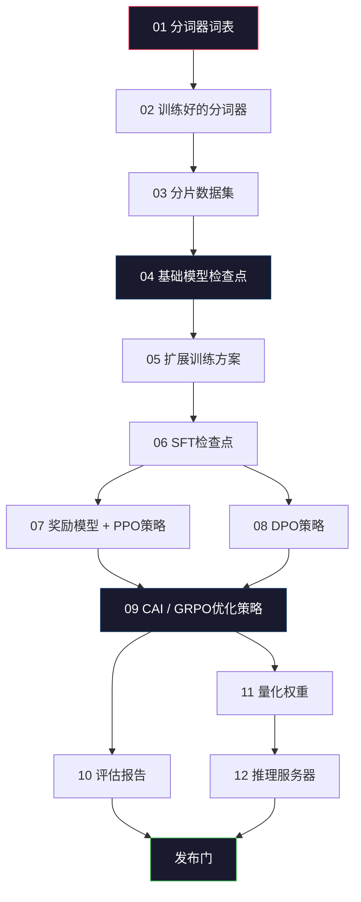
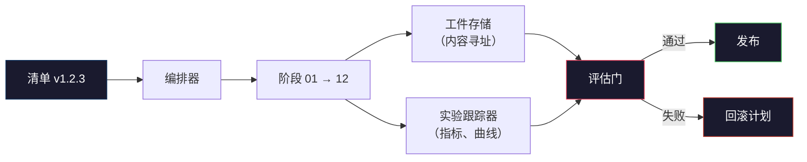

# 构建完整的LLM流水线

> 从课程01到12的所有内容都是一个流水线的一个阶段。本课程是将这些阶段连接成一个完整端到端运行的框架：分词、预训练、扩展、SFT、对齐、评估、量化、服务。你不会在笔记本上训练一个70B模型。你将产生编排层、清单、评估门和回滚计划——2026年前沿团队用来决定发布什么。这是收官之作。

**类型：** 构建
**语言：** Python（标准库）
**前置知识：** 阶段10的所有课程01-12
**时间：** ~120分钟

## 学习目标

- 将之前的十一门课程（分词器、数据、预训练、扩展、SFT、RLHF、DPO、CAI、评估、量化、推理）组合成一个单一可复现的流水线规范
- 定义阶段之间的工件契约：每个阶段消费什么、产出什么，以及下一阶段如何验证输入
- 构建一个编排器，跟踪实验、哈希工件、并在评估阈值上把关发布决策
- 设计回滚计划：哪些工件容易重新运行，哪些代价高昂，以及损坏的检查点会造成什么损失

## 问题

之前的课程各自都能工作。分词器训练好了。小GPT预训练好了。SFT数据集组装好了。奖励模型训练好了。DPO运行了。评估测量了。量化权重导出了。推理服务器启动了。每一个都是一个笔记本。每一个都有自己的约定、自己的输出路径、自己的随机种子。

一个前沿训练运行不是一个笔记本。Llama 3 405B用了大约54天、3000万H100小时。DeepSeek-V3用了大约280万H800小时。在那段时间里，一个损坏的检查点、一次数据污染、一次评估回归就可能让团队浪费一周的挂钟时间和一个月的GPU预算。团队能够生存下来的方式是依靠流水线卫生：每个阶段都有确定的输入、确定的输出、清单、哈希和门控。

这是收官之作。你不会在笔记本上端到端运行这个流水线。你将编写协调各阶段的编排器、描述运行的清单、把关发布决策的验证器、以及让第三方能够从单个文件重新运行你的工作的重放计划。代码量很小；纪律性很强。

这个模式从1亿到1万亿参数不变。相同的四个组件——清单、编排器、评估门、工件存储——既运行Llama 3，也运行你的爱好GPT。区别在于每个阶段配置内部的数值大小，而不是流水线的形状。

## 概念

### 十二个阶段

阶段10的每一课都是一个阶段。以下是完整的依赖图。



阶段07和08可以并行运行。其他一切都是硬依赖。阶段02（分词器）的更改会使所有下游工件失效。阶段10（评估）的更改只使发布决策失效。

### 清单

清单是一个单一文件，足够完整地描述一次运行以便重放。流水线产出的任何内容都不应依赖于清单中未包含的状态。这些字段很基础但必不可少。

```
pipeline_version: 1.2.3
seed: 42
git_commit: a1b2c3d4
stages:
  01_tokenizer:
    recipe: bpe_32k
    input_hash: sha256:...
    output_hash: sha256:...
    wall_clock_sec: 3600
    cost_usd: 12
```

阶段N的输出哈希就是阶段N+1的输入哈希。任何偏差都会导致流水线停止。这就是你尽早发现数据损坏的方法。也是不同洲际的团队成员验证他们的重放是否产生了与你相同的工件的方法。

实践中，团队使用一个小的YAML模式加上一个清单检查器，与上一次成功运行进行差异比较。预期字段（成本、挂钟时间）之外的任何差异都是危险信号。

### 工件类型化

每个阶段的输出是一个类型化的工件。不是一个目录 blob，不是一个 pickle，而是一个具有已知模式的命名类型。

| 阶段 | 工件类型 | 关键字段 |
|-------|---------|--------|
| 01-02 | Tokenizer | vocab.json, merges.txt, config.json, hash |
| 03 | Dataset | shards[], 行数, token数, 去重统计 |
| 04-05 | Checkpoint | weights.safetensors, config.json, 优化器状态, 步数 |
| 06 | SFT Model | 检查点 + SFT方案 + 数据混合 |
| 07 | Reward Model | RM检查点 + 偏好数据哈希 |
| 08-09 | Policy | 检查点 + 参考哈希 + beta + 已消耗KL预算 |
| 10 | Eval Report | 基准分数 + 回归差异 + 评估数据哈希 |
| 11 | Quantized Model | 量化权重 + 校准数据 + 与FP16的精度差异 |
| 12 | Server Spec | 端点 + 模型哈希 + 配置 + 可观测性钩子 |

类型化防止了最常见的故障模式：将阶段08的输出用作阶段06的输入，通过SFT路径发布一个DPO训练的模型。类型化工件和类型化阶段签名使这些错误成为编译时错误，而不是第五天的事故。

### 评估门

发布不是"训练完成"。发布是"训练完成且评估门通过了"。门是在运行开始前定义的。

```
gates:
  mmlu:      >= baseline + 0.5   # 无回归
  humaneval: >= baseline + 1.0
  truthfulqa: >= baseline         # 无下降
  safety_refusal_rate: <= 0.05
  kl_from_reference: <= 25.0
  cost_total_usd: <= 50000
```

每个门都是一个数值阈值。没有"看起来不错"的门。没有主观的签字确认。如果所有门都通过了，工件标记为可发布。如果任何门失败，运行将被挂起，等待指定审阅者的明确覆盖，该覆盖本身记录在清单中。

两个门能捕捉大多数灾难。一个**回归**门（新模型必须在核心基准上至少与之前一样好）捕捉训练错误。一个**KL预算**门（对齐策略不得偏离参考超过X）捕捉对齐过度调整。每个生产流水线都有这两个。

### 编排器

一段小的代码，读取清单、分派阶段、跟踪工件、并在任何契约违规时停止。这不是Airflow。这不是Kubeflow。对于流水线卫生，你想要的是你写的无聊的东西。

编排器的职责很窄：

1. 从清单解析DAG。
2. 对每个阶段，检查预期的输出是否已经以正确的哈希存在（存在则跳过）。
3. 运行阶段，捕获stdout/stderr，测量挂钟时间和成本。
4. 验证输出哈希是否与下游阶段预期的输入哈希匹配。
5. 失败时，写入包含确切失败阶段的局部清单并以非零退出。

那是200行Python。它会看起来像本课程中的`code/main.py`文件。在底层，真正的流水线使用`torchrun`或`ray`在集群上执行各个阶段，但编排器本身在单机上运行。

### 实验跟踪和工件存储

两个外部系统支撑流水线。

**实验跟踪器（wandb、neptune、mlflow）。** 记录每个阶段的损失曲线、评估指标、系统遥测。当你三周后需要比较运行A和运行B时，你要去跟踪器那里。团队几乎总是使用托管跟踪器——自己写会浪费本应用于训练的时间。

**工件存储（S3、R2、GCS）。** 用于检查点、数据集、分词器、评估报告的不可变对象存储。工件通过哈希寻址，而非文件名。像`latest.pt`这样的文件名是一个隐患；`ckpt-7b-step-20000-sha256:abc123.safetensors`是一个契约。

编排器写入两者。跟踪器是给人看图表用的。工件存储是给下一个阶段查找输入用的。

### 成本核算

前沿运行有一个美元数字。预算纪律发生在两个地方。

**运行前估算。** 从清单计算预期的FLOPs（对于预训练：6 x 参数 x token数）、预期的GPU小时数（FLOPs / 峰值吞吐量 / 利用率）、以及当前租赁费率下的美元成本。如果估算超过预算门，流水线拒绝启动。

**运行中跟踪。** 逐阶段的挂钟时间和成本记录到清单。每个阶段之后检查剩余预算。如果一个阶段超支，下一个阶段的门以新的剩余预算进行评估。你不会在VC打电话时才发现钱花光了。

Llama 3报告的成本为6100万美元。DeepSeek-V3报告主要预训练运行成本为560万美元。这个比例主要是硬件效率加上混合专家——但具体的成本可见是因为两个团队都按阶段跟踪，而不是按运行。

### 可重现性 vs 确定性

这两者不一样。*可重现*意味着相同的清单加上相同的代码加上相同的基础设施产生具有等效下游指标的检查点。*确定性*意味着比特级相同的输出。

现代LLM训练是可重现的但非确定性的。分布式训练的reduce顺序、GPU内核非确定性（cuBLAS、flash-attn）和混合精度舍入相结合，产生在1e-5级别上不同的浮点数。这对最终指标来说是可以的，指标不会变化。但如果你试图通过比特级差异进行调试，这是致命的。解决方法是在每个阶段记录输入哈希、输出哈希和关键指标——如果这些匹配，即使权重不是比特级相同的，运行也算"可重现"。



### 回滚计划

在运行开始之前，写下每个阶段失败时的应对方案。三类：

- **容易重新运行**（小时级）：分词器、评估、量化、推理服务器。直接重新运行。
- **中等**（天级）：SFT、DPO、CAI。保留基础模型；只重新运行对齐阶段。
- **代价高昂**（周级和数百万美元）：预训练。这里的回滚计划不是"重新运行"。它是"使用最后一个好的检查点，以修订后的数据重新运行更便宜的下游阶段"。

因为阶段依赖是类型化和哈希化的，编排器可以自动计算回滚集：使失败阶段加上所有后代失效。阶段06（SFT）的失败使06、07、08、09、10、11、12失效。阶段11（量化）的失败只使11和12失效。提前命名这些可以避免团队在凌晨4点筋疲力尽时临时抱佛脚。

### 2026年观察到的生产方案

大多数前沿团队趋同于相同的骨架：

- 分词器：128k BPE，带字节回退。在小的、平衡的多语言切片上训练。
- 预训练：10-20T token，主要是网页加代码加合成数据。Muon或AdamW优化器。FSDP2或DeepSpeed ZeRO-3。梯度检查点。BF16权重，FP32主权重。
- SFT：50万-200万指令对，混合人工和合成数据，严格去重评估集。
- 对齐：DPO或CAI + GRPO。只有当偏好评级信号对DPO来说过于多维时才使用RLHF。
- 评估：MMLU-Pro、MATH、HumanEval+、GPQA、SWE-Bench Verified、LiveBench，加上一个公众从未见过的私有保留集。
- 量化：推理用4-bit GPTQ或AWQ，精度差异重要的安全评估用8-bit。
- 服务：vLLM、TensorRT-LLM或自研。连续批处理。推测解码。KV缓存淘汰。

数字每六个月变化一次。骨架不变。

```figure
beam-search
```

## 构建它

本课程的代码是一个编排器和一个清单检查器，而不是十二个训练脚本。每个阶段用一个占位符模拟，该占位符产生具有正确形状和哈希的输出工件。端到端运行编排器证明流水线的管道在你烧GPU钱之前是工作的。

完整的实现见`code/main.py`。关键组件：

- `Manifest`数据类：流水线版本、随机种子、git提交、阶段、门。
- `Stage`数据类：名称、类型、输入（哈希）、输出（哈希）、挂钟时间、成本。
- `Orchestrator.run()`：解析DAG，分派阶段，验证哈希，更新清单。
- `EvalGate.check()`：读取阈值，与最新评估报告比较，返回通过/失败。
- `ArtifactStore`（内存桩）：按哈希put/get，模拟S3。
- `CostTracker`：逐阶段和累计，超出上限时停止。

`main.py`中的流水线运行十二个占位阶段，生成一个清单，并执行一个失败的评估门来展示被挂起的运行是什么样子的。用相应课程的真实训练脚本替换每个占位符，你就得到了真正前沿流水线使用的骨架。

## 使用它

标准工作流有三个命令。

```
python code/main.py plan    # 验证清单，计算成本估算，打印DAG
python code/main.py run     # 执行阶段，写入manifest.out.yaml
python code/main.py gate    # 读取manifest.out.yaml，应用评估门，发布或挂起
```

每次先运行`plan`。大多数流水线错误在计划阶段就显现出来——缺失的门阈值、过期的哈希、预算超支。运行`plan`是免费的。运行`run`是昂贵的。通过在廉价侧捕捉错误来节省资金。

`gate`的输出要么是`SHIP`，要么是`HOLD： <原因>`。被挂起的运行不是失败；它是一个决策点。指定的审阅者要么覆盖（覆盖会被记录），要么批准回滚。

## 产出

本课程产出`outputs/skill-llm-pipeline-reviewer.md`。给它一个提议的流水线清单，它检查所有契约：阶段类型化、哈希链、门、回滚计划、成本估算。它拒绝批准缺少评估门、无界KL预算、或混合评估和训练数据的运行的清单。

## 练习

1. 扩展编排器以支持阶段07和08的并行执行。使用标准库的`concurrent.futures`模块。确认最终的清单记录了两个阶段的输出，并且阶段09的输入哈希是两者的确定性组合。

2. 添加一个"污染检查"门。给定评估数据集哈希和训练数据集分片，计算重叠（精确字符串匹配或13-gram匹配）。如果重叠超过0.1%，门失败。输入一个受污染的训练集并确认门阻止了运行。

3. 从基本原理实现成本估算器。对于阶段04（预训练），将FLOPs估算为6 x 参数 x token数，假设H100在989 TFLOPS BF16下40% MFU（模型FLOPS利用率），按$2.50/GPU小时计算。报告在2T token上训练的7B模型的估算。与已发布的Llama 2数据进行比较。

4. 构建部分回滚。模拟阶段09（CAI）的失败，然后重新运行阶段09到12，同时保持01-08缓存。编排器应按哈希检测缓存的工件并跳过它们。测量与完全重新运行相比节省的挂钟时间。

5. 添加可观测性。为每个阶段发出OpenTelemetry跨度，带有参数、已见token数、损失和成本等属性。将跨度传输到本地收集器。目的不是仪表板；目的是每个阶段的健康状况可以从一个单一的跟踪ID追踪。

## 关键术语

| 术语 | 人们说的 | 实际含义 |
|------|---------|---------|
| 清单 | "配方文件" | 描述流水线版本、随机种子、每个阶段配置和门阈值的YAML或JSON——足够重放一次运行 |
| 内容寻址 | "按哈希而非名称" | 工件按内容的SHA-256存储，因此你永远不会混淆版本A和版本B |
| 评估门 | "发布标准" | 基准指标和安全分数上的数值阈值，必须在工件被标记为可发布之前通过 |
| KL预算 | "对齐漂移了多少" | 跨对齐阶段的累计KL(策略 || 参考)的上限，作为门强制执行 |
| MFU | "你用了多少GPU" | 模型FLOPS利用率——达到的FLOPS除以理论峰值。70B规模下40%是典型的，7B下为55% |
| 回滚计划 | "出问题时我们做什么" | 每个阶段失败时预先写好的操作集：重新运行、回退、用修订过的输入重新训练 |
| 编排器 | "指挥" | 读取清单、分派阶段、验证哈希、在任何契约违规时停止的进程 |
| 工件存储 | "权重版的S3" | 不可变的内容寻址对象存储——检查点、数据集、评估报告的单一真实来源 |
| 可重现 | "重放时相同指标" | 不同的比特级权重但等效的下游指标——分布式LLM训练的务实目标 |
| 成本门 | "你不能超过X" | 运行前成本估算加运行中跟踪器——如果估算超过预算，流水线拒绝启动 |

## 延伸阅读

- [Dubey等，2024 -- "The Llama 3 Herd of Models"](https://arxiv.org/abs/2407.21783) -- 最详细的前沿流水线公开描述，包括数据、训练、对齐、评估
- [DeepSeek-AI，2024 -- "DeepSeek-V3 Technical Report"](https://arxiv.org/abs/2412.19437) -- 效率优先的流水线，成本约为Llama 3类训练的1/10
- [Kaplan等，2020 -- "Scaling Laws for Neural Language Models"](https://arxiv.org/abs/2001.08361) -- 原始的计算-数据-参数扩展关系
- [Hoffmann等，2022 -- "Training Compute-Optimal Large Language Models (Chinchilla)"](https://arxiv.org/abs/2203.15556) -- 对Kaplan的修正，重新校准了现代数据预算
- [PyTorch FSDP2文档](https://pytorch.org/docs/stable/fsdp.html) -- 在PyTorch 2.4+中取代FSDP1的分布式训练原语
- [Weights & Biases LLM Reports](https://wandb.ai/site/llms) -- 开源LLM运行的真实清单和实验跟踪器输出，可作为可复制的模板
