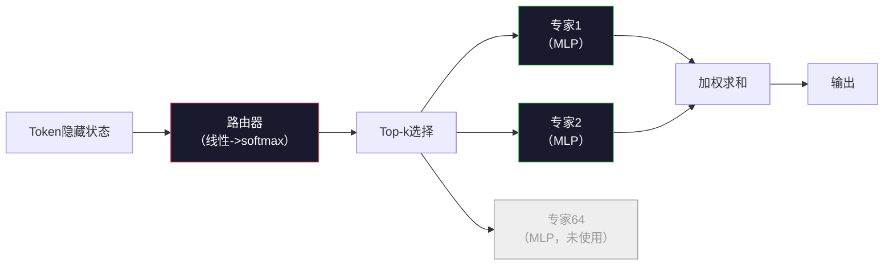

# 开源模型：架构深度解析

> 你在课程04中从头构建了一个GPT-2 Small。2026年的前沿开源模型是同一家族，仅有五六个具体的变化。RMSNorm替代LayerNorm。SwiGLU替代GELU。RoPE替代学习位置编码。GQA或MLA替代完整MHA。大规模混合专家。你已经掌握的数学覆盖了其中95%。本课程并行阅读Llama 3、DeepSeek-V3、Mixtral、Qwen和Gemma，并指出每个架构分叉的确切行。

**类型：** 学习
**语言：** Python（标准库）
**前置知识：** 阶段10，课程04、05、12（预训练、扩展、推理）
**时间：** ~45分钟

## 学习目标

- 阅读Llama 3、Mistral、Mixtral、Gemma 2、Qwen 2.5和DeepSeek-V3的config.json，并解释每个字段
- 指出每个模型相对于GPT-2 Small所做的具体架构变更，并从基本原理进行论证
- 仅从配置计算任何开源模型的参数数量、KV缓存大小和激活内存
- 根据延迟、内存和能力约束为部署目标选择正确的开源模型

## 问题

在课程04中你写了350行numpy就有了一个GPT-2形状的模型。Llama 3 405B有一份200页的技术报告。你的直觉是这些是不同的造物。它们不是。那200页描述了同一个对象，带有五六个动机明确的修改，加上一千个关于扩展的实现细节。骨架——嵌入、Transformer块、注意力、MLP、归一化、头部——没有变化。

本课程是一个差异比较。对于每个主要的开源模型家族，我们列出相对于GPT-2具体改变了什么，为什么，以及代价是什么。完成后，你可以阅读一个新的模型卡，并在精神上将其翻译回GPT-2基线。

实际回报是：当Meta发布Llama 5或DeepSeek发布V4时，你不需要一个新的心智模型。你将查看配置，看看哪些已知的旋钮发生了变化，并知道下游影响是什么。2026年的架构是一个有限的工具箱。每个新模型选择一个不同的子集。

## 概念

### 不变核心

所有自回归开源模型共享：

- Token嵌入矩阵（vocab_size x hidden_dim）。
- N个解码器块的堆叠：归一化、自注意力、残差连接、归一化、MLP、残差连接。
- 最终归一化和投影到vocab_size的线性头（通常与嵌入权重绑定）。
- 因果掩码，下一个token的交叉熵损失。

这就是形状。其余的是旋钮。

### 实际变化的六个旋钮

在每一个2024-2026年的前沿开源模型中，相同的六个设计选择被反复选取：

1. **归一化。** LayerNorm -> RMSNorm。
2. **位置编码。** 学习绝对位置 -> RoPE（以及变体：YaRN、NTK）。
3. **激活函数。** GELU -> SwiGLU（或GeGLU）。
4. **注意力头共享。** MHA -> GQA -> MQA -> MLA。
5. **密集 vs 稀疏MLP。** 密集 -> 混合专家。
6. **预归一化位置。** 预归一化保持不变。后归一化已被淘汰。

其他一切（学习率调度、数据混合、批次大小、上下文长度）都存在于训练配置中，而非架构中。六个旋钮。

### 旋钮1：RMSNorm

LayerNorm减去均值，除以标准差，缩放，平移。RMSNorm只保留缩放：

```
RMSNorm(x) = x / sqrt(mean(x^2) + eps) * gamma
```

没有均值减法。没有偏置。每个token少一次矩阵乘法。Zhang和Sennrich（2019）论证它与LayerNorm在机器翻译上相当，同时快10%。每个现代开源模型都使用它。

成本：无。收益：小的吞吐量提升，更简单的代码。

### 旋钮2：RoPE

学习位置嵌入在GPT-2中是一个1024槽的查找表。上下文1025超出了表的末端。模型不能外推超过其训练长度。

旋转位置嵌入（RoPE，Su等，2021）通过在注意力点积之前成对旋转每个Q和K向量来注入位置。旋转角度是位置的确定性函数，因此没有需要学习的参数，也不会用完。借助扩展技巧（NTK感知插值、YaRN），在8k上下文上训练的模型可以在推理时扩展到128k，精度损失适中。

```
q_rotated = rotate(q, angle(pos))
k_rotated = rotate(k, angle(pos))
score = q_rotated . k_rotated
```

每个Llama、Mistral、Qwen、DeepSeek和Gemma都使用RoPE。Gemma 2使用混合方式（大多数层用RoPE，其他层用局部滑动窗口注意力）。

### 旋钮3：SwiGLU

GPT-2的MLP是`x -> gelu(xW1 + b1) -> (...)W2 + b2`。SwiGLU（Shazeer 2020）用门控乘积替换了激活函数：

```
SwiGLU(x) = (xW1) * sigmoid(xW1) * xV
```

两个投影并行，而不是一个，由Swish激活门控。经验上每个参数在困惑度上更强。Llama 2采用了它，其他都跟进。MLP的隐藏大小通常设置为使总参数数量与原始密集MLP匹配：如果GPT-2使用`ff_dim = 4 * hidden`，SwiGLU使用`ff_dim = (2/3) * 4 * hidden = 8/3 * hidden`。

### 旋钮4：注意力头共享

GPT-2使用**多头注意力（MHA）**：每个头有自己的Q、K、V投影。

**多查询注意力（MQA，Shazeer 2019）**在所有头之间共享一个K和一个V。将KV缓存减少num_heads倍，在典型模型上为12倍到32倍减少。在硬基准上精度略有下降。

**分组查询注意力（GQA，Ainslie等，2023）**是中间地带：G组Q头共享一个K和一个V。Llama 3 8B使用GQA，32个Q头和8个KV头（G=8），因此KV缓存相比完整MHA缩小了4倍。

**多头潜在注意力（MLA，DeepSeek 2024）**将K和V压缩到一个共享的低秩潜在空间中，并在每个头上投影回来。进一步减少KV缓存，同时保留每头的表现力。DeepSeek-V2和V3依赖于此实现其长上下文性能。

| 方案 | KV头数 | KV缓存 | 精度 |
|------|--------|--------|------|
| MHA | num_heads | 完整 | 最佳 |
| GQA | num_groups（G < num_heads） | num_heads / G 减少 | 接近MHA |
| MQA | 1 | num_heads 减少 | 小幅损失 |
| MLA | 潜在，每头解压缩 | 比MQA更小 | 接近MHA |

对于任何约13B参数以上的模型，GQA或MLA实际上是强制性的。大规模下的完整MHA是一个KV缓存灾难。

### 旋钮5：混合专家

密集MLP为每个token激活其所有参数。MoE MLP在每个块中有K个专家和一个路由器，为每个token选择top-k专家（通常为top-2）。只有那些专家的权重对该token进行前向传播。

```
router_logits = xW_r
indices, weights = top_k(router_logits, k=2)
output = sum_i weights[i] * expert[indices[i]](x)
```

吸引力在于：你可以有64个大小为7B的专家（因此总参数数量巨大），而每个token只运行其中2个（因此每token计算量匹配密集7B模型）。Mixtral 8x7B总共有47B参数，但每个token只激活13B。DeepSeek-V3总共有671B参数，但每个token只激活37B。



优点：相同计算，更多参数，更好容量。缺点：专家内存仍然必须存在某处（因此服务需要比密集等效更多的VRAM），平衡路由器的负载很困难，在对齐期间微调路由器是其自身的研究领域。

### 旋钮6：预归一化保持不变

原始的Transformer在每个子层之后应用层归一化。自GPT-2以来的每个开源模型都将其放在*每个子层之前*。预归一化在深度训练中严格更容易。没什么可争论的。

### 逐模型差异比较

以下是使所有这些具体化的表格。

| 模型 | 年份 | 总参数 | 激活参数 | 归一化 | 激活函数 | 位置 | 注意力 | MoE | 上下文 |
|------|------|--------|---------|--------|---------|------|--------|-----|--------|
| GPT-2 Small | 2019 | 124M | 124M | LayerNorm | GELU | 学习 | MHA（12头） | 否 | 1k |
| Llama 3 8B | 2024 | 8B | 8B | RMSNorm | SwiGLU | RoPE | GQA（32/8） | 否 | 128k |
| Llama 3 70B | 2024 | 70B | 70B | RMSNorm | SwiGLU | RoPE | GQA（64/8） | 否 | 128k |
| Llama 3 405B | 2024 | 405B | 405B | RMSNorm | SwiGLU | RoPE | GQA（128/16） | 否 | 128k |
| Mistral 7B | 2023 | 7.2B | 7.2B | RMSNorm | SwiGLU | RoPE | GQA | 否 | 32k |
| Mixtral 8x7B | 2023 | 47B | 13B | RMSNorm | SwiGLU | RoPE | GQA | 是（8专家，top-2） | 32k |
| Gemma 2 9B | 2024 | 9B | 9B | RMSNorm（pre+post） | GeGLU | RoPE + 滑动 | GQA | 否 | 8k |
| Qwen 2.5 72B | 2024 | 72B | 72B | RMSNorm | SwiGLU | RoPE（YaRN） | GQA（64/8） | 否 | 128k |
| DeepSeek V2 236B | 2024 | 236B | 21B | RMSNorm | SwiGLU | RoPE | MLA | 是（160专家，top-6） | 128k |
| DeepSeek V3 | 2024 | 671B | 37B | RMSNorm | SwiGLU | RoPE | MLA | 是（256专家，top-8） | 128k |

扫描这些列。RMSNorm是通用的。SwiGLU或其GeGLU表亲是通用的。RoPE是通用的。GQA在7B以上是通用的，除非被MLA取代。MoE是高端的分化因素。

### 读取config.json

Llama 3 8B配置：

```
{
  "hidden_size": 4096,
  "intermediate_size": 14336,
  "num_hidden_layers": 32,
  "num_attention_heads": 32,
  "num_key_value_heads": 8,
  "max_position_embeddings": 131072,
  "rope_theta": 500000.0,
  "rms_norm_eps": 1e-5,
  "vocab_size": 128256
}
```

每个字段都对应于你已经实现的东西。

- `hidden_size`：嵌入维度。
- `intermediate_size`：MLP隐藏大小（3.5倍hidden -- SwiGLU数学）。
- `num_hidden_layers`：堆叠深度。
- `num_attention_heads`：Q头数。
- `num_key_value_heads`：KV头数（GQA）。
- `max_position_embeddings`：训练上下文长度。
- `rope_theta`：RoPE基础频率。Meta将其从默认的10k扩展到500k以实现长上下文外推。
- `rms_norm_eps`：数值稳定性。
- `vocab_size`：token数量。

仅凭这些你就可以计算总参数、KV缓存和峰值激活内存。确切的公式见`code/main.py`。

### 激活内存预算

在几十亿参数以上，激活主导训练内存。预训练的经验法则（使用梯度检查点）：

```
activation_mem ~ batch_size * seq_len * hidden_size * num_layers * bytes_per_element
```

对于Llama 3 8B，batch=1，seq=8192，BF16，32层，hidden=4096：使用检查点大约8 GB仅用于激活，不使用则为40 GB。这就是为什么flash-attention和ring-attention很重要——它们重写了注意力计算，使激活变得更小。

### KV缓存预算

用于最大上下文推理：

```
kv_cache = 2 * num_layers * num_kv_heads * head_dim * max_seq_len * bytes_per_element
```

Llama 3 8B在128k上下文、BF16、head_dim = hidden / num_heads = 128下：
`2 * 32 * 8 * 128 * 131072 * 2 = 17.2 GB` 每个序列。

8B的权重在BF16下是16 GB。单个128k序列的KV缓存比权重还大。这就是推动GQA、MLA和KV缓存量化研究的内存压力。

### 每个模型何时胜出

- **单块80GB GPU，无MoE**：Llama 3 8B、Mistral 7B、Gemma 2 9B。易于服务，工具广泛。
- **单节点（8x80GB），大容量**：Llama 3 70B、Qwen 2.5 72B。最高密集开源能力。
- **最大开源能力，接受MoE复杂性**：DeepSeek V3、Mixtral 8x22B。每个激活FLOP的最佳能力。
- **长上下文需求**：Llama 3（带RoPE扩展的128k）、DeepSeek（MLA优势）。
- **低延迟服务**：Gemma 2 9B（滑动窗口减少长上下文计算）。

```figure
rmsnorm-vs-layernorm
```

## 构建它

本课程的代码是一个计算器。给定任何config.json，它按组件打印参数数量、最大上下文下的KV缓存、SwiGLU MLP比率、以及对架构的简短判断（密集/GQA/MLA/MoE）。

```python
config = {
    "hidden_size": 4096, "intermediate_size": 14336,
    "num_hidden_layers": 32, "num_attention_heads": 32,
    "num_key_value_heads": 8, "vocab_size": 128256,
    "max_position_embeddings": 131072,
}
```

该脚本逐字段遍历架构，计算嵌入、注意力（带GQA缩减）、MLP（带SwiGLU扩展）、层归一化和头部的参数数量。然后计算在所述上下文长度下的KV缓存并打印摘要。

实现见`code/main.py`。

## 使用它

在脚本中捆绑的Llama 3 8B、Mistral 7B、Mixtral 8x7B和DeepSeek V3配置上运行计算器。比较参数分解。注意MoE模型的总参数数量远远超过密集模型，但激活参数数量往往更小。注意DeepSeek V3的KV缓存比Llama 3 405B更小，尽管有更多的总参数——这就是MLA的作用。

然后为你在本地的任何模型插入配置，阅读摘要，并决定它是否适合你的GPU。

## 产出

本课程产出`outputs/skill-open-model-picker.md`。给定一个部署目标（GPU类型、VRAM、上下文长度、延迟预算）和一个任务画像（聊天、代码、推理、长上下文），它推荐一个开源模型、来自课程11的量化和来自课程12的推理栈，并包含关于六个架构旋钮的明确推理。

## 练习

1. 从HuggingFace读取Qwen 2.5 72B配置。从头计算总参数。与HF报告的值比较，并确定任何差异的来源（头维度舍入、KV共享因子等）。

2. DeepSeek V3使用256个专家和top-8路由。计算激活专家与总专家的比率，并与Mixtral 8x7B的top-2 of 8进行比较。从稀疏（25%）到更密稀疏（3%）的转变对每个FLOP的容量意味着什么？

3. 以FP8和BF16计算Llama 3 405B在128k上下文下的KV缓存。FP8下是BF16数字的一半。你可以在单个8xH100节点（每个80GB = 总计640GB，减去权重内存）上服务多少个并行序列？

4. Gemma 2交替使用完全注意力和滑动窗口注意力层。当一半的层使用4096 token的滑动窗口而非完整上下文时，写出KV缓存的数学计算。在8k总上下文下这节省多少内存？

5. 找一个在本课程编写之后发布的最新前沿开源模型。识别它选择了六个旋钮中的哪些，以及是否引入了第七个旋钮。课程内容在新架构发布时会感觉过时——目标是更新你的表格而不重建你的心智模型。

## 关键术语

| 术语 | 人们说的 | 实际含义 |
|------|---------|---------|
| RMSNorm | "没有均值的LayerNorm" | 仅按均方根归一化，带学习的缩放——更便宜且与LayerNorm相当 |
| RoPE | "旋转位置" | 在2D对中按依赖位置的角旋转每个Q和K向量——借助扩展技巧可外推超出训练长度 |
| SwiGLU | "新的MLP激活函数" | 带Swish的门控线性单元：`(xW1) * sigmoid(xW1) * xV`——每个2024+开源模型的标准 |
| GQA | "中间地带注意力" | 分组查询注意力：G组Q头共享一个K和一个V头——缩小KV缓存而不产生MQA的精度损失 |
| MLA | "DeepSeek的注意力" | 多头潜在注意力：将K/V压缩到共享低秩潜在空间，每头解压缩——大模型的最小KV缓存 |
| MoE | "稀疏专家" | 混合专家：每块N个MLP，路由器为每个token选择top-k——巨大总参数，小激活参数 |
| Top-k路由 | "每个token选k个专家" | 路由器计算每个专家的分数并激活最高的k个——典型k为2（Mixtral）到8（DeepSeek） |
| YaRN | "拉伸RoPE" | Yet another RoPE extension——插值旋转角度以在推理时将上下文从8k扩展到128k+ |
| 滑动窗口注意力 | "不关注所有内容" | 每个token只关注最后W个token——将注意力成本限制在O(W)每token，用于Gemma 2和早期Mistral |
| 激活参数 | "每个token运行什么" | 对于MoE模型，每个token进行前向传播的参数数量（远小于总参数）——控制每token FLOPs |

## 延伸阅读

- [Dubey等，2024 -- "The Llama 3 Herd of Models"](https://arxiv.org/abs/2407.21783) -- 密集Llama 3家族的架构和训练参考
- [DeepSeek-AI，2024 -- "DeepSeek-V3 Technical Report"](https://arxiv.org/abs/2412.19437) -- MLA加无辅助损失负载均衡加671B MoE
- [Jiang等，2024 -- "Mixtral of Experts"](https://arxiv.org/abs/2401.04088) -- 经典的MoE开源模型论文
- [Su等，2021 -- "RoFormer: Enhanced Transformer with Rotary Position Embedding"](https://arxiv.org/abs/2104.09864) -- RoPE论文
- [Shazeer，2020 -- "GLU Variants Improve Transformer"](https://arxiv.org/abs/2002.05202) -- SwiGLU、GeGLU等
- [Ainslie等，2023 -- "GQA: Training Generalized Multi-Query Transformer Models"](https://arxiv.org/abs/2305.13245) -- GQA论文
- [Gemma 2 Team，2024 -- "Gemma 2: Improving Open Language Models at a Practical Size"](https://arxiv.org/abs/2408.00118) -- 混合全+滑动注意力，pre+post归一化
- [Qwen Team，2024 -- "Qwen 2.5 Technical Report"](https://arxiv.org/abs/2412.15115) -- YaRN上下文扩展和长上下文训练方案
