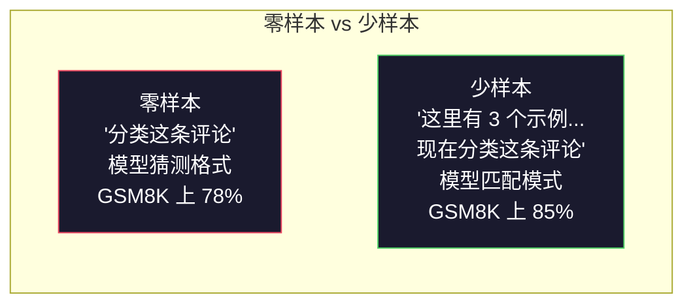
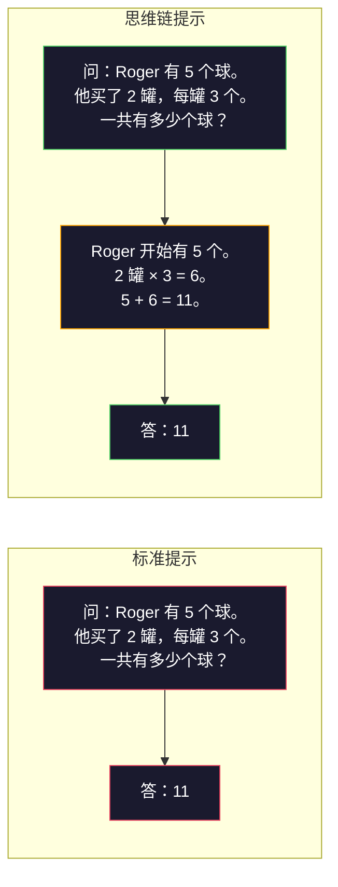
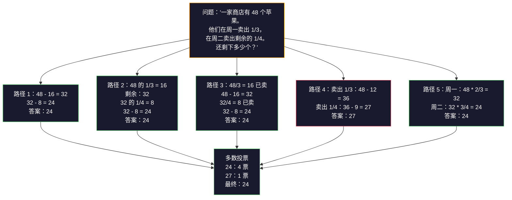
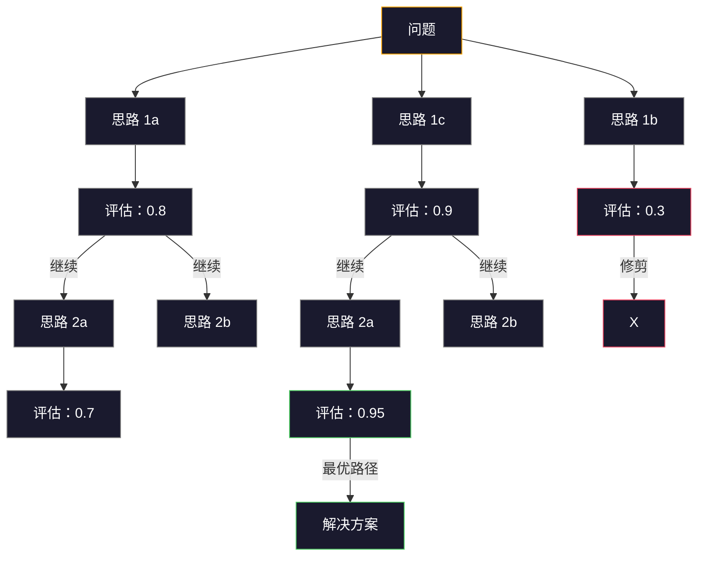

# 少样本、思维链、思维树

> 告诉模型要做什么是提示。教它如何思考是工程。在相同模型、相同任务、相同数据上，78% 和 91% 准确率之间的差距不是更好的模型。而是更好的推理策略。

**类型：** 构建
**语言：** Python
**前置知识：** 课程 11.01（提示词工程）
**时间：** 约 45 分钟

## 学习目标

- 通过选择和格式化示例演示来实现少样本提示，以最大化任务准确性
- 应用思维链推理来提高多步问题（如数学应用题）的准确性
- 构建一个思维树提示词，探索多个推理路径并选择最优的
- 在标准基准上测量零样本与少样本与思维链的准确性提升

## 问题

你构建了一个数学辅导应用。你的提示词说："解这道应用题。"GPT-5 在 GSM8K（标准的小学数学基准）上做对了 94% 的题目。你认为已经到顶了。实际上还没有——思维链仍然能增加 3-4 个百分点。

加上五个字——"让我们逐步思考"——准确率跃升至 97%。添加几个工作示例后达到 98%。相同模型。相同温度。相同 API 成本。唯一的区别是你给了模型草稿纸。

这不是一种黑客技巧。这就是推理的工作方式。人类不会通过一次心理飞跃解决多步问题。Transformer 也不行。当你迫使模型生成中间词元时，这些词元成为下一个词元的上下文的一部分。每个推理步骤都会喂养下一个步骤。模型实际上是计算着走向答案。

但"逐步思考"只是开始，不是结束。如果你采样五个推理路径并取多数投票会怎样？如果你让模型探索一棵可能性树，评估和修剪分支会怎样？如果你将推理与工具使用交错进行会怎样？这些不是假设。它们是已发表的、有测量改进的技术，你将在本课程中构建所有这些技术。

## 概念

### 零样本与少样本：当示例胜过指令时

零样本提示直接给模型一个任务，没有其他内容。少样本提示先给示例。

Wei 等人（2022）在 8 个基准上对此进行了测量。对于简单任务如情感分类，零样本和少样本的表现相差在 2% 以内。对于复杂任务如多步算术和符号推理，少样本将准确率提高了 10-25%。

直觉：示例是压缩后的指令。你不是描述输出格式，而是展示它。你不是解释推理过程，而是示范它。模型在示例上进行模式匹配比解释抽象指令更可靠。



**少样本胜出时：** 格式敏感任务、分类、结构化提取、领域特定术语、任何需要模型匹配特定模式的任务。

**零样本胜出时：** 简单事实问题、创意任务（示例会限制创造力）、找到好示例比写出好指令更困难的任务。

### 示例选择：相似优于随机

并非所有示例都是平等的。选择与目标输入相似的示例，在分类任务上比随机选择好 5-15%（Liu 等人，2022）。三个原则：

1. **语义相似性**：选择在嵌入空间中与输入最接近的示例
2. **标签多样性**：在示例中覆盖所有输出类别
3. **难度匹配**：匹配目标问题的复杂度水平

大多数任务的最优示例数量是 3-5 个。低于 3 个，模型没有足够的信号来提取模式。超过 5 个，你会遇到收益递减并浪费上下文窗口词元。对于有许多标签的分类任务，每个标签使用一个示例。

### 思维链：给模型草稿纸

思维链提示由 Wei 等人（2022）在 Google Brain 提出。这个想法很简单：不要只要求模型给出答案，而是要求它先展示推理步骤。



这在机制上为何有效？Transformer 生成的每个词元都成为下一个词元的上下文。没有 CoT，模型必须将所有推理压缩到一次前向传递的隐藏状态中。有了 CoT，模型将中间计算外化为词元。每个推理词元延长了有效计算深度。

**GSM8K 基准（小学数学，8.5K 个问题）：**

| 模型 | 零样本 | 零样本 CoT | 少样本 CoT |
|------|--------|-----------|-----------|
| GPT-4o | 78% | 91% | 95% |
| GPT-5 | 94% | 97% | 98% |
| o4-mini（推理） | 97% | — | — |
| Claude Opus 4.7 | 93% | 97% | 98% |
| Gemini 3 Pro | 92% | 96% | 98% |
| Llama 4 70B | 80% | 89% | 94% |
| DeepSeek-V3.1 | 89% | 94% | 96% |

**关于推理模型的说明。** 像 OpenAI 的 o 系列（o3、o4-mini）和 DeepSeek-R1 这类模型在发出答案之前会在内部运行思维链。在推理模型上添加"让我们逐步思考"是多余的，有时甚至适得其反——它们已经这样做过了。

CoT 的两种形式：

**零样本 CoT**：在提示词后追加"让我们逐步思考"。不需要示例。Kojima 等人（2022）表明，这一句话就能在算术、常识和符号推理任务上提高准确性。

**少样本 CoT**：提供包含推理步骤的示例。比零样本 CoT 更有效，因为模型看到了你期望的确切推理格式。

**CoT 有损时：** 简单事实回忆（"法国的首都是什么？"）、单步分类、速度比准确性更重要的任务。CoT 每次查询增加 50-200 词元的推理开销。对于高吞吐量、低复杂度的任务，这是浪费成本。

### 自一致性：多次采样，一次投票

Wang 等人（2023）引入了自一致性。其洞见是：单一的 CoT 路径可能包含推理错误。但如果你使用温度 > 0 采样 N 个独立的推理路径，并在最终答案上取多数投票，错误就会相互抵消。



自一致性在原始的 PaLM 540B 实验中将 GSM8K 准确率从 56.5%（单次 CoT）提高到 74.4%（N=40）。在 GPT-5 上改进幅度很小（97% 到 98%），因为基础准确率已经饱和。该技术在最能发挥作用的模型上，CoT 基础准确率在 60-85%——这是单路径错误频繁但非系统性的理想区间。对于推理模型（o 系列、R1），自一致性已被内置的内部采样所取代。

权衡：N 次采样意味着 N 倍的 API 成本和延迟。在实践中，N=5 能捕捉到大部分收益。N=3 是有意义投票的最低要求。大多数任务中 N > 10 的收益递减。

### 思维树：分支探索

Yao 等人（2023）引入了思维树。CoT 遵循一条线性的推理路径，而 ToT 则探索多个分支，并在继续之前评估哪些分支最有希望。



ToT 有三个组成部分：

1. **思路生成**：产生多个候选的下一步
2. **状态评估**：为每个候选评分（可以使用 LLM 本身作为评估器）
3. **搜索算法**：通过树进行 BFS 或 DFS，修剪分数低的分支

在"24 点游戏"任务（使用算术组合 4 个数字得到 24）上，标准提示的 GPT-4 解决 7.3% 的问题。使用 CoT 为 4.0%（CoT 在这里实际上有损，因为搜索空间很宽）。使用 ToT 为 74%。

ToT 很昂贵。树中的每个节点都需要一次 LLM 调用。分支因子为 3、深度为 3 的树可能需要多达 39 次 LLM 调用。只将其用于搜索空间大但可评估的问题——规划、解谜、带约束的创意问题解决。

### ReAct：思考 + 行动

Yao 等人（2022）将推理轨迹与行动结合起来。模型在思考（生成推理）和行动（调用工具、搜索、计算）之间交替。


ReAct 在知识密集型任务上优于纯 CoT，因为它可以将推理基于真实数据。在 HotpotQA（多跳问答）上，使用 GPT-4 的 ReAct 实现 35.1% 的精确匹配，而纯 CoT 为 29.4%。真正的威力在于推理错误会被观察结果纠正——模型可以在执行过程中更新其计划。

ReAct 是现代 AI 智能体的基础。每个智能体框架（LangChain、CrewAI、AutoGen）都实现了"思考-行动-观察"循环的某种变体。你将在阶段 14 中构建完整的智能体。本课程涵盖提示模式。

### 结构化提示：XML 标签、分隔符、标题

随着提示词变得复杂，结构可以防止模型混淆各个部分。三种方法：

**XML 标签**（在 Claude 上效果最好，其他地方也不错）：
```
<context>
你正在审查一个拉取请求。
代码库使用 TypeScript 和 React。
</context>

<task>
审查以下差异（diff）中的错误、安全问题和风格违规。
</task>

<diff>
{diff_content}
</diff>

<output_format>
列出每个问题，包括：文件、行号、严重性（严重/警告/信息）、描述。
</output_format>
```

**Markdown 标题**（通用）：
```
## 角色
一家金融科技公司的高级安全工程师。

## 任务
分析这个 API 端点的漏洞。

## 输入
{api_code}

## 规则
- 关注 OWASP Top 10
- 对每个发现评级：严重、高、中、低
- 包含修复步骤
```

**分隔符**（简单但有效）：
```
---输入---
{user_text}
---输入结束---

---指令---
用 3 个要点总结上述内容。
---指令结束---
```

### 提示链：顺序分解

有些任务对单个提示词来说太复杂了。提示链将它们分解为步骤，一个提示词的输出成为下一个提示词的输入。


链式提示击败单次提示的原因有三：

1. **每一步更简单**：模型处理一个聚焦的任务，而不是同时处理所有事情
2. **中间输出可检查**：你可以在步骤之间验证和纠正
3. **不同步骤可以使用不同的模型**：用便宜的模型做提取，用昂贵的模型做推理

### 性能比较

| 技术 | 最适合 | GSM8K 准确率（GPT-5） | API 调用 | 词元开销 | 复杂度 |
|------|-------|---------------------|----------|---------|--------|
| 零样本 | 简单任务 | 94% | 1 | 无 | 简单 |
| 少样本 | 格式匹配 | 96% | 1 | 200-500 词元 | 低 |
| 零样本 CoT | 快速推理提升 | 97% | 1 | 50-200 词元 | 简单 |
| 少样本 CoT | 最大单次调用准确性 | 98% | 1 | 300-600 词元 | 低 |
| 自一致性（N=5） | 高风险推理 | 98.5% | 5 | 5 倍词元成本 | 中 |
| 推理模型（o4-mini） | 即插即用 CoT 替代 | 97% | 1 | 隐藏（2-10 倍内部） | 简单 |
| 思维树 | 搜索/规划问题 | 不适用（24 点游戏 74%） | 10-40+ | 10-40 倍词元成本 | 高 |
| ReAct | 基于知识的推理 | 不适用（HotpotQA 上 35.1%） | 3-10+ | 可变 | 高 |
| 提示链 | 复杂多步任务 | 96%（流水线） | 2-5 | 2-5 倍词元成本 | 中 |

正确的技术取决于三个因素：准确性要求、延迟预算和成本容忍度。对于大多数生产系统，少样本 CoT 配合 3 次采样自一致性作为后备覆盖了 90% 的用例。

## 构建

我们将构建一个数学问题求解器，将少样本提示、思维链推理和自一致性投票结合到一个流水线中。然后我们将为难题添加思维树。

完整的实现在 `code/advanced_prompting.py` 中。以下是关键组件。

### 步骤 1：少样本示例库

第一个组件管理少样本示例，并为给定的问题选择最相关的示例。

```python
GSM8K_EXAMPLES = [
    {
        "question": "Janet 的鸭子每天下 16 个蛋。她每天早上吃三个，每天用四个给朋友烤松饼。其余每个蛋在农贸市场卖 2 美元。她每天在农贸市场赚多少钱？",
        "reasoning": "Janet 的鸭子每天下 16 个蛋。她吃了 3 个，烤了 4 个，用了 3 + 4 = 7 个蛋。所以她剩下 16 - 7 = 9 个蛋。每个卖 2 美元，所以她每天赚 9 * 2 = 18 美元。",
        "answer": "18"
    },
    ...
]
```

每个示例有三个部分：问题、推理链和最终答案。推理链是将普通的少样本示例转变为 CoT 少样本示例的关键。

### 步骤 2：思维链提示构建器

提示构建器将系统消息、带有推理链的少样本示例和目标问题组装成一个提示词。

```python
def build_cot_prompt(question, examples, num_examples=3):
    system = (
        "你是一个数学问题求解器。"
        "对于每个问题，展示你的逐步推理过程，"
        "然后在最后一行以 '答案是 [数字]' 的格式给出最终的数值答案。"
    )

    example_text = ""
    for ex in examples[:num_examples]:
        example_text += f"问：{ex['question']}\n"
        example_text += f"答：{ex['reasoning']} 答案是 {ex['answer']}。\n\n"

    user = f"{example_text}问：{question}\n答："
    return system, user
```

格式约束（"答案是 [数字]"）至关重要。没有它，自一致性无法跨样本提取和比较答案。

### 步骤 3：自一致性投票

采样 N 个推理路径，取多数答案。

```python
def self_consistency_solve(question, examples, client, model, n_samples=5):
    system, user = build_cot_prompt(question, examples)

    answers = []
    reasonings = []
    for _ in range(n_samples):
        response = client.chat.completions.create(
            model=model,
            messages=[
                {"role": "system", "content": system},
                {"role": "user", "content": user}
            ],
            temperature=0.7
        )
        text = response.choices[0].message.content
        reasonings.append(text)
        answer = extract_answer(text)
        if answer is not None:
            answers.append(answer)

    vote_counts = Counter(answers)
    best_answer = vote_counts.most_common(1)[0][0] if vote_counts else None
    confidence = vote_counts[best_answer] / len(answers) if best_answer else 0

    return best_answer, confidence, reasonings, vote_counts
```

温度 0.7 很重要。在温度 0.0 时，所有 N 个样本都会相同，从而违背了目的。你需要足够的随机性来获得多样化的推理路径，但不能太多以至于模型产生胡言乱语。

### 步骤 4：思维树求解器

对于线性推理失败的问题，ToT 探索多种方法并评估哪个方向最有希望。

```python
def tree_of_thought_solve(question, client, model, breadth=3, depth=3):
    thoughts = generate_initial_thoughts(question, client, model, breadth)
    scored = [(t, evaluate_thought(t, question, client, model)) for t in thoughts]
    scored.sort(key=lambda x: x[1], reverse=True)

    for current_depth in range(1, depth):
        next_thoughts = []
        for thought, score in scored[:2]:
            extensions = extend_thought(thought, question, client, model, breadth)
            for ext in extensions:
                ext_score = evaluate_thought(ext, question, client, model)
                next_thoughts.append((ext, ext_score))
        scored = sorted(next_thoughts, key=lambda x: x[1], reverse=True)

    best_thought = scored[0][0] if scored else ""
    return extract_answer(best_thought), best_thought
```

评估器本身也是一次 LLM 调用。你问模型："在 0.0 到 1.0 的尺度上，这个推理路径对解决问题的希望有多大？"这就是 ToT 的关键洞见——模型评估自己的部分解决方案。

### 步骤 5：完整流水线

该流水线结合了所有技术，并采用升级策略。

```python
def solve_with_escalation(question, examples, client, model):
    system, user = build_cot_prompt(question, examples)
    single_response = call_llm(client, model, system, user, temperature=0.0)
    single_answer = extract_answer(single_response)

    sc_answer, confidence, _, _ = self_consistency_solve(
        question, examples, client, model, n_samples=5
    )

    if confidence >= 0.8:
        return sc_answer, "self_consistency", confidence

    tot_answer, _ = tree_of_thought_solve(question, client, model)
    return tot_answer, "tree_of_thought", None
```

升级逻辑：先尝试便宜的（单次 CoT）。如果自一致性置信度低于 0.8（5 个样本中有少于 4 个一致），升级到 ToT。这平衡了成本和准确性——大多数问题低成本解决，难题获得更多计算资源。

## 使用

### 使用 LangChain

LangChain 为简化少样本和 CoT 模式提供了内置的提示模板和输出解析支持：

```python
from langchain_core.prompts import FewShotPromptTemplate, PromptTemplate
from langchain_openai import ChatOpenAI

example_prompt = PromptTemplate(
    input_variables=["question", "reasoning", "answer"],
    template="问：{question}\n答：{reasoning} 答案是 {answer}。"
)

few_shot_prompt = FewShotPromptTemplate(
    examples=examples,
    example_prompt=example_prompt,
    suffix="问：{input}\n答：让我们逐步思考。",
    input_variables=["input"]
)

llm = ChatOpenAI(model="gpt-4o", temperature=0.7)
chain = few_shot_prompt | llm
result = chain.invoke({"input": "如果火车在 2 小时内行驶 120 公里..."})
```

LangChain 还有用于语义相似性选择的 `ExampleSelector` 类：

```python
from langchain_core.example_selectors import SemanticSimilarityExampleSelector
from langchain_openai import OpenAIEmbeddings

selector = SemanticSimilarityExampleSelector.from_examples(
    examples,
    OpenAIEmbeddings(),
    k=3
)
```

### 使用 DSPy

DSPy 将提示策略视为可优化的模块。你不需要手工制作 CoT 提示词，而是定义一个签名，让 DSPy 优化提示词：

```python
import dspy

dspy.configure(lm=dspy.LM("openai/gpt-4o", temperature=0.7))

class MathSolver(dspy.Module):
    def __init__(self):
        self.solve = dspy.ChainOfThought("question -> answer")

    def forward(self, question):
        return self.solve(question=question)

solver = MathSolver()
result = solver(question="Janet 的鸭子每天下 16 个蛋...")
```

DSPy 的 `ChainOfThought` 自动添加推理轨迹。`dspy.majority` 实现自一致性：

```python
result = dspy.majority(
    [solver(question=q) for _ in range(5)],
    field="answer"
)
```

### 对比：从头实现 vs 框架

| 特性 | 从头实现（本课程） | LangChain | DSPy |
|------|------------------|-----------|------|
| 对提示格式的控制 | 完全 | 基于模板 | 自动 |
| 自一致性 | 手动投票 | 手动 | 内置（`dspy.majority`） |
| 示例选择 | 自定义逻辑 | `ExampleSelector` | `dspy.BootstrapFewShot` |
| 思维树 | 自定义树搜索 | 社区链 | 未内置 |
| 提示词优化 | 手动迭代 | 手动 | 自动编译 |
| 最适合 | 学习、自定义流水线 | 标准工作流 | 研究、优化 |

## 交付

本课程产出两个制品。

**1. 推理链提示词**（`outputs/prompt-reasoning-chain.md`）：一个可用于生产的少样本 CoT 提示模板，支持自一致性。插入你的示例和问题领域。

**2. CoT 模式选择技能**（`outputs/skill-cot-patterns.md`）：一个根据任务类型、准确性要求和成本约束选择合适的推理技术的决策框架。

## 练习

1. **测量差距**：取 10 个 GSM8K 问题。分别用零样本、少样本、零样本 CoT 和少样本 CoT 求解每个问题。记录每种方法的准确率。哪种技术对你的模型提升最大？

2. **示例选择实验**：对同样的 10 个问题，比较随机选择示例与手动挑选相似示例。测量准确率差异。在什么情况下示例质量比示例数量更重要？

3. **自一致性成本曲线**：用 N=1、3、5、7、10 在 20 个 GSM8K 问题上运行自一致性。绘制准确率 vs 成本（总词元数）。你的模型的曲线拐点在哪里？

4. **构建 ReAct 循环**：使用计算器工具扩展流水线。当模型生成一个数学表达式时，用 Python 的 `eval()`（在沙箱中）执行并将结果反馈回去。测量基于工具的推理是否优于纯 CoT。

5. **创意任务的 ToT**：将思维树求解器改编用于创意写作任务："写一个既好笑又伤感的 6 字故事。"使用 LLM 作为评估器。分支探索是否能比单次生成产生更好的创意输出？

## 关键术语

| 术语 | 通常说法 | 实际含义 |
|------|---------|---------|
| 少样本提示 | "给一些例子" | 在提示词中包含输入-输出演示，以锚定模型的输出格式和行为 |
| 思维链 | "让它逐步思考" | 引发中间推理词元，在产生最终答案之前扩展模型的有效计算 |
| 自一致性 | "运行多次" | 在温度 > 0 时采样 N 个多样化的推理路径，通过多数投票选择最常见的最终答案 |
| 思维树 | "让它探索选项" | 在推理分支上进行结构化搜索，评估每个部分解决方案，只扩展有希望的分支 |
| ReAct | "思考 + 工具使用" | 在"思考-行动-观察"循环中，将推理轨迹与外部行动（搜索、计算、API 调用）交错进行 |
| 提示链 | "分解为步骤" | 将复杂任务分解为顺序提示词，每个输出成为下一个输入 |
| 零样本 CoT | "只需添加'逐步思考'" | 在提示词后追加推理触发短语，不包含任何示例，依赖模型的潜在推理能力 |

## 进一步阅读

- [思维链提示引发大语言模型的推理能力](https://arxiv.org/abs/2201.11903) —— Wei 等人 2022。来自 Google Brain 的原始 CoT 论文。阅读第 2-3 节了解核心结果。
- [自一致性提高语言模型中的思维链推理](https://arxiv.org/abs/2203.11171) —— Wang 等人 2023。自一致性论文。表 1 有你需要的所有数字。
- [思维树：用大语言模型进行审慎的问题求解](https://arxiv.org/abs/2305.10601) —— Yao 等人 2023。ToT 论文。第 4 节中的 24 点游戏结果是亮点。
- [ReAct：在语言模型中协同推理与行动](https://arxiv.org/abs/2210.03629) —— Yao 等人 2022。现代 AI 智能体的基础。第 3 节解释了"思考-行动-观察"循环。
- [大语言模型是零样本推理者](https://arxiv.org/abs/2205.11916) —— Kojima 等人 2022。"让我们逐步思考"论文。对于其简单性来说出奇地有效。
- [DSPy：将声明式语言模型调用编译为自我改进的流水线](https://arxiv.org/abs/2310.03714) —— Khattab 等人 2023。将提示视为编译问题。如果你想超越手动提示工程，请阅读。
- [OpenAI —— 推理模型指南](https://platform.openai.com/docs/guides/reasoning) —— 厂商指导，说明思维链何时成为内部按词元计价的"推理"模式，而不是提示层技巧。
- [Lightman 等人，"让我们逐步验证"（2023）](https://arxiv.org/abs/2305.20050) —— 过程奖励模型（PRM），对链中的每一步进行评分；成功超越仅结果奖励的推理监督信号。
- [Snell 等人，"最优缩放 LLM 测试时计算"（2024）](https://arxiv.org/abs/2408.03314) —— 对 CoT 长度、自一致性采样和 MCTS 的系统研究；当准确性比延迟更重要时，"逐步思考"的进阶方向。
