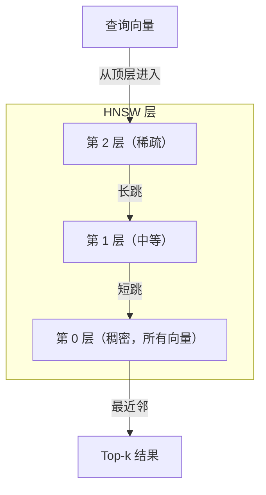

# 嵌入与向量表示

> 文本是离散的。数学是连续的。每次你让大语言模型查找"相似"文档、比较含义或搜索超越关键词时，你都在依赖连接这两个世界的桥梁。那座桥梁就是嵌入。如果你不理解嵌入，你就不理解现代 AI。你只是在使用它。

**类型：** 构建
**语言：** Python
**前置知识：** 阶段 11，课程 01（提示词工程）
**时间：** 约 75 分钟
**关联：** 阶段 5 · 22（嵌入模型深度剖析）涵盖稠密 vs 稀疏 vs 多向量、Matryoshka 截断和逐轴模型选择。本课程聚焦生产流水线（向量数据库、HNSW、相似度数学）。在选择模型之前请阅读阶段 5 · 22。

## 学习目标

- 使用 API 提供者和开源模型生成文本嵌入，并计算它们之间的余弦相似度
- 解释为什么嵌入能够解决关键词搜索无法处理的词汇不匹配问题
- 构建一个语义搜索索引，通过含义而非精确关键词匹配来检索文档
- 使用检索基准（precision@k、召回率）评估嵌入质量，并为你的任务选择合适的嵌入模型

## 问题

你有 10,000 张支持工单。一个客户写道"我的付款没有成功"。你需要找到类似的过往工单。关键词搜索找到包含"付款"和"没有成功"的工单。它错过了"交易失败"、"扣款被拒绝"和"账单错误"。这些工单用完全不同的词语描述了完全相同的问���。

这就是词汇不匹配问题。人类语言有几十种方式来表达同一件事。关键词搜索将每个词视为没有含义的独立符号。它无法知道"被拒绝"和"没有成功"指的是同一个概念。

你需要一种文本表示，其中含义而非拼写决定相似性。你需要一种方式将"我的付款没有成功"和"交易被拒绝"在某种数学空间中放在一起，同时将"我的付款按时到了"推得很远，尽管它们共享"付款"这个词。

这种表示就是嵌入。

## 概念

### 什么是嵌入？

嵌入是一个稠密的浮点数向量，表示文本的含义。"稠密"这个词很重要——每个维度都携带信息，这与稀疏表示（词袋、TF-IDF）不同，后者大多数维度为零。

"猫坐在垫子上"变成类似 `[0.023, -0.041, 0.087, ..., 0.012]` 的东西——根据模型不同，有 768 到 3072 个数字的列表。这些数字编码了含义。你从不直接检查它们。你比较它们。

### Word2Vec 的突破

2013 年，Tomas Mikolov 和 Google 的同事发表了 Word2Vec。核心洞见：训练一个神经网络根据周围词预测一个词（或根据一个词预测周围词），隐藏层的权重就变成了有意义的向量表示。

著名结果：

```
king - man + woman = queen
```

词嵌入上的向量运算捕捉了语义关系。从"man"到"woman"的方向大致等同于从"king"到"queen"的方向。这是该领域意识到几何可以编码含义的时刻。

Word2Vec 产生 300 维向量。每个词无论上下文如何都得到一个向量。"bank"在"river bank"和"bank account"中有相同的嵌入。这一局限性推动了接下来十年的研究。

### 从词到句子

词嵌入表示单个词元。生产系统需要嵌入整个句子、段落或文档。出现了四种方法：

**平均**：取句子中所有词向量的均值。便宜、有损、对短文本效果出奇地好。完全丢失了词序——"狗咬人"和"人咬狗"得到相同的嵌入。

**CLS 词元**：Transformer 模型（BERT，2018）输出一个特殊的 [CLS] 词元嵌入，表示整个输入。比平均好，但 [CLS] 词元是训练用于下一句预测的，而不是相似度。

**对比学习**：显式训练模型将相似对推到一起，不相似对分开。Sentence-BERT（Reimers & Gurevych，2019）使用了这种方法，并成为现代嵌入模型的基础。给定"如何重置我的密码？"和"我需要更改我的密码"，模型学习到这些应该有几乎相同的向量。

**指令调优嵌入**：最新方法。像 E5 和 GTE 这样的模型接受一个任务前缀（"search_query："、"search_document："），告诉模型要产生什么样的嵌入。这让一个模型服务多个任务。

```mermaid
graph LR
    subgraph "2013：Word2Vec"
        W1["king"] --> V1["[0.2, -0.1, ...]"]
        W2["queen"] --> V2["[0.3, -0.2, ...]"]
    end

    subgraph "2019：Sentence-BERT"
        S1["如何重置我的密码？"] --> E1["[0.04, 0.12, ...]"]
        S2["我需要更改我的密码"] --> E2["[0.05, 0.11, ...]"]
    end

    subgraph "2024：指令调优"]
        I1["search_query：重置密码"] --> T1["[0.08, 0.09, ...]"]
        I2["search_document：要重置密码，请点击..."] --> T2["[0.07, 0.10, ...]"]
    end
```

### 现代嵌入模型

市场已收敛到少数几个生产级选项（2026 年初的 MTEB 分数，MTEB v2）：

| 模型 | 提供者 | 维度 | MTEB | 上下文 | 成本 / 100 万词元 |
|------|-------|------|------|-------|-----------------|
| Gemini Embedding 2 | Google | 3072（Matryoshka） | 67.7（检索） | 8192 | $0.15 |
| embed-v4 | Cohere | 1024（Matryoshka） | 65.2 | 128K | $0.12 |
| voyage-4 | Voyage AI | 1024/2048（Matryoshka） | 66.8 | 32K | $0.12 |
| text-embedding-3-large | OpenAI | 3072（Matryoshka） | 64.6 | 8192 | $0.13 |
| text-embedding-3-small | OpenAI | 1536（Matryoshka） | 62.3 | 8192 | $0.02 |
| BGE-M3 | BAAI | 1024（稠密+稀疏+ColBERT） | 63.0 多语言 | 8192 | 开放权重 |
| Qwen3-Embedding | 阿里巴巴 | 4096（Matryoshka） | 66.9 | 32K | 开放权重 |
| Nomic-embed-v2 | Nomic | 768（Matryoshka） | 63.1 | 8192 | 开放权重 |

MTEB（大规模文本嵌入基准）v2 涵盖 100+ 个任务，包括检索、分类、聚类、重排序和总结。分数越高越好。到 2026 年，开放权重模型（Qwen3-Embedding、BGE-M3）在大多数方面匹配或超越封闭托管的模型。Gemini Embedding 2 在纯检索方面领先；Voyage/Cohere 在特定领域（金融、法律、代码）领先。在确定之前，始终在自己的查询上做基准测试。

### 相似度指标

给定两个嵌入向量，有三种方法衡量它们的相似程度：

**余弦相似度**：两个向量之间夹角的余弦。范围从 -1（相反）到 1（相同方向）。忽略大小——一个 10 词的句子和一个 500 词的文档如果指向相同方向可以得 1.0。这是 90% 用例的默认选择。

```
cosine_sim(a, b) = dot(a, b) / (||a|| * ||b||)
```

**点积**：两个向量的原始内积。当向量被归一化（单位长度）时与余弦相似度相同。计算更快。OpenAI 的嵌入是归一化的，因此点积和余弦给出相同的排名。

```
dot(a, b) = sum(a_i * b_i)
```

**欧几里得（L2）距离**：向量空间中的直线距离。越小 = 越相似。对大小差异敏感。当向量空间中的绝对位置（而不仅仅是方向）重要时使用。

```
L2(a, b) = sqrt(sum((a_i - b_i)^2))
```

何时使用哪种：

| 指标 | 何时使用 | 何时避免 |
|------|---------|---------|
| 余弦相似度 | 比较不同长度的文本；大多数检索任务 | 大小携带信息时 |
| 点积 | 嵌入已经归一化；追求最大速度 | 向量大小不同时 |
| 欧几里得距离 | 聚类；空间最近邻问题 | 比较长度差异巨大的文档时 |

### 向量数据库与 HNSW

暴力相似度搜索将查询与每个存储的向量进行比较。对于 100 万个 1536 维的向量，每次查询需要 15 亿次乘加运算。太慢了。

向量数据库使用近似最近邻（ANN）算法来解决这个问题。主导算法是 HNSW（分层可导航小世界）：

1. 构建一个向量的多层图
2. 顶层是稀疏的——遥远簇之间的长距离连接
3. 底层是密集的——附近向量之间的细粒度连接
4. 搜索从顶层开始，贪心下降以细化
5. 在 O(log n) 时间而不是 O(n) 时间内返回近似的 top-k 结果

HNSW 以少量的精度损失（通常 95-99% 召回率）换取巨大的速度提升。在 1000 万个向量上，暴力搜索需要数秒。HNSW 需要毫秒。



生产选项：

| 数据库 | 类型 | 最适合 | 最大规模 |
|--------|------|--------|---------|
| Pinecone | 托管 SaaS | 零运维生产 | 数十亿 |
| Weaviate | 开源 | 自托管、混合搜索 | 1 亿+ |
| Qdrant | 开源 | 高性能、过滤 | 1 亿+ |
| ChromaDB | 嵌入式 | 原型设计、本地开发 | 100 万 |
| pgvector | Postgres 扩展 | 已在用 Postgres | 1000 万 |
| FAISS | 库 | 进程内、研究 | 10 亿+ |

### 分块策略

文档太长，不能作为单个向量嵌入。一份 50 页的 PDF 涵盖几十个主题——它的嵌入成为所有内容的平均，与任何具体内容都不相似。你将文档分割成块并分别嵌入每个块。

**固定大小分块**：每 N 个词元切分一次，重叠 M 个词元。简单且可预测。当文档没有清晰结构时效果良好。512 词元块配 50 词元重叠：块 1 是词元 0-511，块 2 是词元 462-973。

**基于句子的分块**：在句子边界切分，将句子分组直到达到词元限制。每个块至少是一个完整的句子。比固定大小好，因为你永远不会把一个想法从中间切断。

**递归分块**：首先尝试在最大的边界（章节标题）切分。如果还是太大，尝试段落边界。然后是句子边界。然后是字符限制。这是 LangChain 的 `RecursiveCharacterTextSplitter`，对混合格式语料库效果良好。

**语义分块**：嵌入每个句子，然后对嵌入相似的连续句子进行分组。当嵌入相似度低于阈值时，开始一个新块。昂贵（需要逐个嵌入每个句子），但产生最连贯的块。

| 策略 | 复杂度 | 质量 | 最适合 |
|------|-------|------|-------|
| 固定大小 | 低 | 尚可 | 非结构化文本、日志 |
| 基于句子 | 低 | 好 | 文章、邮件 |
| 递归 | 中 | 好 | Markdown、HTML、混合文档 |
| 语义 | 高 | 最佳 | 对检索质量要求苛刻的场景 |

大多数系统的理想区间：256-512 词元块，50 词元重叠。

### 双编码器 vs 交叉编码器

双编码器独立嵌入查询和文档，然后比较向量。快速——你嵌入一次查询，与预计算的文档嵌入进行比较。这就是你用于检索的方式。

交叉编码器将查询和一个文档作为单一输入，输出相关性分数。慢——它通过完整模型处理每个查询-文档对。但更准确，因为它可以同时跨查询和文档词元进行注意力计算。

生产模式：双编码器检索前 100 个候选，交叉编码器将其重排序为前 10 个。这就是检索-重排序流水线。


重排序模型：Cohere Rerank 3.5（每 1000 次查询 $2）、BGE-reranker-v2（免费、开源）、Jina Reranker v2（免费、开源）。

### Matryoshka 嵌入

传统嵌入是全有或全无的。一个 1536 维向量使用 1536 个浮点数。你不能截断到 256 维而不重新训练。

Matryoshka 表示学习（Kusupati 等人，2022）解决了这个问题。模型被训练为前 N 个维度捕获最重要的信息，就像俄罗斯套娃一样。将 1536 维的 Matryoshka 嵌入截断到 256 维会损失一些准确性，但仍然可用。

OpenAI 的 text-embedding-3-small 和 text-embedding-3-large 通过 `dimensions` 参数支持 Matryoshka 截断。请求 256 维而不是 1536 维可以将存储减少 6 倍，在 MTEB 基准上大约损失 3-5% 的准确性。

### 二进制量化

一个 1536 维嵌入以 float32 存储占用 6,144 字节。乘以 1000 万个文档：仅向量就需要 61 GB。

二进制量化将每个浮点数转换为一个比特：正值变为 1，负值变为 0。存储从 6,144 字节降至 192 字节——32 倍缩减。相似度使用汉明距离（计算不同比特数）计算，CPU 可以在一条指令中完成。

准确率损失大约在检索召回率上为 5-10%。常见模式：对数百万向量进行首次通行搜索使用二进制量化，然后用全精度向量重新评分前 1000 个结果。这可以以 32 倍更少的内存获得全精度 95%+ 的准确率。

```figure
cosine-similarity
```

## 构建

我们从头开始构建一个语义搜索引擎。没有向量数据库。没有外部嵌入 API。纯 Python 配合 numpy 做数学计算。

### 步骤 1：文本分块

```python
def chunk_text(text, chunk_size=200, overlap=50):
    words = text.split()
    chunks = []
    start = 0
    while start < len(words):
        end = start + chunk_size
        chunk = " ".join(words[start:end])
        chunks.append(chunk)
        start += chunk_size - overlap
    return chunks


def chunk_by_sentences(text, max_chunk_tokens=200):
    sentences = text.replace("\n", " ").split(".")
    sentences = [s.strip() + "." for s in sentences if s.strip()]
    chunks = []
    current_chunk = []
    current_length = 0
    for sentence in sentences:
        sentence_length = len(sentence.split())
        if current_length + sentence_length > max_chunk_tokens and current_chunk:
            chunks.append(" ".join(current_chunk))
            current_chunk = []
            current_length = 0
        current_chunk.append(sentence)
        current_length += sentence_length
    if current_chunk:
        chunks.append(" ".join(current_chunk))
    return chunks
```

### 步骤 2：从零构建嵌入

我们使用 TF-IDF 配合 L2 归一化实现一个简单的稠密嵌入。这不是神经嵌入，但它遵循相同的约定：文本输入，固定大小向量输出，相似文本产生相似向量。

```python
import math
import numpy as np
from collections import Counter

class SimpleEmbedder:
    def __init__(self):
        self.vocab = []
        self.idf = []
        self.word_to_idx = {}

    def fit(self, documents):
        vocab_set = set()
        for doc in documents:
            vocab_set.update(doc.lower().split())
        self.vocab = sorted(vocab_set)
        self.word_to_idx = {w: i for i, w in enumerate(self.vocab)}
        n = len(documents)
        self.idf = np.zeros(len(self.vocab))
        for i, word in enumerate(self.vocab):
            doc_count = sum(1 for doc in documents if word in doc.lower().split())
            self.idf[i] = math.log((n + 1) / (doc_count + 1)) + 1

    def embed(self, text):
        words = text.lower().split()
        count = Counter(words)
        total = len(words) if words else 1
        vec = np.zeros(len(self.vocab))
        for word, freq in count.items():
            if word in self.word_to_idx:
                tf = freq / total
                vec[self.word_to_idx[word]] = tf * self.idf[self.word_to_idx[word]]
        norm = np.linalg.norm(vec)
        if norm > 0:
            vec = vec / norm
        return vec
```

### 步骤 3：相似度函数

```python
def cosine_similarity(a, b):
    dot = np.dot(a, b)
    norm_a = np.linalg.norm(a)
    norm_b = np.linalg.norm(b)
    if norm_a == 0 or norm_b == 0:
        return 0.0
    return float(dot / (norm_a * norm_b))


def dot_product(a, b):
    return float(np.dot(a, b))


def euclidean_distance(a, b):
    return float(np.linalg.norm(a - b))
```

### 步骤 4：带暴力搜索的向量索引

```python
class VectorIndex:
    def __init__(self):
        self.vectors = []
        self.texts = []
        self.metadata = []

    def add(self, vector, text, meta=None):
        self.vectors.append(vector)
        self.texts.append(text)
        self.metadata.append(meta or {})

    def search(self, query_vector, top_k=5, metric="cosine"):
        scores = []
        for i, vec in enumerate(self.vectors):
            if metric == "cosine":
                score = cosine_similarity(query_vector, vec)
            elif metric == "dot":
                score = dot_product(query_vector, vec)
            elif metric == "euclidean":
                score = -euclidean_distance(query_vector, vec)
            else:
                raise ValueError(f"未知的指标：{metric}")
            scores.append((i, score))
        scores.sort(key=lambda x: x[1], reverse=True)
        results = []
        for idx, score in scores[:top_k]:
            results.append({
                "text": self.texts[idx],
                "score": score,
                "metadata": self.metadata[idx],
                "index": idx
            })
        return results

    def size(self):
        return len(self.vectors)
```

### 步骤 5：语义搜索引擎

```python
class SemanticSearchEngine:
    def __init__(self, chunk_size=200, overlap=50):
        self.embedder = SimpleEmbedder()
        self.index = VectorIndex()
        self.chunk_size = chunk_size
        self.overlap = overlap

    def index_documents(self, documents, source_names=None):
        all_chunks = []
        all_sources = []
        for i, doc in enumerate(documents):
            chunks = chunk_text(doc, self.chunk_size, self.overlap)
            all_chunks.extend(chunks)
            name = source_names[i] if source_names else f"doc_{i}"
            all_sources.extend([name] * len(chunks))
        self.embedder.fit(all_chunks)
        for chunk, source in zip(all_chunks, all_sources):
            vec = self.embedder.embed(chunk)
            self.index.add(vec, chunk, {"source": source})
        return len(all_chunks)

    def search(self, query, top_k=5, metric="cosine"):
        query_vec = self.embedder.embed(query)
        return self.index.search(query_vec, top_k, metric)

    def search_with_scores(self, query, top_k=5):
        results = self.search(query, top_k)
        return [
            {
                "text": r["text"][:200],
                "source": r["metadata"].get("source", "unknown"),
                "score": round(r["score"], 4)
            }
            for r in results
        ]
```

### 步骤 6：比较相似度指标

```python
def compare_metrics(engine, query, top_k=3):
    results = {}
    for metric in ["cosine", "dot", "euclidean"]:
        hits = engine.search(query, top_k=top_k, metric=metric)
        results[metric] = [
            {"score": round(h["score"], 4), "preview": h["text"][:80]}
            for h in hits
        ]
    return results
```

## 使用

使用生产级嵌入 API，架构保持一致。只改变嵌入器：

```python
from openai import OpenAI

client = OpenAI()

def openai_embed(texts, model="text-embedding-3-small", dimensions=None):
    kwargs = {"model": model, "input": texts}
    if dimensions:
        kwargs["dimensions"] = dimensions
    response = client.embeddings.create(**kwargs)
    return [item.embedding for item in response.data]
```

使用 OpenAI 的 Matryoshka 截断——相同模型，更少维度，更低存储：

```python
full = openai_embed(["语义搜索查询"], dimensions=1536)
compact = openai_embed(["语义搜索查询"], dimensions=256)
```

256 维向量使用 6 倍更少的存储。对于 1000 万文档，那是 10 GB vs 61 GB。准确率损失在标准基准上大约为 3-5%。

使用 Cohere 进行重排序：

```python
import cohere

co = cohere.ClientV2()

results = co.rerank(
    model="rerank-v3.5",
    query="退款政策是什么？",
    documents=["30 天内全额退款...", "90 天后不予退款..."],
    top_n=3
)
```

本地嵌入，无 API 依赖：

```python
from sentence_transformers import SentenceTransformer

model = SentenceTransformer("BAAI/bge-small-en-v1.5")
embeddings = model.encode(["语义搜索查询", "另一篇文档"])
```

我们构建的 VectorIndex 类适用于上述任何一种。替换嵌入函数，保留搜索逻辑。

## 交付

本课程产出：
- `outputs/prompt-embedding-advisor.md` —— 用于选择特定用例的嵌入模型和策略的提示词
- `outputs/skill-embedding-patterns.md` —— 教智能体如何在生产中有效使用嵌入的技能

## 练习

1. **指标比较**：使用余弦相似度、点积和欧几里得距离对样本文档运行相同的 5 个查询。记录每种方法的前 3 个结果。在哪些查询上各指标的结果不一致？为什么？

2. **分块大小实验**：使用 50、100、200 和 500 词的分块大小对样本文档建索引。对于每个分块大小，运行 5 个查询并记录 top-1 相似度分数。绘制分块大小与检索质量之间的关系。找到较大分块开始有害的界点。

3. **Matryoshka 模拟**：构建一个产生 500 维向量的 SimpleEmbedder。截断到 50、100、200 和 500 维。测量检索召回率在每个截断级别如何下降。这模拟了 Matryoshka 行为，不需要真正的训练技巧。

4. **二进制量化**：从搜索引擎中取出嵌入，将其转换为二进制（正值为 1，负值为 0），并实现汉明距离搜索。比较前 10 个结果与全精度余弦相似度。测量重叠百分比。

5. **基于句子的分块**：用 `chunk_by_sentences` 替换固定大小分块。运行相同的查询并比较检索分数。尊重句子边界是否能改善结果？

## 关键术语

| 术语 | 通常说法 | 实际含义 |
|------|---------|---------|
| 嵌入 | "文本转数字" | 一个稠密向量，其中几何接近度编码语义相似性 |
| Word2Vec | "最初的嵌入" | 2013 年的模型，通过预测上下文词学习词向量；证明了向量算术编码含义 |
| 余弦相似度 | "两个向量有多相似" | 向量之间夹角的余弦；1 = 相同方向，0 = 正交，-1 = 相反 |
| HNSW | "快速向量搜索" | 分层可导航小世界图——多层结构，实现 O(log n) 近似最近邻搜索 |
| 双编码器 | "分开嵌入，快速比较" | 独立将查询和文档编码为向量；支持预计算和快速检索 |
| 交叉编码器 | "慢但准确的重排序器" | 将查询-文档对通过完整模型联合处理；更高准确率，无法预计算 |
| Matryoshka 嵌入 | "可截断的向量" | 训练嵌入使得前 N 个维度捕获最重要的信息，支持可变大小存储 |
| 二进制量化 | "1 比特嵌入" | 将浮点向量转换为二进制（仅符号位），存储减少 32 倍，使用汉明距离搜索 |
| 分块 | "拆分文档以嵌入" | 将文档分解为 256-512 词元的片段，以便每个可以独立嵌入和检索 |
| 向量数据库 | "嵌入的搜索引擎" | 针对存储向量和进行大规模近似最近邻搜索进行优化的数据存储 |
| 对比学习 | "通过比较训练" | 将相似对的嵌入推到一起、不相似对的嵌入分开的训练方法 |
| MTEB | "嵌入基准" | 大规模文本嵌入基准——跨 8 个任务的 56 个数据集；比较嵌入模型的标准 |

## 进一步阅读

- Mikolov 等人，"向量空间中词表示的高效估计"（2013）—— 以 king-queen 类比开启嵌入革命的 Word2Vec 论文
- Reimers & Gurevych，"Sentence-BERT：使用孪生 BERT 网络的句子嵌入"（2019）—— 如何训练双编码器进行句子级相似度，现代嵌入模型的基础
- Kusupati 等人，"Matryoshka 表示学习"（2022）—— OpenAI 为 text-embedding-3 采用的可变维度嵌入技术
- Malkov & Yashunin，"使用分层可导航小世界图的高效且鲁棒的近似最近邻"（2018）—— HNSW 论文，大多数生产级向量搜索背后的算法
- OpenAI 嵌入指南（platform.openai.com/docs/guides/embeddings）—— text-embedding-3 模型的实践参考，包括 Matryoshka 降维
- MTEB 排行榜（huggingface.co/spaces/mteb/leaderboard）—— 跨任务和语言比较所有嵌入模型的实时基准
- [Muennighoff 等人，"MTEB：大规模文本嵌入基准"（EACL 2023）](https://arxiv.org/abs/2210.07316) —— 定义排行榜报告的 8 个任务类别（分类、聚类、对分类、重排序、检索、STS、总结、双语挖掘）的基准；在信任任何单一的 MTEB 分数之前请阅读
- [Sentence Transformers 文档](https://www.sbert.net/) —— 关于双编码器 vs 交叉编码器、池化策略以及本课程实现的摄取-拆分-嵌入-存储 RAG 流水线的权威参考
