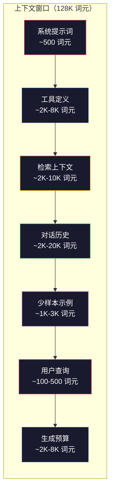
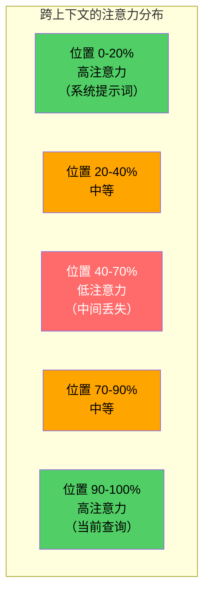
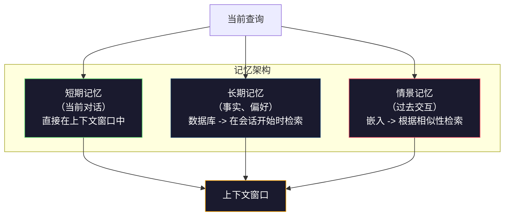

# 上下文工程：窗口、预算、记忆与检索

> 提示词工程是一个子集。上下文工程才是整个游戏。提示词是你输入的字符串。上下文是进入模型窗口的一切：系统指令、检索到的文档、工具定义、对话历史、少样本示例以及提示词本身。2026 年最好的 AI 工程师是上下文工程师。他们决定什么进去、什么留下、以及什么顺序。

**类型：** 构建
**语言：** Python
**前置知识：** 阶段 10（从头构建大语言模型），阶段 11 课程 01-02
**时间：** 约 90 分钟
**关联：** 阶段 11 · 15（提示缓存）——缓存友好的布局是上下文工程的延伸。阶段 5 · 28（长上下文评估）学习如何使用 NIAH/RULER 测量"中间丢失"效应。

## 学习目标

- 计算跨所有上下文窗口组件的词元预算（系统提示词、工具、历史、检索文档、生成余量）
- 实现上下文窗口管理策略：截断、总结和滑动窗口用于对话历史
- 优先排序和排列上下文组件，以最大化模型对最相关信息的注意力
- 构建一个上下文组装器，根据查询类型和可用窗口空间动态分配词元

## 问题

Claude Opus 4.7 有 200K 词元的窗口（1M 测试版）。GPT-5 有 400K。Gemini 3 Pro 有 2M。Llama 4 声称 10M。这些数字听起来很大，直到你把它们填满。

这是一个编码助手的真实分解。系统提示词：500 词元。50 个工具的工具定义：8,000 词元。检索到的文档：4,000 词元。对话历史（10 轮）：6,000 词元。当前用户查询：200 词元。生成预算（最大输出）：4,000 词元。总计：22,700 词元。这只是 128K 窗口的 18%。

但注意力并不随上下文长度线性扩展。一个拥有 128K 词元上下文的模型要付出二次方级的注意力成本（在标准 Transformer 中是 O(n^2)，尽管大多数生产模型使用高效的注意力变体）。更重要的是，检索准确性会下降。"大海捞针"测试表明，模型难以找到放置在长上下文中间的信息。Liu 等人（2023）的研究表明，大语言模型以接近完美的准确性检索长上下文开头和结尾的信息，但对于放置在中间（上下文的 40-70% 位置）的信息，准确性下降 10-20%。这种"中间丢失"效应因模型而异，但影响所有当前的架构。

实际教训：有 200K 词元可用并不意味着使用 200K 词元是有效的。一个精心策划的 10K 词元上下文通常优于一个随意倾倒的 100K 词元上下文。上下文工程是在上下文窗口内最大化信噪比的学科。

你放入窗口的每一个词元都会挤走一个可能携带更相关信息的词元。每一个不相关的工具定义、每一条过时的对话轮次、每一个不回答问题的检索文本块——每一个都使模型在任务上略微变得更差。

## 概念

### 上下文窗口是稀缺资源

将上下文窗口视为 RAM，而不是磁盘。它快速且直接可访问，但有限。你不能把所有东西都放进去。你必须做出选择。



每个组件都在竞争空间。添加更多工具定义意味着对话历史的空间变少。添加更多检索上下文意味着少样本示例的空间变少。上下文工程是一门分配这个预算以最大化任务性能的艺术。

### 中间丢失

上下文工程中最重要的经验发现。模型对上下文开头和结尾的信息注意力更高。中间的信息获得较低的注意力分数，更有可能被忽略。

Liu 等人（2023）系统地测试了这一点。他们将一个相关文档放置在 20 个不相关文档中的不同位置，并测量答案准确性。当相关文档在第一个或最后一个位置时，准确性为 85-90%。当在中间（20 个中的第 10 个位置）时，准确性下降到 60-70%。

这有直接的工程含义：

- 把最重要的信息放在开头（系统提示词、关键指令）
- 把当前查询和最相关的上下文放在最后（近因偏差有助于）
- 将上下文的中间部分视为最低优先级区域
- 如果必须将信息放在中间，在末尾重复关键点



### 上下文组件

**系统提示词**：设定角色、约束和行为规则。这放在首位并在各轮之间保持不变。Claude Code 在其系统提示词中使用了大约 6,000 词元，包括工具定义和行为指令。保持精简。系统提示词中的每个词在每次 API 调用中都会重复。

**工具定义**：每个工具增加 50-200 词元（名称、描述、参数 Schema）。50 个工具每个 150 词元就是 7,500 词元，还没开始对话。动态工具选择——只包含与当前查询相关的工具——可以减少 60-80% 的开销。

**检索上下文**：来自向量数据库的文档、搜索结果、文件内容。检索质量直接决定回复质量。糟糕的检索比没有检索更糟——它用噪声填满窗口并主动误导模型。

**对话历史**：每条以前的用户消息和助手回复。随对话长度线性增长。50 轮对话，每轮 200 词元，就是 10,000 词元的历史。其中大部分与当前查询无关。

**少样本示例**：演示期望行为的输入/输出对。两到三个精心挑选的示例通常比数千词元的指令更能提高输出质量。但它们占用空间。

**生成预算**：为模型回复预留的词元。如果你把窗口填满到容量，模型就没有回答的空间。至少预留 2,000-4,000 词元用于生成。

### 上下文压缩策略

**历史总结**：不需要逐字保留所有以前的轮次，而是定期总结对话。"我们讨论了 X，决定 Y，用户想要 Z"用 100 词元取代了原来 2,000 词元的 10 轮对话。当历史超过阈值时（例如 5,000 词元）运行总结。

**相关性过滤**：对每个检索到的文档根据当前查询进行评分，并丢弃低于阈值的文档。如果你检索了 10 个块但只有 3 个相关，放弃其他 7 个。有 3 个高度相关的块比 10 个平庸的块更好。

**工具修剪**：对用户的查询意图进行分类，只包含与该意图相关的工具。代码问题不需要日历工具。排程问题不需要文件系统工具。这可以将工具定义从 8,000 词元减少到 1,000。

**递归总结**：对于非常长的文档，分阶段总结。先总结每个章节，然后总结所有总结。一份 50 页的文档变成一个 500 词元的摘要，捕获了关键点。

### 记忆系统

上下文工程跨越三个时间范围。

**短期记忆**：当前的对话。直接存储在上下文窗口中。随每次轮次增长。通过总结和截断进行管理。

**长期记忆**：跨对话持久化的事实和偏好。"用户偏好 TypeScript。""项目使用 PostgreSQL。"存储在数据库中，在会话开始时检索。Claude Code 将其存储在 CLAUDE.md 文件中。ChatGPT 将其存储在其记忆功能中。

**情景记忆**：可能与当前情况相关的特定过去交互。"上周二，我们在 auth 模块中调试了类似的问题。"作为嵌入存储，当当前对话匹配过去的情景时被检索到。



### 动态上下文组装

关键洞见：不同的查询需要不同的上下文。静态的系统提示词 + 静态工具 + 静态历史是浪费的。最好的系统为每个查询动态地组装上下文。

1. 分类查询意图
2. 选择相关工具（不是所有工具）
3. 检索相关文档（不是固定集合）
4. 包含相关的历史轮次（不是全部历史）
5. 添加匹配任务类型的少样本示例
6. 按重要性排列所有内容：关键在前，重要在后，可选在中间

这就是区分好的 AI 应用与伟大的 AI 应用的关键。模型是一样的。上下文是区分因素。

## 构建

### 步骤 1：词元计数器

你无法预算你无法衡量的东西。构建一个简单的词元计数器（使用空格分割进行估算，因为精确计数取决于分词器）。

```python
import json
import numpy as np
from collections import OrderedDict

def count_tokens(text):
    if not text:
        return 0
    return int(len(text.split()) * 1.3)

def count_tokens_json(obj):
    return count_tokens(json.dumps(obj))
```

### 步骤 2：上下文预算管理器

核心抽象。预算管理器跟踪每个组件使用多少词元并强制限制。

```python
class ContextBudget:
    def __init__(self, max_tokens=128000, generation_reserve=4000):
        self.max_tokens = max_tokens
        self.generation_reserve = generation_reserve
        self.available = max_tokens - generation_reserve
        self.allocations = OrderedDict()

    def allocate(self, component, content, max_tokens=None):
        tokens = count_tokens(content)
        if max_tokens and tokens > max_tokens:
            words = content.split()
            target_words = int(max_tokens / 1.3)
            content = " ".join(words[:target_words])
            tokens = count_tokens(content)

        used = sum(self.allocations.values())
        if used + tokens > self.available:
            allowed = self.available - used
            if allowed <= 0:
                return None, 0
            words = content.split()
            target_words = int(allowed / 1.3)
            content = " ".join(words[:target_words])
            tokens = count_tokens(content)

        self.allocations[component] = tokens
        return content, tokens

    def remaining(self):
        used = sum(self.allocations.values())
        return self.available - used

    def utilization(self):
        used = sum(self.allocations.values())
        return used / self.max_tokens

    def report(self):
        total_used = sum(self.allocations.values())
        lines = []
        lines.append(f"上下文预算报告（{self.max_tokens:,} 词元窗口）")
        lines.append("-" * 50)
        for component, tokens in self.allocations.items():
            pct = tokens / self.max_tokens * 100
            bar = "#" * int(pct / 2)
            lines.append(f"  {component:<25} {tokens:>6} 词元（{pct:>5.1f}%）{bar}")
        lines.append("-" * 50)
        lines.append(f"  {'已使用':<25} {total_used:>6} 词元（{total_used/self.max_tokens*100:.1f}%）")
        lines.append(f"  {'生成预留':<25} {self.generation_reserve:>6} 词元")
        lines.append(f"  {'剩余':<25} {self.remaining():>6} 词元")
        return "\n".join(lines)
```

### 步骤 3：中间丢失重排序

实现重排序策略：最重要的项目放在最前和最后，最不重要的放在中间。

```python
def reorder_lost_in_middle(items, scores):
    paired = sorted(zip(scores, items), reverse=True)
    sorted_items = [item for _, item in paired]

    if len(sorted_items) <= 2:
        return sorted_items

    first_half = sorted_items[::2]
    second_half = sorted_items[1::2]
    second_half.reverse()

    return first_half + second_half

def score_relevance(query, documents):
    query_words = set(query.lower().split())
    scores = []
    for doc in documents:
        doc_words = set(doc.lower().split())
        if not query_words:
            scores.append(0.0)
            continue
        overlap = len(query_words & doc_words) / len(query_words)
        scores.append(round(overlap, 3))
    return scores
```

### 步骤 4：对话历史压缩器

总结旧的对话轮次以回收词元预算。

```python
class ConversationManager:
    def __init__(self, max_history_tokens=5000):
        self.turns = []
        self.summaries = []
        self.max_history_tokens = max_history_tokens

    def add_turn(self, role, content):
        self.turns.append({"role": role, "content": content})
        self._compress_if_needed()

    def _compress_if_needed(self):
        total = sum(count_tokens(t["content"]) for t in self.turns)
        if total <= self.max_history_tokens:
            return

        while total > self.max_history_tokens and len(self.turns) > 4:
            old_turns = self.turns[:2]
            summary = self._summarize_turns(old_turns)
            self.summaries.append(summary)
            self.turns = self.turns[2:]
            total = sum(count_tokens(t["content"]) for t in self.turns)

    def _summarize_turns(self, turns):
        parts = []
        for t in turns:
            content = t["content"]
            if len(content) > 100:
                content = content[:100] + "..."
            parts.append(f"{t['role']}：{content}")
        return "之前： " + " | ".join(parts)

    def get_context(self):
        parts = []
        if self.summaries:
            parts.append("[对话总结]")
            for s in self.summaries:
                parts.append(s)
        parts.append("[最近对话]")
        for t in self.turns:
            parts.append(f"{t['role']}：{t['content']}")
        return "\n".join(parts)

    def token_count(self):
        return count_tokens(self.get_context())
```

### 步骤 5：动态工具选择器

只包含与当前查询相关的工具。分类意图，然后过滤。

```python
TOOL_REGISTRY = {
    "read_file": {
        "description": "读取文件内容",
        "tokens": 120,
        "categories": ["code", "files"],
    },
    "write_file": {
        "description": "将内容写入文件",
        "tokens": 150,
        "categories": ["code", "files"],
    },
    "search_code": {
        "description": "在代码库中搜索模式",
        "tokens": 130,
        "categories": ["code"],
    },
    "run_command": {
        "description": "执行 shell 命令",
        "tokens": 140,
        "categories": ["code", "system"],
    },
    "create_calendar_event": {
        "description": "创建新的日历事件",
        "tokens": 180,
        "categories": ["calendar"],
    },
    "list_emails": {
        "description": "列出最近的邮件",
        "tokens": 160,
        "categories": ["email"],
    },
    "send_email": {
        "description": "发送邮件消息",
        "tokens": 200,
        "categories": ["email"],
    },
    "web_search": {
        "description": "在网络上搜索信息",
        "tokens": 140,
        "categories": ["research"],
    },
    "query_database": {
        "description": "在数据库上运行 SQL 查询",
        "tokens": 170,
        "categories": ["code", "data"],
    },
    "generate_chart": {
        "description": "从数据生成图表",
        "tokens": 190,
        "categories": ["data", "visualization"],
    },
}

def classify_intent(query):
    query_lower = query.lower()

    intent_keywords = {
        "code": ["代码", "函数", "错误", "文件", "实现", "重构", "调试", "测试"],
        "calendar": ["会议", "日程", "日历", "预约", "事件"],
        "email": ["邮件", "发送", "收件箱", "消息"],
        "research": ["搜索", "查找", "什么", "如何", "解释", "查询"],
        "data": ["数据", "查询", "数据库", "图表", "分析", "sql"],
    }

    scores = {}
    for intent, keywords in intent_keywords.items():
        score = sum(1 for kw in keywords if kw in query_lower)
        if score > 0:
            scores[intent] = score

    if not scores:
        return ["code"]

    max_score = max(scores.values())
    return [intent for intent, score in scores.items() if score >= max_score * 0.5]

def select_tools(query, token_budget=2000):
    intents = classify_intent(query)
    relevant = {}
    total_tokens = 0

    for name, tool in TOOL_REGISTRY.items():
        if any(cat in intents for cat in tool["categories"]):
            if total_tokens + tool["tokens"] <= token_budget:
                relevant[name] = tool
                total_tokens += tool["tokens"]

    return relevant, total_tokens
```

### 步骤 6：完整上下文组装流水线

将所有内容连接起来。给定一个查询，动态组装最优上下文。

```python
class ContextEngine:
    def __init__(self, max_tokens=128000, generation_reserve=4000):
        self.budget = ContextBudget(max_tokens, generation_reserve)
        self.conversation = ConversationManager(max_history_tokens=5000)
        self.system_prompt = (
            "你是一个有用的 AI 助手。你可以使用代码编辑、文件管理、"
            "网络搜索和数据分析工具。对每个任务使用适当的工具。要简洁和准确。"
        )
        self.knowledge_base = [
            "Python 3.12 引入了用于泛型类的类型参数语法，使用方括号表示法。",
            "项目使用 PostgreSQL 16 配合 pgvector 进行嵌入存储。",
            "认证由 Supabase Auth 使用 JWT 令牌处理。",
            "前端使用 Next.js 15 配合 App Router 构建。",
            "API 速率限制为每个用户每分钟 100 个请求。",
            "部署流水线使用 GitHub Actions 和 Docker 多阶段构建。",
            "所有新模块的测试覆盖率必须高于 80%。",
            "代码库在数据访问方面遵循仓库模式。",
        ]

    def assemble(self, query):
        self.budget = ContextBudget(self.budget.max_tokens, self.budget.generation_reserve)

        system_content, _ = self.budget.allocate("system_prompt", self.system_prompt, max_tokens=1000)

        tools, tool_tokens = select_tools(query, token_budget=2000)
        tool_text = json.dumps(list(tools.keys()))
        tool_content, _ = self.budget.allocate("tools", tool_text, max_tokens=2000)

        relevance = score_relevance(query, self.knowledge_base)
        threshold = 0.1
        relevant_docs = [
            doc for doc, score in zip(self.knowledge_base, relevance)
            if score >= threshold
        ]

        if relevant_docs:
            doc_scores = [s for s in relevance if s >= threshold]
            reordered = reorder_lost_in_middle(relevant_docs, doc_scores)
            doc_text = "\n".join(reordered)
            doc_content, _ = self.budget.allocate("retrieved_context", doc_text, max_tokens=3000)

        history_text = self.conversation.get_context()
        if history_text.strip():
            history_content, _ = self.budget.allocate("conversation_history", history_text, max_tokens=5000)

        query_content, _ = self.budget.allocate("user_query", query, max_tokens=500)

        return self.budget

    def chat(self, query):
        self.conversation.add_turn("user", query)
        budget = self.assemble(query)
        response = f"[回复：{query[:50]}...]"
        self.conversation.add_turn("assistant", response)
        return budget


def run_demo():
    print("=" * 60)
    print("  上下文工程流水线演示")
    print("=" * 60)

    engine = ContextEngine(max_tokens=128000, generation_reserve=4000)

    print("\n--- 查询 1：代码任务 ---")
    budget = engine.chat("修复认证模块中 JWT 令牌过期过早的错误")
    print(budget.report())

    print("\n--- 查询 2：研究任务 ---")
    budget = engine.chat("在 PostgreSQL 中实现向量搜索的最佳方法是什么？")
    print(budget.report())

    print("\n--- 查询 3：对话历史积累后 ---")
    for i in range(8):
        engine.conversation.add_turn("user", f"关于系统实现细节的跟进问题 {i+1}")
        engine.conversation.add_turn("assistant", f"这是对跟进问题 {i+1} 的回复，包含架构的技术细节")

    budget = engine.chat("现在实现我们讨论过的变更")
    print(budget.report())

    print("\n--- 工具选择示例 ---")
    test_queries = [
        "修复 auth.py 中的错误",
        "安排周二与团队的会议",
        "显示数据库查询性能统计",
        "搜索关于错误处理的最佳实践",
    ]

    for q in test_queries:
        tools, tokens = select_tools(q)
        intents = classify_intent(q)
        print(f"\n  查询：{q}")
        print(f"  意图：{intents}")
        print(f"  工具：{list(tools.keys())}（{tokens} 词元）")

    print("\n--- 中间丢失重排序 ---")
    docs = ["文档 A（最相关）", "文档 B（有些相关）", "文档 C（最不相关）",
            "文档 D（相关）", "文档 E（中等相关）"]
    scores = [0.95, 0.60, 0.20, 0.80, 0.50]
    reordered = reorder_lost_in_middle(docs, scores)
    print(f"  原始顺序：{docs}")
    print(f"  分数：    {scores}")
    print(f"  重排序后：{reordered}")
    print(f"  （最相关在开头和结尾，最不相关在中间）")
```

## 使用

### Claude Code 的上下文策略

Claude Code 使用分层方法管理上下文。系统提示词包括行为规则和工具定义（约 6K 词元）。当你打开一个文件时，其内容作为上下文注入。当你搜索时，结果被添加。旧的对话轮次被总结。CLAUDE.md 提供跨会话持久化的长期记忆。

关键的工程决策：Claude Code 不会将你的整个代码库倾倒入上下文。它按需检索相关文件。这就是上下文工程的实践。

### Cursor 的动态上下文加载

Cursor 将你的整个代码库索引为嵌入。当你输入查询时，它使用向量相似性检索最相关的文件和代码块。只有这些片段进入上下文窗口。一个 50 万行的代码库被压缩为 5-10 个最相关的代码块。

这就是模式：嵌入所有内容，按需检索，只包含重要的内容。

### ChatGPT 记忆

ChatGPT 将用户偏好和事实存储为长期记忆。在每个对话开始时，相关的记忆被检索并包含在系统提示词中。"用户偏好 Python"花费 5 词元，但节省了跨对话数百词元的重复指令。

### RAG 作为上下文工程

检索增强生成是形式化的上下文工程。不是将知识塞进模型权重（训练）或系统提示词（静态上下文），而是在查询时检索相关文档并将其注入上下文窗口。整个 RAG 流水线——分块、嵌入、检索、重排序——存在的目的是解决一个问题：将正确的信息放入上下文窗口。

## 交付

本课程产出 `outputs/prompt-context-optimizer.md` —— 一个可重用的提示词，用于审计上下文组装策略并推荐优化方案。输入你的系统提示词、工具数量、平均历史长度和检索策略，它会识别词元浪费并提出改进建议。

它还产出 `outputs/skill-context-engineering.md` —— 一个根据任务类型、上下文窗口大小和延迟预算设计上下文组装流水线的决策框架。

## 练习

1. 为 ContextBudget 类添加一个"词元浪费检测器"。它应该标记使用超过 30% 预算的组件，并针对每种组件类型建议压缩策略（总结历史、修剪工具、重新排序文档）。

2. 实现检索上下文的语义去重。如果两个检索到的文档相似度超过 80%（通过词重叠或嵌入的余弦相似度），只保留分数更高的那个。测量这能回收多少词元预算。

3. 构建一个"上下文回放"工具。给定一个对话记录，通过 ContextEngine 重放并可视化预算分配逐轮变化的情况。绘制随时间变化的每个组件的词元使用。识别上下文开始被压缩的轮次。

4. 实现一个基于优先级的工具选择器。不是二元包含/排除，而是为每个工具分配与当前查询的相关性分数。按降序相关性包含工具，直到工具预算用完。比较包含 5、10、20 和 50 个工具时的任务性能。

5. 构建一个多策略上下文压缩器。实现三种压缩策略（截断、总结、关键句提取），并在 20 篇文档上对它们进行基准测试。测量压缩比与信息保留之间的权衡（压缩版本是否仍然包含查询的答案？）。

## 关键术语

| 术语 | 通常说法 | 实际含义 |
|------|---------|---------|
| 上下文窗口 | "模型能读多少" | 模型在单次前向传递中处理的最大词元数（输入 + 输出）——GPT-5 为 400K，Claude Opus 4.7 为 200K（1M 测试版），Gemini 3 Pro 为 2M |
| 上下文工程 | "高级提示词工程" | 决定什么进入上下文窗口、按什么顺序、以什么优先级的学科——涵盖检索、压缩、工具选择和记忆管理 |
| 中间丢失 | "模型忘记中间的东西" | 经验发现，大语言模型对上下文开头和结尾的注意力更高，中间位置的信息准确性下降 10-20% |
| 词元预算 | "你还有多少词元" | 明确的上下文窗口容量分配，跨组件（系统提示词、工具、历史、检索、生成）并设置每个组件的限制 |
| 动态上下文 | "动态加载内容" | 为每个查询基于意图分类、相关工具选择和检索结果不同地组装上下文窗口 |
| 历史总结 | "压缩对话" | 用简洁的总结替换逐字的旧对话轮次，降低词元成本同时保留关键信息 |
| 工具修剪 | "只包含相关工具" | 分类查询意图，只包含匹配的工具定义，将工具词元成本降低 60-80% |
| 长期记忆 | "跨会话记住" | 存储在数据库中并在会话开始时检索的事实和偏好——CLAUDE.md、ChatGPT 记忆和类似系统 |
| 情景记忆 | "记住特定的过去事件" | 作为嵌入存储的过去交互，在当前查询与过去对话相似时被检索 |
| 生成预算 | "答案的空间" | 为模型输出预留的词元——如果上下文完全填满窗口，模型就没有空间回复 |

## 进一步阅读

- [Liu 等人，2023 ——"中间丢失：语言模型如何使用长上下文"](https://arxiv.org/abs/2307.03172) —— 关于位置依赖性注意力的权威研究，显示模型在长上下文中间的信息方面存在困难
- [Anthropic 的上下文检索博客文章](https://www.anthropic.com/news/contextual-retrieval) —— Anthropic 如何处理上下文感知的块检索，将检索失败率降低 49%
- [Simon Willison 的"上下文工程"](https://simonwillison.net/2025/Jun/27/context-engineering/) —— 命名该学科并将其与提示词工程区分开来的博客文章
- [LangChain 关于 RAG 的文档](https://python.langchain.com/docs/tutorials/rag/) —— 作为上下文工程模式的检索增强生成的实际实现
- [Greg Kamradt 的大海捞针测试](https://github.com/gkamradt/LLMTest_NeedleInAHaystack) —— 揭示了所有主流模型中位置依赖性检索失败的基准测试
- [Pope 等人，"高效扩展 Transformer 推理"（2022）](https://arxiv.org/abs/2211.05102) —— 为什么上下文长度驱动内存和延迟，以及 KV 缓存、MQA 和 GQA 如何改变预算计算
- [Agrawal 等人，"SARATHI：通过分块预填充的搭载解码实现高效 LLM 推理"（2023）](https://arxiv.org/abs/2308.16369) —— 使长提示词在 TTFT 中昂贵但在 TPOT 中便宜的推理的两个阶段；上下文打包权衡背后的事实依据
- [Ainslie 等人，"GQA：从多头检查点训练通用多查询 Transformer 模型"（EMNLP 2023）](https://arxiv.org/abs/2305.13245) —— 分组查询注意力论文，在不损失质量的情况下将生产解码器中的 KV 内存削减了 8 倍
