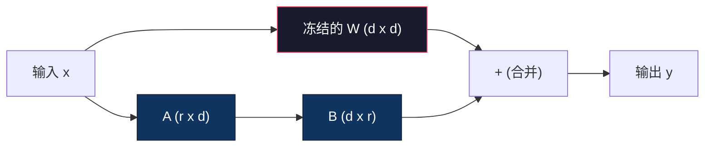
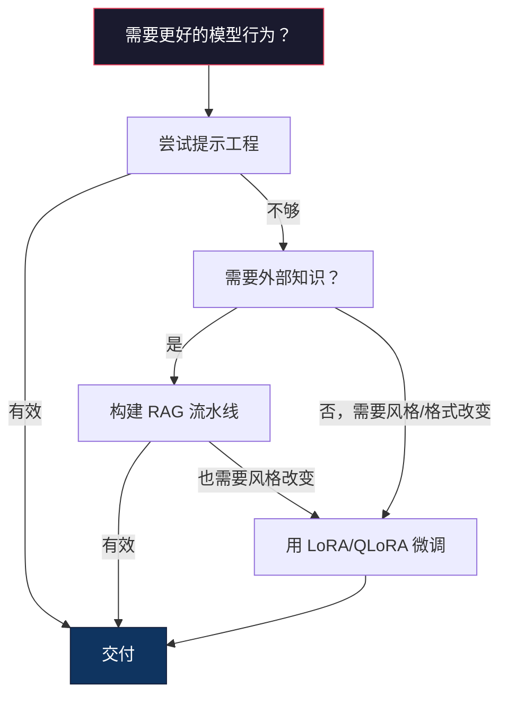

# 使用 LoRA 和 QLoRA 进行微调

> 对7B模型进行全量微调需要56GB 显存。你没有。大多数公司也没有。LoRA 让你在6GB 显存下微调同一个模型，只需训练不到1%的参数。这并非妥协——在大多数任务上它能达到与全量微调相当的质量。整个开源微调生态系统都建立在这样一个技巧之上。

**类型：** 构建
**语言：** Python
**前置知识：** 阶段10，第06课（指令微调 / SFT）
**时间：** ~75分钟
**相关：** 阶段10涵盖了从头开始的 SFT/DPO 循环。本课程将这些内容融入2026年的 PEFT 工具包（PEFT、TRL、Unsloth、Axolotl、LLaMA-Factory）。

## 学习目标

- 通过将低秩适配矩阵（A 和 B）注入预训练模型的注意力层来实现 LoRA
- 计算 LoRA 与全量微调相比的参数节省：秩 r 和 d_model 维度训练 2*r*d 个参数，而不是 d^2
- 使用 QLoRA（4位量化基础 + LoRA 适配器）微调模型，使其适应消费级 GPU 内存
- 将 LoRA 权重合并回基础模型以进行部署，并比较有无适配器时的推理速度

## 问题

你有一个基础模型。Llama 3 8B。你希望它能以你公司的话术回答客户支持工单。SFT 是答案。但 SFT 有一个成本问题。

全量微调会更新模型中的每个参数。Llama 3 8B 有80亿个参数。在 fp16 下，每个参数占2个字节。仅加载权重就需要16GB。在训练期间，你还需要梯度（16GB）、Adam 优化器状态（动量和方差共32GB）和激活值。总计：一个8B模型大约需要56GB 显存。

一块 A100 80GB 几乎装不下。两块 A100 在云提供商处每小时花费 $3-4。在50,000个示例上训练3轮需要6-10小时。每次实验 $30-40。运行10次实验来调整超参数，在部署之前你就已经花了 $400。

将这个规模扩大到 Llama 3 70B，数字就变得荒谬了。仅权重就需要140GB。你需要一个集群。每次实验 $100+。

还有一个更深层的问题。全量微调会修改模型中的每个权重。如果你在客户支持数据上微调，可能会降低模型的通用能力。这被称为灾难性遗忘。模型在你的任务上变得更好，但在其他所有事情上都变得更差。

你需要一种训练更少参数、使用更少内存、且不破坏模型现有知识的方法。

## 概念

### LoRA：低秩自适应

Edward Hu 及其在微软的同事于2021年6月发表了 LoRA。论文的洞察：微调期间的权重更新具有低固有秩。你不需要更新4096x4096权重矩阵中的所有1670万个参数。更新中的有用信息可以通过秩为16或32的矩阵来捕获。

数学如下。标准线性层计算：

```
y = Wx
```

其中 W 是 d_out x d_in 矩阵。对于4096x4096的注意力投影，有16,777,216个参数。

LoRA 冻结 W 并添加一个低秩分解：

```
y = Wx + BAx
```

其中 B 是 (d_out x r)，A 是 (r x d_in)。秩 r 远小于 d——通常为8、16或32。

对于4096x4096层上的 r=16：
- 原始参数：4096 x 4096 = 16,777,216
- LoRA 参数：(4096 x 16) + (16 x 4096) = 65,536 + 65,536 = 131,072
- 缩减：131,072 / 16,777,216 = 0.78%

你在训练0.78%的参数，获得95-100%的质量。



A 用随机高斯分布初始化。B 初始化为零。这意味着 LoRA 贡献从零开始——模型从其原始行为开始训练，并逐渐学习自适应。

### 缩放因子：Alpha

LoRA 引入了一个缩放因子 alpha，控制低秩更新对输出的影响程度：

```
y = Wx + (alpha / r) * BAx
```

当 alpha = r 时，缩放为1倍。当 alpha = 2r（常见默认值）时，缩放为2倍。这个超参数独立于基础学习率控制 LoRA 路径的学习率。

实践指南：
- alpha = 2 * rank 是一个常见的社区惯例（原始论文在大多数实验中使用了 alpha = rank）
- alpha = rank 给出1倍缩放，保守但稳定
- 更高的 alpha 意味着每步更大的更新，这可以加快收敛或导致不稳定

### 在哪里应用 LoRA

一个 Transformer 有许多线性层。不需要在所有层上都添加 LoRA。原始论文测试了不同的组合：

| 目标层 | 可训练参数 (7B) | 质量 |
|--------------|----------------------|---------|
| 仅 q_proj | 4.7M | 良好 |
| q_proj + v_proj | 9.4M | 更好 |
| q_proj + k_proj + v_proj + o_proj | 18.9M | 注意力最佳 |
| 所有线性层（注意力 + MLP） | 37.7M | 收益微小，参数翻倍 |

大多数任务的最佳选择：q_proj + v_proj。这针对自注意力中的查询和值投影，控制模型关注什么以及提取什么信息。为复杂任务（如代码生成）添加 MLP 层会使参数数量翻倍，但对简单任务收益递减。

### 秩的选择

秩 r 控制自适应的表达能力：

| 秩 | 可训练参数（每层） | 最适合 |
|------|---------------------------|----------|
| 4 | 32,768 | 简单分类、情感分析 |
| 8 | 65,536 | 单领域问答、摘要 |
| 16 | 131,072 | 多领域任务、指令遵循 |
| 32 | 262,144 | 复杂推理、代码生成 |
| 64 | 524,288 | 大多数任务收益递减 |
| 128 | 1,048,576 | 很少合理 |

Hu 等人证明，对于简单任务，r=4 已经能捕获大部分自适应。r=8 和 r=16 是实践中常见的选择。超过 r=64 很少能改善质量，并开始失去 LoRA 的内存优势。

### QLoRA：4位量化 + LoRA

Tim Dettmers 及其在华盛顿大学的同事于2023年5月发表了 QLoRA。思路：将冻结的基础模型量化到4位精度，然后在其上附加 fp16 的 LoRA 适配器。

这极大地改变了内存方程：

| 方法 | 权重内存 (7B) | 训练内存 (7B) | 所需 GPU |
|--------|-------------------|---------------------|-------------|
| 全量微调 (fp16) | 14GB | ~56GB | 1x A100 80GB |
| LoRA (fp16 基础) | 14GB | ~18GB | 1x A100 40GB |
| QLoRA (4-bit 基础) | 3.5GB | ~6GB | 1x RTX 3090 24GB |

QLoRA 有三个技术贡献：

**NF4（Normal Float 4位）**：一种专门为神经网络权重设计的新数据类型。神经网络权重大致遵循正态分布。NF4 将其16个量化级别放置在标准正态分布的分位数处。这在对正态分布数据进行信息论意义上是最优的。它比均匀4位量化（INT4）或标准 Float4 丢失的信息更少。

**双重量化**：量化常数本身占用内存。每64个权重的块需要一个 fp32 缩放因子（4字节）。对于7B模型，这额外增加0.4GB。双重量化将这些常数量化为 fp8，将开销减少到0.1GB。虽小但积少成多。

**分页优化器**：在训练期间，优化器状态（Adam 的动量和方差）在长序列上可能超出 GPU 内存。分页优化器使用 NVIDIA 的统一内存，在 GPU 内存耗尽时自动将优化器状态分页到 CPU 内存，并在需要时将其分页回来。这以防止 OOM 崩溃，代价是一些吞吐量。

### 质量问题

减少参数或量化基础模型会损害质量吗？来自多篇论文的结果：

| 方法 | MMLU (5-shot) | MT-Bench | HumanEval |
|--------|--------------|----------|-----------|
| 全量微调 (Llama 2 7B) | 48.3 | 6.72 | 14.6 |
| LoRA r=16 | 47.9 | 6.68 | 14.0 |
| QLoRA r=16 (NF4) | 47.5 | 6.61 | 13.4 |
| QLoRA r=64 (NF4) | 48.1 | 6.70 | 14.2 |

在大多数基准测试上，r=16 的 LoRA 在全量微调的1%以内。r=16 的 QLoRA 再损失零点几个百分点。r=64 的 QLoRA 在使用少90%内存的同时基本匹配全量微调。

### 实际成本

在50,000个示例上微调 Llama 3 8B（3轮）：

| 方法 | GPU | 时间 | 成本 |
|--------|-----|------|------|
| 全量微调 | 2x A100 80GB | 8小时 | ~$32 |
| LoRA r=16 | 1x A100 40GB | 4小时 | ~$8 |
| QLoRA r=16 | 1x RTX 4090 24GB | 6小时 | ~$5 |
| QLoRA r=16 (Unsloth) | 1x RTX 4090 24GB | 2.5小时 | ~$2 |
| QLoRA r=16 | 1x T4 16GB | 12小时 | ~$4 |

在单张消费级 GPU 上进行 QLoRA 的成本比一顿午餐还便宜。这就是为什么开源权重微调社区在2023年爆发，以及为什么下面的每个训练框架在2026年都默认提供 QLoRA。

### 2026年的 PEFT 工具栈

| 框架 | 是什么 | 选择时机 |
|-----------|-----------|-----------|
| **Hugging Face PEFT** | 标准的 LoRA/QLoRA/DoRA/IA3 库 | 你想要原始控制，且训练循环已经在 `transformers.Trainer` 上 |
| **TRL** | HF 的强化反馈训练器（SFT、DPO、GRPO、PPO、ORPO） | 你需要在 SFT 之后进行 DPO/GRPO；构建在 PEFT 之上 |
| **Unsloth** | 前向/反向传递的 Triton 内核重写 | 你想要2-5倍加速 + 一半显存且无精度损失；Llama/Mistral/Qwen 系列 |
| **Axolotl** | 基于 YAML 配置的 PEFT + TRL + DeepSpeed + Unsloth 封装 | 你想要可复现、版本控制的训练运行 |
| **LLaMA-Factory** | 基于 PEFT + TRL 的 GUI/CLI/API | 你想要零代码微调；支持100+ 模型系列 |
| **torchtune** | 原生 PyTorch 配方，无 `transformers` 依赖 | 你想要最小依赖，且你的组织已标准化使用 PyTorch |

经验法则：研究或一次性实验 -> PEFT。可复现的生产流水线 -> Axolotl 并启用 Unsloth 内核。一次性原型 -> LLaMA-Factory。

### 合并适配器

训练后，你得到两样东西：冻结的基础模型和一个小型 LoRA 适配器（通常10-100MB）。你可以：

1. **保持分开**：加载基础模型，在其上加载适配器。为不同任务切换适配器。这就是如何从一个基础模型服务多个微调变体的方法。

2. **永久合并**：计算 W' = W + (alpha/r) * BA 并将结果保存为新的完整模型。合并后的模型与原始模型大小相同。没有推理开销。不需要管理适配器。

要为多个任务提供服务（客户支持适配器、代码适配器、翻译适配器），保持分开。要部署单个专用模型，合并。

用于合并多个适配器的高级技术：

- **TIES-Merging**（Yadav et al. 2023）：裁剪小幅参数，解决符号冲突，然后合并。减少适配器之间的干扰。
- **DARE**（Yu et al. 2023）：在合并前随机丢弃适配器参数并重新缩放其余参数。在结合能力方面出奇地有效。
- **任务算术**：简单加减适配器权重。添加"代码"适配器和"数学"适配器通常会产生一个两者都擅长的模型。

### 何时不微调

微调是第三个选择，不是第一个。

**第一：提示工程。** 写更好的系统提示。添加 few-shot 示例。使用思维链。这零成本，只需几分钟。如果提示能解决80%的问题，你可能不需要微调。

**第二：RAG。** 如果模型需要了解你的特定数据（文档、知识库、产品目录），检索比将其烘焙到权重中更便宜、更可维护。参见第06课。

**第三：微调。** 当你需要模型采用无法通过提示实现的特定风格、格式或推理模式时使用。当你需要一致的结构化输出时。当你需要将较大的模型蒸馏为较小的模型时。当延迟很重要且你无法承受 few-shot 提示带来的额外 token 时。



```figure
lora-params
```

## 构建

我们用纯 PyTorch 从头实现 LoRA。没有库。没有魔法。你将构建 LoRA 层，将其注入模型，训练它，然后将权重合并回来。

### 步骤 1：LoRA 层

```python
import torch
import torch.nn as nn
import math

class LoRALayer(nn.Module):
    def __init__(self, in_features, out_features, rank=8, alpha=16):
        super().__init__()
        self.rank = rank
        self.alpha = alpha
        self.scaling = alpha / rank

        self.A = nn.Parameter(torch.randn(in_features, rank) * (1 / math.sqrt(rank)))
        self.B = nn.Parameter(torch.zeros(rank, out_features))

    def forward(self, x):
        return (x @ self.A @ self.B) * self.scaling
```

A 用缩放的随机值初始化。B 初始化为零。乘积 BA 从零开始，因此模型从其原始行为开始。

### 步骤 2：LoRA 包装的线性层

```python
class LinearWithLoRA(nn.Module):
    def __init__(self, linear, rank=8, alpha=16):
        super().__init__()
        self.linear = linear
        self.lora = LoRALayer(
            linear.in_features, linear.out_features, rank, alpha
        )

        for param in self.linear.parameters():
            param.requires_grad = False

    def forward(self, x):
        return self.linear(x) + self.lora(x)
```

原始的线性层被冻结。只有 LoRA 参数（A 和 B）是可训练的。

### 步骤 3：将 LoRA 注入模型

```python
def inject_lora(model, target_modules, rank=8, alpha=16):
    for param in model.parameters():
        param.requires_grad = False

    lora_layers = {}
    for name, module in model.named_modules():
        if isinstance(module, nn.Linear):
            if any(t in name for t in target_modules):
                parent_name = ".".join(name.split(".")[:-1])
                child_name = name.split(".")[-1]
                parent = dict(model.named_modules())[parent_name]
                lora_linear = LinearWithLoRA(module, rank, alpha)
                setattr(parent, child_name, lora_linear)
                lora_layers[name] = lora_linear
    return lora_layers
```

首先，冻结模型中的每个参数。然后遍历模型树，找到与目标名称匹配的线性层，并将其替换为 LoRA 包装的版本。LoRA A 和 B 矩阵是整个模型中唯一可训练的参数。

### 步骤 4：计算参数

```python
def count_parameters(model):
    total = sum(p.numel() for p in model.parameters())
    trainable = sum(p.numel() for p in model.parameters() if p.requires_grad)
    frozen = total - trainable
    return {
        "total": total,
        "trainable": trainable,
        "frozen": frozen,
        "trainable_pct": 100 * trainable / total if total > 0 else 0
    }
```

### 步骤 5：将权重合并回来

```python
def merge_lora_weights(model):
    for name, module in model.named_modules():
        if isinstance(module, LinearWithLoRA):
            with torch.no_grad():
                merged = (
                    module.lora.A @ module.lora.B
                ) * module.lora.scaling
                module.linear.weight.data += merged.T
            parent_name = ".".join(name.split(".")[:-1])
            child_name = name.split(".")[-1]
            if parent_name:
                parent = dict(model.named_modules())[parent_name]
            else:
                parent = model
            setattr(parent, child_name, module.linear)
```

合并后，LoRA 层消失了。模型与原始模型大小相同，自适应已烘焙到权重中。没有推理开销。

### 步骤 6：模拟 QLoRA 量化

```python
def quantize_to_nf4(tensor, block_size=64):
    blocks = tensor.reshape(-1, block_size)
    scales = blocks.abs().max(dim=1, keepdim=True).values / 7.0
    scales = torch.clamp(scales, min=1e-8)
    quantized = torch.round(blocks / scales).clamp(-8, 7).to(torch.int8)
    return quantized, scales

def dequantize_from_nf4(quantized, scales, original_shape):
    dequantized = quantized.float() * scales
    return dequantized.reshape(original_shape)
```

这通过将权重映射到64个块内的16个离散级别来模拟4位量化。生产级 QLoRA 使用 bitsandbytes 库在 GPU 上进行真正的 NF4 量化。

### 步骤 7：训练循环

```python
def train_lora(model, data, epochs=5, lr=1e-3, batch_size=4):
    optimizer = torch.optim.AdamW(
        [p for p in model.parameters() if p.requires_grad], lr=lr
    )
    criterion = nn.MSELoss()

    losses = []
    for epoch in range(epochs):
        epoch_loss = 0.0
        n_batches = 0
        indices = torch.randperm(len(data["inputs"]))

        for i in range(0, len(indices), batch_size):
            batch_idx = indices[i:i + batch_size]
            x = data["inputs"][batch_idx]
            y = data["targets"][batch_idx]

            output = model(x)
            loss = criterion(output, y)

            optimizer.zero_grad()
            loss.backward()
            optimizer.step()

            epoch_loss += loss.item()
            n_batches += 1

        avg_loss = epoch_loss / n_batches
        losses.append(avg_loss)

    return losses
```

### 步骤 8：完整演示

```python
def demo():
    torch.manual_seed(42)
    d_model = 256
    n_classes = 10

    model = nn.Sequential(
        nn.Linear(d_model, 512),
        nn.ReLU(),
        nn.Linear(512, 512),
        nn.ReLU(),
        nn.Linear(512, n_classes),
    )

    n_samples = 500
    x = torch.randn(n_samples, d_model)
    y = torch.randint(0, n_classes, (n_samples,))
    y_onehot = torch.zeros(n_samples, n_classes).scatter_(1, y.unsqueeze(1), 1.0)

    data = {"inputs": x, "targets": y_onehot}

    params_before = count_parameters(model)

    lora_layers = inject_lora(
        model, target_modules=["0", "2"], rank=8, alpha=16
    )

    params_after = count_parameters(model)

    losses = train_lora(model, data, epochs=20, lr=1e-3)

    merge_lora_weights(model)
    params_merged = count_parameters(model)

    return {
        "params_before": params_before,
        "params_after": params_after,
        "params_merged": params_merged,
        "losses": losses,
    }
```

演示创建了一个小模型，将 LoRA 注入两个层，训练它，然后将权重合并回来。参数计数从完全可训练下降到 LoRA 训练期间的约1%可训练，然后在合并后恢复到原始架构。

## 使用

使用 Hugging Face 生态系统，在真实模型上进行 LoRA 只需大约20行代码：

```python
from transformers import AutoModelForCausalLM, AutoTokenizer
from peft import LoraConfig, get_peft_model, TaskType

model = AutoModelForCausalLM.from_pretrained("meta-llama/Llama-3.1-8B")
tokenizer = AutoTokenizer.from_pretrained("meta-llama/Llama-3.1-8B")

lora_config = LoraConfig(
    task_type=TaskType.CAUSAL_LM,
    r=16,
    lora_alpha=32,
    lora_dropout=0.05,
    target_modules=["q_proj", "v_proj"],
)

model = get_peft_model(model, lora_config)
model.print_trainable_parameters()
```

对于 QLoRA，添加 bitsandbytes 量化：

```python
from transformers import BitsAndBytesConfig

bnb_config = BitsAndBytesConfig(
    load_in_4bit=True,
    bnb_4bit_quant_type="nf4",
    bnb_4bit_compute_dtype=torch.bfloat16,
    bnb_4bit_use_double_quant=True,
)

model = AutoModelForCausalLM.from_pretrained(
    "meta-llama/Llama-3.1-8B",
    quantization_config=bnb_config,
    device_map="auto",
)

model = get_peft_model(model, lora_config)
```

就这样。相同的训练循环。相同的数据流水线。基础模型现在以4位存储，LoRA 适配器以 fp16 训练，整个内容适合6GB。

使用 Hugging Face Trainer 进行训练：

```python
from transformers import TrainingArguments, Trainer
from datasets import load_dataset

dataset = load_dataset("tatsu-lab/alpaca", split="train[:5000]")

training_args = TrainingArguments(
    output_dir="./lora-llama",
    num_train_epochs=3,
    per_device_train_batch_size=4,
    gradient_accumulation_steps=4,
    learning_rate=2e-4,
    fp16=True,
    logging_steps=10,
    save_strategy="epoch",
    optim="paged_adamw_8bit",
)

trainer = Trainer(
    model=model,
    args=training_args,
    train_dataset=dataset,
)

trainer.train()

model.save_pretrained("./lora-adapter")
```

保存的适配器为10-100MB。基础模型保持不变。你可以在 Hugging Face Hub 上共享适配器，而无需重新分发完整模型。

## 交付

本课程产出：
- `outputs/prompt-lora-advisor.md` —— 帮助你为特定任务决定 LoRA 秩、目标模块和超参数的提示词
- `outputs/skill-fine-tuning-guide.md` —— 教导智能体何时以及如何微调的决策树技能

## 练习

1. **秩消融研究。** 使用秩 2、4、8、16、32 和 64 运行演示。绘制最终损失与秩的关系图。找到收益递减点，即秩翻倍不再使损失减半。对于256维特征的简单分类任务，这应该在 r=8-16 左右。

2. **目标模块比较。** 修改 inject_lora 以仅针对层"0"、仅层"2"、仅层"4"和全部三层。训练每个变体20轮。比较收敛速度和最终损失。这反映了定位 q_proj 与 v_proj 与所有线性层的实际决策。

3. **量化误差分析。** 在 quantize_to_nf4 / dequantize_from_nf4 前后取训练模型的权重矩阵。计算均方误差、最大绝对误差以及原始和重建权重之间的相关性。用 block_size 值 32、64、128 和 256 进行实验。

4. **多适配器服务。** 在数据的不同子集上训练两个 LoRA 适配器（偶数索引和奇数索引）。保存两个适配器。加载基础模型一次，然后切换适配器并验证每个适配器在相同输入上产生不同的输出。这就是生产系统从一个基础模型服务多个微调模型的方式。

5. **合并与未合并的推理比较。** 在 merge_lora_weights 前后，对相同的100个输入比较 LoRA 模型的输出。验证输出是相同的（在 1e-5 的浮点容差范围内）。然后为两者进行推理速度基准测试——合并后的应该稍快，因为它是单个矩阵乘法而不是两个。

## 关键术语

| 术语 | 通常的说法 | 实际含义 |
|------|----------------|----------------------|
| LoRA | "高效微调" | 低秩自适应：冻结基础权重，训练两个小矩阵 A 和 B，其乘积近似于完整权重更新 |
| QLoRA | "在笔记本上微调" | 量化 LoRA：以4位 NF4 加载基础模型，在其上以 fp16 训练 LoRA 适配器，实现7B模型在6GB 显存中微调 |
| 秩 (r) | "模型能学到多少" | A 和 B 矩阵的内部维度；控制表达能力与参数数量的权衡 |
| Alpha | "LoRA 学习率" | 应用于 LoRA 输出的缩放因子；alpha/r 缩放自适应对最终输出的贡献 |
| NF4 | "4位量化" | Normal Float 4：一种4位数据类型，量化级别位于正态分布分位数处，对神经网络权重最优 |
| 适配器 | "小型训练部分" | 保存为单独文件（10-100MB）的 LoRA A 和 B 矩阵，可加载到基础模型的任何副本之上 |
| 目标模块 | "哪些层应用 LoRA" | 注入 LoRA 适配器的特定线性层（q_proj、v_proj 等） |
| 合并 | "烘焙进去" | 计算 W + (alpha/r) * BA 并替换原始权重，消除推理时的适配器开销 |
| 分页优化器 | "训练时不 OOM" | 在 GPU 内存耗尽时将优化器状态（Adam 动量、方差）卸载到 CPU |
| 灾难性遗忘 | "微调破坏了其他一切" | 当更新所有权重导致模型丢失以前学到的能力时 |

## 延伸阅读

- Hu et al., "LoRA: Low-Rank Adaptation of Large Language Models" (2021) —— 介绍低秩分解方法的原始论文，在 GPT-3 175B 上测试，秩低至4
- Dettmers et al., "QLoRA: Efficient Finetuning of Quantized Language Models" (2023) —— 引入 NF4、双重量化和分页优化器，实现在单个48GB GPU 上进行65B 微调
- PEFT 库文档 (huggingface.co/docs/peft) —— Hugging Face 生态系统中 LoRA、QLoRA 和其他参数高效方法的标准库
- Yadav et al., "TIES-Merging: Resolving Interference When Merging Models" (2023) —— 合并多个 LoRA 适配器且不降低质量的技术
- [Rafailov et al., "Direct Preference Optimization: Your Language Model is Secretly a Reward Model" (NeurIPS 2023)](https://arxiv.org/abs/2305.18290) —— DPO 推导；SFT 之后的偏好微调阶段，无需奖励模型。
- [TRL 文档](https://huggingface.co/docs/trl/) —— `SFTTrainer`、`DPOTrainer`、`KTOTrainer` 以及与 PEFT/bitsandbytes/Unsloth 的集成接口的官方参考。
- [Unsloth 文档](https://docs.unsloth.ai/) —— 融合内核，使微调吞吐量翻倍并将内存减半；TRL 下的性能层。
- [Axolotl 文档](https://axolotl-ai-cloud.github.io/axolotl/) —— YAML 配置的多 GPU SFT/DPO/QLoRA 训练器；作为手写脚本的配置即代码替代方案。
