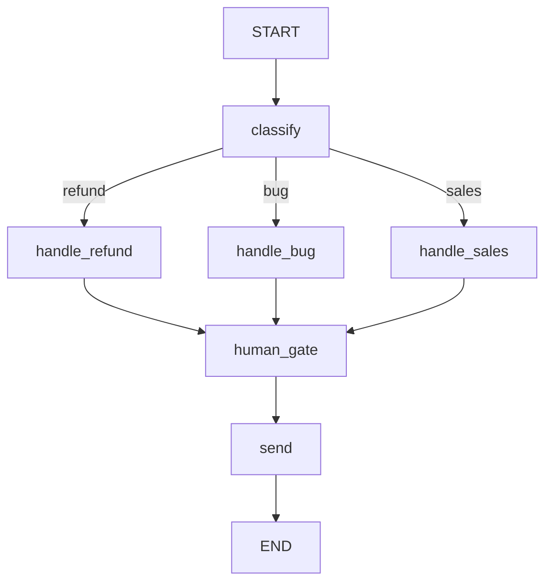

# 客服工单处理系统 — LangGraph 风格有状态图

> 用纯 Python stdlib 实现的状态图引擎，演示客服工单自动处理流程：分类 → 处理 → 人工审批 → 发送回复。

## 运行方式

```bash
# 运行主演示
python3 runner.py

# 运行单元测试
python3 -m unittest discover tests -v
```

主演示预期输出：首次运行在 `human_gate` 暂停 → 打印检查点历史 → 人工批准后恢复 → 完成全流程。

---

## 项目结构

```
state.py          — 状态类型定义（TypedDict）、哨兵常量、异常类
graph.py          — StateGraph 类、节点函数、三种拓扑辅助函数
checkpointer.py   — 检查点抽象接口 + SQLite / InMemory 实现
runner.py         — Runner 执行引擎 + main() 演示
__init__.py       — 包入口，导出核心类和函数
requirements.txt  — 依赖声明（仅 stdlib）
tests/test_all.py — 完整单元测试（30+ 测试用例）
README.md         — 本文件
```

---

## 状态模式设计

### 为什么用 TypedDict 而不是 dataclass？

LangGraph 的状态模型是**字典 + 合并**：每个节点函数接收当前状态（字典），返回一个部分更新（也是字典），Runner 负责将更新合并进状态。这比 dataclass 的赋值语义更灵活——节点只需声明"我修改了什么"，而非重建整个对象。

### State 字段说明

| 字段 | 类型 | 说明 |
|------|------|------|
| `messages` | `list[dict]` | 对话/消息历史，每条是 `{"role": ..., "content": ...}` |
| `ticket_type` | `str` | 工单类型，由 `classify` 节点写入：`refund` / `bug` / `sales` |
| `form_data` | `dict` | 表单数据，由处理节点收集 |
| `approved` | `bool` | 是否通过人工审批，`human_gate` 节点读取 |
| `response` | `str` | 最终回复，由 `send` 节点生成 |
| `retry_count` | `int` | 重试次数，防止无限循环 |

### Update 类型

`Update(TypedDict, total=False)` 使所有字段可选。节点只返回它修改的字段，Runner 用 `{**state, **update}` 合并。

### 哨兵常量

- `START = "__START__"` — 虚拟入口，`set_entry()` 实际上添加 `START → entry_node` 的固定边
- `END = "__END__"` — 虚拟出口，`next_node()` 返回 `END` 时 Runner 停止

---

## 检查点设计

### 为什么每个节点都保存检查点，而不是"仅成功时"？

> **硬性规则：拒绝"仅在成功时检查点"。**

检查点的意义在于**精确恢复**。如果只在成功时保存，暂停/失败时就会丢失最后的状态，无法从断点恢复。每次节点执行后立即保存，确保任何中断都能从最近的完整状态恢复。

### 为什么序列化完整状态，而不是摘要？

> **硬性规则：拒绝仅保存"摘要"状态的检查点。**

摘要有损——你无法从摘要重建完整执行上下文。完整状态序列化（`json.dumps`）确保 `resume()` 可以在任意断点精确重入。

### 后端选择

| 后端 | 适用场景 | 特点 |
|------|---------|------|
| `SQLiteCheckpointer` | 默认，单机生产 | 零配置，支持文件持久化，WAL 模式支持并发读 |
| `InMemoryCheckpointer` | 开发/测试 | 零 IO，进程退出即丢失 |
| Postgres（需自行实现） | 分布式生产 | 多进程共享，行锁保证一致性 |
| Redis（需自行实现） | 低延迟场景 | TTL 自动过期，Pub/Sub 通知 |

扩展新后端只需继承 `Checkpointer` 并实现三个方法：`save`、`load_latest`、`history`。

---

## 恢复语义

### `run(state, session_id)`

从头执行：从入口节点开始，依次执行节点函数，每步保存检查点。遇到 `PausedAtNode` 异常时停止。

### `resume(session_id, state_override=None)`

从最近检查点恢复：
1. `load_latest(session_id)` 获取最后保存的节点名和状态
2. 将 `state_override`（如 `{"approved": True}`）合并进状态
3. 从暂停节点重新执行——该节点这次会通过，图继续向前

**典型用法**：`human_gate` 暂停后，审批系统调用 `resume(session_id, {"approved": True})` 放行。

---

## 三种拓扑辅助函数

### 监督者模式 `build_supervisor_graph(router_fn, worker_graphs)`

```
START → router_fn(state) → worker_A / worker_B / worker_C → END
```

**适用场景**：一个"经理"协调多个专家团队。路由器根据状态将任务分发给对应的 worker 子图。

### 群集模式 `build_swarm_graph(agents, handoff_router)`

```
agent_A → handoff_router → agent_B → handoff_router → agent_C → END
```

**适用场景**：多个对等代理通过交接协议协商。任何代理执行完毕后，路由器决定下一个接手的代理。

### 层次化模式 `build_hierarchical_graph(layers)`

```
层0: [node_a] → 层1: [node_b → node_c] → 层2: [node_d] → END
```

**适用场景**：流水线、多阶段审批。每层节点依次执行，层与层之间串联。

---

## 图拓扑：客服工单示例



- **线性为主，条件为辅**：`classify` 之后的分支是唯一条件边，其余均为固定边。
- **非确定性捕获**：节点函数不依赖 `random` 或 `time.time()`。分类逻辑基于关键词匹配，完全确定性。

---

## 下一步阅读

- **第 14 课（参与者模型）**：当状态图需要跨进程协调时，Actor 模型是状态图的替代方案——用消息传递替代共享状态。
- **第 16 课（交接/护栏层）**：群集模式的交接协议如何与输入验证护栏结合，防止代理之间的消息注入。
- **第 23 课（图步上的 OTel 跨度）**：如何为每次节点执行添加 OpenTelemetry 跨度，实现端到端可观测性。
