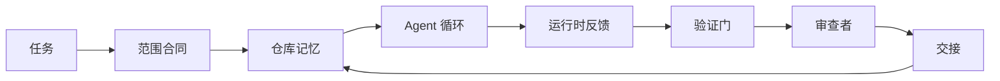

# Agent 工作台工程：为什么强大的模型仍然会失败

> 一个强大的模型是不够的。可靠的 Agent 需要一个工作台：指令、状态、范围、反馈、验证、审查和交接。剥离这些，即使前沿模型产出的工作也不安全，无法交付。

**类型：** 学习 + 构建
**语言：** Python（标准库）
**前置知识：** 阶段 14 · 01（Agent 循环），阶段 14 · 26（失败模式）
**时间：** ~45 分钟

## 学习目标

- 区分模型能力与执行可靠性。
- 说出决定 Agent 能否交付的七个工作台面。
- 在一个小仓库任务上比较纯提示词运行与工作台引导运行。
- 生成一份失败模式报告，将每个缺失的面对应到其导致的症状。

## 问题

你把一个前沿模型放到真实仓库中，让它添加输入验证。它打开四个文件，写了一段看起来合理的代码，宣布成功，然后停止。你运行测试。两个失败了。还有一个与验证无关的文件被修改了。没有记录表明 Agent 假设了什么、先尝试了什么、或者还有什么需要做。

模型并没有在 Python 上出错。它是在工作本身出错。它不知道什么算完成、在哪里可以写、哪些测试是权威的、或者下一个会话应该如何继续。

这不是模型错误。这是工作台错误。Agent 周围的环境缺失了那些将一次性生成转化为可靠、可恢复的工程的部分。

## 概念

工作台是在任务期间包裹模型的操作环境。它有七个面：

| 面 | 承载内容 | 缺失时的失败 |
|---------|-----------------|----------------------|
| 指令 | 启动规则、禁止操作、完成定义 | Agent 猜测交付意味着什么 |
| 状态 | 当前任务、触及的文件、阻塞项、下一步操作 | 每个会话从零开始 |
| 范围 | 允许的文件、禁止的文件、验收标准 | 编辑泄露到无关代码 |
| 反馈 | 捕获到循环中的真实命令输出 | Agent 在 400 错误上宣布成功 |
| 验证 | 测试、lint、冒烟运行、范围检查 | "看起来不错"就到达主分支 |
| 审查 | 使用不同角色的第二次检查 | 构建者给自己的作业评分 |
| 交接 | 改变了什么、为什么改变、还剩下什么 | 下一个会话重新发现一切 |

工作台独立于模型。你可以更换模型而保留这些面。你不能更换这些面而保留可靠性。



循环闭合在状态文件上，而不是聊天历史记录上。聊天是易变的。仓库是记录系统。

### 工作台与提示词工程

提示词告诉模型本轮你想要什么。工作台告诉模型如何跨轮次和跨会话工作。大多数 Agent 失败故事都是穿着提示词工程外衣的工作台失败。

### 工作台与框架

框架给你一个运行时（LangGraph, AutoGen, Agents SDK）。工作台给 Agent 一个在该运行时内工作的场所。两者都需要。这个迷你系列是关于后者的。

### 从原语推理，而非从供应商分类法

目前关于"工作台工程"有很多文章。Addy Osmani、OpenAI、Anthropic、LangChain、Martin Fowler、MongoDB、HumanLayer、Augment Code、Thoughtworks、walkinglabs 的 awesome 列表，以及 Medium 和 Hacker News 上的持续文章都在讨论它。他们在工作台的边界、范围以及使用什么词汇上存在分歧。我们不需要选边站。七个面是一个 UX 层；每个工作台之下都是支撑任何可靠后端的那组相同的分布式系统原语。

暂时去掉 Agent 的标签。一个 Agent 运行是跨越时间、进程和机器的计算。要使其可靠，你需要任何生产系统都需要的那组相同的原语。

| 原语 | 是什么 | 为 Agent 承载什么 |
|-----------|------------|------------------------------|
| 函数 | 类型化处理程序。尽量纯。拥有自己的输入和输出。 | 工具调用、规则检查、验证步骤、模型调用 |
| 工作者 | 拥有一个或多个函数和生命周期长时间运行的进程 | 构建者、审查者、验证者、MCP 服务器 |
| 触发器 | 调用函数的事件源 | Agent 循环节拍、HTTP 请求、队列消息、cron、文件变更、钩子 |
| 运行时 | 决定什么在哪里运行、使用什么超时和资源的边界 | Claude Code 的进程、LangGraph 的运行时、工作者容器 |
| HTTP / RPC | 调用者和工作者之间的线路 | 工具调用协议、MCP 请求、模型 API |
| 队列 | 触发器和工作者之间的持久缓冲区；背压、重试、幂等性 | 任务板、反馈日志、审查收件箱 |
| 会话持久化 | 能在崩溃、重启、模型更换后存活的状态 | `agent_state.json`、检查点、KV 存储、仓库本身 |
| 授权策略 | 谁可以用什么范围调用什么函数 | 允许/禁止的文件、审批边界、MCP 能力列表 |

现在将七个工作台面映射到这些原语上。

- **指令** — 策略 + 函数元数据。规则是检查（函数）。路由器（`AGENTS.md`）是附加到运行时启动的策略。
- **状态** — 会话持久化。运行时在每一步读取的键值存储。文件、KV 或数据库；持久化语义重要，存储后端不重要。
- **范围** — 每任务的授权策略。允许/禁止的 glob 是 ACL。需要审批是权限格。
- **反馈** — 写入队列的调用日志。每个 shell 调用都是一个记录，持久的、可重放的。
- **验证** — 一个函数。对输入是确定性的。在任务关闭时触发。失败时关闭。
- **审查** — 一个独立的工作者，对构建者工件具有只读授权，对审查报告具有只写授权。
- **交接** — 由会话结束触发器发出的持久记录。下一个会话的启动触发器读取它。

Agent 循环本身是一个工作者，消费事件（用户消息、工具结果、定时器节拍），调用函数（模型，然后模型选择的工具），写入记录（状态、反馈），并发出触发器（验证、审查、交接）。没有神秘之处；与作业处理器形状相同。

### 流通中的模式，翻译为原语

每个流行的工作台模式都可以归约为八个原语。翻译表。

| 供应商或社区模式 | 实际是什么 |
|------------------------------|--------------------|
| Ralph 循环（Claude Code、Codex、agentic_harness 书）—— 当 Agent 试图提前停止时，将原始意图重新注入新的上下文窗口 | 一个用干净上下文重新入队任务的触发器；会话持久化将目标向前推进 |
| 计划/执行/验证（PEV） | 三个工作者，每个角色一个，通过状态和阶段间的队列通信 |
| 工作台-计算分离（OpenAI Agents SDK，2026 年 4 月）—— 将控制平面与执行平面分离 | 重新陈述控制平面/数据平面。在 Agent 标签出现之前几十年就已存在 |
| Open Agent Passport（OAP，2026 年 3 月）—— 在执行前对每个工具调用进行声明式策略签名和审计 | 由执行前工作者强制执行的授权策略，带有签名的审计队列 |
| 引导和传感器（Birgitta Bockeler / Thoughtworks）—— 前馈规则 + 反馈可观测性 | 授权策略 + 验证函数 + 可观测性追踪 |
| 渐进压缩，5 阶段（Claude Code 逆向工程，2026 年 4 月） | 一个状态管理工作者，像 cron 一样在会话持久化上运行以保持在预算内 |
| 钩子/中间件（LangChain、Claude Code）—— 拦截模型和工具调用 | 包裹运行时调用路径的触发器 + 函数 |
| 作为带有渐进披露的 Markdown 技能（Anthropic、Flue） | 函数注册表，函数元数据在需要时即时加载到上下文中 |
| 沙箱 Agent（Codex、Sandcastle、Vercel Sandbox） | 计算平面：具有隔离文件系统、网络和生命周期的运行时 |
| MCP 服务器 | 通过稳定的 RPC 暴露函数的工作者，以能力列表作为授权 |

上表中的每一项都是 Agent 社区到达一个在分布式系统中已有名称的原语，然后给它起了一个新名字。对营销有用的标签；对工程词汇没有用。

### 数据实际说明了什么

工作台优于模型的主张现在有数据支持。值得了解，因为它们也是反对"只要等更智能的模型"的唯一诚实论据。

- Terminal Bench 2.0 —— 同一模型，工作台变更将编码 Agent 从前 30 名之外移动到第五名（LangChain，*Agent 工作台解剖*）。
- Vercel —— 删除了 Agent 80% 的工具；成功率从 80% 跃升至 100%（MongoDB）。
- Harvey —— 仅通过工作台优化，法律 Agent 准确性翻倍以上（MongoDB）。
- 88% 的企业 AI Agent 项目未能投入生产。失败集中在运行时，而非推理（preprints.org，*语言 Agent 的工作台工程*，2026 年 3 月）。
- 2025 年一项跨越三个流行开源框架的基准研究报告约 50% 的任务完成率；长上下文 WebAgent 在长上下文条件下从 40-50% 崩溃到 10% 以下，主要来自无限循环和目标丢失（2026 年初的文章广泛报道）。

结论不是"工作台永远胜利"。模型确实会随着时间的推移吸收工作台技巧。结论是，今天，承载工程的负重是在模型周围，而不是在模型内部，而承载这些负重的原语正是每个生产系统一直需要的那些。

### 供应商文章止步之处

这是你不需要客气对待的部分。

- LangChain 的 *Agent 工作台解剖* 列举了十一个组件 —— 提示词、工具、钩子、沙箱、编排、记忆、技能、子 Agent 和一个运行时"愚蠢循环"。它没有命名队列、工作者作为部署单元、触发器语义、会话持久化作为独立关注点、或者授权策略。它将工作台视为你配置的对象，而不是你部署的系统。
- Addy Osmani 的 *Agent 工作台工程* 确立了 `Agent = Model + Harness` 的框架和棘轮模式，但止步于说出工作台是由什么构建的。它读起来像是一个立场，而不是一个规范。
- Anthropic 和 OpenAI 在面上走得最深，但停留在他们自己的运行时内。2026 年 4 月 Agents SDK 中的"工作台-计算分离"公告是第一个明确支持控制平面/数据平面分离的供应商文章。那是一个原语概念，而不是一个新概念。
- agentic_harness 书将工作台视为配置对象（Jaymin West 的 *Agentic Engineering*，第 6 章），其中最有力的陈述是"工作台是 Agent 系统中的主要安全边界"。这仅仅是授权策略，重新陈述而已。
- Hacker News 的讨论不断到达同一个地方。2026 年 4 月的帖子 *Agent 工作台应位于沙箱之外* 认为工作台应该"更像一个位于一切之外并根据上下文和用户授权访问的管理程序"。这再次是作为独立平面的授权策略。

你不需要不同意这些文章中的任何一篇就能注意到差距。它们是在撰写已经存在的系统的 UX 描述。我们在编写系统本身。当系统构建正确时，七个面从原语中自然产生。当构建错误时，再多的 `AGENTS.md` 润色也无法修复缺失的队列。

所以当你听到其他地方讨论"工作台工程"时，请翻译回原语。提示词和规则是策略和函数。脚手架是运行时。护栏是授权 + 验证。钩子是触发器。记忆是会话持久化。Ralph 循环是重新入队。子 Agent 是工作者。沙箱是计算平面。词汇在变；工程不变。工作台是面向 Agent 的 UX；工作台，在能在下次供应商重新定义中存续的意义上，是正确连接起来的函数、工作者、触发器、运行时、队列、持久化和策略。

## 构建

`code/main.py` 在一个小仓库任务上运行两次。第一次纯提示词，然后与七个面连接。同一模型，同一任务。脚本统计失败运行中缺失了哪些面，并打印一份失败模式报告。

仓库任务故意很小：为单文件 FastAPI 风格的处理程序添加输入验证并编写一个通过的测试。

运行：

```
python3 code/main.py
```

输出：两次运行的并列日志，一份总结纯提示词运行的 `failure_modes.json`，以及工作台运行的简要裁决。

Agent 是一个小的基于规则的桩；重点是面，而不是模型。在这个迷你系列的其余部分，你将每个面重建成真实、可复用的工件。

## 使用

三个工作台面已经在现实世界中存在，即使没有人这样称呼它们：

- **Claude Code, Codex, Cursor。** `AGENTS.md` 和 `CLAUDE.md` 是指令面。斜杠命令是范围。钩子是验证。
- **LangGraph, OpenAI Agents SDK。** 检查点和会话存储是状态面。交接是交接面。
- **真实仓库上的 CI。** 测试、lint 和类型检查是验证。PR 模板是交接。CODEOWNERS 是审查。

工作台工程是让这些面明确和可复用的学科，而不是让每个团队重新发现它们。

## 交付

`outputs/skill-workbench-audit.md` 是一个可移植的技能，用于审计现有仓库的七个工作台面，并报告哪些缺失、哪些部分存在、哪些健康。将其放在任何 Agent 设置旁边；它会告诉你首先要修复什么。

## 练习

1. 选择一个你已经运行 Agent 的仓库。给七个面打分，从 0（缺失）到 2（健康）。你最弱的面是什么？
2. 扩展 `main.py`，使纯提示词运行也产生一个假的"成功"声明。验证验证门会捕获它。
3. 为你自己的产品添加第八个面。证明它为什么不能归入现有的七个之一。
4. 使用一个幻觉额外文件写入的不同桩 Agent 重新运行脚本。哪个面最先捕获它？
5. 将阶段 14 · 26 中五个行业反复出现的失败模式映射到七个面上。每个面设计用来吸收哪种模式？

## 关键术语

| 术语 | 人们说的 | 实际含义 |
|------|----------------|------------------------|
| 工作台 | "设置" | 围绕模型的工程化面，使工作可靠 |
| 面 | "一个文档"或"一个脚本" | 一个命名的、机器可读的输入，Agent 每轮读取或写入 |
| 记录系统 | "笔记" | Agent 在聊天历史消失时视为真相的文件 |
| 完成定义 | "验收" | 一个客观的、文件支持的检查清单，Agent 无法伪造 |
| 工作台审计 | "仓库就绪检查" | 对七个面的检查，在工作开始前标记缺失的部分 |

## 延伸阅读

将这些作为数据点阅读，而非权威。每一个都是部分分类法。在决定是否采用之前，将每个概念翻译回原语（函数、工作者、触发器、运行时、HTTP/RPC、队列、持久化、策略）。

供应商框架：

- [Addy Osmani, Agent Harness Engineering](https://addyosmani.com/blog/agent-harness-engineering/) — `Agent = Model + Harness` 和棘轮模式；基础设施方面较薄弱
- [LangChain, The Anatomy of an Agent Harness](https://blog.langchain.com/the-anatomy-of-an-agent-harness/) — 十一个组件：提示词、工具、钩子、编排、沙箱、记忆、技能、子 Agent、运行时；省略了队列、部署、授权
- [OpenAI, Harness engineering: leveraging Codex in an agent-first world](https://openai.com/index/harness-engineering/) — Codex 团队对运行时周围面的看法
- [OpenAI, Unrolling the Codex agent loop](https://openai.com/index/unrolling-the-codex-agent-loop/) — Agent 循环简化为函数调用的 `while`
- [Anthropic, Effective harnesses for long-running agents](https://www.anthropic.com/engineering/effective-harnesses-for-long-running-agents) — 特定运行时内的长周期面
- [Anthropic, Harness design for long-running application development](https://www.anthropic.com/engineering/harness-design-long-running-apps) — 应用设计笔记
- [LangChain Deep Agents harness capabilities](https://docs.langchain.com/oss/python/deepagents/harness) — 运行时配置面

具有可用细节的实践者文章：

- [Martin Fowler / Birgitta Böckeler, Harness engineering for coding agent users](https://martinfowler.com/articles/harness-engineering.html) — 引导（前馈）+ 传感器（反馈）；最清晰的控制理论框架
- [HumanLayer, Skill Issue: Harness Engineering for Coding Agents](https://www.humanlayer.dev/blog/skill-issue-harness-engineering-for-coding-agents) — "不是模型问题，是配置问题"
- [MongoDB, The Agent Harness: Why the LLM Is the Smallest Part of Your Agent System](https://www.mongodb.com/company/blog/technical/agent-harness-why-llm-is-smallest-part-of-your-agent-system) — 数据：Vercel 80% 到 100%，Harvey 2 倍准确性，Terminal Bench 前 30 到前 5
- [Augment Code, Harness Engineering for AI Coding Agents](https://www.augmentcode.com/guides/harness-engineering-ai-coding-agents) — 约束优先的实践指南
- [Sequoia podcast, Harrison Chase on Context Engineering Long-Horizon Agents](https://sequoiacap.com/podcast/context-engineering-our-way-to-long-horizon-agents-langchains-harrison-chase/) — 运行时关注点优先于模型关注点

书籍、论文和参考实现：

- [Jaymin West, Agentic Engineering — Chapter 6: Harnesses](https://www.jayminwest.com/agentic-engineering-book/6-harnesses) — 书籍长度的处理，将工作台视为主要安全边界
- [preprints.org, Harness Engineering for Language Agents (March 2026)](https://www.preprints.org/manuscript/202603.1756) — 作为控制/自主/运行时的学术框架
- [walkinglabs/awesome-harness-engineering](https://github.com/walkinglabs/awesome-harness-engineering) — 跨上下文、评估、可观测性、编排的精选阅读列表
- [ai-boost/awesome-harness-engineering](https://github.com/ai-boost/awesome-harness-engineering) — 备选精选列表（工具、评估、记忆、MCP、权限）
- [andrewgarst/agentic_harness](https://github.com/andrewgarst/agentic_harness) — 带有 Redis 支持记忆和评估套件的生产就绪参考实现
- [HKUDS/OpenHarness](https://github.com/HKUDS/OpenHarness) — 内置个人 Agent 的开放 Agent 工作台

值得阅读的 Hacker News 讨论，为了分歧而非共识：

- [HN: Effective harnesses for long-running agents](https://news.ycombinator.com/item?id=46081704)
- [HN: Improving 15 LLMs at Coding in One Afternoon. Only the Harness Changed](https://news.ycombinator.com/item?id=46988596)
- [HN: The agent harness belongs outside the sandbox](https://news.ycombinator.com/item?id=47990675) — 主张授权作为独立平面

本课程内的交叉引用：

- 阶段 14 · 23 — OpenTelemetry GenAI 约定：传感器文献所指的可观测性层
- 阶段 14 · 26 — 七个面设计用来吸收的失败模式目录
- 阶段 14 · 27 — 位于授权策略原语的提示注入防御
- 阶段 14 · 29 — 生产运行时（队列、事件、cron）：本节课中的原语在部署中的位置
