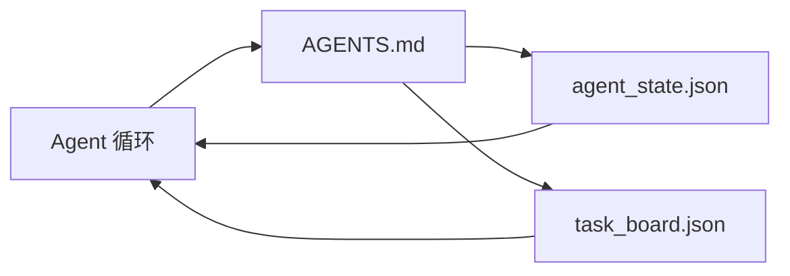

# 最小 Agent 工作台

> 最小的有用工作台是三个文件：一个根指令路由器、一个状态文件和一个任务板。其他一切都在此之上分层构建。如果一个仓库不能承载这三个文件，没有任何模型能拯救它。

**类型：** 构建
**语言：** Python（标准库）
**前置知识：** 阶段 14 · 31（为什么强大的模型仍然会失败）
**时间：** ~45 分钟

## 学习目标

- 定义构成最小可行工作台的三个文件。
- 解释为什么短根路由器胜过冗长的单体 `AGENTS.md`。
- 构建一个 Agent 可以在每轮读取并在结束时写入的状态文件。
- 构建一个能在多会话工作中存活的、不依赖聊天历史的任务板。

## 问题

大多数团队通过编写一个 3000 行的 `AGENTS.md` 并称其完成来构建工作台。模型加载它，忽略它无法总结的部分，然后仍然在它一直失败的那些面上失败。

你需要相反的做法。一个小的根文件，仅在相关时将 Agent 路由到更深层的文件中。持久的状态，Agent 在操作前读取、操作后写入。一个任务板，说明正在进行什么、什么被阻塞、接下来是什么。

三个文件。每个都有自己的工作。每个都足够机器可读，以便以后能演变为真正的系统。

## 概念



### AGENTS.md 是一个路由器，不是一本手册

一个好的 `AGENTS.md` 是短的。它指向 Agent：

- 状态文件（你在哪里）。
- 任务板（还剩下什么）。
- 更深层的规则（在 `docs/agent-rules.md` 下）。
- 验证命令（如何知道它工作）。

任何更长的内容都放在更深的文档中，仅在需要时加载。长手册被忽略。短路由器被遵循。

### agent_state.json 是记录系统

状态承载：活跃的任务 ID、触及的文件、所做的假设、阻塞项和下一步操作。Agent 在每轮读取它。下一个会话读取它而不是重放聊天。

状态存储在文件中，因为聊天历史不可靠。会话会消亡。对话会被修剪。文件不会。

### task_board.json 是队列

任务板承载每个任务，状态为 `todo | in_progress | done | blocked`。它是当状态为空时 Agent 从中拉取的队列，也是你想知道 Agent 是否在正轨上时读取的队列。

板上的任务有一个 ID、一个目标、一个所有者（`builder`、`reviewer` 或 `human`）和验收标准。板是有意小的：当它增长超过一个屏幕时，你有一个规划问题，而不是板的问题。

### 三个文件是地板，不是天花板

后续的课程会添加范围合同、反馈运行器、验证门、审查检查清单和交接数据包。这里的三个文件是所有这些所假设的基础。

## 构建

`code/main.py` 将最小工作台写入一个空仓库，并演示一个单 Agent 轮次：

1. 读取 `agent_state.json`。
2. 如果状态为空，从 `task_board.json` 拉取下一个任务。
3. 触及范围内单个文件。
4. 写回更新后的状态。

运行：

```
python3 code/main.py
```

脚本在其旁边创建 `workdir/`，放下三个文件，运行一轮，并打印差异。重新运行以查看第二轮如何从第一轮停止的地方继续。

## 使用

在生产 Agent 产品内部，同样的三个文件以不同名称出现：

- **Claude Code：** `AGENTS.md` 或 `CLAUDE.md` 作为路由器，`.claude/state.json` 风格存储作为状态，钩子作为板。
- **Codex / Cursor：** 工作区规则作为路由器，会话记忆作为状态，聊天侧边栏中的排队任务作为板。
- **自定义 Python Agent：** 你刚刚写的相同文件。

名称变了。形状没有。

## 生产环境中的模式

最小工作台在三个模式叠加其上后，才能在实际的大型仓库中生存。它们是独立的；选择你的仓库实际需要的那些。

**嵌套的 `AGENTS.md` 取最近优先。** OpenAI 在其主仓库中发布了 88 个 `AGENTS.md` 文件，每个子组件一个。Codex、Cursor、Claude Code 和 Copilot 都从工作文件向仓库根目录行走，并连接沿途找到的每个 `AGENTS.md`。子目录文件扩展根文件。Codex 添加了 `AGENTS.override.md` 来替换而非扩展；覆盖机制是 Codex 特定的，应避免用于跨工具工作。Augment Code 的衡量标准才是重要的：最好的 `AGENTS.md` 文件提供的质量提升相当于从 Haiku 升级到 Opus；最差的则使输出比没有文件更差。

**拒绝的反模式，即使它们看起来像覆盖。** 冲突的指令会静默地将 Agent 从交互模式降级到贪婪模式（ICLR 2026 AMBIG-SWE：48.8% → 28% 解决率）；用编号优先级而非平铺堆叠。不可验证的风格规则（"遵循 Google Python 风格指南"）没有强制命令，让 Agent 自行发明合规性；每条风格规则都要配上精确的 lint 命令。以风格而非命令开头会埋没验证路径；命令优先，风格最后。为人类而非 Agent 编写浪费上下文预算；简洁是优点。

**跨工具符号链接。** 一个单一的根文件，配合符号链接（`ln -s AGENTS.md CLAUDE.md`、`ln -s AGENTS.md .github/copilot-instructions.md`、`ln -s AGENTS.md .cursorrules`），让所有编码 Agent 保持在同一事实来源上。Nx 的 `nx ai-setup` 自动化了跨 Claude Code、Cursor、Copilot、Gemini、Codex 和 OpenCode 的配置。

## 交付

`outputs/skill-minimal-workbench.md` 为任何新仓库生成三个文件的工作台：一个针对项目调优的 `AGENTS.md` 路由器、一个带有正确键的 `agent_state.json`，以及一个种子化当前积压任务的 `task_board.json`。

## 练习

1. 向 `agent_state.json` 添加一个 `last_run` 时间戳。如果文件超过 24 小时，除非操作员确认，否则拒绝运行。
2. 向任务板添加一个 `priority` 字段，并将拉取器改为始终选取最高优先级的 `todo`。
3. 将 `task_board.json` 迁移到 JSON Lines 格式，使每个任务为一行，差异在版本控制中清晰可见。
4. 编写一个 `lint_workbench.py`，如果 `AGENTS.md` 超过 80 行或引用了不存在的文件，则失败。
5. 决定三个文件中哪一个丢失代价最大。为其辩护。

## 关键术语

| 术语 | 人们说的 | 实际含义 |
|------|----------------|------------------------|
| 路由器 | `AGENTS.md` | 将 Agent 指向深层文档和文件的短根文件 |
| 状态文件 | "笔记" | 记录 Agent 位置的机器可读文件，每轮写入 |
| 任务板 | "积压工作" | 带有状态、所有者、验收条件的 JSON 工作队列 |
| 记录系统 | "事实来源" | 聊天消失后工作台视为权威的文件 |

## 延伸阅读

- [agents.md — 开放规范](https://agents.md/) — 被 Cursor、Codex、Claude Code、Copilot、Gemini、OpenCode 采用
- [Augment Code, A good AGENTS.md is a model upgrade. A bad one is worse than no docs at all](https://www.augmentcode.com/blog/how-to-write-good-agents-dot-md-files) — 测量的质量提升
- [Blake Crosley, AGENTS.md Patterns: What Actually Changes Agent Behavior](https://blakecrosley.com/blog/agents-md-patterns) — 经验上有效和无效的
- [Datadog Frontend, Steering AI Agents in Monorepos with AGENTS.md](https://dev.to/datadog-frontend-dev/steering-ai-agents-in-monorepos-with-agentsmd-13g0) — 实际中的嵌套优先级
- [Nx Blog, Teach Your AI Agent How to Work in a Monorepo](https://nx.dev/blog/nx-ai-agent-skills) — 跨六个工具的单源生成
- [The Prompt Shelf, AGENTS.md Best Practices: Structure, Scope, and Real Examples](https://thepromptshelf.dev/blog/agents-md-best-practices/) — 能经受审查的章节排序
- [Anthropic, Claude Code subagents and session store](https://docs.anthropic.com/en/docs/agents-and-tools/claude-code/sub-agents)
- 阶段 14 · 31 — 这个最小模式吸收的失败模式
- 阶段 14 · 34 — 本课预览的持久状态模式
