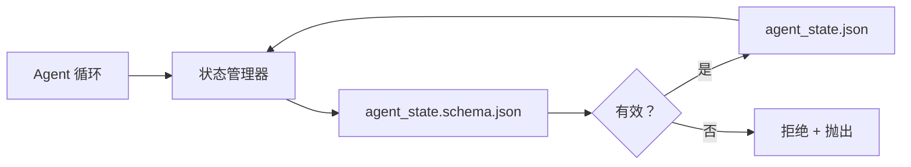

# 仓库记忆与持久状态

> 聊天历史是易变的。仓库是持久的。工作台将 Agent 状态存储在版本化文件中，以便下一个会话、下一个 Agent 和下一个审查者都从同一个事实来源读取。

**类型：** 构建
**语言：** Python（标准库 + `jsonschema` 可选）
**前置知识：** 阶段 14 · 32（最小工作台）
**时间：** ~60 分钟

## 学习目标

- 定义什么属于仓库记忆，什么属于聊天历史。
- 为 `agent_state.json` 和 `task_board.json` 编写 JSON Schema。
- 构建一个能原子地加载、验证、变更和持久化状态的状态管理器。
- 使用 Schema 在错误写入损坏工作台之前拒绝它们。

## 问题

Agent 完成一个会话。聊天关闭。下一个会话打开并询问从哪里开始。模型说"让我检查文件"，读取过时的笔记，重新做已经完成的工作。或者更糟，它重写了一个已经完成的文件，因为没有人告诉它这个文件已经完成了。

工作台的解决方案是仓库记忆：状态存在于仓库中的 JSON 文件中，在 schema 下编写，原子地持久化，在代码审查中对差异友好。聊天是瞬态的输入流；仓库是记录系统。

## 概念



### 什么属于仓库记忆

| 属于 | 不属于 |
|---------|-----------------|
| 活跃任务 ID | 原始聊天记录 |
| 本次会话触及的文件 | 词元级推理追踪 |
| Agent 所做的假设 | "用户似乎感到沮丧" |
| 未解决的阻塞项 | 采样完成结果 |
| 下一步操作 | 供应商特定的模型 ID |

测试是持久性：三个月后在 CI 重新运行中是否有用？如果有用，放入仓库。如果没有用，放入遥测。

### Schema 优先的状态

JSON Schema 是合同。没有它，每个 Agent 都会发明新字段，每个审查者都要学习新形状，每个 CI 脚本都必须特殊处理以前的版本。有了它，错误的写入就是被拒绝的写入。

Schema 涵盖：

- 必需的键。
- 允许的 `status` 值。
- 禁止的值（例如数组为 `null`）。
- 模式约束（任务 ID 匹配 `T-\d{3,}`）。
- 用于迁移的版本字段。

### 原子写入

状态写入需要能够承受部分失败：写入临时文件、fsync、重命名覆盖目标。状态文件是事实来源；写了一半的文件比没有文件更糟糕。

### 迁移

当 schema 变化时，在 schema 升级旁边发布一个迁移脚本。状态文件携带一个 `schema_version` 字段；管理器拒绝加载来自它无法迁移的版本的文件。

## 构建

`code/main.py` 实现：

- `agent_state.schema.json` 和 `task_board.schema.json`。
- 一个仅使用标准库的验证器（JSON Schema 子集：required、type、enum、pattern、items）。
- `StateManager.load`、`StateManager.update`、`StateManager.commit` 使用原子性的临时文件与重命名写入。
- 一个变更状态、持久化、重新加载并证明完整往返的演示。

运行：

```
python3 code/main.py
```

脚本写入 `workdir/agent_state.json` 和 `workdir/task_board.json`，跨两轮变更它们，并在每一步打印验证后的状态。

## 生产环境中的模式

四个模式将本课的最小方案转变为多 Agent 大型仓库可以存活的东西。

**原子临时文件与重命名不是可选的。** 2026 年 3 月一个 Hive 项目的 bug 报告清晰地记录了失败模式：`state.json` 通过 `write_text()` 写入，异常被捕获并静默。部分写入导致会话在无信号的情况下在损坏状态上恢复。修复方法始终是：在与目标相同的目录中使用 `tempfile.mkstemp`、写入、`fsync`、`os.replace`（POSIX 和 Windows 上的原子重命名）。本课的 `atomic_write` 正是这样做的。

**每个非幂等工具调用的幂等键。** 如果 Agent 在调用工具之后、检查点结果之前崩溃，恢复时会重试工具调用。对读取是安全的；对电子邮件、数据库插入、文件上传是危险的。模式：在执行前将每个工具调用 ID 记录到 `pending_calls.jsonl`。重试时检查 ID；如果存在，跳过调用并使用缓存结果。Anthropic 和 LangChain 在 2026 年的指南中都指出了这一点；LangGraph 的检查点器也出于同样的原因持久化待处理的写入。

**将大型工件与状态分离。** 不要将 CSV、长记录或生成的文件存储在 `agent_state.json` 中。将工件保存为单独的文件（或上传到对象存储），只在状态中保留路径。检查点保持小巧快速；工件独立增长。

**用于审计的事件溯源，用于恢复的快照。** 在每次变更时追加到事件日志（`state.events.jsonl`）；定期快照到 `state.json`。恢复时读取快照，然后重放快照时间戳之后的任何事件。这会消耗更多磁盘，但可以逐字重放 Agent 的决策——在调试长周期运行时至关重要。与 Postgres 内部用于 WAL 的形状相同。

**Schema 迁移，否则拒绝加载。** `schema_version` 整数是合同。当管理器加载未知版本的文件时，它拒绝读取。在 schema 升级旁边发布迁移脚本；`tools/migrate_state.py` 在每次启动时幂等地运行。

## 使用

在生产中：

- **LangGraph 检查点器。** 相同的想法，不同的存储。检查点器将图状态持久化到 SQLite、Postgres 或自定义后端。本课教授的 schema 是当检查点器失效且你需要手动读取状态时的选择。
- **Letta 记忆块。** 具有结构化 schema 的持久块（阶段 14 · 08）。相同的纪律，限定于长时间运行的角色。
- **OpenAI Agents SDK 会话存储。** 可插拔后端，schema 感知。本课中的状态文件是本地文件后端。

## 交付

`outputs/skill-state-schema.md` 生成项目特定的 JSON Schema 对（状态 + 板）、一个接入原子写入的 Python `StateManager`，以及一个迁移脚手架，以便下一次 schema 升级不会破坏工作台。

## 练习

1. 添加一个 `last_human_touch` 时间戳。拒绝任何在人类编辑后五秒内的 Agent 写入。
2. 扩展验证器以支持 `oneOf`，使任务可以是构建任务或审查任务，具有不同的必需字段。
3. 添加一个 `schema_version` 字段，并编写从 v1 到 v2 的迁移（将 `blockers` 重命名为 `risks`）。
4. 将存储后端从本地文件迁移到 SQLite。保持 `StateManager` API 相同。
5. 让两个 Agent 以 50 毫秒的写入竞争对同一状态文件运行。会出什么问题？原子重命名如何拯救你？

## 关键术语

| 术语 | 人们说的 | 实际含义 |
|------|----------------|------------------------|
| 仓库记忆 | "笔记文件" | 存储在仓库追踪文件中的状态，在 schema 下 |
| Schema 优先 | "验证输入" | 在写入者之前定义合同，拒绝漂移 |
| 原子写入 | "就是重命名" | 写入临时文件、fsync、重命名，使部分失败无法损坏 |
| 迁移 | "Schema 升级" | 将 vN 状态转换为 v(N+1) 状态的脚本 |
| 记录系统 | "事实来源" | 工作台视为权威的工件 |

## 延伸阅读

- [JSON Schema 规范](https://json-schema.org/specification.html)
- [LangGraph 检查点器](https://langchain-ai.github.io/langgraph/concepts/persistence/)
- [Letta 记忆块](https://docs.letta.com/concepts/memory)
- [Fast.io, AI Agent State Checkpointing: A Practical Guide](https://fast.io/resources/ai-agent-state-checkpointing/) — 具有幂等性的 schema 优先检查点
- [Fast.io, AI Agent Workflow State Persistence: Best Practices 2026](https://fast.io/resources/ai-agent-workflow-state-persistence/) — 并发控制、TTL、事件溯源
- [Hive Issue #6263 — non-atomic state.json writes silently ignored](https://github.com/aden-hive/hive/issues/6263) — 真实项目中的失败模式
- [eunomia, Checkpoint/Restore Systems: Evolution, Techniques, Applications](https://eunomia.dev/blog/2025/05/11/checkpointrestore-systems-evolution-techniques-and-applications-in-ai-agents/) — 从操作系统历史应用于 Agent 的 CR 原语
- [Indium, 7 State Persistence Strategies for Long-Running AI Agents in 2026](https://www.indium.tech/blog/7-state-persistence-strategies-ai-agents-2026/)
- [Microsoft Agent Framework, Compaction](https://learn.microsoft.com/en-us/agent-framework/agents/conversations/compaction) — 供应商检查点管理器
- 阶段 14 · 08 — 记忆块与休眠时间计算
- 阶段 14 · 32 — 本课进行 schema 化的三个文件最小集
- 阶段 14 · 40 — 从同一 schema 读取的交接数据包
