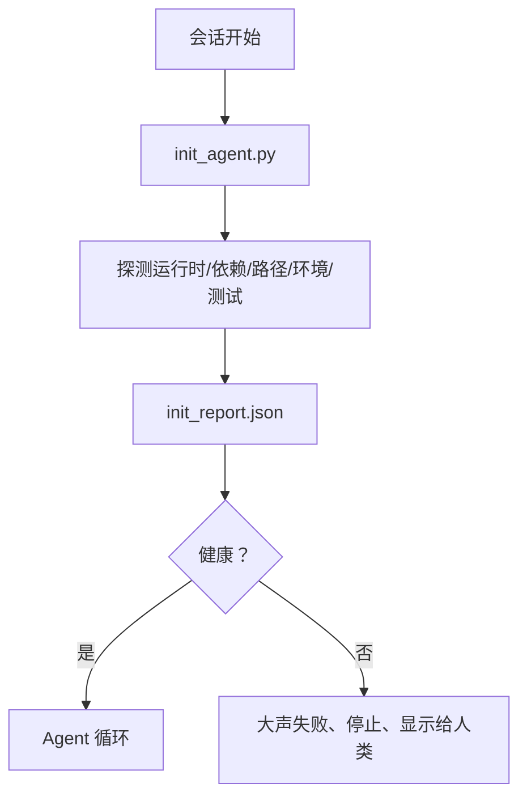

# Agent 的初始化脚本

> 每个冷启动的会话都要付出代价。Agent 读取相同的文件、重试相同的探测、重新发现相同的路径。一个初始化脚本只付一次代价，并将答案写入状态。

**类型：** 构建
**语言：** Python（标准库）
**前置知识：** 阶段 14 · 32（最小工作台），阶段 14 · 34（仓库记忆）
**时间：** ~45 分钟

## 学习目标

- 识别 Agent 永远不应该在每个会话中重复做的工作。
- 构建一个确定性的初始化脚本，探测运行时、依赖关系和仓库健康状态。
- 持久化探测结果，使 Agent 读取它而不是重新运行检查。
- 当初始化失败时，大声、快速失败，只有一个查找位置。

## 问题

打开一个会话。Agent 猜测 Python 版本。猜测测试命令。列出仓库根目录五次以找到入口点。尝试导入一个未安装的包。询问用户配置文件在哪里。到它做出真正的编辑时，已经有一万个词元花在了本应是一个脚本的设置工作上。

解决方案是一个在 Agent 做任何其他事情之前运行的初始化脚本，并写入一个 `init_report.json`，Agent 在启动时读取。

## 概念



### 初始化脚本探测什么

| 探测项 | 为什么重要 |
|-------|----------------|
| 运行时版本 | 错误的 Python 或 Node 版本意味着静默的错误版本 bug |
| 依赖可用性 | 稍后缺失的包代价是现在捕获它的十倍 |
| 测试命令 | Agent 必须知道如何验证；如果命令缺失，工作台就是坏的 |
| 仓库路径 | 硬编码路径会漂移；一次解析并固定 |
| 环境变量 | 缺失的 `OPENAI_API_KEY` 是失败面，不是运行时谜题 |
| 状态 + 板的新鲜度 | 崩溃会话的过时状态是隐患 |
| 最后已知良好提交 | 会话结束时交接差异的锚点 |

### 大声失败、快速失败、在一个地方失败

探测失败意味着停止并显示给人类。不存在"Agent 会解决的"。初始化的全部意义在于当工作台损坏时拒绝启动。

### 幂等性

连续运行两次。第二次运行应该除了更新时间戳外什么都不做。幂等性使你能够将脚本接入 CI、钩子或预任务斜杠命令。

### 初始化与启动规则

规则（阶段 14 · 33）描述了什么必须为真才能行动。初始化是建立那些规则可以被检查的脚本。没有初始化的规则变成了"要小心"。没有规则的初始化变成了华丽的失败。

## 构建

`code/main.py` 实现 `init_agent.py`：

- 五个探测：Python 版本、通过 `importlib.util.find_spec` 列出依赖、测试命令可解析性、必需的环境变量、状态文件新鲜度。
- 每个探测返回 `(name, status, detail)`。
- 脚本写入 `init_report.json` 包含完整的探测集，如果任何块严重级别的探测失败则以非零退出。

运行：

```
python3 code/main.py
```

脚本打印探测表，写入 `init_report.json`，在正常路径下以零退出，或在有失败探测列表时以非零退出。

## 生产环境中的模式

三个模式将一个有用的初始化脚本与一个形式主义区分开来。

**最后已知良好提交锚定。** 探测当前提交与上次成功合并时写入的 `LKG` 文件。如果差异超过预算（默认 50 个文件），拒绝启动并要求人类确认新基线。这就是 Cloudflare 的 AI 代码审查用来限定审查者 Agent 范围的方法：每个审查会话锚定在同一个最后已知良好上，从不跨会话累积漂移。

**带 TTL 的锁文件。** 在第一次成功探测通过后写入 `prereqs.lock`。后续运行信任该锁 N 小时（默认 24 小时），如果依赖清单哈希匹配，跳过昂贵的探测。初始化脚本首先读取锁；如果锁是新鲜的且依赖清单哈希匹配，则短路。这与 Docker 用于层缓存的模式相同：幂等探测 + 内容哈希 = 跳过。

**热路径中无网络、无 LLM、无意外。** 初始化探测是确定性的管道。调用 LLM 来分类失败或访问外部服务来检查许可证的探测不是探测；它是工作流。如果某个探测在干运行中耗时超过三秒，将其视为工作台异味，要么移出初始化，要么缓存其结果。

## 使用

在生产中：

- **Claude Code 钩子。** `pre-task` 钩子调用初始化脚本，如果失败则拒绝启动 Agent。
- **GitHub Actions。** `setup-agent` 作业运行初始化脚本；Agent 作业依赖它。
- **Docker 入口点。** Agent 容器在执行 Agent 运行时之前运行初始化脚本；日志在失败时显示。

初始化脚本是可移植的，因为它不对特定框架进行调用。Bash、Make 或 tasks 文件都可以包装它。

## 交付

`outputs/skill-init-script.md` 采访项目，将其设置工作分类为探测，并发布项目特定的 `init_agent.py` 加上一个在任何 Agent 步骤之前运行它的 CI 工作流。

## 练习

1. 添加一个探测，对比当前提交与最后已知良好提交的差异，如果超过 50 个文件更改则拒绝启动。
2. 将脚本改为写入一个 `prereqs.lock` 文件，如果锁超过七天则拒绝启动。
3. 添加一个 `--fix` 标记，自动安装缺失的开发依赖，但未经审批绝不修改运行时依赖。
4. 将探测从硬编码函数移动到 YAML 注册表。为这种权衡辩护。
5. 为每个探测添加时间预算。运行超过三秒的探测是工作台异味。

## 关键术语

| 术语 | 人们说的 | 实际含义 |
|------|----------------|------------------------|
| 探测 | "一项检查" | 返回 `(name, status, detail)` 的确定性函数 |
| 初始化报告 | "设置输出" | 在状态旁边写入的包含探测结果的 JSON |
| 幂等 | "安全重跑" | 连续两次运行产生相同的报告，时间戳除外 |
| 大声失败 | "不要吞下" | 停止并显示给人类；无静默回退 |
| 设置代价 | "启动成本" | Agent 每会话重新发现显而易见事物所花费的词元 |

## 延伸阅读

- [Anthropic, Effective harnesses for long-running agents](https://www.anthropic.com/engineering/effective-harnesses-for-long-running-agents)
- [GitHub Actions, composite actions for setup](https://docs.github.com/en/actions/sharing-automations/creating-actions/creating-a-composite-action)
- [microservices.io, GenAI dev platform: guardrails](https://microservices.io/post/architecture/2026/03/09/genai-development-platform-part-1-development-guardrails.html) — 作为初始化的预提交 + CI 检查
- [Augment Code, How to Build Your AGENTS.md (2026)](https://www.augmentcode.com/guides/how-to-build-agents-md) — 初始化预期
- [Codex Blog, Codex CLI Context Compaction](https://codex.danielvaughan.com/2026/03/31/codex-cli-context-compaction-architecture/) — 作为压缩感知初始化的会话开始
- 阶段 14 · 33 — 该脚本启用的规则集
- 阶段 14 · 34 — 该脚本种子化的状态文件
- 阶段 14 · 38 — 初始化脚本输入的验证门
- 阶段 14 · 40 — 消费初始化报告的最后已知良好的交接
