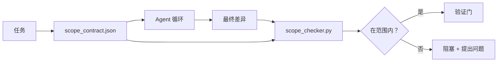

# 范围合同与任务边界

> 模型不知道工作在哪里结束。范围合同是一个按任务的文件，说明工作从哪里开始、在哪里结束、以及如果溢出如何回滚。合同将"保持在范围内"从愿望转变为检查。

**类型：** 构建
**语言：** Python（标准库）
**前置知识：** 阶段 14 · 32（最小工作台），阶段 14 · 33（作为约束的规则）
**时间：** ~50 分钟

## 学习目标

- 编写一个 Agent 在任务开始时读取、验证者在任务结束时读取的范围合同。
- 指定允许的文件、禁止的文件、验收标准、回滚计划和审批边界。
- 实现一个范围检查器，将差异与合同进行比较并标记违规。
- 使范围蔓延变得可见、自动化和可审查。

## 问题

Agent 会蔓延。任务是"修复登录 bug"。差异触及了登录路由、邮件辅助函数、数据库驱动、README 和发布脚本。每一次触及在当时都有合理的理由。但它们加在一起是一个与被审查的变更不同的变更。

范围蔓延是 Agent 工作中最被低估的失败模式，因为 Agent 善意地叙述每一步。解决方案不是更严格的提示词。解决方案是磁盘上的一个合同，说明承诺了什么，以及一个将结果与承诺进行比较的检查。

## 概念



### 范围合同中包含什么

| 字段 | 目的 |
|-------|---------|
| `task_id` | 链接到板上的任务 |
| `goal` | 审查者可以验证的一句话 |
| `allowed_files` | Agent 可以写入的 glob 模式 |
| `forbidden_files` | Agent 即使意外也不能触及的 glob 模式 |
| `acceptance_criteria` | 证明完成的测试命令或断言行 |
| `rollback_plan` | 操作员在需要停止时可以执行的一个段落 |
| `approvals_required` | 超出范围、需要明确人工签字批准的操作 |

没有 `forbidden_files` 的合同是不完整的。否定空间是合同的一半。

### Globs，而非原始路径

真实仓库会移动文件。将合同绑定到 glob 模式（`app/**/*.py`、`tests/test_signup*.py`），使会话之间的重构不会使合同失效。

### 回滚是范围的一部分

列出如何回滚迫使合同作者思考可能出错的地方。一个你不能从中回滚的合同是不应该被批准的合同。

### 范围检查是差异检查

Agent 写入一个差异。检查器读取差异、允许的 glob、禁止的 glob 以及任何运行过的验收命令列表。每个违规都是一个标记的发现，验证门可以拒绝。

### 范围的两个层次：功能列表与任务合同

范围合同限定一个任务。它不限定的项目。Agent 可以完美地停留在登录修复的合同内，然后在下一轮决定项目还需要一个设置页面、一个深色模式切换和一个路由器重写。合同从未被问及哪些工作属于项目范围，只问了哪些文件属于任务范围。

第二个层次需要它自己的原语：一个 `feature_list.json`，Agent 在会话开始时读取。它是作为机器可读、有序文件的项目积压。Agent 恰好选取一个 `status` 为 `todo` 的功能，将其 `id` 写入活跃的范围合同，并被禁止在同一会话中开始第二个功能。"一次一个功能"不再是 Agent 可以理性化的提示词中的一行，而是它从磁盘读取的值和门强制执行的一个检查。

```json
{
  "project": "知识库",
  "active": "import-pdf",
  "features": [
    { "id": "import-pdf",   "status": "in_progress", "goal": "将 PDF 导入到库中",        "done_when": "pytest tests/test_import.py && 示例 PDF 出现在库视图中" },
    { "id": "full-text-search", "status": "todo",     "goal": "搜索文档文本并对结果排序",   "done_when": "查询返回带片段的有序结果" },
    { "id": "cite-answers", "status": "todo",         "goal": "答案附带来源引用",        "done_when": "每个答案至少渲染一个可点击的引用" }
  ]
}
```

| 字段 | 目的 |
|-------|---------|
| `active` | 当前会话可以触及的单个功能；空表示选择一个并设置它 |
| `features[].id` | 范围合同的 `task_id` 指向的稳定 slug |
| `features[].status` | `todo`、`in_progress`、`done`、`blocked`；一次只能有一个 `in_progress` |
| `features[].goal` | 审查者可以验证的一句话 |
| `features[].done_when` | 将 `in_progress` 翻转为 `done` 的验收行 |

两条规则使列表承载重量而非装饰。首先，不变式"最多一个 `in_progress`"本身就是一个启动检查（阶段 14 · 33）：如果列表显示两个，会话拒绝启动直到人类解决。其次，功能列表是文件，而不是聊天消息，因为聊天会滚出上下文，而文件跨会话和跨 Agent 持久化。交接（阶段 14 · 40）将已完成功能的状态写回 `done`，使下一个会话打开时看到准确的板，而不是重新推导剩下什么。

合同和列表通过最小权限组合，与下面描述的合并方式相同：任务合同的 `allowed_files` 必须位于活跃功能触及的任何内容之内，绝不能在其之外。

## 构建

`code/main.py` 实现：

- `scope_contract.json` schema（JSON Schema 子集，glob 数组）。
- 一个差异解析器，将触及的文件列表加上运行命令列表转换为 `RunSummary`。
- 一个 `scope_check`，返回 `(violations, in_scope, off_scope)` 与合同对比。
- 两次演示运行：一次保持在范围内，一次蔓延。检查器标记蔓延，包括确切的文件和原因。

运行：

```
python3 code/main.py
```

输出：合同、两次运行、每次运行的裁决，以及保存的 `scope_report.json`。

## 生产环境中的模式

一个实践"规范最大化"（在调用 Agent 之前用 YAML 编写范围合同）的报告显示，兔子洞率在三周内从 52% 下降到 21%，没有改变 Agent。合同发挥了作用，而不是模型。三个模式让增益持久。

**违规预算，而非二元失败。** `agent-guardrails`（被 Claude Code、Cursor、Windsurf、Codex 通过 MCP 使用的开源合并门）为每个任务提供了一个 `violationBudget`：预算内的轻微范围滑移显示为警告；只有在预算超限时才拒绝合并。配合 `violationSeverity: "error" | "warning"`。预算是一个能交付的门和被团队讨厌而禁用的门之间的区别。

**按路径系列的严重级别不对称。** 超出范围写入 `docs/**` 通常是 `warn`；超出范围写入 `scripts/**`、`migrations/**`、`config/prod/**` 始终是 `block`。这种不对称必须存在于合同中，而不是在运行时中，因为它是项目特定的并且每个任务都会变化。

**文件预算旁边的时间和网络预算。** 一个 `time_budget_minutes` 字段限制了挂钟时间；运行时在未经重新批准的情况下拒绝超过它。`network_egress` 基于主机名的允许列表防止 Agent 静默访问不在任务范围内的外部 API。这些也是范围的维度；文件 glob 是必要的，但不是充分的。

**多合同合并语义（最小权限）。** 当两个范围合同适用时（例如项目范围合同加上任务特定合同），合并规则为：**交集** `allowed_files`（两个合同都必须允许该路径），**并集** `forbidden_files`（任一可以禁止），`time_budget_minutes` 取最严格的（最小值），`approvals_required` 累加。`network_egress` 为 `None` 表示不执行，`[]` 表示全部拒绝，`[...]` 为允许列表；在合并下，`None` 遵从另一方，两个列表取交集，全部拒绝保持全部拒绝。在合同 schema 中声明这一点，使合并是机械的和可审查的。

## 使用

生产模式：

- **Claude Code 斜杠命令。** `/scope` 命令写入合同并将其固定为会话上下文。子 Agent 在操作前读取合同。
- **GitHub PR。** 将合同作为 JSON 文件推送到 PR 正文中或作为检入的工件。CI 针对合并差异运行范围检查器。
- **LangGraph 中断。** 范围违规触发中断；处理程序询问人类合同是否需要增长还是 Agent 需要退出。

合同随任务一起移动。任务关闭时，合同归档在 `outputs/scope/closed/` 下。

## 交付

`outputs/skill-scope-contract.md` 为任务描述生成范围合同以及一个在 CI 中对每个 Agent 差异运行的通配符感知检查器。

## 练习

1. 添加一个 `network_egress` 字段，列出允许的外部主机。拒绝触及其他主机的运行。
2. 扩展检查器，对 `docs/**` 软失败，对 `scripts/**` 硬失败。证明这种不对称。
3. 让合同使用静态规则集（无 LLM）从 `goal` 字段推导 `allowed_files`。第一个边界情况会出什么问题？
4. 添加一个 `time_budget_minutes`，一旦挂钟超过它拒绝继续。
5. 对同一差异运行两个合同。当两者都适用时，正确的合并语义是什么？

## 关键术语

| 术语 | 人们说的 | 实际含义 |
|------|----------------|------------------------|
| 范围合同 | "任务简报" | 按任务的 JSON，列出允许/禁止的文件、验收条件、回滚 |
| 范围蔓延 | "它还触及了……" | 合同之外的在同一任务中更改的文件 |
| 回滚计划 | "我们可以回退" | 操作员停止运行的一个段落 |
| 审批边界 | "需要签字" | 合同中列出的需要明确人工审批的操作 |
| 差异检查 | "路径审计" | 将触及的文件与合同 glob 进行比较 |

## 延伸阅读

- [LangGraph human-in-the-loop interrupts](https://langchain-ai.github.io/langgraph/concepts/human_in_the_loop/)
- [OpenAI Agents SDK tool approval policies](https://platform.openai.com/docs/guides/agents-sdk)
- [logi-cmd/agent-guardrails — merge gates and scope validation](https://github.com/logi-cmd/agent-guardrails) — 违规预算、严重级别层级
- [Dev|Journal, Preventing AI Agent Configuration Drift with Agent Contract Testing](https://earezki.com/ai-news/2026-05-05-i-built-a-tiny-ci-tool-to-keep-ai-agent-configs-from-drifting-in-my-repo/) — 无外部依赖的 `--strict` 模式
- [Agentic Coding Is Not a Trap (production logs)](https://dev.to/jtorchia/agentic-coding-is-not-a-trap-i-answered-the-viral-hn-post-with-my-own-production-logs-33d9) — 规范最大化数据：52% → 21%
- [OpenCode permission globs](https://opencode.ai/docs/agents/) — 细粒度每权限范围
- [Knostic, AI Coding Agent Security: Threat Models and Protection Strategies](https://www.knostic.ai/blog/ai-coding-agent-security) — 作为最小权限一部分的范围
- [Augment Code, AI Spec Template](https://www.augmentcode.com/guides/ai-spec-template) — 三层边界系统（必须/询问/绝不）
- 阶段 14 · 27 — 与范围锁配对的提示注入防御
- 阶段 14 · 33 — 该合同按任务特化的规则集
- 阶段 14 · 38 — 检查器报告进入的验证门
