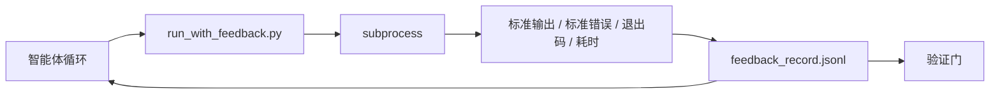

# 运行时反馈循环

> 看不到实际命令输出的智能体只能靠猜测。反馈运行器将标准输出、标准错误、退出码和耗时捕获到一个结构化记录中，供下一轮读取。智能体因此基于事实做出反应，而不是基于对事实的预测。

**类型：** 构建
**语言：** Python（标准库）
**前置知识：** 阶段 14 · 32（最小工作台），阶段 14 · 35（初始化脚本）
**时间：** 约 50 分钟

## 学习目标

- 区分运行时反馈与可观测性遥测。
- 构建一个包装 shell 命令并持久化结构化记录的反馈运行器。
- 确定性地截断大输出，使循环保持在 Token 预算内。
- 在反馈缺失时拒绝推进循环。

## 问题

智能体说"正在运行测试。"下一条消息说"所有测试通过。"而现实是根本没有测试运行过。智能体想象了输出，或者它运行了命令但从未读取结果，或者它读取了结果但悄悄截断了失败行。

反馈运行器消除了这个差距。每条命令都通过运行器执行。每条记录都包含命令、捕获的标准输出和标准错误、退出码、实际耗时以及一行智能体备注。智能体在下一轮读取记录。验证门在任务结束时读取记录。

## 概念



### 反馈记录中包含的内容

| 字段 | 为什么重要 |
|-------|----------------|
| `command` | 精确的 argv，无 shell 展开的意外 |
| `stdout_tail` | 最后 N 行，确定性截断 |
| `stderr_tail` | 最后 N 行，与标准输出分开 |
| `exit_code` | 明确无误的成功信号 |
| `duration_ms` | 揭示慢查询和失控进程 |
| `started_at` | 用于回放的时间戳 |
| `agent_note` | 智能体关于其预期内容所写的一行备注 |

### 截断是确定性的

50 MB 的日志会摧毁循环。运行器使用 `...truncated N lines...`（已截断 N 行）标记截断头和尾，确保相同的输出总是产生相同的记录。不进行采样；智能体需要看到的部分（最终错误、最终摘要）都在尾部。

### 反馈与遥测

遥测（阶段 14 · 23，OTel GenAI 约定）供人类操作员跨时间审查运行情况。反馈供本次运行的下一轮使用。它们共享字段，但存在于不同的文件中，具有不同的保留策略。

### 没有反馈则拒绝推进

如果运行器在捕获退出码之前出错，记录携带 `exit_code: null` 和 `error: <reason>`。智能体循环必须拒绝在 `null` 退出码上声称成功。没有退出码，就没有进展。

## 构建

`code/main.py` 实现了：

- `run_with_feedback(command, agent_note)`，包装 `subprocess.run`，捕获标准输出/标准错误/退出码/耗时，确定性地截断，追加到 `feedback_record.jsonl`。
- 一个将 JSONL 流式加载到 Python 列表的小加载器。
- 一个演示，运行三条命令（成功、失败、慢速）并打印每条命令的最后一条记录。

运行方式：

```
python3 code/main.py
```

输出：三条反馈记录追加到 `feedback_record.jsonl`，最后一条内联打印。跨多次运行查看文件尾部，可以看到循环的积累。

## 生产环境中的模式

三种模式使运行器足够健壮以投入生产。

**写入时编校，而非读取时。** 任何接触标准输出或标准错误的记录都可能泄露密钥。运行器在 JSONL 追加之前执行编校处理：剥离匹配 `^Bearer `、`password=`、`api[_-]?key=`、`AKIA[0-9A-Z]{16}`（AWS）、`xox[baprs]-`（Slack）的行。读取时编校是脚镣；磁盘上的文件才是攻击者能接触到的。每季度对照生产运行时观察到的密钥格式审计编校模式。

**轮换策略，而非单一文件。** 将 `feedback_record.jsonl` 限制为每个文件 1 MB；溢出时轮换到 `.1`、`.2`，丢弃 `.5`。智能体的循环只读取当前文件，因此运行时成本是有限的。CI 工件存储获取完整的轮换集。没有轮换，文件会成为每次加载器调用的瓶颈。

**父命令 ID 用于重试链。** 每条记录获得 `command_id`；重试携带 `parent_command_id` 指向前一次尝试。审查者的"失败尝试"列表（阶段 14 · 40）和验证门的审计都跟随这个链。没有这个链接，重试看起来像独立的成功，审计隐藏了失败历史。

## 使用

生产模式：

- **Claude Code Bash 工具。** 该工具已经捕获标准输出、标准错误、退出码和耗时。本课程中的运行器是任何智能体产品的框架无关等价实现。
- **LangGraph 节点。** 将任何 shell 节点包装在运行器中，使记录在图状态之外持久化。
- **CI 日志。** 将 JSONL 输出到 CI 工件存储；审查者无需重新运行会话即可回放任何命令。

运行器是一个薄包装层，能经受住任何框架迁移，因为它拥有记录的形状。

## 交付

`outputs/skill-feedback-runner.md` 生成项目特定的 `run_with_feedback.py`，包含正确的截断预算、连接到工作台的 JSONL 写入器，以及智能体在每一轮读取的加载器。

## 练习

1. 为每条记录添加 `cwd` 字段，使从不同目录运行的同一条命令可区分。
2. 添加一个 `redaction` 步骤，剥离匹配 `^Bearer ` 或 `password=` 的行。在固定记录上测试。
3. 通过轮换到 `.1`、`.2` 文件将总 `feedback_record.jsonl` 大小限制为 1 MB。为轮换策略辩护。
4. 添加 `parent_command_id`，使重试链可见：哪条命令产生了下一条命令消费的输入。
5. 将 JSONL 输出到一个微型 TUI，高亮最新非零退出码。列出 TUI 在审查中必须显示的八个关键特性。

## 关键术语

| 术语 | 人们说的 | 实际含义 |
|------|----------------|------------------------|
| 反馈记录 | "运行日志" | 包含命令、输出、退出码、耗时的结构化 JSONL 条目 |
| 尾部截断 | "修剪日志" | 确定性的头和尾捕获，使记录适合 Token 预算 |
| 空值拒绝 | "在缺失数据时阻塞" | 当 `exit_code` 为 null 时，循环不得前进 |
| 智能体备注 | "预期标签" | 智能体在读取结果之前写的一行预测 |
| 遥测分离 | "两个日志文件" | 反馈供下一轮使用，遥测供操作员使用 |

## 延伸阅读

- [OpenTelemetry GenAI 语义约定](https://opentelemetry.io/docs/specs/semconv/gen-ai/)
- [Anthropic，长效智能体的有效框架](https://www.anthropic.com/engineering/effective-harnesses-for-long-running-agents)
- [Guardrails AI x MLflow —— 确定性安全、PII、质量验证器](https://guardrailsai.com/blog/guardrails-mlflow) —— 作为回归测试的编校模式
- [Aport.io，2026 年最佳 AI 智能体护栏：预操作授权比较](https://aport.io/blog/best-ai-agent-guardrails-2026-pre-action-authorization-compared/) —— 工具前后捕获
- [Andrii Furmanets，2026 年 AI 智能体：工具、记忆、评估、护栏的实用架构](https://andriifurmanets.com/blogs/ai-agents-2026-practical-architecture-tools-memory-evals-guardrails) —— 可观测性界面
- 阶段 14 · 23 —— 遥测侧的 OTel GenAI 约定
- 阶段 14 · 24 —— 智能体可观测性平台（Langfuse、Phoenix、Opik）
- 阶段 14 · 33 —— 要求在声明完成前提供反馈的规则
- 阶段 14 · 38 —— 读取 JSONL 的验证门
