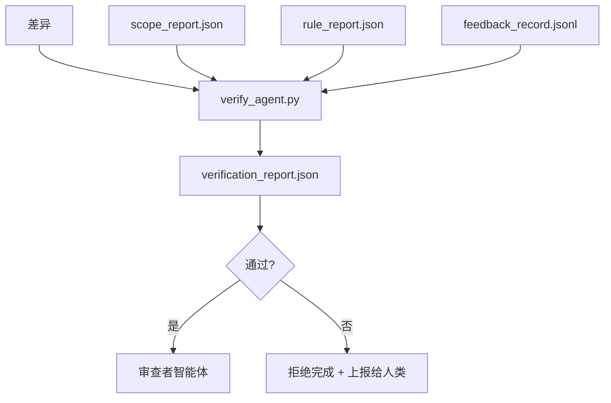

# 验证门

> 智能体不能自行标记自己的工作为完成。验证门读取范围契约、反馈日志、规则报告和差异，回答一个单一问题：这个任务真的完成了吗？如果门说不，任务就没有完成，不管对话怎么说。

**类型：** 构建
**语言：** Python（标准库）
**前置知识：** 阶段 14 · 33（规则），阶段 14 · 36（范围），阶段 14 · 37（反馈）
**时间：** 约 55 分钟

## 学习目标

- 将验证门定义为工作台工件上的确定性函数。
- 将规则报告、范围报告、反馈记录和差异合并为单一裁决。
- 生成对审查者智能体和 CI 都可读的 `verification_report.json`。
- 在任何阻塞级别失败时拒绝推进任务，无一例外。

## 问题

智能体太容易声明成功。三种失败形态占主导：

- "看起来不错。"模型读取了自己的差异并认定它是正确的。
- "测试通过了。"说得很有信心。但没有测试实际运行的记录。
- "验收已满足。"验收标准被宽松解释为"任何看起来像完成的东西。"

工作台的修复方案是一个单一的验证门，它读取智能体已经产生的工件并做出判断。这个门是确定性的。门在版本控制中。门连接到 CI。智能体无法贿赂它。

## 概念



### 门检查的内容

| 检查项 | 来源工件 | 严重级别 |
|-------|-----------------|----------|
| 所有验收命令都已运行 | `feedback_record.jsonl` | 阻塞 |
| 所有验收命令退出码为零 | `feedback_record.jsonl` | 阻塞 |
| 范围检查无禁止写入 | `scope_report.json` | 阻塞 |
| 范围检查无超出范围写入 | `scope_report.json` | 阻塞或警告 |
| 所有阻塞级别规则通过 | `rule_report.json` | 阻塞 |
| 反馈中无 `null` 退出码 | `feedback_record.jsonl` | 阻塞 |
| 触及文件匹配 `scope.allowed_files` | 两者 | 警告 |

`warn` 发现注释裁决；`block` 发现阻止 `passed: true`。

### 确定性的，而非概率性的

门必须对相同的工件集每次产生相同的裁决。没有 LLM 评审。LLM 评审属于审查者侧（阶段 14 · 39），其目标是定性评估，而非状态判断。

### 一份报告，一条路径

门为每个任务关闭生成一份 `verification_report.json`，写入 `outputs/verification/<task_id>.json`。CI 消费相同的路径。多个不同路径的门会分叉真相来源。

### 无一例外地拒绝

阻塞级别的发现不能被智能体覆盖。它们只能由人类覆盖，并记录 `override_reason` 和 `overridden_by` 用户 ID。覆盖是签名的变更，不是智能体的决策。

## 构建

`code/main.py` 实现了：

- 每个输入工件的加载器，全部在本地存根，使课程自包含。
- `verify(task_id, artifacts) -> VerdictReport` 纯函数。
- 一个打印器，显示每个检查项的结果和最终的通过/失败。
- 一个包含三个任务场景的演示：干净通过、范围蔓延、缺失验收。

运行方式：

```
python3 code/main.py
```

输出：三份裁决报告，每份保存在脚本旁边。

## 生产环境中的模式

四种模式将门从"又一个 lint 任务"提升为"决定性边缘"。

**纵深防御，而非单一门。** 预提交钩子 → CI 状态检查 → 工具前授权钩子 → 合并前门。每一层都是确定性的，因此一层中的失败会被下一层捕获。microservices.io 的 2026 年 3 月手册明确指出：预提交钩子是不可绕过的，因为它不像模型侧技能那样依赖于智能体遵循指令。验证门位于 CI / 预合并层。

**确定性检查防御，模型评审仅用于细微之处。** Anthropic 的 2026 年混合规范配对：可验证的奖励（单元测试、模式检查、退出码）回答"代码是否解决了问题？"—— LLM 评分标准回答"代码是否可读、安全、符合风格？"门运行第一类；审查者（阶段 14 · 39）运行第二类。混合它们会破坏信号。

**签名覆盖日志，而非 Slack 线程。** 每次覆盖在 `outputs/verification/overrides.jsonl` 中生成一行，包含：时间戳、发现代码、原因、签名用户、当前 HEAD 提交。运行时拒绝任何缺少签名的覆盖；审计跟踪被 Git 跟踪。这是覆盖策略和覆盖做样子之间的分界线。

**覆盖率下限作为一等检查。** `coverage_report.json` 供给 `coverage_floor`（默认 80%）检查。如果测量的覆盖率低于下限或低于上次合并的下限超过 1 个百分点，门失败。没有这个检查，智能体会悄悄删除失败的测试，而验证报告保持绿色。

**`--strict` 模式将警告提升为阻塞。** 对于发布分支、阻塞发布的 PR 或事后排查，`--strict` 使每个警告成为硬失败。此标志按分支选择加入；不是全局默认值，因为事事严格会腐蚀日常流程。

## 使用

生产模式：

- **CI 步骤。** `verify_agent` 作业针对智能体的最终工件运行门。合并保护拒绝未得到 `passed: true` 的提交。
- **交接前钩子。** 智能体运行时在生成交接文档前调用门。没有绿色裁决，就没有交接。
- **手动排查。** 操作员在智能体声称成功而人类怀疑时读取报告。

门是工作台流程中的决定性边缘。其他所有表面都在它的上游。

## 交付

`outputs/skill-verification-gate.md` 将门连接到特定项目：哪些验收命令供给它，哪些规则是阻塞级别的，哪些超范围写入被容忍，覆盖审计日志如何存储。

## 练习

1. 添加 `coverage_floor` 检查：测试命令必须生成至少 80% 的覆盖率报告。确定哪个工件携带下限。
2. 支持 `--strict` 模式，将每个 `warn` 提升为 `block`。记录 strict 模式作为正确默认值的场景。
3. 使门除了 JSON 外还生成 Markdown 摘要。为摘要中应包含哪些字段辩护。
4. 添加 `time_since_last_human_touch` 检查：任何在人类按键 60 秒内编辑的文件免于超范围标记。
5. 在你的产品的一个真实智能体差异上运行门。有多少发现是真实的，多少是噪音？门需要在哪些地方成长？

## 关键术语

| 术语 | 人们说的 | 实际含义 |
|------|----------------|------------------------|
| 验证门 | "阻止事情的检查" | 工作台工件上的确定性函数，产生通过/失败裁决 |
| 阻塞级别 | "硬失败" | 阻止 `passed: true` 并需要签名覆盖的发现 |
| 覆盖日志 | "为什么我们放行了它" | 带有原因和用户 ID 的签名条目，由审查审计 |
| 验收命令 | "证据" | 其零退出码是"完成"含义的 shell 命令 |
| 单一报告路径 | "真相来源" | `outputs/verification/<task_id>.json`，供 CI 和人类使用 |

## 延伸阅读

- [Anthropic，长效应用开发的框架设计](https://www.anthropic.com/engineering/harness-design-long-running-apps)
- [OpenAI Agents SDK 护栏](https://platform.openai.com/docs/guides/agents-sdk/guardrails)
- [microservices.io，GenAI 开发平台：护栏](https://microservices.io/post/architecture/2026/03/09/genai-development-platform-part-1-development-guardrails.html) —— 预提交和 CI 之间的纵深防御
- [ICMD，2026 年 Agentic AI 运维手册](https://icmd.app/article/the-2026-playbook-for-agentic-ai-ops-guardrails-costs-and-reliability-at-scale-1776661990431) —— 审批门阶梯（草稿 → 审批 → 阈值下自动通过）
- [类型检查合规：确定性护栏（arXiv 2604.01483）](https://arxiv.org/pdf/2604.01483) —— Lean 4 作为确定性门控的上界
- [logi-cmd/agent-guardrails —— 合并门规范](https://github.com/logi-cmd/agent-guardrails) —— 范围 + 变异测试门
- [Guardrails AI x MLflow](https://guardrailsai.com/blog/guardrails-mlflow) —— 作为 CI 评分器的确定性验证器
- [Akira，智能体系统的实时护栏](https://www.akira.ai/blog/real-time-guardrails-agentic-systems) —— 工具前后门
- 阶段 14 · 27 —— 提示注入防御（门的对抗对）
- 阶段 14 · 36 —— 此门执行的范围契约
- 阶段 14 · 37 —— 此门评分的反馈日志
- 阶段 14 · 39 —— 门交接给的审查者智能体
