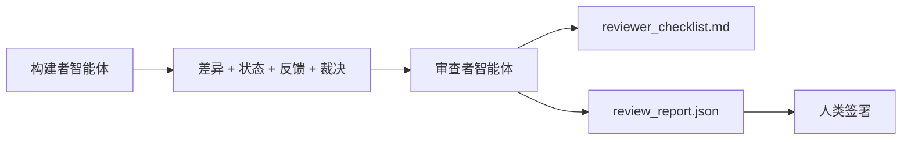

# 审查者智能体：将构建者与评分者分离

> 编写代码的智能体不能给它自己评分。审查者是具有不同系统提示词、不同目标以及对构建者产生的一切具有只读访问权的第二循环。构建者和审查者之间的差距是大多数可靠性所在。

**类型：** 构建
**语言：** Python（标准库）
**前置知识：** 阶段 14 · 38（验证门）
**时间：** 约 55 分钟

## 学习目标

- 阐述为什么同一个智能体不能可靠地审查自己的工作。
- 构建一个消费构建者工件并生成结构化审查报告的审查者智能体循环。
- 编写一个审查者评分标准，对特定维度进行评分，而非凭感觉。
- 将审查者接入工作台，使人类审查步骤从真实工件开始。

## 问题

你让智能体修复一个 bug。它编辑了四个文件，运行了测试，报告了完成。验证门（阶段 14 · 38）确认验收已运行且范围保持。门说 `passed: true`。你合并了。两天后你发现修复解决了错误的 bug 的一半。

验收是必要的，但不是充分的。审查者提出验收无法提出的问题：这是解决了正确的问题吗？它是否未经标记就扩展了范围？它是否记录了本应被质疑的假设？它是否将工作台保持在下一个会话可以接手的可维护状态？

## 概念



### 审查者评分标准

五个维度，每个评分 0 到 2。

| 维度 | 问题 |
|-----------|----------|
| 问题匹配度 | 变更解决了所述任务，而不是某个类似的任务？ |
| 范围纪律 | 编辑是否限于契约内，还是契约被刻意扩大了？ |
| 假设 | 所有隐藏假设是否都写在可审查的地方？ |
| 验证质量 | 验收命令是否真正证明了目标，还是证明了一个较弱的版本？ |
| 交接就绪度 | 下一个会话能否从当前状态干净地接手？ |

满分 10 分。低于 7 分为软失败；低于 5 分为硬失败。

### 审查者是分离的角色，不是分离的模型

你可以使用与构建者相同的模型来运行审查者。关键在于角色分离：不同的系统提示词、不同的输入、对差异没有写权限。姿态的改变就是信号的改变。

### 审查者不能编辑差异

审查者读取差异、状态、反馈和裁决。它写一份报告。它不打补丁。如果报告说"修复这个"，下一次构建者的轮次负责修复；审查者回到审查工作。混合角色会破坏差距。

### 审查者评分标准与验证门

门（阶段 14 · 38）检查确定性事实：验收是否运行了、规则是否通过、范围是否保持。审查者做出定性判断：这是否是正确的工作、是否有文档记录、交接是否可用。两者都是必需的。

## 构建

`code/main.py` 实现了：

- 一个 `ReviewerInputs` 数据类，打包审查者读取的工件。
- 一个评分标准评分器，每个维度一个函数。每个函数是确定性的，在课程中为存根级别；真实实现会调用 LLM。
- 一个 `review_report.json` 写入器，包含五个分数、总分和裁决（`pass`、`soft_fail`、`hard_fail`）。
- 两个演示案例：一个干净的变更和一个"测试正确，问题错误"的变更。

运行方式：

```
python3 code/main.py
```

输出：两份审查报告写入磁盘，以及一个维度分数的控制台表格。

## 生产环境中的模式

数据佐证：Cloudflare 2026 年 4 月的 AI 代码审查系统在 30 天内对 5,169 个仓库的 48,095 个合并请求运行了 131,246 次审查运行。中位审查完成时间为 3 分 39 秒。最多七个专业审查者（安全、性能、代码质量、文档、发布管理、合规、工程规范）在一个审查协调器下并行运行，该协调器去重发现并判断严重级别。顶级模型专门留给协调器；专业审查者运行在更便宜的层级。

四种模式使其规模化运作。

**专业审查者池，而非一个庞大的审查者。** 一个具有 5 维度评分标准的审查者适用于单人仓库。一旦代码库具有安全关键、性能关键和文档界面，拆分为具有更小提示词的专业审查者。协调者进行去重；专业审查者从不运行完整的评分标准。模型层分离自然产生：便宜的专业审查者，昂贵的协调器。

**偏差缓解作为设计需求，而非优化。** LLM 评审显示出四种可靠偏差（Adnan Masood，2026 年 4 月）：位置偏差（GPT-4 在 (A,B) 与 (B,A) 排序上约 40% 不一致）、冗长偏差（约 15% 向更长输出偏移的分数膨胀）、自我偏好（评审者偏好来自相同模型族的输出）、权威性（评审者对已知作者的引用评分过高）。缓解措施：评估两种排序并仅计数一致的胜者；使用明确奖励简洁性的 1-4 级量表；在模型族之间轮换评审者；评分前去除作者姓名。

**校准集，而非凭感觉。** 一个 10-20 个任务的历史集，具有已知正确裁决。在每次提示词变更时对校准集运行审查者。如果与历史记录的一致性低于 80%，评分标准在审查者交付前需要修订。这是每个团队最终都会重新发现的事情；最好是开始时就准备好。

**与门的混合规范。** 验证门（阶段 14 · 38）处理确定性检查（验收是否运行、测试是否通过、范围是否保持）。审查者处理语义检查（这是否是正确的工作、假设是否被记录、交接是否可用）。Anthropic 的 2026 指南对此次分离明确表态：不要要求审查者重新做门已经证明的事情。

## 使用

生产模式：

- **Claude Code 子智能体。** 审查者子智能体在构建者关闭任务后运行。它在 PR 上发布带评分标准分数的评论。
- **OpenAI Agents SDK 交接。** 构建者在任务完成时交接给审查者。审查者可以带着发现列表交回，或上报给人类。
- **双模型配对。** 构建者运行在更快更便宜的模型上。审查者运行在更强的模型上，使用更小的上下文，专注于判断。

审查者是工作台在人类无法亲自进行每项审查时增加的第二双眼睛。

## 交付

`outputs/skill-reviewer-agent.md` 生成项目特定的审查者评分标准、连接到构建者工件的审查者智能体存根，以及与验证门的集成，使得人类审查从书面报告开始，而不是空白页。

## 练习

1. 添加对你的产品领域特定的第六个维度。论证为什么它不能被现有的五个维度吸收。
2. 使用两个不同的系统提示词（简洁、详细）运行审查者。哪一个产生的报告人类更可能阅读？
3. 为每个维度添加 `confidence` 字段。当最低维度的置信度低于 0.6 时拒绝交付报告。
4. 构建一个校准集：10 个具有已知正确裁决的历史任务关闭记录。对它们运行审查者。它在哪些地方与历史记录不一致？
5. 添加"请求更多证据"能力：审查者可以在评分前要求构建者运行特定测试。什么是合适的回退机制以防止无限循环？

## 关键术语

| 术语 | 人们说的 | 实际含义 |
|------|----------------|------------------------|
| 审查者评分标准 | "检查清单" | 五维度 0-2 评分，每个维度有书面问题 |
| 软失败 | "需要修订" | 总分低于 7；构建者获得需要处理的发现 |
| 硬失败 | "拒绝" | 总分低于 5 或任何维度为 0；停止并上报给人类 |
| 角色分离 | "不同的提示词" | 同一模型可以扮演两种角色；关键在于输入和姿态 |
| 置信度下限 | "不要交付低信号报告" | 评分标准不确定时拒绝发出裁决 |

## 延伸阅读

- [OpenAI Agents SDK 交接](https://platform.openai.com/docs/guides/agents-sdk/handoffs)
- [Anthropic Claude Code 子智能体](https://docs.anthropic.com/en/docs/agents-and-tools/claude-code/sub-agents)
- [Cloudflare，大规模编排 AI 代码审查](https://blog.cloudflare.com/ai-code-review/) —— 7 专家 + 协调器架构，131k 次运行 / 30 天
- [Agent-as-a-Judge：用智能体评估智能体（OpenReview / ICLR）](https://openreview.net/forum?id=DeVm3YUnpj) —— DevAI 基准，366 个分层解决方案需求
- [Adnan Masood，基于评分标准的评估与 LLM-as-a-Judge：方法、偏差、经验验证](https://medium.com/@adnanmasood/rubric-based-evals-llm-as-a-judge-methodologies-and-empirical-validation-in-domain-context-71936b989e80) —— 4 种偏差及缓解措施
- [MLflow，LLM-as-a-Judge 评估](https://mlflow.org/llm-as-a-judge) —— 构建者/评估者分离的生产工具
- [LangChain，如何用人工校正校准 LLM-as-a-Judge](https://www.langchain.com/articles/llm-as-a-judge) —— 校准集工作流
- [Evidently AI，LLM-as-a-judge：完整指南](https://www.evidentlyai.com/llm-guide/llm-as-a-judge)
- [Arize，LLM as a Judge —— 入门和预构建评估器](https://arize.com/llm-as-a-judge/)
- 阶段 14 · 05 —— 自我精炼与 CRITIC（单智能体自我审查基线）
- 阶段 14 · 30 —— 评估驱动的智能体开发（校准集生成器）
- 阶段 14 · 38 —— 审查者读取的验证门
- 阶段 14 · 40 —— 审查者报告馈入的交接数据包
