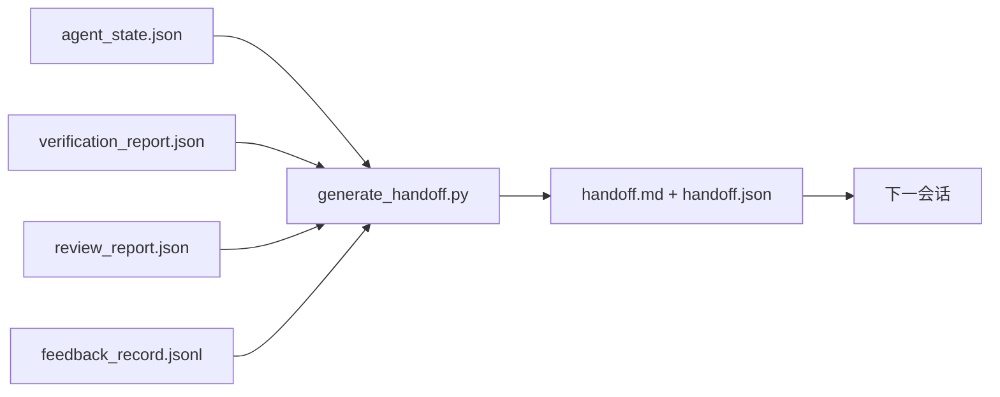

# 多会话交接

> 会话会结束。工作不会。交接数据包是这样一个工件：它将"智能体工作了一小时"转变为"下一个会话在第一分钟就有效率"。有意构建它，而非事后才想起。

**类型：** 构建
**语言：** Python（标准库）
**前置知识：** 阶段 14 · 34（仓库记忆），阶段 14 · 38（验证），阶段 14 · 39（审查者）
**时间：** 约 50 分钟

## 学习目标

- 识别每个交接数据包所需的七个字段。
- 从工作台工件生成交接，无需手写散文。
- 将大型反馈日志修剪成交接大小的摘要。
- 使下一个会话的第一个动作是确定性的。

## 问题

会话结束了。智能体说"很好，我们取得了进展。"下一个会话打开了。下一个智能体问"我们上次停在哪里？"上一个智能体的答案已经消失了。下一个智能体重新发现、重新运行相同的命令、向人类重新问相同的问题，花了三十分钟来恢复上一个会话的最后三十秒。

一个糟糕的交接代价在每个会话中，贯穿任务的整个生命周期。修复方案是在会话结束时自动生成一个数据包：什么变了、为什么、尝试了什么、什么失败了、还剩下什么、下次首先要做什么。

## 概念



### 每个交接携带的七个字段

| 字段 | 它回答的问题 |
|-------|---------------------|
| `summary` | 做了什么的一段话 |
| `changed_files` | 一目了然的差异 |
| `commands_run` | 实际执行了什么 |
| `failed_attempts` | 尝试了什么以及为什么没成功 |
| `open_risks` | 什么可能在下个会话造成问题，带有严重级别 |
| `next_action` | 下个会话采取的第一个具体步骤 |
| `verdict_pointer` | 验证 + 审查报告的路径 |

`next_action` 字段是承重的。除了 `next_action` 之外什么都有的是状态报告，不是交接。

### 交接是生成的，不是手写的

手写的交接是在困难的日子里会被跳过的交接。生成器读取工作台工件并发出数据包。智能体的工作是让工作台处于生成器可以总结的状态，而不是写总结本身。

### 两种形式：人类可读和机器可读

`handoff.md` 是人类阅读的。`handoff.json` 是下一个智能体加载的。两者来自相同的源工件。如果它们不一致，以 JSON 为准。

### 反馈日志修剪

完整的 `feedback_record.jsonl` 可能有数百条条目。交接只携带最后 K 条加上每个非零退出的条目。下一个会话在需要时加载完整日志，但数据包保持小巧。

### 留下干净的状态

交接描述工作。干净的状态让工作可以恢复。它们不是一回事。一份完美的 `handoff.md` 是无价值的，如果下一个会话打开时面对的是半应用的差异、智能体忘记的临时文件、游离的分支以及在运行之前就出错的测试。下一个智能体然后花前十钟清理上一个智能体的遗留，而不是构建，代价在每个会话中不断累积，贯穿任务的整个生命周期。

所以会话在功能完成后不会结束。它在工作台处于生成器可以总结且下一个会话可以信任的状态时才会结束。清理是独立的阶段，在交接前运行，而且它是一个检查，不是习惯，因为习惯是困难日子里会被跳过的东西。

| 检查 | 干净意味着 | 脏阻塞因为 |
|-------|-------------|----------------------|
| 工作树 | 每个变更已提交或明确暂存并附有备注 | 半应用的差异在下个智能体看来像是有意的工作 |
| 临时工件 | 没有留下 `*.tmp`、临时目录、调试打印或注释掉的代码块 | 游离文件污染差异和下个智能体的心智模型 |
| 测试 | 绿色，或红色但失败已命名在 `open_risks` 中 | 静默的红色测试是下个会话踩入的陷阱 |
| 特性板 | `feature_list.json` 状态反映现实（阶段 14 · 36） | 过时的板子将下个会话送到已经完成的工作上 |
| 分支 | 在预期的分支上，无分离 HEAD，无孤立分支 | 错误的分支意味着下个会话的第一次提交落在错误的地方 |

清理阶段发出一个 `clean_state.json`，列出阻塞问题；空列表是交接生成器在写数据包之前断言的前置条件。在脏树上构建的交接不是交接，是转发的一团糟。这两个工件配对：清理证明工作台可以安全离开，交接证明下个会话知道从哪里开始。

## 构建

`code/main.py` 实现了：

- 一个加载器，将状态、裁决、审查和反馈收集到单个 `WorkbenchSnapshot` 中。
- 一个 `generate_handoff(snapshot) -> (markdown, payload)` 函数。
- 一个过滤器，挑选最后 K 条反馈条目加上所有非零退出。
- 一个演示运行，在脚本旁边写入 `handoff.md` 和 `handoff.json`。

运行方式：

```
python3 code/main.py
```

输出：打印的交接体，加上磁盘上的两个文件。

## 生产环境中的模式

Codex CLI、Claude Code 和 OpenCode 各有不同的压缩方案；结构化交接数据包位于三者之上。

**压缩策略各异；数据包模式不变。** Codex CLI 的 POST /v1/responses/compact 是一个服务器端不透明的 AES blob（OpenAI 模型的快速路径）；回退是附加为 `_summary` 用户角色消息的本地"交接摘要"。Claude Code 在 95% 上下文时执行五阶段渐进压缩。OpenCode 做基于时间戳的消息隐藏加上 5 标题的 LLM 摘要。三种不同的机制，相同需求：将能在压缩中存活的内容序列化为可移植工件。数据包就是那个工件。

**新会话交接不是压缩。** 压缩扩展会话；交接干净地关闭一个并开始下一个。Hermes Issue #20372（2026 年 4 月）的表述是正确的：当原地压缩开始降级时，智能体应该写一个紧凑的交接、结束会话并在新上下文中恢复。数据包正是使这种转换廉价的工具。错误是持续压缩直到质量崩溃；修复方案是为早期、干净的交接做预算。

**每个分支和主题一个活跃交接。** 多智能体协调在过时交接上的崩溃比在糟糕模型输出上更多。始终包含 `branch`、`last_known_good_commit` 和 `status`（`active | superseded | archived`）。过时交接被归档；只有活跃的交接驱动下一个会话。这是作为笔记的交接和作为状态的交接之间的区别。

**在 50-75% 上下文预算时结束，而非撞墙时。** 手写方案手册（CLAUDE.md + HANDOVER.md）报告当会话在 50-75% 上下文预算而非 95% 时结束的效果最好。数据包生成器在压缩工作制品污染源状态之前干净地运行。在上下文完整时写是便宜的；在模型已经丢失位置时写是昂贵的。

## 使用

生产模式：

- **会话结束钩子。** 运行时在用户关闭聊天时触发生成器。数据包进入 `outputs/handoff/<session_id>/`。
- **PR 模板。** 生成器的 markdown 也是 PR 正文。审查者无需打开其他五个文件即可阅读。
- **跨智能体交接。** 用一个产品（Claude Code）构建，用另一个（Codex）继续。数据包是通用语言。

数据包小巧、规范且生产便宜。成本节约在每个会话中不断累积。

## 交付

`outputs/skill-handoff-generator.md` 生成一个为项目工件路径调优的生成器、一个运行它的会话结束钩子，以及下一个智能体在启动时读取的 `handoff.json` 模式。

## 练习

1. 添加一个 `assumptions_to_validate` 字段，表面每个构建者记录过但审查者评分未超过 1 的假设。
2. 对失败运行和通过运行以不同方式修剪反馈摘要。为不对称性辩护。
3. 包含一个"给人类的问题"列表。什么问题应该进入数据包而不是聊天消息？阈值是什么？
4. 使生成器幂等：运行两次产生相同的数据包。需要什么稳定才能使其成立？
5. 添加一个"下个会话前置条件"部分，准确列出下个会话在行动前必须加载的工件。

## 关键术语

| 术语 | 人们说的 | 实际含义 |
|------|----------------|------------------------|
| 交接数据包 | "会话摘要" | 生成的工件，携带七个字段，既有 markdown 也有 JSON |
| 下一个动作 | "首先要做什么" | 启动下一个会话的一个具体步骤 |
| 反馈修剪 | "日志摘要" | 最后 K 条记录加上每个非零退出 |
| 状态报告 | "我们做了什么" | 缺少 `next_action` 的文档；有用，但不是交接 |
| 裁决指针 | "收据" | 验证 + 审查报告的路径，用于可追溯性 |

## 延伸阅读

- [Anthropic，长效智能体的有效框架](https://www.anthropic.com/engineering/effective-harnesses-for-long-running-agents)
- [OpenAI Agents SDK 交接](https://platform.openai.com/docs/guides/agents-sdk/handoffs)
- [Codex Blog，Codex CLI 上下文压缩：架构、配置、管理长会话](https://codex.danielvaughan.com/2026/03/31/codex-cli-context-compaction-architecture/) —— POST /v1/responses/compact 和本地回退
- [Justin3go，卸下沉重的记忆：Codex、Claude Code、OpenCode 中的上下文压缩](https://justin3go.com/en/posts/2026/04/09-context-compaction-in-codex-claude-code-and-opencode) —— 三方压缩比较
- [JD Hodges，Claude 交接提示词：如何跨会话保持上下文（2026）](https://www.jdhodges.com/blog/ai-session-handoffs-keep-context-across-conversations/) —— CLAUDE.md + HANDOVER.md，50-75% 上下文预算
- [Mervin Praison，管理多智能体编码会话中的交接：保持连续性的新上下文](https://mer.vin/2026/04/managing-handoffs-in-multi-agent-coding-sessions-fresh-context-without-losing-continuity/) —— 分布式系统框架
- [Hermes Issue #20372 —— 当压缩变得有风险时自动新会话交接](https://github.com/NousResearch/hermes-agent/issues/20372)
- [Hermes Issue #499 —— 上下文压缩质量大修](https://github.com/NousResearch/hermes-agent/issues/499) —— Codex CLI 中的交接导向提示词
- [Microsoft Agent Framework，压缩](https://learn.microsoft.com/en-us/agent-framework/agents/conversations/compaction)
- [OpenCode，上下文管理与压缩](https://deepwiki.com/sst/opencode/2.4-context-management-and-compaction)
- [LangChain，智能体上下文工程](https://www.langchain.com/blog/context-engineering-for-agents)
- 阶段 14 · 34 —— 生成器读取的状态文件
- 阶段 14 · 38 —— 数据包指向的验证裁决
- 阶段 14 · 39 —— 打包到数据包中的审查者报告
