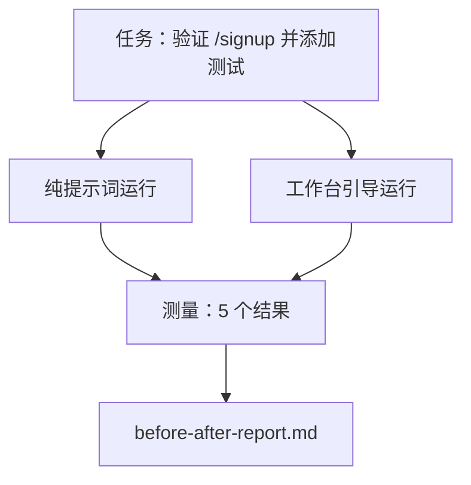

# 真实仓库上的工作台

> 十一个课程的知识面如果在真实代码库中不能发挥作用就毫无价值。本课程在一个小型示例应用上运行相同的任务两次：纯提示词方式与工作台引导方式。数据说话。

**类型：** 构建
**语言：** Python（标准库）
**前置知识：** 阶段 14 · 32 至 14 · 40
**时间：** 约 60 分钟

## 学习目标

- 在一个小型应用上将七个工作台面结合起来。
- 运行相同任务两次（纯提示词和工作台引导）并测量五个结果。
- 阅读前后报告并决定哪些面提供了最大的杠杆作用。
- 针对"但我的模型已经足够好了"的反对意见为工作台辩护。

## 问题

在玩具任务上的演示说服不了任何人。工作台的论据是通过在一个真实感的仓库上的真实感任务以更少的失败、更少的回滚以及下一个会话可以使用的数据包来证明其价值。

本课程提供了那个真实感的仓库，并运行相同的任务通过两个流水线。结果是一份你可以递给怀疑者的前后报告。

## 概念



### 示例应用

`sample_app/` 中的一个最小 FastAPI 风格处理器：

- `app.py` 包含 `/signup`（尚未有验证）。
- `test_app.py` 包含一个快乐路径测试。
- `README.md` 和 `scripts/release.sh` 作为禁区诱饵。

### 任务

> 为 `/signup` 添加输入验证：拒绝短于 8 个字符的密码，返回 422 并带有类型化错误信封。添加一个证明新行为的测试。

### 两个流水线

纯提示词：

1. 读取 README。
2. 读取 `app.py`。
3. 编辑文件。
4. 声称完成。

工作台引导：

1. 运行初始化脚本（课程 35）。
2. 读取范围契约（课程 36）。
3. 读取状态（课程 34）。
4. 仅编辑允许的文件。
5. 通过反馈运行器运行验收命令（课程 37）。
6. 运行验证门（课程 38）。
7. 运行审查者（课程 39）。
8. 生成交接（课程 40）。

### 测量的五个结果

| 结果 | 为什么重要 |
|---------|----------------|
| `tests_actually_run` | 大多数"测试通过"的声明无法验证 |
| `acceptance_met` | 证明目标的测试必须是实际运行的测试 |
| `files_outside_scope` | 范围蔓延是主要的静默失败 |
| `handoff_quality` | 下一个会话为此付出代价或从中受益 |
| `reviewer_total` | 在门之上的定性判断 |

## 构建

`code/main.py` 编排两个流水线针对相同的示例应用装置。两个流水线都是脚本化的（循环中没有 LLM），因此测量是可重现的。脚本将比较写入 `before-after-report.md` 和 `comparison.json`。

运行方式：

```
python3 code/main.py
```

输出：每个流水线结果的表格、保存在脚本旁边的 Markdown 报告，以及供需要绘制图表者使用的 JSON。

## 生产环境中的模式

怀疑者的问题是"工作台到底有多大帮助？"2026 年的数字说明的远比解释多。

**相同模型从 Terminal Bench 前 30 名之外跃升至前 5。** LangChain 的《智能体框架剖析》（2026 年 4 月）：一个编码智能体仅通过改变框架就从 Terminal Bench 2.0 的前 30 名之外跃升至第 5 名。相同模型。不同的面。二十五名的差距。

**Vercel 通过删除工具从 80% 提升到 100%。** Vercel 报告删除其智能体 80% 的工具将成功率从 80% 提升到 100%。更小的工具面、更锐利的作用域、更少的失败方式。负空间胜出。

**Harvey 仅通过框架提升 2 倍准确率。** 法律智能体通过框架优化准确率翻倍以上，没有改变模型。

**88% 的企业 AI 智能体项目未能进入生产。** preprints.org 的《语言智能体的框架工程》论文（2026 年 3 月）将失败追溯到运行时而非推理：过期状态、脆弱的重试、膨胀的上下文、对中间错误的糟糕恢复。

**长上下文崩溃。** WebAgent 基线 40-50% 的成功率在长上下文条件下下降到 10% 以下，主要来自无限循环和目标丢失。Ralph 循环和交接数据包的存在正是为了吸收这种情况。

**假阴性仍然存在。** 单步事实任务、单行 lint、格式化程序运行、模型已经逐字记忆的任何东西 —— 这些用纯提示词运行更快。基准测试应诚实地枚举它们，使工作台不会被描述为过度设计。

结论不是"框架永远胜利"。模型确实随着时间吸收框架的技巧。结论是今天，工程负载分布在七个面上，数据证明了这一点。

## 使用

本课程是你在以下情况下引用的案例文件：

- 有人问为什么每个 PR 都带有 `agent-rules.md` 和范围契约。
- 一个团队想要"只是这个冲刺"放弃验证门。
- 一个新产品推出，你需要一个可移植的基准来衡量它是否真的节省时间。

数字的传播力比解释更远。

## 交付

`outputs/skill-workbench-benchmark.md` 是一个可移植的评估框架，可以在任何智能体产品上通过两个流水线针对项目自己的示例应用运行，并报告五个结果。

## 练习

1. 添加第六个结果：首次有意义编辑的时间。如何干净地测量它？
2. 在你的代码库中对真实的第二天任务运行比较。工作台数字在哪些地方下滑？
3. 添加一个"假阴性"测试：纯提示词本来更快且工作台开销是真实成本的场景。仍然为保留工作台辩护。
4. 将脚本化的"智能体"替换为真实的 LLM 调用。哪些结果变得更嘈杂？
5. 编写一个面向非工程师的单页摘要。哪些内容能通过裁剪？

## 关键术语

| 术语 | 人们说的 | 实际含义 |
|------|----------------|------------------------|
| 示例应用 | "玩具仓库" | 小巧但足够真实以锻炼所有七个面 |
| 流水线 | "工作流" | 智能体遵循的面的有序读写序列 |
| 前后报告 | "收据" | 你递给怀疑者的工件 |
| 假阴性 | "工作台过度设计" | 纯提示词更快的任务；诚实地枚举很有用 |
| 工作台基准 | "可靠性评分" | 在你的代码库上运行比较的可移植框架 |

## 延伸阅读

- [LangChain，《智能体框架剖析》](https://blog.langchain.com/the-anatomy-of-an-agent-harness/) —— Terminal Bench 前 30 到前 5 的凭据
- [MongoDB，《智能体框架：为什么 LLM 是你智能体系统中最小的部分》](https://www.mongodb.com/company/blog/technical/agent-harness-why-llm-is-smallest-part-of-your-agent-system) —— Vercel + Harvey 数据
- [preprints.org，《语言智能体的框架工程》](https://www.preprints.org/manuscript/202603.1756) —— 88% 企业失败率，运行时根因
- [HN：《一个下午改进 15 个 LLM 的编码能力。只有框架变了》](https://news.ycombinator.com/item?id=46988596) —— 在 15 个模型上复现
- [Cloudflare，《大规模编排 AI 代码审查》](https://blog.cloudflare.com/ai-code-review/) —— 生产中 131k 次审查运行 / 30 天
- [Anthropic，《构建有效的智能体》](https://www.anthropic.com/research/building-effective-agents)
- 阶段 14 · 32 至 14 · 40 —— 本课程端到端练习的面
- 阶段 14 · 19 —— SWE-bench、GAIA、AgentBench 作为本课程补充的宏观基准
- 阶段 14 · 30 —— 同一框架插件的评估驱动智能体开发
