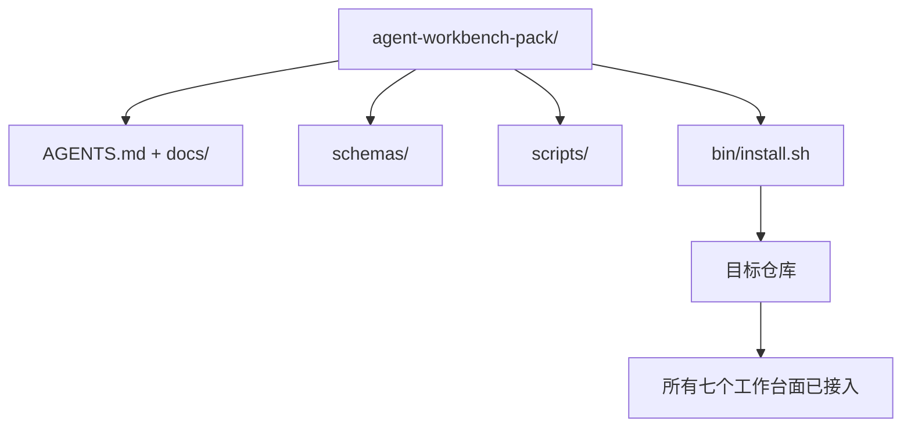

# 顶点项目：交付可复用的智能体工作台包

> 迷你轨道的终点是一个你可以放入任何仓库的包。十一个课程的知识面压缩成一个你可以 `cp -r` 并在第二天早上让智能体可靠工作的目录。顶点项目是这个课程路线图所依赖的工件。

**类型：** 构建
**语言：** Python（标准库）
**前置知识：** 阶段 14 · 31 至 14 · 41
**时间：** 约 75 分钟

## 学习目标

- 将七个工作台面打包成一个可即插即用的目录。
- 固定模式、脚本和模板，使新仓库获得已知良好的基线。
- 添加一个单一的安装脚本，幂等地安装包。
- 决定什么留在包中，什么留在外面，为每个决定辩护。

## 问题

存在于 Google 文档、聊天历史和三个半记得的脚本中的工作台是每季度需要重建的工作台。解决方案是一个版本化的包：一个包含面、模式、脚本和单命令安装器的仓库或目录。

你将在本课程结束时在磁盘上交付 `outputs/agent-workbench-pack/` 和将其放入任何目标仓库的 `bin/install.sh`。

## 概念



### 包布局

```
outputs/agent-workbench-pack/
├── AGENTS.md
├── docs/
│   ├── agent-rules.md
│   ├── reliability-policy.md
│   ├── handoff-protocol.md
│   └── reviewer-rubric.md
├── schemas/
│   ├── agent_state.schema.json
│   ├── task_board.schema.json
│   └── scope_contract.schema.json
├── scripts/
│   ├── init_agent.py
│   ├── run_with_feedback.py
│   ├── verify_agent.py
│   └── generate_handoff.py
├── bin/
│   └── install.sh
└── README.md
```

### 什么留在里面，什么留在外面

里面：

- 面模式。它们是契约。
- 上面的四个脚本。它们是运行时。
- 四个文档。它们是规则和评分标准。

外面：

- 项目特定任务。任务属于目标仓库的板子，而不是包。
- 供应商 SDK 调用。包是框架无关的。
- 入职教程。包放在团队现有入职资料的旁边，而不是里面。

### 安装器

一个简短的 `bin/install.sh`（或 `bin/install.py`）：

1. 拒绝在没有 `--force` 的情况下覆盖现有包。
2. 将包复制到目标仓库。
3. 如果存在 `.github/workflows/`，则接入 CI。
4. 打印下一步：填写板子、设置验收命令、运行初始化脚本。

### 版本控制

包携带一个 `VERSION` 文件。需要迁移的模式升级和脚本变更提升主版本号。仅文档变更提升补丁号。目标仓库的 `agent_state.json` 记录它初始化时使用的包版本。

## 构建

`code/main.py` 将包组装到课程旁边的 `outputs/agent-workbench-pack/` 中，使用本迷你轨道前面课程的模式和脚本以及你已经编写的文档。

运行方式：

```
python3 code/main.py
```

脚本复制并固定面、写入 README、打印包树并零退出。重新运行是幂等的。

## 生产环境中的模式

一个包只有在能够经得起分叉、更新和不友好的上游时才是有价值的。四种模式使其成功。

**`VERSION` 是契约，不是营销。** 主版本提升需要状态迁移。次版本提升需要检查器重新运行。补丁提升仅限文档。安装器在每次安装时将 `.workbench-version` 写入目标仓库；`lint_pack.py` 在目标的锁与包的 `VERSION` 不一致时拒绝交付。这就是 `npm`、`Cargo` 和 `pyproject.toml` 能够经受 10 年变更的方式；关于智能体没有什么会改变规则。

**跨工具分发的单一源头。** Nx 发布一个 `nx ai-setup`，从单一配置铺设 `AGENTS.md`、`CLAUDE.md`、`.cursor/rules/`、`.github/copilot-instructions.md` 和一个 MCP 服务器。包应该做同样的事；安装器发出符号链接（`ln -s AGENTS.md CLAUDE.md`），使单一真相来源分发到每个编码智能体。为了支持一个工具而分叉包是一种失败模式。

**拒绝在非平凡状态上运行的 `uninstall.sh`。** 卸载包不得删除用户的 `agent_state.json`、`task_board.json` 或 `outputs/`。卸载器删除模式、脚本、文档和 `AGENTS.md`（带有 `--keep-agents-md` 选择退出选项），并在状态文件有任何未提交变更时拒绝继续。状态属于用户；包不拥有它。

**技能即可发布。SkillKit 风格分发。** 包作为 SkillKit 技能交付：`skillkit install agent-workbench-pack` 从单一源将其铺设到 32 个 AI 智能体。包仓库是真相来源；SkillKit 是分发渠道。供应商锁定消失；七个面保持不变。

## 使用

包交付的三个地方：

- **作为一个目录放入仓库。** `cp -r outputs/agent-workbench-pack /path/to/repo`。
- **作为公开模板仓库。** 分叉和定制，`VERSION` 控制漂移。
- **作为 SkillKit 技能。** 接入你的智能体产品，单条命令即可铺设。

包是配方。每次安装是一次服务。

## 交付

`outputs/skill-workbench-pack.md` 生成一个项目调优的包：根据团队历史磨锐的规则、与仓库匹配的范围通配符、用一个领域特定条目扩展的评分标准维度。

## 练习

1. 决定哪个可选的第五文档值得提升到规范包中。为这一选择辩护。
2. 用 Python 重写安装器，带 `--dry-run` 标志。对比 bash 的可用性。
3. 添加一个 `bin/uninstall.sh`，安全地移除包，并在状态文件有非平凡历史时拒绝。什么算非平凡？
4. 添加一个 `lint_pack.py`，在包从 `VERSION` 漂移时失败。将其接入包自身仓库的 CI。
5. 编写从手动工作台迁移到此包的运行手册。什么操作顺序能最小化停机时间？

## 关键术语

| 术语 | 人们说的 | 实际含义 |
|------|----------------|------------------------|
| 工作台包 | "启动工具包" | 携带所有七个面的版本化目录 |
| 安装器 | "设置脚本" | `bin/install.sh`，幂等地铺设包 |
| 包版本 | "VERSION" | 模式/脚本变更提升主版本，仅文档提升补丁 |
| 即插即用包 | "cp -r 即可用" | 包在第一天无需按仓库定制即可工作 |
| 可分叉模板 | "GitHub 模板" | GitHub 的"使用此模板"可以克隆的公开仓库 |

## 延伸阅读

- 阶段 14 · 31 至 14 · 41 —— 此包捆绑的每个面
- [SkillKit](https://github.com/rohitg00/skillkit) —— 将此技能安装到 32 个 AI 智能体
- [Nx Blog，教你的 AI 智能体如何在单体仓库中工作](https://nx.dev/blog/nx-ai-agent-skills) —— 跨六个工具的单一源生成器
- [agents.md —— 开放规范](https://agents.md/) —— 你的包的路由器必须实现什么
- [HKUDS/OpenHarness](https://github.com/HKUDS/OpenHarness) —— 包等价物的参考实现
- [andrewgarst/agentic_harness](https://github.com/andrewgarst/agentic_harness) —— 带评估套件的 Redis 后端参考
- [Augment Code，好的 AGENTS.md 就是模型升级](https://www.augmentcode.com/blog/how-to-write-good-agents-dot-md-files) —— 包文档质量门槛
- [Anthropic，长效智能体的有效框架](https://www.anthropic.com/engineering/effective-harnesses-for-long-running-agents)
- [Anthropic，长效应用开发的框架设计](https://www.anthropic.com/engineering/harness-design-long-running-apps)
- 阶段 14 · 30 —— 消费包验证门的评估驱动智能体开发
- 阶段 14 · 41 —— 此包改进的前后基准
