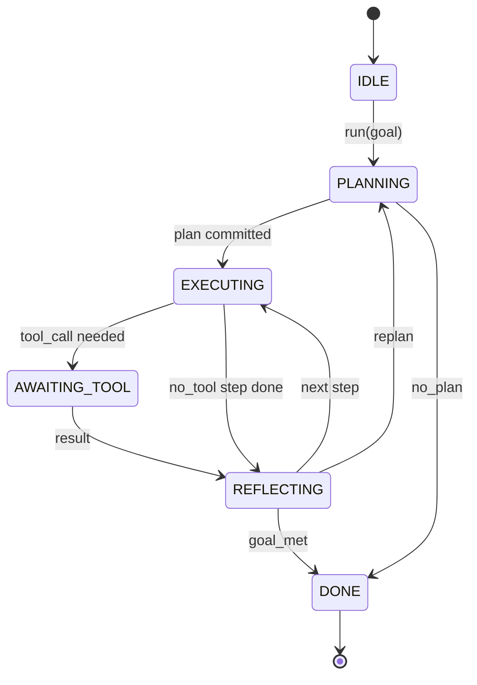

# 智能体框架循环契约

> 框架就是智能体。模型是协处理器。本课冻结了一个你可以将任何模型接入其中的循环契约。

**类型：** 构建
**语言：** Python
**前置知识：** 阶段 13 课程 01-07，阶段 14 课程 01
**时间：** 约 90 分钟

## 学习目标
- 将智能体框架循环指定为具有显式转换的确定性状态机。
- 实现十个生命周期钩子主题，操作员可以将其接入策略、遥测和护栏。
- 定义两个拉取点，循环在此时将控制权交还给调用者，并在收到新输入时继续。
- 强制执行每会话预算（轮次、工具调用、墙钟时间），在超出时不泄露部分状态。
- 发出十一种事件类型的类型化流，使下游 UI 和跟踪器可以订阅而无需直接检查循环。

## 框架

一个无人值守运行四十轮的编码智能体不是一个聊天循环。它是一个状态机，操作员可以拦截其节点，审计其边。一旦你把契约写下来，切换模型、工具或策略就不再是重构。它变成了一个注册调用。

本课构建该契约。我们命名六个状态、十个钩子主题、两个拉取点、十一种事件类型和一个预算信封。其他所有内容（工具注册表、JSON-RPC 传输、调度器、规划器）都插入到这个形态中。

## 状态

循环有六个状态。五个是活跃的。一个是终止的。



`IDLE` 是唯一的合法入口点。`DONE` 是唯一的合法出口。`AWAITING_TOOL` 是唯一产生拉取点的状态。所有其他转换都是内部的。

状态机是确定性的。给定相同的事件日志，框架重新进入相同的状态。这个属性让你可以在不重新调用模型的情况下重放会话以进行调试。

## 钩子主题

钩子是操作员进入循环的接口。框架触发十个主题。每个主题接受任意数量的订阅者。订阅者按注册顺序触发。订阅者可以变更载荷、触发中止轮次，或返回哨兵值跳过下一步。

```text
before_plan         after_plan
before_tool_call    after_tool_call
before_step         after_step
on_error
on_pause
on_budget_exceeded
on_complete
```

这个形态反映了 Claude Code、Cursor 和 OpenCode 在 2025 年中期的共识。名称是功能性的，而非品牌化的。阻止 `rm -rf` 的钩子位于 `before_tool_call`。发送 OpenTelemetry span 的钩子位于 `after_step`。恢复暂停会话的钩子位于 `on_pause`。

## 拉取点

循环两次交出控制权。第一次是在 `AWAITING_TOOL` 时，当它无法在无工具结果的情况下继续前进时。第二次是在 `on_pause` 时，当预算耗尽或钩子明确请求人工审查时。

拉取点不是异常。它是一个返回。调用者检查框架状态，获取框架请求的内容，并调用 `resume(payload)`。框架从停止的地方继续。这与 Python 生成器的形态相同。拉取点上的传输由你选择。在 TUI 中它是按键。通过 MCP 它是 `tools/call`。通过队列它是任务轮询。

## 事件流

循环在契约中的特定点将事件追加到类型化流中。该流是追加写入的，订阅者可以从任何偏移量重放。已实现的十一种事件类型是：

- `session.start` — 调用 `run(goal)` 时发出一次
- `plan.draft` — 规划器返回草稿计划时发出
- `plan.commit` — 草稿提交为活动计划后发出
- `step.start` — 每个执行步骤开始时发出
- `step.end` — 每个执行步骤结束时发出
- `tool.call` — 需要工具的步骤将控制权交给调用者时发出
- `tool.result` — 携带工具结果恢复时发出
- `tool.error` — 携带错误恢复或钩子中止调用时发出
- `budget.warn` — 达到预算限制时发出
- `session.pause` — 循环在暂停时交出控制权时发出（预算或钩子）
- `session.complete` — 循环到达 `DONE` 时发出一次

事件不重复钩子载荷。钩子是指令式的（变更、中止）。事件是观察性的（记录、发送）。将它们视为正交的。

## 预算信封

一个会话携带三个限制。轮次数、工具调用次数、墙钟秒数。每轮增加一次轮数。每次工具调用增加一次工具调用数。墙钟时间在每个状态转换时检查。当任何限制达到时，循环触发 `on_budget_exceeded`，发出 `budget.warn`，然后在下一个拉取点转换到 `IDLE`，附带预算超出的原因。

预算不是终止开关。它是一个让步。调用者决定是延长预算并继续，还是关闭会话。

## 本课不做的事情

它不调用模型。它不注册真实工具。它不实现传输。这些是接下来四课的内容。本课固定契约，以便接下来的四课可以接入而无需重写。

`main.py` 中的确定性规划器是一个替代品。它返回一个硬编码的三步骤计划，其中两个需要工具结果。重点是循环，而不是计划。

## 如何阅读代码

`HarnessLoop` 是主类。它持有状态、触发钩子、发出事件。`Budget` 跟踪限制。`Event` 是流上的类型化信封。`HookRegistry` 是调度表。`_transition` 是唯一改变状态的函数，因此状态机不变量位于一个地方。

从头到尾阅读 `main.py`。然后阅读 `code/tests/test_loop.py`。测试固定了每个转换和每个钩子触发顺序。

## 进一步深入

在生产中构建框架最难的部分不是状态机。而是使契约可强制执行。契约必须在规划器的热重载中存活。它必须在返回畸形 JSON 的工具中存活。它必须在 `before_tool_call` 中的钩子在四十轮会话进行了三分之二时抛出的情况下存活。本课中的测试演练了这些失败模式。运行它们。破坏它们。添加用例。

下一课添加工具注册表。之后是 JSON-RPC 传输。再之后是调度器。到第二十四课时，这个文件中的循环将使用真实工具、真实预算和真实强制执行来运行真实计划。
