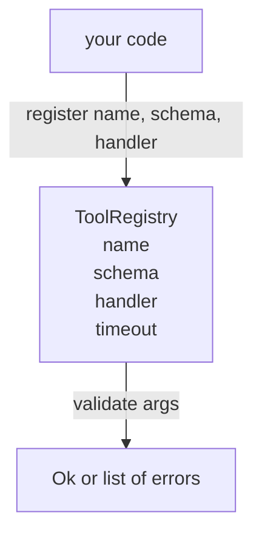

# 工具注册表与模式验证

> 智能体无法验证的工具就是智能体无法调用的工具。在构建工具之前，先构建注册表和模式检查器。

**类型：** 构建
**语言：** Python
**前置知识：** 阶段 13 课程 01-07，阶段 14 课程 01
**时间：** 约 90 分钟

## 学习目标
- 持有一个工具名称 -> 模式 -> 处理器的类型化注册表，调度器可以查询一次并随后信任。
- 实现一个 JSON Schema 2020-12 子集，覆盖百分之九十的工具调用实际使用的关键字。
- 返回精确的、JSON 指针形状的错误路径，以便模型可以在一次往返中自我修正。
- 拒绝无显式覆盖的重复注册，因为静默覆盖是生产工具目录漂移的原因。
- 保持验证器纯净（无 I/O、无时间、无全局变量），以便可以在重放日志上重新运行。

## 为什么注册表在工具之前

2026 年的编码智能体拥有的注册工具数量超过了模型在单个上下文窗口中能容纳的数量。一个非平凡的框架将注册两百个工具，并在任何给定轮次中展现十到四十个。注册表是"存在哪些工具"、"它们的参数是什么形状"以及"我调用哪个处理器"的真理之源。一旦这三个答案确定，框架的其余部分就可以停止猜测。

我们正在避免的错误是交付没有模式的处理器，或者交付没有验证的模式。两者都很常见。两者都将下一层（第二十三课的调度器）变成一个猜谜游戏，其中唯一的失败模式是来自处理器的堆栈跟踪。

## 工具记录的样子

```text
ToolRecord
  name        : str          (唯一，小写字母数字和下划线段由点分隔，例如 snake_case.segment.case)
  description : str          (一行，显示给模型)
  schema      : dict         (JSON Schema 2020-12 子集)
  handler     : Callable     (异步或同步，返回 Any)
  idempotent  : bool         (调度器用于重试决策)
  timeout_ms  : int          (覆盖每个工具的调度器默认值)
```

模式是验证器触及的唯一字段。处理器对它是不透明的。我们有意将它们分开。模式是数据。处理器是代码。混合它们会诱使你将在处理器内部放置验证逻辑，而这正是我们正在阻止的错误。

## JSON Schema 2020-12 子集

完整的 2020-12 规范是一篇论文。我们需要八个关键字。

```text
type           string / number / integer / boolean / object / array / null
properties     属性名称 -> 模式的映射
required       属性名称列表
enum           允许的原始值列表
minLength      整数，适用于字符串
maxLength      整数，适用于字符串
pattern        ECMA-262 兼容的正则表达式，适用于字符串
items          应用于每个数组元素的模式
```

这足够覆盖工具 API 实际需要的内容。我们没有添加的关键字（oneOf、anyOf、allOf、$ref、条件式）在生产模式中是有效的，但会使验证器变成带循环的树遍历器。我们在构建注册表，而不是 JSON Schema 引擎。

## JSON 指针错误路径

当验证失败时，验证器返回一个错误列表。每个错误携带一个指向输入的 JSON 指针路径。指针是由斜杠前缀的属性名称和数组索引组成的序列。

```text
{"a": {"b": [1, 2, "x"]}}
                    ^
                    /a/b/2
```

模型读取错误路径比读取句子更好。如果模式要求 `args.user.email` 而模型传入了一个整数，错误应该是 `/user/email`，附带 `expected_type: string`。模型在下一次调用中修复它，无需一轮自然语言。

## 注册和覆盖

`register(name, schema, handler, **opts)` 默认拒绝重复注册。调用者必须传递 `override=True` 来替换。这是操作卫生。代码库的两个部分静默注册相同的工具名称是那种需要一周才能在生产中找到的 bug。

注册表暴露三个读取方法。`get(name)` 返回记录或抛出异常。`validate(name, args)` 返回 `Ok` 或错误列表。`names()` 按注册顺序返回工具名称。

## 验证器是什么和不是什么

它是对模式树的单次遍历，递归的。它是纯净的。它不调用处理器。它不强转类型（字符串 `"42"` 不能通过数字模式）。它不静默截断。

它不是安全边界。恶意处理器在验证通过后仍然可能行为异常。第二十三课的调度器添加超时和沙箱层。注册表添加形状。

## 形态



## 如何阅读代码

`code/main.py` 定义了 `ToolRegistry`、`ToolRecord`、`ValidationError` 和八个验证器函数。验证器根据 `schema["type"]` 调度（或将带 `enum` 的模式视为无类型枚举检查）。每个类型验证器返回空列表或 `ValidationError` 列表。顶层遍历器连接错误并在下降时预置路径段。

`code/tests/test_registry.py` 涵盖注册、覆盖、验证成功、带路径的验证失败以及子集中的每个关键字。

## 进一步深入

本课落地后你会想要的两个扩展是 `$ref` 解析（针对本地定义块）和 `additionalProperties: false`（用于严格形状）。两者都很小。两者在工具目录增长到超过五十个工具时都很常见。我们将其留出课程以保持文件在一次阅读内。

下一课（二十二）构建将本注册表暴露给模型客户端的 JSON-RPC stdio 传输。其后的课程（二十三）将两者包装在带超时和重试的调度器后面。
