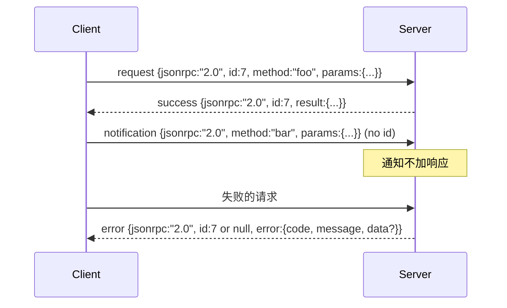

# 基于换行符分隔 Stdio 的 JSON-RPC 2.0

> 模型客户端和工具服务器之间的传输是 JSON-RPC over stdio。亲手实现一次会让你了解每个框架层在付出什么代价。

**类型：** 构建
**语言：** Python
**前置知识：** 阶段 13 课程 01-07，阶段 14 课程 01
**时间：** 约 90 分钟

## 学习目标
- 在 stdin 和 stdout 上使用换行符分隔的 JSON 作为框架来说 JSON-RPC 2.0。
- 映射五个标准错误代码（-32700、-32600、-32601、-32602、-32603），并以正确的语义呈现它们。
- 区分请求、响应、通知和批处理，无需发明新的信封键。
- 处理每行的一个解析错误，而不污染流的其余部分。
- 使用 `io.BytesIO` 构建一个自终止的演示，使本课无需生成子进程即可运行。

## 为什么 JSON-RPC 仍然是通用语言

2026 年的编码智能体在单个会话中可能与大约十二个工具服务器通信。每个服务器是一个独立的进程或远程端点。线格式自 2013 年以来保持不变。JSON-RPC 2.0 是一个两页的规范。它之所以存活，是因为替代方案（gRPC、每次调用的 HTTP、自定义二进制）都强加了一个 JSON-RPC 没有的权衡：它们要么选择流式传输，要么选择批处理，要么选择传输耦合。JSON-RPC 在 stdio、套接字、WebSocket 和 HTTP 上是对称的，并且客户端可以在从未见过服务器的情况下驱动它，只要双方都遵守规范。

本课构建 stdio 变体。换行符分隔的 JSON。每个请求是一行。每个响应是一行。传输边界是 `\n`。

## 线格式形态

存在四种信封形态。两种由客户端说出。两种由服务器说出。



通知没有 `id`。服务器不得对其做出响应。如果服务器返回对通知的响应，客户端无法将其附加到调用点。这一条规则保持了框架数学的简单。

批处理是请求或通知的 JSON 数组。服务器以任意顺序回复一个响应数组，每个非通知条目一个。如果批处理中的每个条目都是通知，服务器不返回任何内容。

## 五个错误代码

```text
-32700  解析错误        JSON 无法解析
-32600  无效请求        信封形状错误
-32601  找不到方法
-32602  无效参数
-32603  内部错误
```

-32000 到 -32099 之间的代码保留给服务器定义的错误。其他所有代码是应用定义的。本课坚持使用这五个。如果你的处理器抛出异常，传输将其包装为 -32603，并在 `data.exception` 中带上异常类名。

解析错误有一个特殊规则。响应中的 `id` 是 `null`，因为请求从未被解析到可以提取 id 的程度。

## 换行符框架和 BytesIO 演示

传输一次读取一行。一行是直到并包括 `\n` 的字节。如果一行无法解析，传输写入一个带 `id: null` 的 -32700 响应并继续。流不会被污染。下一行被重新解析。

对于本课，我们包装一对 `io.BytesIO` 作为 stdin 和 stdout。服务器读取请求直到 EOF，对每个写入响应，然后返回。客户端读回响应。没有进程生成。没有超时。传输行为与真实的子进程管道相同，因为 Python 的 `io` 接口呈现相同的 `.readline()` 和 `.write()` 契约。

## 方法调度

传输不知道哪些方法存在。它转交给框架提供的可调用 `handler(method, params)`。处理器返回结果或抛出异常。三个异常类映射特定代码。

```text
MethodNotFound -> -32601
InvalidParams  -> -32602
其他任何异常  -> -32603，在 data 中带上异常名
```

传输从不看到工具注册表。注册表位于处理器后面。这是我们想要的层次。传输说 JSON-RPC。注册表说工具形状。调度器（第二十三课）将它们缝合在一起。

## 错误时的流行为

```text
客户端写入                服务器读取              服务器写入
---------------           -----------            -------------
{...有效请求...}          解析成功               {...response, id matches...}
{...损坏的 json...        解析失败               {id:null, error: -32700}
{...有效请求...}          解析成功               {...response, id matches...}
{...缺少方法...}          无效信封               {id:X, error: -32600}
```

损坏的 JSON 行不会停止循环。缺少的 `method` 字段不会停止循环。处理器异常不会停止循环。传输持续读取直到 EOF。

## 通知和不对称流

通知是即发即弃的。框架使用通知进行进度事件、取消信号和日志行。通知是长期运行的工具可以流式传输状态更新而无需为每个状态往返的方式。

本课实现了一个出站通知辅助函数 `write_notification`。服务器在请求进行中使用它来发出进度。演示展示了这种模式：请求进入，处理器发出两个进度通知，然后写入最终响应。

## 如何阅读代码

`code/main.py` 定义了 `StdioTransport`、解析辅助函数（`parse_request`）、三个写入辅助函数（`write_response`、`write_error`、`write_notification`）以及调度循环 `serve`。错误代码常量位于模块作用域。

`code/tests/test_transport.py` 涵盖五个错误代码、通知（不写响应）、批处理（数组输入，数组输出，跳过通知）、损坏的 JSON（解析错误然后继续）以及处理器在调用中写入通知的不对称流。

## 进一步深入

这个传输对于后续课程来说已经足够。生产传输添加三样东西。一个在转发中存活的关联 ID 字段（你的 `id` 已经是这个，但在网格中你还需要一个外部追踪 ID）。一个取消通道（像 `$/cancelRequest` 这样的通知，带有进行中调用的 id）。还有一个内容类型协商握手，使同一套接字可以同时说 JSON-RPC 和 Streamable HTTP。这些都不会改变线格式。它们添加元数据。
