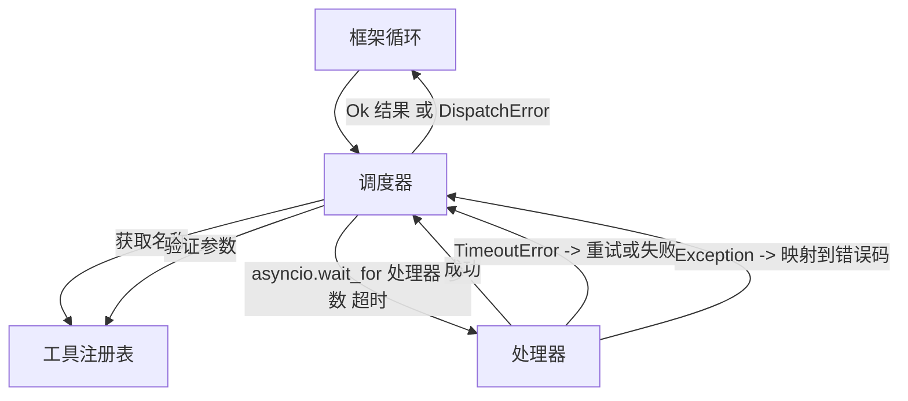
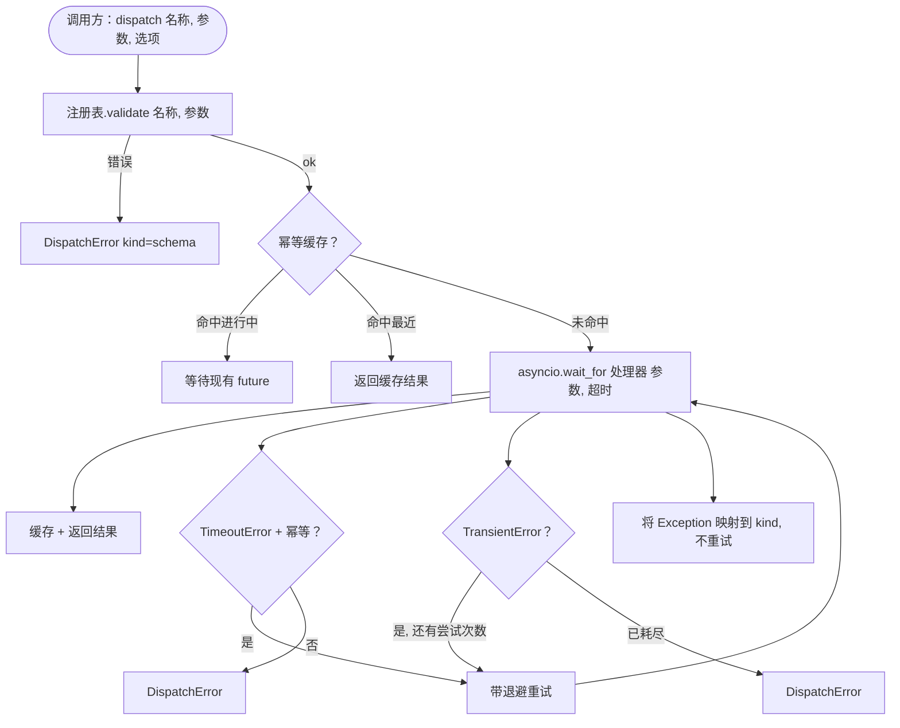

# 函数调用调度器

> 调度器是框架为模式中每个承诺付出代价的地方。超时、重试、去重、错误映射。全部集中在一个接缝处。

**类型:** 构建
**语言:** Python
**前置知识:** 阶段13 第01-07课，阶段14 第01课
**时长:** ~90分钟

## 学习目标
- 将工具处理器包装在每次调用的超时中，返回类型化错误而非挂起循环。
- 应用带抖动的指数退避重试和最大尝试次数。
- 基于幂等键去重，使重试不会与慢速原始调用竞态执行两次。
- 将处理器异常和传输故障映射到框架循环已理解的单一错误信封中。
- 使用并发限制约束并行调度，使40个工具调用的扇出不会耗尽事件循环。

## 调度器的位置

位于框架循环（第20课）和工具注册表（第21课）之间。传输层（第22课）为循环提供数据。循环将工具调用交给调度器。调度器调用注册表，运行处理器，返回结果或JSON-RPC格式的错误信封。



调度器是唯一知道定时器、重试和幂等性的层。循环不知道。注册表不知道。处理器不知道。这种隔离正是关键所在。

## 超时

每个工具有一个默认超时。注册表记录中携带 `timeout_ms`。当框架传递每次调用的覆盖值时，调度器会覆盖它。我们使用 `asyncio.wait_for`。超时时，处理器任务被取消，调度器返回 `DispatchError(kind="timeout")`。

对于非幂等工具，超时默认不是可重试错误。一个 `db.write` 在超时时可能已提交也可能未提交。重试会重复写入。调度器遵循注册表记录中的 `idempotent` 标志。幂等工具会重试。非幂等工具不会。

## 带指数退避的重试

重试策略最多三次尝试。退避是指数级带抖动的。

```text
尝试 1  -> 延迟 0
尝试 2  -> 延迟 0.1s * (1 + random[0..0.5])
尝试 3  -> 延迟 0.4s * (1 + random[0..0.5])
```

只有 `timeout` 和 `transient` 错误会重试。`schema` 错误、`not_found` 或 `internal` 错误不会重试。模式错误是确定性的。重试不会改变结果，只会浪费预算。

重试循环遵循框架的预算。如果调用方的预算剩余零次工具调用，调度器在第一次尝试时快速失败，返回 `kind="budget_exceeded"`。

## 幂等键去重

在原始调用仍在进行中时触发的重试是一个真实的生产错误。第一次调用在4.9秒处挂起（刚好低于超时）。重试在5秒时触发。现在两个请求竞态访问同一个后端。如果工具是 `payments.charge`，就会重复收费。

调度器接受可选的 `idempotency_key`。如果相同的键在调用到达时正在进行中，调度器等待进行中的未来对象并返回其结果。缓存完成后保留键60秒，以吸收延迟的重试。

键是调用方的责任。框架从规划器派生它：`f"{step_id}:{tool_name}:{hash(args)}"`。调度器不会自己发明键，因为仅从参数派生键会使两个语义不同的调用看起来相同。

## 错误信封

失败的调度返回单一形状。

```text
DispatchError
  kind        : "timeout" | "transient" | "schema" | "not_found" | "internal" | "budget_exceeded"
  message     : str
  attempts    : int
  jsonrpc_code: int   （之一：-32601, -32602, -32603）
```

框架循环将 `kind` 映射到下一个状态。`schema` 和 `not_found` 进入 `on_error` 并触发重新规划。`timeout` 和 `transient` 进入 `on_error`，根据尝试次数决定是否重新规划。`budget_exceeded` 触发 `on_budget_exceeded`。

## 扇出的并发限制

`gather(*calls)` 同时运行所有协程。对于40个工具调用，就是40个开放套接字或40个子进程管道。大多数后端不喜欢来自一个客户端的40个并行连接。

调度器将 `gather` 包装在信号量中。默认并发限制为8。每个调用在调度前获取信号量，完成后释放。调用方看到的是 `gather` 形状的输出，但实际的调度是有界的。

## 单次调用的流程



## 如何阅读代码

`code/main.py` 定义了 `Dispatcher`、`DispatchError` 和 `TransientError`。调度器在构造时接收注册表。异步的 `dispatch(name, args, ...)` 是唯一的入口点。每次尝试的超时在 `_run_with_retries` 内使用 `asyncio.wait_for` 内联应用。`gather_bounded(calls)` 使用并发限制运行多个调度。

`code/tests/test_dispatcher.py` 覆盖了超时触发、瞬态错误重试、模式错误不重试、幂等去重（两个相同键的并发调用折叠为一次处理器调用）以及并发限制（信号量的实际运行）。

测试使用 `asyncio.sleep(0)` 和确定性的基于 `Counter` 的处理器，因此在毫秒内完成，不依赖挂钟时间。

## 进一步探索

生产调度器会添加的两个扩展。第一，结构化日志记录每个转换（循环的事件流已经提供了这一点，但调度器也应该发出 `dispatch.attempt` 和 `dispatch.retry` 事件）。第二，断路器：在一个窗口内失败N次后，工具进入冷却期，调度立即返回 `kind="circuit_open"` 而非尝试处理器。两者都可以在此调度器之上添加，无需更改契约。

第24课将调度器连接到规划-执行智能体，让你看到所有四个部分协同工作。
