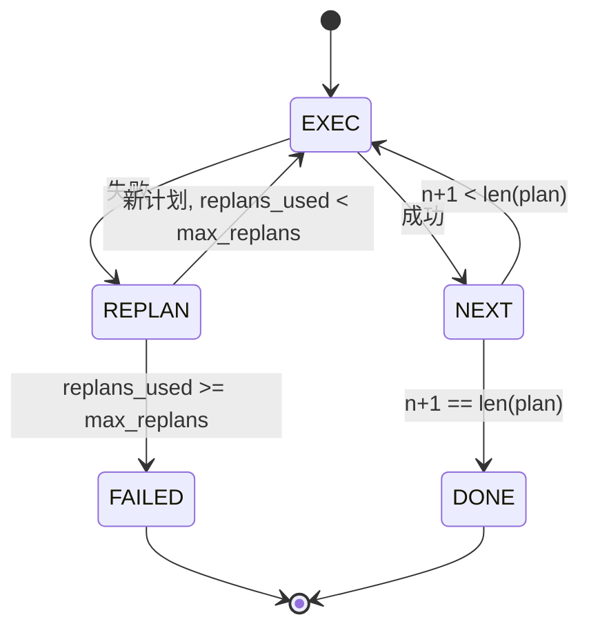

# 规划-执行控制流

> 一个无法承受失败的计划只是一段脚本。一个能重新规划的脚本才是一个智能体。先构建重规划器。

**类型:** 构建
**语言:** Python
**前置知识:** 阶段13 第01-07课，阶段14 第01课
**时长:** ~90分钟

## 学习目标
- 将计划表示为类型化步骤的有序列表，使执行器能够推理进度和结果。
- 顺序执行步骤，并将受控的失败交回给规划器。
- 从当前游标处重新规划，将先前的错误放在上下文中，使下一个计划有信息依据。
- 每次修订发出计划差异，使下游追踪器或UI能显示计划变更的原因。
- 执行两个预算：硬性步骤上限和硬性重新规划上限。

## 规划与执行，而非思维链

思维链智能体生成token，让循环猜测工具调用的结束位置。规划-执行智能体首先发出结构化计划，然后确定性地执行每一步。计划是框架可以内省的数据。执行是框架通过调度器运行该数据的过程。

两个部分。产生计划的规划器。运行计划的执行器。有趣的工作在于执行器遇到失败时发生什么。三个选项：

```text
1. 中止        （返回失败，显示错误）
2. 跳过        （标记步骤失败，继续其余部分）
3. 重新规划    （将错误交给规划器，从游标获取新计划）
```

重新规划是将脚本变成智能体的关键。

## 步骤形状

```text
Step
  id              : int           （计划修订内单调递增）
  tool_name       : str
  args            : dict
  expected_outcome: str           （规划器声明的成功条件）
  result          : Any | None
  error           : str | None
```

`expected_outcome` 是规划器随步骤发出的简短句子。执行器不强制执行它。它用于两件事：重规划器在修订计划时读取它；事件流发出它以便追踪器可以显示"此步骤本应执行X"。

## 规划器形状

```python
def planner(goal: str, history: list[Step], last_error: str | None) -> list[Step]:
    ...
```

一个纯函数。`goal` 是用户目标。`history` 是已执行的步骤（结果和错误已填充）。`last_error` 在第一次调用时为None，在后续每次调用时为最近失败的出错消息。规划器返回从当前游标开始的下一个计划。

规划器不知道执行器。它不知道重试。它不知道超时。它产生一个计划。仅此而已。

## 执行器

执行器是一个小型状态机。每一步通过调度器运行。结果有三种可能：成功、可重新规划的失败、致命的失败。可重新规划的失败交回给规划器。致命的失败（预算超限、重新规划次数达到上限）返回 `FAILED` 会话结果。



## 修订时的计划差异

当规划器在失败后返回新计划时，执行器发出带有三个字段的 `plan.diff` 事件。

```text
removed: 旧计划中存在但新计划中没有的步骤ID列表
added  : 新计划中存在但旧计划中没有的步骤ID列表
revised: 工具名称或参数发生变化的步骤ID列表
```

追踪器或UI可以将此呈现为删除步骤的删除线和新增步骤的高亮。重点不是差异格式。重点是修订是一个可见的事件，而非静默的重写。

## 两个预算，均为硬性限制

`max_steps` 限制整个会话中的总步骤执行次数，包括重新规划。默认为12。一个线性的5步计划如果重新规划两次，每次添加3个步骤，将达到16次执行并超出预算。执行器将拒绝重新规划并返回 FAILED。

`max_replans` 限制首次计划后调用规划器的次数。默认为5。这是更重要的限制。一个连续五次返回相同破损计划的规划器会在步骤预算捕获它之前一直循环。限制重新规划使失败更快，原因更清晰。

## 本课中的确定性规划器

本课不调用模型。课程附带一个基于 `last_error` 选择计划的确定性规划器。

```text
last_error 为 None    -> 发出四步计划
last_error 匹配 X    -> 发出绕开X的三步计划
last_error 匹配 Y    -> 发出优雅放弃的两步计划
其他情况             -> 返回 []（表示无可重新规划）
```

这足以测试执行器在每条转换路径上的行为：成功、重新规划一次、重新规划两次、重新规划耗尽、以及步骤预算耗尽。

## 结果形状

```text
SessionResult
  status      : "completed" | "failed"
  reason      : str     （"goal_met" | "step_budget" | "replan_budget" | "no_plan"）
  history     : list[Step]
  revisions   : list[PlanDiff]
  events      : list[Event]
```

第20课的框架循环可以直接读取此结果。第23课的调度器执行每一步。第21课的注册表验证每一步的参数。第22课的传输层将通过JSON-RPC将整个流程呈现给模型客户端。

## 如何阅读代码

`code/main.py` 定义了 `PlanExecuteAgent`、`Step`、`PlanDiff`、`SessionResult` 和确定性规划器。执行器是一个返回 `SessionResult` 的单一 `run(goal)` 方法。计划差异通过比较步骤ID和 `(tool_name, args)` 元组来计算。

`code/tests/test_agent.py` 覆盖了线性成功、中间失败后重新规划一次、重新规划耗尽返回 `failed:replan_budget`、步骤预算耗尽以及计划差异事件格式。

## 进一步探索

将其连接到真实模型后你会想要的两个扩展。第一，部分计划缓存：当一个计划的前三步成功而后三步失败时，你不想重新运行前三步。执行器已经保留了历史记录；规划器只需要读取它。第二，并行分支：当前的执行器严格串行。规划器如果发出独立分支（`gather_step` 而非 `next_step`），可以通过调度器同时运行两个工具调用。

两者都增加了实际的复杂性。两者在串行执行器确定之后更容易添加。这正是本课所做的。
