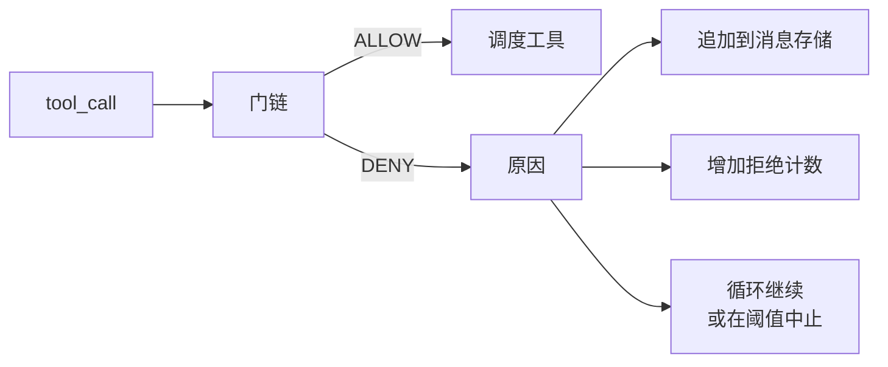
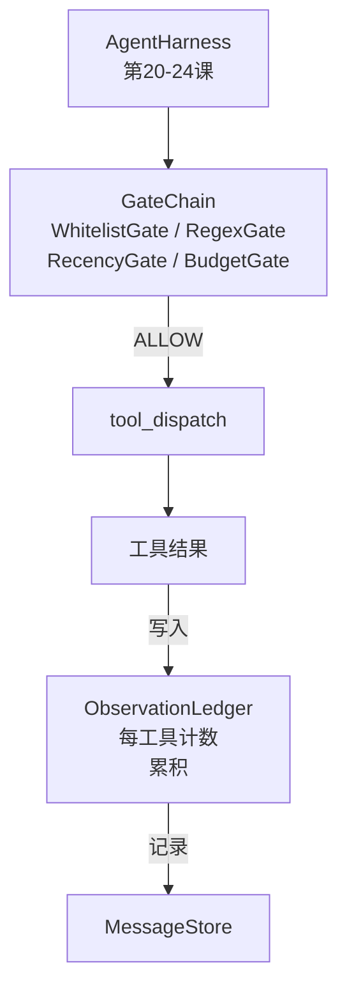

# 顶点项目第25课：验证门与观察预算

> 没有验证层的智能体框架只是穿风衣的愿望。本课构建确定性门链，决定工具调用是否允许触发、智能体允许看到其多少输出、以及当智能体读取过多时循环何时必须停止。该链由小型命名门加上一个跟踪模型所见每个token的观察分类账组成。

**类型:** 构建
**语言:** Python (标准库)
**前置知识:** 阶段19 · 20-24（Track A1：智能体循环、工具注册表、消息存储、提示构建器、模型路由器），阶段14 · 33（指令作为约束），阶段14 · 36（作用域契约），阶段14 · 38（验证门）
**时长:** ~90分钟

## 学习目标

- 构建具有确定性 `evaluate(call)` 方法的 `VerificationGate` 协议。
- 将预算、新鲜度、白名单和正则表达式门组合成具有短路语义的链。
- 通过以工具和轮次为键的 `ObservationLedger` 跟踪每个观察。
- 当累积观察预算将被超出时拒绝工具调用。
- 呈现结构化的 `GateDecision` 记录，下游可观测性可以摄取。

## 问题

当智能体框架让模型自由调用工具时，在实际使用的第一个小时内就会出现三类错误。

第一是无界观察。跨200K行代码库的grep将50万token的输出转储到下一轮。模型每千字节看到一个匹配，其余上下文被浪费。token账单很大，智能体现在反而更差，而非更好。

第二是陈旧的新鲜度。长时间运行的任务积累了50次工具调用。模型将第3轮的第一次 read_file 重新读取为实时状态。第47轮所做的编辑永远不会出现，因为提示构建器先序列化了最早的观察。

第三是权限蔓延。一个研究任务从调用 `web_search` 开始，然后不知何故最终运行了 `shell`，因为模型发明了一个工具名称，而框架默认为许可模式。到有人阅读追踪记录时，一个垃圾文件已放在 /tmp 中，一个 curl 已对私有API运行。

验证门是说"不"的框架组件。它不是模型。它不是评判者。它是 `(call, history, ledger)` 的确定性函数，返回 ALLOW 或 DENY 并附上原因。原因被记录。模型被告知。循环继续或中止。

## 概念



门是具有 `evaluate(call, ctx) -> GateDecision` 方法的任何东西。链是有序列表。评估在第一个拒绝时短路。顺序很重要：廉价的结构性门在昂贵的token计数门之前运行。

本课提供了四个门：

- `WhitelistGate`。允许的工具名称是显式集合。之外的任何内容都被拒绝。这是最廉价的门，首先运行。
- `RegexGate`。工具参数与正则表达式匹配。用于拒绝包含 `rm -rf` 的 shell 调用，或对内部IP的HTTP调用。纯粹基于调用负载。
- `RecencyGate`。模型只能看到最近N轮的观察。较旧的观察被屏蔽。当工具调用的结果会扩展已过时的观察窗口时，门拒绝该调用。
- `BudgetGate`。模型在会话中读取的累积token有上限。当分类账显示已到达上限时，每个进一步的工具调用都被拒绝。

观察分类账是记账簿。每次成功的工具调用写入一行：工具名称、轮次、发出的token数、累积值。分类账回答两个问题：模型总共看到了多少，以及它看到了工具X的多少。预算门读取前者。每个工具的预算门（你将作为练习编写）读取后者。

## 架构



框架询问门链。门链要么点头要么拒绝。如果它点头，工具运行，分类账增加，结果追加到消息存储。如果它拒绝，模型以系统消息的形式收到拒绝通知，循环决定重试或中止。

## 你将构建的内容

实现是一个单一的 `main.py` 加测试。

1. `Observation` 和 `ToolCall` 数据类定义线格式。
2. `ObservationLedger` 记录 `(turn, tool, tokens)` 行并回答 `cumulative()` 和 `per_tool(name)`。
3. `GateDecision` 携带 `(allow, reason, gate_name)`。
4. `VerificationGate` 是协议。每个门实现 `evaluate(call, ctx)`。
5. `GateChain` 包装有序列表。它调用每个门，返回第一个拒绝，如果每个门都通过则返回允许。
6. 演示运行一个微型的合成智能体循环。三轮。第三轮触发预算门，循环报告带有非零拒绝计数的清晰拒绝。

token计数器有意使用愚蠢的 `len(text) // 4` 启发式方法。本课的重点是门管道，而非分词器。在生产中替换为真正的分词器。

## 为什么链顺序很重要

拒绝比允许更廉价。`WhitelistGate` 以O(1)哈希查找运行。`RegexGate` 以O(模式 * 参数量)运行。`RecencyGate` 读取消息存储的一小部分。`BudgetGate` 读取整个分类账。通过按成本升序排列，被拒绝的调用在进行昂贵工作之前短路。

你也按影响范围排序。白名单是最强的主张：此工具不在契约中。正则门次之：此参数不在契约中。新鲜度在后面：框架仍然关心，但调用在结构上是合法的。预算在最后，因为按照定义，它只在其他所有门都通过时触发。

## 如何与Track A其余部分组合

前几课给了你循环、工具注册表、消息存储、提示构建器和模型路由器。本课在模型和工具之间添加了层。第26课提供调度器在门链说ALLOW后将工具调用交予的沙箱。第27课提供将拒绝计数作为质量信号的评估框架。第28课将门决策接入OpenTelemetry spans。第29课将所有这些缝合为一个可工作的编码智能体。

## 运行

```bash
cd phases/19-capstone-projects/25-verification-gates-observation-budget
python3 code/main.py
python3 -m pytest code/tests/ -v
```

演示逐轮打印跟踪，包括每个门决策，并以零退出。测试覆盖分类账、每个独立门、链短路以及端到端的合成循环。
