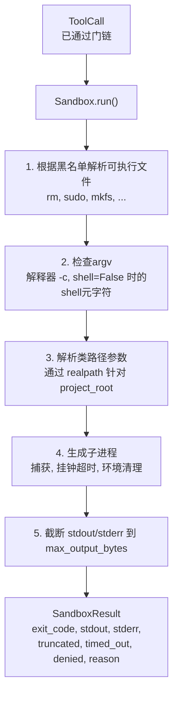
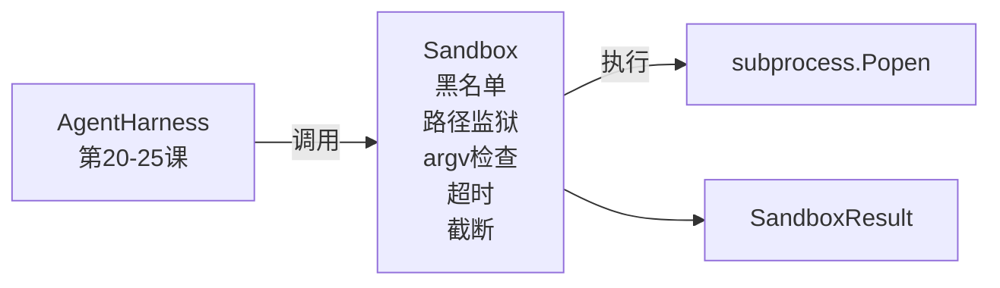

# 顶点项目第26课：带黑名单和路径监狱的沙箱运行器

> 验证门决定工具调用是否应该运行。沙箱决定当它运行时会发生什么。本课提供一个子进程运行器，拒绝危险的可执行文件、拒绝危险的argv形状、将所有文件路径监禁到项目根目录、截断过大的输出、并在挂钟超时时杀死失控进程。它是位于模型和操作系统之间的两个层中的第二个。

**类型:** 构建
**语言:** Python (标准库)
**前置知识:** 阶段19 · 25（验证门与观察预算），阶段14 · 33（指令作为约束），阶段14 · 38（验证门）
**时长:** ~90分钟

## 学习目标

- 构建包装 `subprocess.run` 并带有超时、捕获和截断的 `Sandbox` 类。
- 根据黑名单拒绝命令名称，根据argv检查器拒绝命令结构。
- 拒绝任何解析到声明项目根目录之外的路径参数。
- 在shell模式关闭时拒绝shell元字符。
- 返回结构化的 `SandboxResult`，下游可观测性和评估框架可以摄取。

## 问题

能够执行shell命令的编码智能体可以在单轮中安装后门、窃取密钥、破坏开发者笔记本电脑并累积云账单。成本最低的防御是不给它shell。第二低成本的是对精确模式列表说"不"的沙箱。

在智能体追踪中反复出现三类失败。

第一是危险的可执行文件。处于修复路径问题压力下的模型会尝试 `sudo`、`chmod -R 777`、`rm -rf`、`mkfs`、`dd`。这些都不属于智能体运行。黑名单按名称和别名捕获它们。

第二是argv技巧。被告知不能使用shell的模型会通过解释器管道化攻击：`python3 -c "import os; os.system('rm -rf /')"`、`bash -c '...'`、`node -e '...'`、`perl -e '...'`。沙箱需要知道任何使用 `-c` 类标志运行的解释器本质上就是带额外步骤的shell调用。

第三是路径逃逸。模型被告知读取 `./src/main.py` 却读取了 `../../etc/passwd`。沙箱通过 `os.path.realpath` 解析每个路径参数并断言前缀来监禁路径。

沙箱不是操作系统意义上的安全边界。具有代码执行权限的坚定攻击者仍然可以突破。沙箱是开发时的护栏：它使常见失败模式变得响亮，并阻止智能体因纯粹的无能而造成损害。

## 概念



沙箱有四个拒绝轴：名称、argv、路径、结构。每个轴是调用的纯函数，尚未创建子进程。子进程仅在每个轴都通过后生成。

`SandboxResult` 退出码是常规的：0 成功，非零失败，外加三个哨兵码用于拒绝（-100）、超时（-101）和截断（退出码是真实值，带标志）。下游课程读取此结构化结果，而非解析 stderr。

## 架构



黑名单是可执行文件基名的冻结集合。别名（`/bin/rm`、`/usr/bin/rm`）都解析为相同的基名。argv检查器知道解释器形状：任何 argv 中 argv[0] 是解释器且后续参数以 `-c` 或 `-e` 开头的都被拒绝。当调用未显式请求shell时，shell元字符（`;`、`|`、`&`、`>`、`<`、反引号、`$()`）导致拒绝。

路径监狱是最微妙的组件。沙箱在构造时接受 `project_root`。任何看起来像路径的参数（包含 `/` 或匹配现有文件）通过 `os.path.realpath` 标准化，然后检查与项目根目录的 realpath。如果解析的目标不在根目录下，则拒绝。符号链接逃逸尝试（项目根目录内指向外部的符号链接）通过检查 realpath（而非字面路径）来阻止。

## 你将构建的内容

实现是 `main.py` 加测试目录。

1. `SandboxResult` 数据类：exit_code, stdout, stderr, truncated, timed_out, denied, reason, duration_ms。
2. `SandboxConfig` 数据类：project_root, max_output_bytes, timeout_seconds, denylist, interpreter_block。
3. `Sandbox` 类：`run(argv, *, shell=False, cwd=None)` 返回 `SandboxResult`。
4. 内部拒绝辅助函数：`_check_executable_denylist`、`_check_argv_interpreter`、`_check_shell_metachars`、`_check_path_jail`。
5. 输出截断，带有清晰的 `truncated` 标志和捕获流中的标记行。
6. 底部的演示：一系列合法和对抗性调用。每个都显示其结果。

沙箱默认使用 `shell=False` 和 `capture_output=True` 的 `subprocess.run`。挂钟超时使用 `timeout` 参数；在 `TimeoutExpired` 时，沙箱杀死进程组并合成一个 SandboxResult。

## 为什么这不是真正的沙箱

本课的沙箱不使用命名空间、cgroups、seccomp、gVisor、Firecracker 或任何内核级隔离。子进程能做的，沙箱也能做。保护是结构性的：智能体被拒绝最常见的危险调用，响亮的拒绝进入可观测性而非静默运行。

对于生产智能体，你在其上进一步分层：在无特权的 Docker 容器内运行、在 microVM 内运行、删除能力、将项目根目录挂载为只读、将临时目录挂载为读写、设置内存和 CPU 的 ulimit、将环境清理为已知安全的 whitelist。第29课做了其中一些。操作系统隔离超出了本课的范围。

## 运行

```bash
cd phases/19-capstone-projects/26-sandbox-runner-denylist
python3 code/main.py
python3 -m pytest code/tests/ -v
```

演示创建临时目录，在其中放置一个干净文件，然后运行一系列调用。合法调用成功。被拒绝的调用返回带有 `denied=True` 和原因的 SandboxResult。超时返回 `timed_out=True`。截断设置 `truncated=True`。演示打印结果的JSON表格并以零退出。

## 如何与Track A其余部分组合

第25课产生了门链。第26课是在门ALLOW后运行的工具执行器。第27课的评估框架比较沙箱结果与每个任务的预期退出码。第28课围绕每个 `Sandbox.run` 调用发出 `gen_ai.tool.execution` span。第29课的端到端演示将一个真实的编码智能体通过两个层进行连接。
