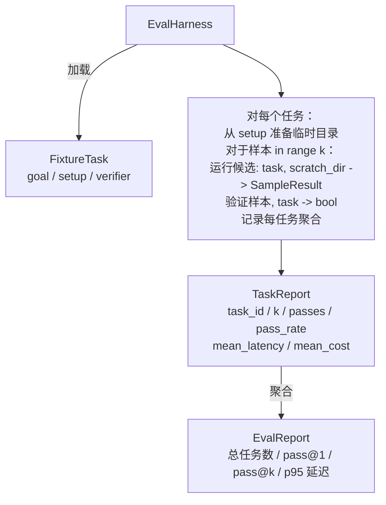

# 顶点项目第27课：带固定任务的评估框架

> 一个编码智能体只有在其衡量标准下的任务套件同样好时才真正好。本课构建一个评估框架，接受一个固定任务文件夹，将每个任务通过候选智能体运行，通过确定性验证器评分通过或失败，并将结果聚合为 pass@1、pass@k、平均延迟和平均成本。该框架是让你区分回归与重构的真相来源。

**类型:** 构建
**语言:** Python (标准库)
**前置知识:** 阶段19 · 25（验证门），阶段19 · 26（沙箱运行器），阶段14 · 30（评估驱动的智能体开发），阶段14 · 19（SWE-bench 和 GAIA 基准）
**时长:** ~90分钟

## 学习目标

- 将固定任务定义为目标、设置和验证器的三元组。
- 对每个任务评分多个样本运行，并计算 pass@1 和 pass@k。
- 将延迟和成本聚合为均值和95百分位数指标。
- 将确定性验证器（文件差异、退出码、正则表达式匹配）接入可重用函数。
- 发出结构化的JSON报告，回归追踪脚本可以摄取。

## 问题

没有评估框架构建的智能体基准存在三种失败模式。

第一是未经验证的通过。智能体说它修复了错误，人类扫一眼差异，套件标记为绿色，三周后回归测试暴露了同样的错误。智能体的推理看似合理但实际并未修复任何内容。

第二是未检测到的回归。提示模板的更改使智能体在响亮的任务上提升4%，在安静的任务上下降14%。没有黄金集和每任务得分，回归潜入主分支，直到客户投诉时才被发现。

第三是每任务漂移。评估在周一以100个任务运行，周五以95个运行，因为有人重命名了五个固定任务。通过率看起来提升了5%。实际上并没有。

框架是将这些失败转化为事实的程序。它每次运行每个固定任务，以可重现的顺序，针对返回真或假的确定性检查的验证器。

## 概念

```mermaid
flowchart LR
  F1[fixtures/task_001/<br/>task.json + expected/] --> Harness
  F2[fixtures/task_002/<br/>...] --> Harness
  Harness[Harness<br/>对每个任务：<br/>setup / 运行智能体 k 个样本 /<br/>验证每个样本 /<br/>记录延迟、成本]
  Harness --> Report[EvalReport<br/>pass@1 / pass@k<br/>平均 ms / p95 ms<br/>平均成本]
```

`FixtureTask` 是一个小型JSON文件加上可选的 `expected/` 目录。JSON 声明一个 `id`、一个 `goal`（提供给智能体的提示）、一个 `setup` 块（要放入临时目录的文件）和一个 `verifier` 块。验证器块在框架的验证器注册表中命名一个函数并提供其参数。

三种验证器形状覆盖了大多数有用任务。

第一种是 `file_equals`。智能体运行后，比较命名文件与预期内容。这捕获了"以这种确切方式修复这个错误"的任务。

第二种是 `regex_match`。命名文件的内容与正则表达式匹配。这捕获了"函数必须存在并返回X"的任务，其中存在多种可接受的解决方案。

第三种是 `shell_exit_zero`。框架运行一个shell命令（通过第26课的沙箱），仅当命令以零退出时任务才通过。这捕获了"测试必须通过"的任务。

框架运行每个任务 `k` 次。Pass@k 是 `1 - (1 - p)^k`，其中 p 是经验通过率；框架也报告原始计数，以便你发现方差。延迟是每个样本的挂钟时间。成本是智能体自我报告的任何值（token计数、美元或两者）；框架跨样本求和，呈现每任务和聚合数字。

```figure
pass-at-k
```

## 架构



候选是一个可调用对象：`Callable[[FixtureTask, str], SampleResult]`。框架通过 `tempfile.mkdtemp()` 创建临时目录，并将其路径作为普通字符串传递。框架不关心候选如何工作。候选可以是确定性补丁应用器（对框架自测试有用）、真实LLM智能体或模糊测试器。契约是 SampleResult。

## 你将构建的内容

`main.py` 提供：

1. `FixtureTask` 数据类。
2. `SampleResult` 数据类：success_self_reported, latency_ms, cost_units, edits。
3. `TaskReport`、`EvalReport` 数据类，带 `to_dict()`。
4. `VerifierRegistry` 将验证器名称映射到函数。内置验证器：file_equals, regex_match, shell_exit_zero。
5. `EvalHarness` 类。针对候选运行任务目录。返回 EvalReport。
6. 五个打包在 `tasks/` 中的固定任务：
   - `fizzbuzz` 中的差一错误
   - `factorial` 中缺少 return
   - 错误消息中的拼写错误
   - 空函数体
   - 链表遍历中的差一错误
7. 一个确定性的参考候选（`apply_known_fixes`），框架用它演示干净的 pass@1 为 1.0。
8. 演示打印 EvalReport JSON 并以零退出。

固定任务作为 JSON 文件打包在 `tasks/` 中，外加配套的源文件在 `tasks/<id>/buggy/` 和 `tasks/<id>/expected/` 中。框架将 buggy 复制到临时目录，交给候选，并对照 expected 验证。

## 为什么用 pass@k 而不仅仅是 pass@1

真实的LLM智能体是随机的。pass@1 为 0.6 看起来像失败。pass@5 为 0.95 表示智能体大多数时候得到正确答案，但在早期样本中选择了错误的答案。修复方法是采样和排序，而非总是更多训练。Pass@k 使这一点可见。

Pass@k 与 pass@1 一起报告，因为 pass@k 掩盖了一个真实的失败：如果模型在20次尝试中只得到一次正确答案，你并没有一个有用的智能体。框架显示两者。

## 如何与Track A其余部分组合

第25课产生了门链。第26课产生了沙箱。框架对任何 `shell_exit_zero` 验证器使用沙箱。第28课将每次框架运行包装在 OTel 追踪中。第29课针对一个打包的固定任务运行端到端演示，并对参考候选断言 pass@1 = 1.0。

## 运行

```bash
cd phases/19-capstone-projects/27-eval-harness-fixture-tasks
python3 code/main.py
python3 -m pytest code/tests/ -v
```

演示以 JSON 格式打印 EvalReport，包括 pass@1、pass@5、平均延迟和每任务细分。退出码为零。测试覆盖验证器函数、pass@k 数学、固定任务加载以及针对打包参考候选的端到端框架。
