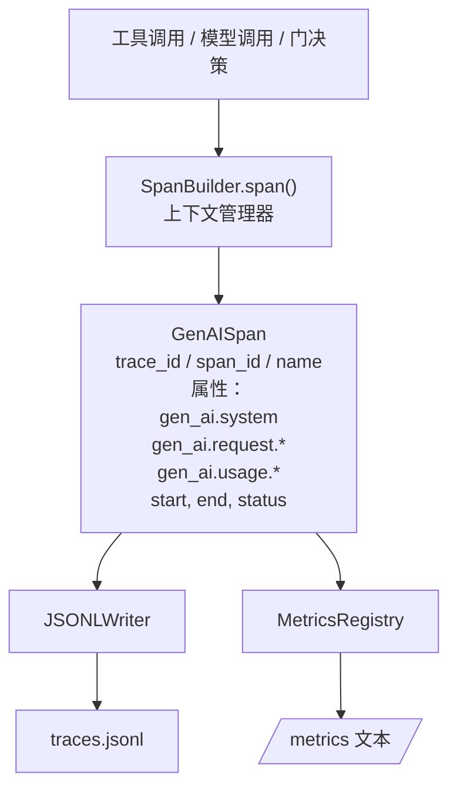
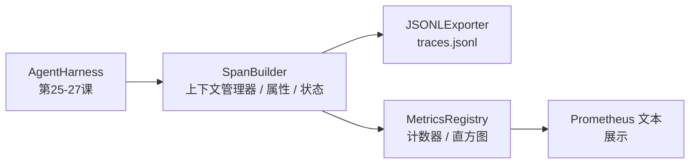

# 顶点项目第28课：基于OTel GenAI Span和Prometheus指标的可观测性

> 没有可观测性的智能体框架是一个花钱的黑箱。本课手工构建一个span构建器，发出符合OpenTelemetry GenAI语义约定的记录，每行一个span写入JSON-Lines文件，并以Prometheus文本格式暴露计数器和直方图。全部使用Python标准库，离线运行。

**类型:** 构建
**语言:** Python (标准库)
**前置知识:** 阶段19 · 25（验证门），阶段19 · 26（沙箱），阶段19 · 27（评估框架），阶段13 · 20（OpenTelemetry GenAI），阶段14 · 23（OTel GenAI约定）
**时长:** ~90分钟

## 学习目标

- 构建符合OpenTelemetry GenAI语义约定的span数据类。
- 实现每行写入一个自包含span的JSONL导出器。
- 构建带标签和Prometheus文本格式暴露的计数器和直方图。
- 将任何可调用对象包装在记录持续时间、状态和异常的span上下文管理器中。
- 验证发出的span通过 `json.loads` 能够往返且符合规范形状。

## 问题

生产中的编码智能体每轮产生三类产物：模型调用、工具执行和验证门决策。没有结构化遥测，这些都没有用。

第一种失败模式是缺失的追踪。周二出了故障，但唯一的记录是500行的聊天日志。没有记录哪个工具运行了、花了多长时间、提示中使用了多少token、或者门是否拒绝了任何东西。智能体作者只能猜测。

第二种失败模式是不可解析的追踪。框架写了span，但使用了自制的字段名称。Grafana、Honeycomb、Jaeger或本地CLI中没有任何东西能读取它们。团队栈中存在的任何工具都被浪费了，因为span是非标准的。

第三种失败模式是未聚合的指标。你可以在追踪中看到一个慢的工具调用，但你无法回答"过去一小时内 read_file 调用的p95延迟是多少？"因为没有指标，只有追踪。

OpenTelemetry GenAI语义约定正是为此而存在。它们定义了一小组标准属性，所有LLM框架中的span发射器共享这些属性。如果你的框架写入这些属性，每个兼容OTel的后端都能读取它们。

## 概念



框架中的每个操作产生一个span。一个span有一个追踪ID（整个智能体调用）、一个span ID（这个操作）、一个名称（例如 `gen_ai.chat`、`gen_ai.tool.execution`）、遵循GenAI约定的属性、开始和结束时间以及状态。

GenAI约定标准化了这些属性键：`gen_ai.system`（哪个提供商，例如 `anthropic`、`openai`）、`gen_ai.request.model`（模型ID）、`gen_ai.request.max_tokens`、`gen_ai.usage.input_tokens`、`gen_ai.usage.output_tokens`、`gen_ai.response.model`、`gen_ai.response.id`、`gen_ai.operation.name`，加上工具特定的键 `gen_ai.tool.name` 和 `gen_ai.tool.call.id`。

导出器写入JSONL。每行一个JSON对象。这是下游工具可以流式处理、grep和导入的最简单可能的格式。真正的OTel导出器会使用OTLP gRPC；本课的JSONL导出器是在线等价物，在每个工作站上以零退出。

指标与追踪并存。计数器在每个工具调用时递增：`tools_called_total{tool="read_file"}`。直方图记录观察到的延迟：`tool_latency_ms{tool="read_file"}`。两者序列化为Prometheus文本展示格式，这是基于拉取的指标的事实标准。

```figure
trace-spans
```

## 架构



span构建器是一个小类，带有返回上下文管理器的 `span(name, attrs)` 方法。上下文管理器在进入时记录开始时间，在退出时记录结束时间，如果抛出了异常则附加异常，并将完成的span推送到导出器。

指标注册表是两个字典。计数器是 `{(name, frozen_labels): int}`。直方图在列表中保留原始样本，并在展示时序列化为Prometheus直方图桶。

## 你将构建的内容

`main.py` 提供：

1. `GenAISpan` 数据类：trace_id, span_id, parent_span_id, name, attributes, start_unix_nano, end_unix_nano, status, status_message, events。
2. `SpanBuilder` 类，带 `span(name, attrs, parent=None)` 上下文管理器。
3. `JSONLExporter` 类，带 `export(span)`，追加一行。
4. `Counter` 和 `Histogram` 类加 `MetricsRegistry`。
5. `prometheus_exposition(registry)` 产生文本格式输出。
6. `wrap_tool_call(name)` 装饰器，发出span并更新指标。
7. 演示：合成一个完整的智能体调用（围绕工具span的 gen_ai.chat span），写入 traces.jsonl，打印 Prometheus 展示，以零退出。

span ID 和 trace ID 是16字节十六进制字符串，从 `os.urandom` 生成。这与OTel的W3C追踪上下文匹配。导出器从不抛出；IO错误会被提出，但框架继续运行。

直方图有固定的桶集（OTel延迟毫秒默认值：5, 10, 25, 50, 100, 250, 500, 1000, 2500, 5000, 10000, +Inf）。样本存储为列表；展示时按需计算每桶计数。

## 为什么手工打造而非使用 opentelemetry-sdk

OTel Python SDK 是一个真实的依赖项。它也是数千行代码、多个OTLP导出器进程以及压垮课程预算的运行时成本。手工打造的版本教授线格式。在生产中，你将相同的属性接入真实的SDK，免费获得OTLP导出器、批处理和资源检测。

约定是稳定的。本课发出的线格式在2030年仍能解析，因为OTel从不断裂GenAI属性名称；它们只添加新的。

## 如何与Track A其余部分组合

第25课产生了门链。第26课产生了沙箱。第27课产生了评估框架。第28课使三者都可观测。第29课将端到端演示的每一步包装在span中，并在最后打印Prometheus文本。

## 运行

```bash
cd phases/19-capstone-projects/28-observability-otel-traces
python3 code/main.py
python3 -m pytest code/tests/ -v
```

演示在课程工作目录中发出 `traces.jsonl`（最后清理干净），然后打印三个span的样本，然后打印计数器和直方图的Prometheus展示。测试验证span可以往返序列化、规范的GenAI属性存在、计数器正确递增以及直方图展示包含预期的桶计数。
