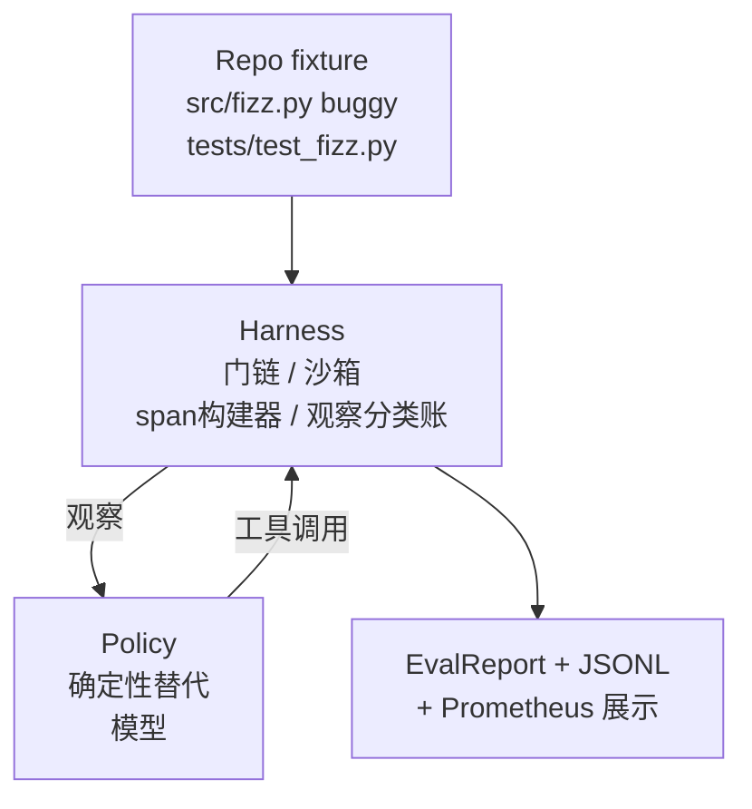
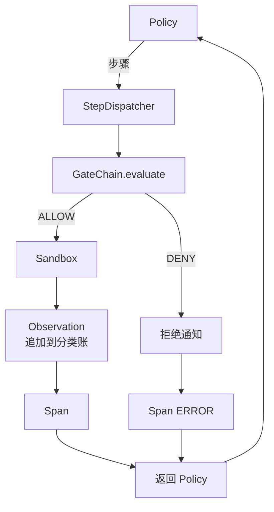

# 顶点项目第29课：框架上的端到端编码智能体

> Track A的收官之作。本课将门链、沙箱、评估框架和OTel span缝合为一个工作的编码智能体，修复一个真实的（小型、固定任务规模）多文件Python项目中的错误。智能体是确定性策略，而非LLM；这种替换使课程可重现，并表明框架才是整个过程中有趣的部分。契约完全相同：真实模型在策略接缝处插入。

**类型:** 构建
**语言:** Python (标准库)
**前置知识:** 阶段19 · 25（验证门），阶段19 · 26（沙箱），阶段19 · 27（评估框架），阶段19 · 28（可观测性），阶段14 · 38（验证门），阶段14 · 41（真实仓库工作台），阶段14 · 42（智能体工作台顶点项目）
**时长:** ~90分钟

## 学习目标

- 将门链、沙箱、评估框架和span构建器组合为单一智能体循环。
- 实现使用 read_file、run_tests 和 write_file 修复固定任务错误的确定性策略。
- 在端到端运行中执行全局步骤预算加观察token预算。
- 为完整运行发出完整的OTel GenAI追踪和Prometheus指标。
- 验证智能体在少于12步内解决固定任务，且合法工具的门触发次数为零。

## 问题

大多数智能体演示孤立工作：沙箱独立、评估框架独立、span发射器独立。它们看起来没问题。组合起来，接缝就显现了。

门链说ALLOW，但沙箱以门链未预料到的原因拒绝。评估框架记录通过，但OTel span显示门拒绝了一个智能体声称使用的工具。Prometheus计数器应该递增一次却递增了两次。观察预算已超限，但智能体继续运行，因为预算在链中跟踪而沙箱不知道。

本课是整个Track的集成测试。智能体必须按顺序做四件事：读取项目、运行测试、从测试失败中识别错误、写入修复、重新运行测试、然后停止。每个操作都经过门链。每次工具执行都经过沙箱。每一步都包装在span中。评估框架在最后对整个事情评分。

## 概念



智能体的策略是一个状态机。五个状态。

`SURVEY`：智能体读取项目列表。下一个状态是 RUN_TESTS。

`RUN_TESTS`：智能体运行测试命令。如果测试通过，状态机以成功停止。否则下一个状态是 INSPECT。

`INSPECT`：智能体读取失败的源文件。下一个状态是 FIX。

`FIX`：智能体写入修正后的文件。下一个状态是 VERIFY。

`VERIFY`：智能体再次运行测试命令。如果测试通过，停止成功。否则以失败停止。

每个状态对应一个工具调用。每个工具调用通过门链。如果工具调用被拒绝，智能体在追踪中报告拒绝并停止。

固定任务错误是 `fizz.py` 中的差一错误。确定性策略通过正则表达式从测试失败消息中检测错误，并发出修正后的文件。用LLM替换策略不会改变框架契约。

## 架构



本课是自包含的。每个先前课程的原语在 `main.py` 中以最小规模重新实现（门、沙箱、分类账、span），使课程无需导入同级模块即可运行。名称与第25-28课完全匹配，因此概念映射是明确的。

## 你将构建的内容

`main.py` 提供：

1. 最小的框架原语，以与第25-28课相同的名称复制：`GateChain`、`Sandbox`、`ObservationLedger`、`SpanBuilder`、`MetricsRegistry`。
2. `CodingAgentPolicy` 类：五个状态的状态机。
3. `Repo` 辅助类：用打包的有错误固定任务准备临时目录。
4. `AgentRun` 类：驱动策略，通过框架调度，返回 `AgentRunReport`。
5. 打包的固定任务（`fixture_repo/`），包含 src/fizz.py、tests/test_fizz.py 和为评估框架准备的 expected/ 目录树。
6. 演示：端到端运行策略，打印逐步追踪，断言通过，打印指标。

打包的固定任务与第27课的任务结构形状相同：有错误的文件和测试文件。测试失败消息包含足够的信息供确定性策略识别修复。真实的LLM会做同样的工作，更慢且召回范围更广，但不会改变框架的期望。

## 为什么策略不是LLM

真实的LLM需要API密钥、网络调用和不可验证的随机性。框架是本课关心的部分。替换为确定性策略让本课可以在任何开发者笔记本电脑上运行，零外部依赖，并让测试套件断言精确的步骤计数。

本课的策略是LLM智能体所做的严格子集。策略读取仓库，看到失败的测试，识别行，并发出修复。LLM经历同样的循环，使用相同的框架契约；记账完全相同。

## 演示断言的内容

端到端演示在退出时断言五件事，测试套件以编程方式重新断言它们。

策略在少于12步内解决了固定任务。

观察预算从未超限。

合法工具的零次门拒绝触发。（智能体从未发明被拒绝的工具名称。）

traces.jsonl 中的每一步都有对应的span。

Prometheus 展示包含 `tools_called_total{tool="read_file"}` 条目和 `tool_latency_ms` 直方图。

## 如何与Track A其余部分组合

本课是集成。第25课编写了门链。第26课编写了沙箱。第27课编写了评估框架。第28课编写了可观测性。第29课证明它们作为一个系统工作。真实的智能体框架从此扩展：将确定性策略替换为模型，将打包的固定任务替换为真实仓库任务，将JSONL导出器替换为OTLP。

## 运行

```bash
cd phases/19-capstone-projects/29-end-to-end-coding-task-demo
python3 code/main.py
python3 -m pytest code/tests/ -v
```

演示打印逐步追踪、最终评估报告和Prometheus展示。退出码为零。测试覆盖策略状态转换、合成工具调用上的门拒绝、打包固定任务的端到端运行以及步骤预算不变量。
